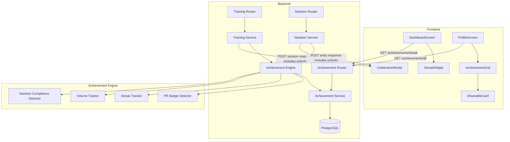

# Design Document: Achievement System

## Overview

The Achievement System adds gamification to Hypertrophy OS through four achievement categories: PR Badges, Consistency Streaks, Volume Milestones, and Nutrition Compliance Badges. The system follows the existing modular architecture — a new `src/modules/achievements/` backend module with models, schemas, service, and router, plus frontend components for the achievement grid, celebration modal, shareable cards, and dashboard streak widget.

Achievement evaluation is event-driven: when training sessions or nutrition entries are created, the Achievement Engine checks unlock conditions and returns newly unlocked achievements in the API response. Progress tracking is incremental — the system maintains running totals (lifetime volume, streak count, compliance streak) to avoid re-scanning historical data on every request.

## Architecture



The Achievement Engine is invoked as a side-effect within the existing Training and Nutrition service methods. It does not introduce new middleware or interceptors — instead, the `create_session` and `create_entry` methods call the engine after persisting the primary record, and the engine's results (newly unlocked achievements) are included in the API response.

### Key Design Decisions

1. **Inline evaluation over background jobs**: Achievement checks run synchronously within the request transaction. The checks are lightweight (comparing against cached progress values and static thresholds), so the latency impact is minimal. This avoids the complexity of a job queue and ensures the celebration modal can fire immediately.

2. **Incremental progress tracking**: Rather than re-computing lifetime volume or streak length from scratch, the system maintains `achievement_progress` records that are updated incrementally. This makes reads O(1) instead of O(n) over all historical sessions.

3. **Static achievement definitions in code**: Achievement definitions (thresholds, icons, descriptions) are defined as a Python enum/dataclass registry rather than a database table. This simplifies deployment (no migrations for new achievements) and makes definitions version-controlled. The `achievement_definitions` table is not needed — definitions live in `src/modules/achievements/definitions.py`.

4. **Achievements are permanent**: Once unlocked, achievements are never revoked, even if the triggering data is soft-deleted. This matches user expectations for gamification systems.

## Components and Interfaces

### Backend Components

#### `src/modules/achievements/definitions.py`
Static registry of all achievement definitions.

```python
from enum import StrEnum
from dataclasses import dataclass

class AchievementCategory(StrEnum):
    PR_BADGE = "pr_badge"
    STREAK = "streak"
    VOLUME = "volume"
    NUTRITION = "nutrition"

@dataclass(frozen=True)
class AchievementDef:
    id: str                        # e.g. "pr_bench_1plate"
    category: AchievementCategory
    title: str
    description: str
    icon: str                      # icon name for frontend
    threshold: float | int         # category-specific threshold value
    exercise_group: str | None = None  # for PR badges only

ACHIEVEMENT_REGISTRY: dict[str, AchievementDef] = { ... }
```

#### `src/modules/achievements/models.py`
SQLAlchemy models for user achievements and progress.

```python
class UserAchievement(SoftDeleteMixin, AuditLogMixin, Base):
    """Records an unlocked achievement for a user."""
    __tablename__ = "user_achievements"
    user_id: Mapped[uuid.UUID]
    achievement_id: Mapped[str]          # references AchievementDef.id
    unlocked_at: Mapped[datetime]
    trigger_data: Mapped[dict | None]    # JSONB — the set/session that triggered it

class AchievementProgress(Base):
    """Tracks incremental progress toward achievements."""
    __tablename__ = "achievement_progress"
    user_id: Mapped[uuid.UUID]
    progress_type: Mapped[str]           # "lifetime_volume", "streak", "nutrition_compliance"
    current_value: Mapped[float]         # current count/total
    metadata_: Mapped[dict | None]       # JSONB — extra state (e.g. last_active_date for streaks)
```

#### `src/modules/achievements/service.py`
CRUD operations for reading achievement state.

```python
class AchievementService:
    async def get_all_achievements(self, user_id) -> list[AchievementWithStatus]
    async def get_unlocked_achievements(self, user_id) -> list[UserAchievementResponse]
    async def get_streak(self, user_id) -> int
```

#### `src/modules/achievements/engine.py`
Core evaluation logic invoked after training/nutrition writes.

```python
class AchievementEngine:
    async def evaluate_training_session(self, user_id, session_data) -> list[str]
    async def evaluate_nutrition_entry(self, user_id, entry_date) -> list[str]
    async def _check_pr_badges(self, user_id, exercises) -> list[str]
    async def _update_volume(self, user_id, exercises) -> list[str]
    async def _update_streak(self, user_id, activity_date) -> list[str]
    async def _check_nutrition_compliance(self, user_id, entry_date) -> list[str]
```

#### `src/modules/achievements/router.py`
FastAPI endpoints.

```
GET  /api/v1/achievements/         — all definitions with user status/progress
GET  /api/v1/achievements/unlocked — user's unlocked achievements
GET  /api/v1/achievements/streak   — current streak count
```

#### `src/modules/achievements/exercise_aliases.py`
Maps exercise name variations to canonical groups for PR badge matching.

```python
EXERCISE_ALIASES: dict[str, str] = {
    "bench press": "bench_press",
    "flat bench press": "bench_press",
    "barbell bench press": "bench_press",
    "squat": "squat",
    "back squat": "squat",
    "barbell squat": "squat",
    "deadlift": "deadlift",
    "conventional deadlift": "deadlift",
    "barbell deadlift": "deadlift",
    ...
}

def resolve_exercise_group(exercise_name: str) -> str | None:
    return EXERCISE_ALIASES.get(exercise_name.lower().strip())
```

### Frontend Components

#### `app/components/achievements/AchievementGrid.tsx`
Grid display of all achievements grouped by category. Locked achievements are grayed out with a progress bar.

#### `app/components/achievements/AchievementCard.tsx`
Individual achievement tile showing icon, title, and status (locked/unlocked with date).

#### `app/components/achievements/CelebrationModal.tsx`
Full-screen modal with animation shown when achievements are unlocked. Queues multiple unlocks and shows them sequentially.

#### `app/components/achievements/ShareableCard.tsx`
Generates a styled view for sharing via the native share sheet. Uses `react-native-view-shot` to capture as an image.

#### `app/components/dashboard/StreakWidget.tsx`
Compact streak display for the dashboard (already partially exists as `StreakIndicator`; this extends it with achievement context).

### Integration Points

1. **Training Service** (`src/modules/training/service.py`): After `create_session`, call `AchievementEngine.evaluate_training_session()`. Include unlocked achievement IDs in `TrainingSessionResponse`.

2. **Nutrition Service** (`src/modules/nutrition/service.py`): After `create_entry`, call `AchievementEngine.evaluate_nutrition_entry()`. Include unlocked achievement IDs in the response.

3. **Profile Screen** (`app/screens/profile/ProfileScreen.tsx`): Add `AchievementGrid` component in the Features section.

4. **Dashboard Screen** (`app/screens/dashboard/DashboardScreen.tsx`): The existing `StreakIndicator` already shows streak count. Enhance it to pull from the achievement API.

5. **Main Router** (`src/main.py`): Register the achievements router.

## Data Models

### Database Tables

#### `user_achievements`

| Column | Type | Constraints | Description |
|--------|------|-------------|-------------|
| id | UUID | PK, auto | Primary key |
| user_id | UUID | NOT NULL, indexed | Foreign key to users |
| achievement_id | VARCHAR | NOT NULL | References static AchievementDef.id |
| unlocked_at | TIMESTAMP | NOT NULL | When the achievement was unlocked |
| trigger_data | JSONB | nullable | Context about what triggered the unlock |
| created_at | TIMESTAMP | auto | Record creation time |
| updated_at | TIMESTAMP | auto | Last update time |
| deleted_at | TIMESTAMP | nullable | Soft delete |

Unique constraint: `(user_id, achievement_id)` — a user can only unlock each achievement once.

Index: `ix_user_achievements_user_id` on `user_id`.

#### `achievement_progress`

| Column | Type | Constraints | Description |
|--------|------|-------------|-------------|
| id | UUID | PK, auto | Primary key |
| user_id | UUID | NOT NULL, indexed | Foreign key to users |
| progress_type | VARCHAR | NOT NULL | One of: "lifetime_volume", "streak", "nutrition_compliance" |
| current_value | FLOAT | NOT NULL, default 0 | Current progress value |
| metadata_ | JSONB | nullable | Extra state (last_active_date, last_compliant_date, etc.) |
| created_at | TIMESTAMP | auto | Record creation time |
| updated_at | TIMESTAMP | auto | Last update time |

Unique constraint: `(user_id, progress_type)` — one progress record per type per user.

### Static Achievement Definitions

```python
# PR Badges
AchievementDef(id="pr_bench_1plate", category=PR_BADGE, title="1-Plate Bench", description="Bench press 60 kg", icon="badge-bench-1", threshold=60, exercise_group="bench_press")
AchievementDef(id="pr_bench_2plate", category=PR_BADGE, title="2-Plate Bench", description="Bench press 100 kg", icon="badge-bench-2", threshold=100, exercise_group="bench_press")
AchievementDef(id="pr_bench_3plate", category=PR_BADGE, title="3-Plate Bench", description="Bench press 140 kg", icon="badge-bench-3", threshold=140, exercise_group="bench_press")
AchievementDef(id="pr_squat_2plate", category=PR_BADGE, title="2-Plate Squat", description="Squat 100 kg", icon="badge-squat-2", threshold=100, exercise_group="squat")
AchievementDef(id="pr_squat_3plate", category=PR_BADGE, title="3-Plate Squat", description="Squat 140 kg", icon="badge-squat-3", threshold=140, exercise_group="squat")
AchievementDef(id="pr_squat_4plate", category=PR_BADGE, title="4-Plate Squat", description="Squat 180 kg", icon="badge-squat-4", threshold=180, exercise_group="squat")
AchievementDef(id="pr_deadlift_2plate", category=PR_BADGE, title="2-Plate Deadlift", description="Deadlift 100 kg", icon="badge-dl-2", threshold=100, exercise_group="deadlift")
AchievementDef(id="pr_deadlift_3plate", category=PR_BADGE, title="3-Plate Deadlift", description="Deadlift 140 kg", icon="badge-dl-3", threshold=140, exercise_group="deadlift")
AchievementDef(id="pr_deadlift_4plate", category=PR_BADGE, title="4-Plate Deadlift", description="Deadlift 180 kg", icon="badge-dl-4", threshold=180, exercise_group="deadlift")
AchievementDef(id="pr_deadlift_5plate", category=PR_BADGE, title="5-Plate Deadlift", description="Deadlift 220 kg", icon="badge-dl-5", threshold=220, exercise_group="deadlift")

# Streak Badges
AchievementDef(id="streak_7", category=STREAK, title="Week Warrior", description="7-day activity streak", icon="badge-streak-7", threshold=7)
AchievementDef(id="streak_30", category=STREAK, title="Monthly Machine", description="30-day activity streak", icon="badge-streak-30", threshold=30)
AchievementDef(id="streak_90", category=STREAK, title="Quarter Crusher", description="90-day activity streak", icon="badge-streak-90", threshold=90)
AchievementDef(id="streak_365", category=STREAK, title="Year of Iron", description="365-day activity streak", icon="badge-streak-365", threshold=365)

# Volume Milestones
AchievementDef(id="volume_10k", category=VOLUME, title="10K Club", description="Lift 10,000 kg total", icon="badge-vol-10k", threshold=10_000)
AchievementDef(id="volume_50k", category=VOLUME, title="50K Club", description="Lift 50,000 kg total", icon="badge-vol-50k", threshold=50_000)
AchievementDef(id="volume_100k", category=VOLUME, title="100K Club", description="Lift 100,000 kg total", icon="badge-vol-100k", threshold=100_000)
AchievementDef(id="volume_500k", category=VOLUME, title="500K Club", description="Lift 500,000 kg total", icon="badge-vol-500k", threshold=500_000)
AchievementDef(id="volume_1m", category=VOLUME, title="Million KG Club", description="Lift 1,000,000 kg total", icon="badge-vol-1m", threshold=1_000_000)

# Nutrition Compliance
AchievementDef(id="nutrition_7", category=NUTRITION, title="Week of Discipline", description="7 consecutive compliant days", icon="badge-nutr-7", threshold=7)
AchievementDef(id="nutrition_14", category=NUTRITION, title="Fortnight Focus", description="14 consecutive compliant days", icon="badge-nutr-14", threshold=14)
AchievementDef(id="nutrition_30", category=NUTRITION, title="Monthly Macro Master", description="30 consecutive compliant days", icon="badge-nutr-30", threshold=30)
```

### Pydantic Schemas

```python
class AchievementDefResponse(BaseModel):
    id: str
    category: str
    title: str
    description: str
    icon: str
    threshold: float

class AchievementWithStatus(BaseModel):
    definition: AchievementDefResponse
    unlocked: bool
    unlocked_at: datetime | None
    progress: float | None          # 0.0–1.0 fraction toward unlock
    current_value: float | None     # raw progress value

class UserAchievementResponse(BaseModel):
    achievement_id: str
    title: str
    description: str
    icon: str
    category: str
    unlocked_at: datetime
    trigger_data: dict | None

class StreakResponse(BaseModel):
    current_streak: int
    longest_streak: int

class NewlyUnlockedResponse(BaseModel):
    """Included in training/nutrition API responses when achievements unlock."""
    achievement_id: str
    title: str
    description: str
    icon: str
    category: str
```


## Correctness Properties

*A property is a characteristic or behavior that should hold true across all valid executions of a system — essentially, a formal statement about what the system should do. Properties serve as the bridge between human-readable specifications and machine-verifiable correctness guarantees.*

### Property 1: PR badge detection with metadata

*For any* training session containing exercises with sets, and *for any* PR badge definition where the exercise group matches and the set weight meets or exceeds the threshold, the Achievement Engine should unlock that badge AND the resulting UserAchievement record should have a non-null `unlocked_at` timestamp and `trigger_data` containing the triggering exercise name and weight.

**Validates: Requirements 1.1, 1.3**

### Property 2: Exercise alias resolution is case-insensitive and consistent

*For any* exercise name string that is a known alias (regardless of casing or leading/trailing whitespace), the `resolve_exercise_group` function should return the same canonical exercise group as the lowercase trimmed version of that alias.

**Validates: Requirements 1.5**

### Property 3: Streak computation and threshold unlocks

*For any* sequence of activity dates (training sessions or nutrition entries), the computed streak should equal the length of the longest run of consecutive calendar days ending on the most recent activity date. Furthermore, *for any* streak value that meets or exceeds a streak achievement threshold (7, 30, 90, 365), the corresponding streak achievement should be unlocked.

**Validates: Requirements 2.1, 2.3, 2.4**

### Property 4: Volume calculation and threshold unlocks

*For any* sequence of training sessions, the user's lifetime volume should equal the sum of (weight_kg × reps) across all sets in all non-deleted sessions. The `achievement_progress` record's `current_value` should match this total. Furthermore, *for any* lifetime volume that meets or exceeds a volume milestone threshold (10K, 50K, 100K, 500K, 1M kg), the corresponding volume achievement should be unlocked.

**Validates: Requirements 3.1, 3.2, 3.4**

### Property 5: Achievement permanence after soft-delete

*For any* unlocked achievement (PR badge or volume milestone), soft-deleting the training session that triggered the unlock should not remove the UserAchievement record. The achievement should remain in the user's unlocked list.

**Validates: Requirements 1.4, 3.3**

### Property 6: Nutrition compliance check

*For any* set of daily macro totals (calories, protein, carbs, fat) and corresponding adaptive targets, a day should be marked compliant if and only if each macro total is within 5% of its target (i.e., `abs(actual - target) / target <= 0.05` for each macro).

**Validates: Requirements 4.1**

### Property 7: Nutrition compliance streak and threshold unlocks

*For any* sequence of daily compliance results, the compliance streak should equal the length of the longest run of consecutive compliant days ending on the most recent day. A non-compliant day should reset the counter to zero. Furthermore, *for any* compliance streak that meets or exceeds a threshold (7, 14, 30), the corresponding nutrition badge should be unlocked.

**Validates: Requirements 4.2, 4.3**

### Property 8: Achievement grouping by category

*For any* list of AchievementDef objects, grouping them by category should produce exactly the set of distinct categories present in the input, and every definition should appear in exactly one group matching its category.

**Validates: Requirements 5.1**

### Property 9: API response includes newly unlocked achievements

*For any* training session or nutrition entry that triggers one or more achievement unlocks, the API response should contain a `newly_unlocked` list whose achievement IDs match exactly the set of achievements that were unlocked by that operation.

**Validates: Requirements 7.1**

### Property 10: User achievement isolation

*For any* two distinct users, querying achievements for user A should never return achievements belonging to user B, and vice versa.

**Validates: Requirements 8.3**

### Property 11: Achievement schema serialization round-trip

*For any* valid AchievementWithStatus object, serializing it to JSON and deserializing it back should produce an equivalent object.

**Validates: Requirements 8.5**

## Error Handling

| Scenario | Behavior |
|----------|----------|
| Achievement Engine fails during session creation | Log the error, return the training session response without achievement data. Session creation must not fail due to achievement errors. |
| Invalid exercise name (no alias match) | Skip PR badge evaluation for that exercise silently. No error returned. |
| Missing adaptive targets for compliance check | Skip nutrition compliance evaluation for that day. Log a warning. |
| Duplicate achievement unlock attempt | The unique constraint `(user_id, achievement_id)` prevents duplicates. The engine should catch the IntegrityError and treat it as a no-op. |
| Database connection failure during achievement read | Return HTTP 500 with standard error response format. |
| Share sheet unavailable on platform | Catch the error and show a toast notification to the user. |
| Achievement progress record missing | Create it on first access with `current_value = 0`. |

## Testing Strategy

### Property-Based Testing

Library: **Hypothesis** (Python) for backend, **fast-check** (TypeScript) for frontend logic.

Each property test should run a minimum of 100 iterations. Each test must be tagged with a comment referencing the design property:

```python
# Feature: achievement-system, Property 1: PR badge detection with metadata
```

Property tests cover:
- PR badge detection logic (Property 1)
- Exercise alias resolution (Property 2)
- Streak computation (Property 3)
- Volume calculation (Property 4)
- Achievement permanence (Property 5)
- Nutrition compliance check (Property 6)
- Nutrition compliance streak (Property 7)
- Achievement grouping (Property 8)
- Newly unlocked in response (Property 9)
- User isolation (Property 10)
- Schema round-trip (Property 11)

### Unit Testing

Unit tests complement property tests by covering specific examples and edge cases:

- Specific PR badge thresholds (e.g., exactly 60 kg bench triggers 1-plate badge)
- Streak edge cases: first day ever, timezone boundary, exactly at midnight
- Volume edge case: session with zero-weight sets (bodyweight exercises)
- Compliance edge case: target is zero (division by zero guard)
- Exercise alias edge cases: empty string, unknown exercise, unicode characters
- API endpoint integration tests: correct HTTP status codes, auth required
- Celebration modal: sequential display of multiple unlocks
- Share card: contains all required fields

### Test Organization

```
tests/
  test_achievement_properties.py      # Property-based tests (Properties 1-11)
  test_achievement_unit.py            # Unit tests for edge cases
app/__tests__/
  utils/achievementLogic.test.ts      # Frontend logic tests
  components/CelebrationModal.test.ts # Component tests
```
