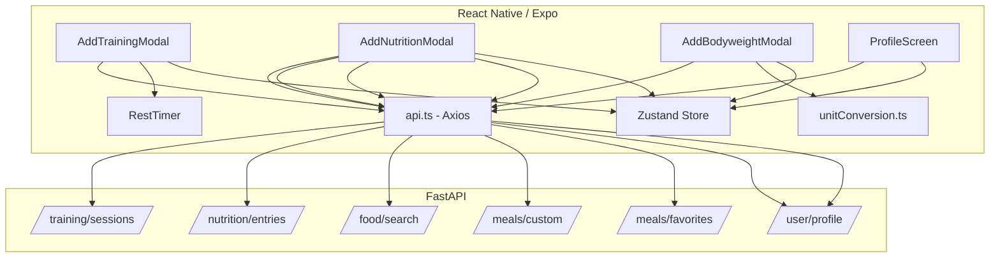
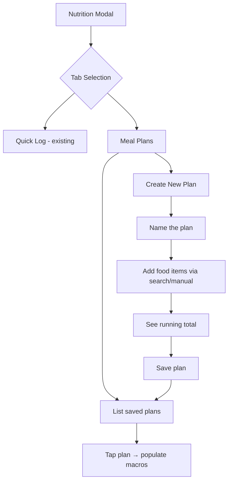

# Design Document: App Fixes and Nutrition V2

## Overview

This design addresses 3 critical bug fixes (training save, nutrition save, food search) and 5 feature enhancements (bodyweight unit toggle, micronutrient tracking, profile editability, rest timer relocation, custom meal plans) for HypertrophyOS.

The architecture follows the existing patterns: React Native/Expo frontend with Zustand state management communicating via Axios to a FastAPI/SQLAlchemy backend. Bug fixes are surgical — minimal changes to existing components. New features extend existing data models (the `micro_nutrients` JSONB column already exists) and add new UI sections to existing modals.

**Key design decisions:**
- Bug fixes over new code: Req 1-3 are field mapping and state management fixes, not rewrites
- Backend-first data model: micronutrients, water, fibre all fit in the existing `micro_nutrients` JSONB — no schema migration
- Progressive disclosure: micronutrient section is collapsible, water tracking is visual (glass icons), keeping the default flow fast
- Unit conversion is frontend-only: backend always stores kg, frontend converts for display

## Architecture



## Components and Interfaces

### Bug Fix 1: Training Modal State Management (Req 1)

**Root cause:** `AddTrainingModal` uses a local `modalVisible` state that gets set to `false` when navigating to the exercise picker. The `useEffect` syncing `visible` prop → `modalVisible` creates a race condition where the modal closes unexpectedly.

**Fix:** Remove the internal `modalVisible` state entirely. Use the `visible` prop directly. When navigating to the exercise picker, call `onClose()` and pass exercise state via navigation params. When returning, the parent re-opens the modal with the preserved state.

```typescript
// BEFORE (broken):
const [modalVisible, setModalVisible] = useState(false);
useEffect(() => { setModalVisible(visible); }, [visible]);
// Navigation: setModalVisible(false) → navigates → modal gone

// AFTER (fixed):
// Use `visible` prop directly in ModalContainer
// Store pending exercises in a ref or parent state before navigating
// On return from picker, parent re-opens modal with state intact
```

**Alternative approach (simpler):** Keep the modal open but render the exercise picker as an inline overlay within the modal instead of navigating away. This avoids the state loss entirely.

**Chosen approach:** Fix the state management by removing `modalVisible` and using `visible` prop directly. For exercise picker navigation, store the current form state in a `useRef` so it survives the modal close/reopen cycle.

### Bug Fix 2: Nutrition Entry Payload (Req 2)

**Root cause:** Frontend sends `{ date, calories, protein_g, carbs_g, fat_g }` but backend `NutritionEntryCreate` requires `meal_name` (mandatory, min_length=1) and `entry_date` (not `date`).

**Fix:** Update `handleSubmit` in `AddNutritionModal`:

```typescript
await api.post('nutrition/entries', {
  entry_date: new Date().toISOString().split('T')[0],  // was: date
  meal_name: notes.trim() || 'Quick entry',             // was: missing
  calories: Number(calories),
  protein_g: Number(protein),
  carbs_g: Number(carbs),
  fat_g: Number(fat),
  ...(notes.trim() ? { notes: notes.trim() } : {}),
  ...(microNutrients ? { micro_nutrients: microNutrients } : {}),
});
```

### Bug Fix 3: Food Search Response Handling (Req 3)

**Root cause investigation:** The API route `GET /food/search` exists at `/api/v1/food/search` and the frontend calls `api.get('food/search', { params: { q: text.trim() } })`. The Axios baseURL is `${API_BASE_URL}/api/v1/` so this resolves correctly. The likely issue is either:
1. Empty food database (no seed data loaded)
2. The response shape: backend returns `PaginatedResult` with `items` array, frontend reads `res.data.items` — this should work

**Fix:** Add defensive handling for both empty database and response shape variations. Also ensure the food database seed script runs during setup.

```typescript
const res = await api.get('food/search', { params: { q: text.trim() } });
const items = res.data?.items ?? res.data ?? [];
setSearchResults(Array.isArray(items) ? items : []);
```

### Component: Bodyweight Unit Toggle (Req 4)

**Interface changes to `AddBodyweightModal`:**

```typescript
interface BodyweightModalState {
  weight: string;           // displayed value in current unit
  unit: 'kg' | 'lbs';      // current display unit
  loading: boolean;
}

// Read initial unit from store
const unitSystem = useStore((s) => s.unitSystem);
const [unit, setUnit] = useState<'kg' | 'lbs'>(
  unitSystem === 'imperial' ? 'lbs' : 'kg'
);

// Conversion on toggle
function toggleUnit() {
  const numVal = parseFloat(weight);
  if (!isNaN(numVal) && numVal > 0) {
    if (unit === 'kg') {
      setWeight(String(Math.round(numVal * 2.20462 * 10) / 10));
      setUnit('lbs');
    } else {
      setWeight(String(Math.round(numVal / 2.20462 * 10) / 10));
      setUnit('kg');
    }
  } else {
    setUnit(unit === 'kg' ? 'lbs' : 'kg');
  }
}

// On submit: always convert to kg for API
const weightKg = unit === 'lbs'
  ? parseFloat(weight) / 2.20462
  : parseFloat(weight);
```

**UI:** A `SegmentedControl` (reuse from ProfileScreen) placed next to the weight label.

### Component: Micronutrient, Fibre, and Water Tracking (Req 5)

**Micronutrient section** — collapsible, below macro fields:

```typescript
const MICRO_FIELDS = [
  { key: 'vitamin_a_mcg', label: 'Vitamin A (mcg)' },
  { key: 'vitamin_c_mg', label: 'Vitamin C (mg)' },
  { key: 'vitamin_d_mcg', label: 'Vitamin D (mcg)' },
  { key: 'calcium_mg', label: 'Calcium (mg)' },
  { key: 'iron_mg', label: 'Iron (mg)' },
  { key: 'zinc_mg', label: 'Zinc (mg)' },
  { key: 'magnesium_mg', label: 'Magnesium (mg)' },
  { key: 'potassium_mg', label: 'Potassium (mg)' },
] as const;

interface MicroState {
  [key: string]: string;  // string values for TextInput, converted to float on submit
}
```

**Fibre field** — added to the macro row layout as a fifth field.

**Water tracking** — glass-based visual component:

```typescript
interface WaterTrackerProps {
  glasses: number;        // current count
  onIncrement: () => void;
  onDecrement: () => void;
  maxGlasses?: number;    // default 12
}

// Each glass = 250ml
// Display: "💧 4 glasses (1000ml)"
// Tapping empty glass → increment, tapping filled glass → decrement
```

**Data serialization:** All micronutrient data, fibre, and water are packed into the `micro_nutrients` JSONB field:

```json
{
  "vitamin_a_mcg": 900,
  "iron_mg": 18,
  "fibre_g": 25,
  "water_ml": 2000
}
```

### Component: Profile Field Editability (Req 6)

**Current state:** Only `displayName` is editable via an "Edit Profile" button that toggles a single text input. Other fields (email, timezone, currency) are read-only text.

**Design:** Convert each editable field to an `EditableField` component:

```typescript
interface EditableFieldProps {
  label: string;
  value: string;
  onSave: (newValue: string) => Promise<void>;
  editable?: boolean;  // false for email (read-only)
}

// Visual states:
// - View mode: value text + subtle pencil icon on the right
// - Edit mode: TextInput with focus border (colors.border.focus) + Save/Cancel buttons
// - Saving: loading spinner replacing Save button
// - Error: red border flash + alert
```

**Fields to make editable:** display name, timezone (picker), preferred currency (picker).
**Fields that stay read-only:** email (shown with a lock icon).

### Component: Rest Timer Settings in Training Modal (Req 7)

**Design:** Add a small gear icon button in the rest timer overlay header. Tapping it opens an inline settings panel (not a new screen) with two numeric inputs for compound and isolation rest seconds.

```typescript
// In RestTimer component, add settings toggle:
interface RestTimerProps {
  durationSeconds: number;
  visible: boolean;
  onDismiss: () => void;
  onComplete: () => void;
  onSettingsChange?: (compound: number, isolation: number) => void;
}

// Settings panel slides in below the countdown
// Save button persists to PUT /user/profile with updated preferences
```

**Profile screen:** Keep the existing rest timer section in Preferences. Both locations write to the same `preferences.rest_timer` object.

### Component: Custom Meal Plans (Req 8)

**Frontend flow:**



**Backend:** The existing `CustomMeal` model and `POST /meals/custom` endpoint already support this. The frontend needs to:
1. Add a meal plan creation form with multi-item support
2. Show aggregate nutrition as items are added
3. Call `POST /meals/custom` with the aggregate data
4. Call `GET /meals/custom` to list saved plans

**Meal plan items** are stored as part of the `micro_nutrients` JSONB or as a separate `items` field. Since the current `CustomMeal` model only stores aggregate macros (not individual items), we'll store the item breakdown in the `micro_nutrients` JSONB under a `_plan_items` key for v1:

```json
{
  "vitamin_a_mcg": 900,
  "_plan_items": [
    { "name": "Chicken Breast", "calories": 165, "protein_g": 31, "carbs_g": 0, "fat_g": 3.6, "serving_multiplier": 1.5 },
    { "name": "Brown Rice", "calories": 216, "protein_g": 5, "carbs_g": 45, "fat_g": 1.8, "serving_multiplier": 1 }
  ]
}
```

This avoids a schema migration while keeping item-level detail for editing.

## Data Models

### Existing Models (No Changes Required)

**NutritionEntry** — already has `micro_nutrients: JSONB` column. No migration needed.

**CustomMeal** — already has `micro_nutrients: JSONB` column. We'll use it to store plan item breakdowns.

**MealFavorite** — already has `micro_nutrients: JSONB` column.

**FoodItem** — already has `micro_nutrients: JSONB` column.

### Frontend State Extensions

```typescript
// Zustand store — no changes needed, unitSystem already exists

// AddNutritionModal local state additions:
interface NutritionModalState {
  // Existing
  calories: string;
  protein: string;
  carbs: string;
  fat: string;
  notes: string;

  // New
  fibre: string;
  waterGlasses: number;
  microNutrients: Record<string, string>;  // key → string value for inputs
  microExpanded: boolean;
  activeTab: 'quick' | 'mealPlans';

  // Meal plan creation
  planName: string;
  planItems: Array<{
    name: string;
    calories: number;
    protein_g: number;
    carbs_g: number;
    fat_g: number;
    serving_multiplier: number;
  }>;
}
```

### API Payload Mapping

| Frontend Field | Backend Field | Notes |
|---|---|---|
| `date` (removed) | `entry_date` | Fix: use correct field name |
| `notes` | `meal_name` | Fix: derive meal_name from notes or default |
| `fibre` | `micro_nutrients.fibre_g` | New: packed into JSONB |
| `waterGlasses * 250` | `micro_nutrients.water_ml` | New: packed into JSONB |
| `microNutrients.*` | `micro_nutrients.*` | New: packed into JSONB |

### Unit Conversion Functions

```typescript
// app/utils/unitConversion.ts (extend existing file)
export const CONVERSION_FACTOR = 2.20462;

export function kgToLbs(kg: number): number {
  return Math.round(kg * CONVERSION_FACTOR * 10) / 10;
}

export function lbsToKg(lbs: number): number {
  return Math.round((lbs / CONVERSION_FACTOR) * 10) / 10;
}

export function convertWeight(value: number, from: 'kg' | 'lbs', to: 'kg' | 'lbs'): number {
  if (from === to) return value;
  return from === 'kg' ? kgToLbs(value) : lbsToKg(value);
}
```


## Correctness Properties

*A property is a characteristic or behavior that should hold true across all valid executions of a system — essentially, a formal statement about what the system should do. Properties serve as the bridge between human-readable specifications and machine-verifiable correctness guarantees.*

The following properties were derived from the acceptance criteria prework analysis. After reflection, redundant properties were consolidated (e.g., individual serialization checks for fibre, water, and micronutrients were combined into a single serialization property; imperial/metric conversion checks were unified).

### Property 1: Nutrition payload always contains required fields

*For any* combination of macro values (calories, protein, carbs, fat) and any notes string (including empty/whitespace), the constructed nutrition entry payload SHALL always contain a non-empty `meal_name` (defaulting to "Quick entry" when notes is empty/whitespace) and a valid `entry_date` in ISO date format.

**Validates: Requirements 2.1, 2.2**

### Property 2: Macro scaling is multiplicative

*For any* food item with base macros (calories, protein_g, carbs_g, fat_g) and any positive serving multiplier m, `scaleMacros(food, m)` SHALL return values where each macro equals `base_macro * m`.

**Validates: Requirements 3.3**

### Property 3: Search results are capped at 10

*For any* food search result set of size N, the displayed results SHALL have length `min(N, 10)`.

**Validates: Requirements 3.2**

### Property 4: Weight conversion correctness

*For any* positive weight value and any unit (kg or lbs), the API payload `weight_kg` SHALL equal the input value when unit is kg, or `input / 2.20462` when unit is lbs.

**Validates: Requirements 4.2, 4.3**

### Property 5: Unit toggle round-trip

*For any* positive weight value, converting from kg to lbs and back to kg (or lbs to kg to lbs) SHALL produce a value within 0.1 of the original value (accounting for single-decimal rounding).

**Validates: Requirements 4.5**

### Property 6: Micronutrient, fibre, and water serialization

*For any* combination of micronutrient key-value pairs, fibre value, and water glass count, the serialized `micro_nutrients` object SHALL contain all provided micronutrient keys with their float values, `fibre_g` equal to the fibre input, and `water_ml` equal to `glasses * 250`.

**Validates: Requirements 5.2, 5.4, 5.9**

### Property 7: Water glass count invariant

*For any* starting glass count n ≥ 0, incrementing produces n+1 and decrementing produces max(n-1, 0). *For any* glass count, incrementing then decrementing returns to the original count. The glass count SHALL never be negative.

**Validates: Requirements 5.6, 5.7**

### Property 8: Micronutrient persistence round-trip

*For any* valid `micro_nutrients` dictionary, creating a nutrition entry with that dictionary and then retrieving it SHALL return an equivalent dictionary with the same keys and values.

**Validates: Requirements 5.8**

### Property 9: Filled micronutrient field count

*For any* set of micronutrient input values (some empty, some filled), the summary count SHALL equal the number of fields with non-empty, non-zero values.

**Validates: Requirements 5.10**

### Property 10: Meal plan aggregate nutrition

*For any* list of food items with macros and serving multipliers, the aggregate calories SHALL equal the sum of `item.calories * item.serving_multiplier` for all items, and similarly for protein, carbs, and fat.

**Validates: Requirements 8.3**

### Property 11: Meal plan save round-trip

*For any* valid meal plan (name + items + aggregate macros), saving via `POST /meals/custom` and then retrieving via `GET /meals/custom` SHALL return a plan with equivalent name and aggregate nutritional values.

**Validates: Requirements 8.4**

### Property 12: Meal plan edit does not alter logged entries

*For any* meal plan that has been used to log a nutrition entry, editing the meal plan's macros SHALL not change the `calories`, `protein_g`, `carbs_g`, or `fat_g` values of the previously logged nutrition entry.

**Validates: Requirements 8.7**

### Property 13: Meal plan soft-delete is recoverable

*For any* soft-deleted meal plan, the plan's `deleted_at` field SHALL be non-null, and the plan SHALL not appear in normal `GET /meals/custom` queries but SHALL still exist in the database.

**Validates: Requirements 8.8**

### Property 14: Search trigger threshold

*For any* search query string, the food search SHALL only trigger an API call when the trimmed string length is ≥ 2 characters. Strings shorter than 2 characters SHALL result in an empty result set without an API call.

**Validates: Requirements 3.1**

## Error Handling

| Scenario | Component | Behavior |
|---|---|---|
| Training save API error | Training_Modal | Show Alert with "Failed to log training session", keep form data, re-enable save button |
| Nutrition save API error | Nutrition_Modal | Show Alert with "Failed to log nutrition entry", keep form data, re-enable save button |
| Nutrition save validation error (422) | Nutrition_Modal | Parse error response, show specific field error in Alert |
| Food search API error | Food_Search | Show inline warning "Search failed. You can still enter macros manually.", don't block form |
| Food search empty results | Food_Search | Show inline message "No results found — try a different term or enter macros manually" |
| Food database empty | Food_Search | Same as empty results — graceful degradation |
| Bodyweight save API error | Bodyweight_Modal | Show Alert with "Failed to log bodyweight", keep form data |
| Invalid weight input (NaN, negative, zero) | Bodyweight_Modal | Show Alert "Please enter a valid weight", prevent submission |
| Profile update API error | Profile_Screen | Show Alert "Failed to update profile", revert field to previous value |
| Meal plan save API error | Nutrition_Modal | Show Alert "Failed to save meal plan", keep form data |
| Rest timer settings save error | Training_Modal | Show Alert "Failed to update rest timer", revert to previous values |
| Network timeout (15s) | All modals | Axios timeout triggers catch block, show generic error alert |
| Double-tap prevention | All save buttons | Disable button + show ActivityIndicator while loading state is true |

## Testing Strategy

### Unit Tests

Unit tests cover specific examples, edge cases, and error conditions:

- **Nutrition payload construction:** Verify that empty notes → "Quick entry", non-empty notes → trimmed notes as meal_name
- **scaleMacros edge cases:** Zero multiplier, very large multiplier, zero-calorie food
- **Unit conversion edge cases:** 0 kg, very large values, boundary rounding (e.g., 100.05 lbs)
- **Water glass count:** Decrement at 0 stays at 0, increment at max (12) behavior
- **Micronutrient serialization:** Empty micronutrients, partial fill, all fields filled
- **Meal plan aggregation:** Empty item list, single item, items with zero macros
- **Search threshold:** Exactly 1 char, exactly 2 chars, whitespace-only strings

### Property-Based Tests

Property-based tests verify universal properties across randomized inputs. We use:
- **Frontend:** `fast-check` library for TypeScript property tests
- **Backend:** `hypothesis` library for Python property tests

Each property test runs a minimum of 100 iterations and is tagged with its design property reference.

**Frontend property tests (fast-check):**

| Property | Test Description | Tag |
|---|---|---|
| Property 1 | Generate random macro values and notes strings, verify payload always has meal_name and entry_date | Feature: app-fixes-and-nutrition-v2, Property 1: Nutrition payload required fields |
| Property 2 | Generate random food items and multipliers, verify scaleMacros output | Feature: app-fixes-and-nutrition-v2, Property 2: Macro scaling is multiplicative |
| Property 3 | Generate result arrays of varying sizes, verify display cap at 10 | Feature: app-fixes-and-nutrition-v2, Property 3: Search results capped at 10 |
| Property 4 | Generate random weights and units, verify API payload conversion | Feature: app-fixes-and-nutrition-v2, Property 4: Weight conversion correctness |
| Property 5 | Generate random weights, toggle kg→lbs→kg, verify within 0.1 tolerance | Feature: app-fixes-and-nutrition-v2, Property 5: Unit toggle round-trip |
| Property 6 | Generate random micronutrient values, fibre, water glasses, verify serialization | Feature: app-fixes-and-nutrition-v2, Property 6: Micronutrient serialization |
| Property 7 | Generate random glass counts, verify increment/decrement invariants | Feature: app-fixes-and-nutrition-v2, Property 7: Water glass count invariant |
| Property 9 | Generate random micronutrient fill patterns, verify count | Feature: app-fixes-and-nutrition-v2, Property 9: Filled field count |
| Property 10 | Generate random food item lists with multipliers, verify aggregate sum | Feature: app-fixes-and-nutrition-v2, Property 10: Meal plan aggregate nutrition |
| Property 14 | Generate random strings, verify search trigger threshold | Feature: app-fixes-and-nutrition-v2, Property 14: Search trigger threshold |

**Backend property tests (hypothesis):**

| Property | Test Description | Tag |
|---|---|---|
| Property 8 | Generate random micro_nutrients dicts, create entry, retrieve, verify equality | Feature: app-fixes-and-nutrition-v2, Property 8: Micronutrient persistence round-trip |
| Property 11 | Generate random meal plans, save and retrieve, verify equivalence | Feature: app-fixes-and-nutrition-v2, Property 11: Meal plan save round-trip |
| Property 12 | Create meal plan, log entry, edit plan, verify entry unchanged | Feature: app-fixes-and-nutrition-v2, Property 12: Edit doesn't alter logged entries |
| Property 13 | Create meal plan, soft-delete, verify deleted_at set and excluded from normal queries | Feature: app-fixes-and-nutrition-v2, Property 13: Soft-delete recoverable |
