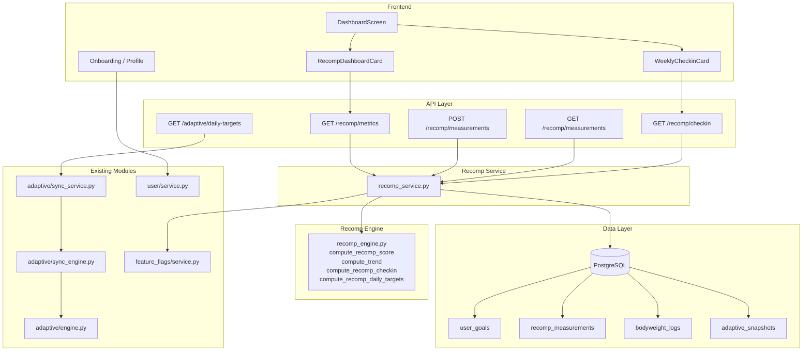

# Design Document: Body Recomposition Mode

## Overview

Body Recomposition Mode extends Hypertrophy OS with a specialized goal type for simultaneous fat loss and muscle gain. The feature integrates with three existing systems:

1. **Adaptive Engine** (`engine.py`): Extended with a new `RECOMPOSITION` goal type that uses calorie cycling instead of flat offsets.
2. **Nutrition-Training Sync Engine** (`sync_engine.py`): Recomp mode overrides the default surplus/deficit percentages (+10%/-10% instead of +15%/-5%) and adjusts macro distribution for recomp-specific carb/fat cycling.
3. **User/Measurements system**: New `recomp_measurements` table and trend computation for waist, arm, and chest circumferences.

The core addition is a pure computation module (`recomp_engine.py`) that computes the Recomp Score and measurement trends. Like the existing adaptive engine, it has no side effects — given identical inputs, it produces identical outputs.

### Key Design Decisions

| Decision | Rationale | Alternative Considered |
|----------|-----------|----------------------|
| Extend GoalType enum with `RECOMPOSITION` | Single source of truth for goal types; all existing branching logic picks it up | Separate boolean `is_recomp` flag — rejected: splits goal logic across two fields |
| Reuse Sync Engine for day classification | Avoids duplicating training day detection logic | Standalone recomp day classifier — rejected: maintenance burden |
| Separate `recomp_measurements` table | Clean indexing, no JSONB querying, explicit schema | Overload `user_metrics.additional_metrics` JSONB — rejected: poor query performance, no type safety |
| Pure computation module for trends/score | Testable without DB, deterministic, cacheable | Compute in service layer — rejected: mixes I/O with math, harder to test |
| Linear regression for trends | Simple, interpretable, sufficient for weekly cadence | EMA — rejected: less interpretable for "cm/week" display |
| Feature flag `recomp_mode_enabled` | Instant kill-switch, incremental rollout | No flag — rejected: no safe rollback path |
| Protein floor of 2.0 g/kg for recomp | Evidence-based for muscle preservation during recomp | 1.8 g/kg (maintenance level) — rejected: insufficient for recomp stimulus |

## Architecture



### Request Flows

**Recomp Daily Targets**: `GET /adaptive/daily-targets?date=...` → Sync Engine detects `goal_type == "recomposition"` → applies +10%/-10% cycling + recomp macro distribution → returns adjusted targets.

**Recomp Metrics**: `GET /recomp/metrics` → Recomp Service fetches measurements + bodyweight → calls pure `compute_recomp_score()` → returns trends + score.

**Recomp Check-in**: `GET /recomp/checkin` → Recomp Service computes trends → calls pure `compute_recomp_checkin()` → returns recommendation + score.

## Strict Dependency Chain (Build Order)

No layer may reference anything from a higher-numbered layer. Circular dependencies are impossible by construction.

```
Layer 0: GoalType enum extension (src/shared/types.py)
         Feature flag registration (feature_flags seed)
         DB migration (recomp_measurements table)
         ↓ depends on: nothing
         ↓ blocks: everything below

Layer 1: Pure computation — recomp_engine.py
         (compute_trend, compute_recomp_score, compute_recomp_checkin,
          compute_recomp_daily_targets)
         ↓ depends on: Layer 0 (GoalType enum only)
         ↓ blocks: Layer 5 (service)

Layer 2: Data models — recomp/models.py (SQLAlchemy model)
         ↓ depends on: Layer 0 (migration must exist)
         ↓ blocks: Layer 5 (service)

Layer 3: Pydantic schemas — recomp/schemas.py
         ↓ depends on: Layer 0 (GoalType enum)
         ↓ blocks: Layer 5 (service), Layer 6 (router)

Layer 4: Adaptive engine extension — engine.py (add RECOMPOSITION to dicts)
         Sync engine extension — sync_engine.py (recomp branching)
         ↓ depends on: Layer 0 (GoalType enum)
         ↓ blocks: Layer 6 (daily-targets endpoint behavior)

Layer 5: Service layer — recomp_service.py
         ↓ depends on: Layers 1, 2, 3, 4
         ↓ blocks: Layer 6 (router)

Layer 6: API router — recomp/router.py + wire into main.py
         ↓ depends on: Layers 3, 5
         ↓ blocks: Layer 7 (frontend)

Layer 7: Frontend — RecompDashboardCard, DashboardScreen changes,
         WeeklyCheckinCard changes, onboarding/profile goal selection
         ↓ depends on: Layer 6 (API contracts)
```

**Layers 1, 2, 3, 4 are independent of each other** and can be built in parallel after Layer 0 is complete.

## Components and Interfaces

### 1. GoalType Extension: `src/shared/types.py`

```python
class GoalType(StrEnum):
    CUTTING = "cutting"
    MAINTAINING = "maintaining"
    BULKING = "bulking"
    RECOMPOSITION = "recomposition"
```

**Risk**: Every `match`/`if`/dict-lookup on GoalType across the codebase must handle the new value. Unhandled sites will raise KeyError or fall through silently.
**Mitigation**: Before any other work, grep for all GoalType usages (`GOAL_OFFSETS`, `PROTEIN_MULTIPLIERS`, `goal_type ==`, schema validators) and add exhaustive handling. This is a blocking prerequisite.
**Rollback**: Revert the enum addition; migrate any users with `goal_type="recomposition"` to `"maintaining"`.

### 2. Feature Flag: `recomp_mode_enabled`

Gate all recomp endpoints and UI behind this flag using existing `feature_flags/service.py`.

```python
# In each recomp router endpoint:
if not await feature_flag_service.is_enabled("recomp_mode_enabled", user_id):
    raise HTTPException(status_code=403, detail="Body recomposition mode is not available")
```

**Risk**: Flag not seeded in DB → all requests fail with 500.
**Mitigation**: Include flag seed in the DB migration step. Default: enabled=False for production, enabled=True for dev/staging.
**Rollback**: Set flag to False → instant kill-switch, no deploy needed.

### 3. Database Migration: `recomp_measurements` table

```sql
CREATE TABLE recomp_measurements (
    id UUID PRIMARY KEY DEFAULT gen_random_uuid(),
    user_id UUID NOT NULL REFERENCES users(id) ON DELETE CASCADE,
    recorded_date DATE NOT NULL,
    waist_cm DOUBLE PRECISION,
    arm_cm DOUBLE PRECISION,
    chest_cm DOUBLE PRECISION,
    created_at TIMESTAMPTZ NOT NULL DEFAULT now(),
    updated_at TIMESTAMPTZ NOT NULL DEFAULT now()
);

CREATE INDEX ix_recomp_measurements_user_date
    ON recomp_measurements (user_id, recorded_date);

ALTER TABLE recomp_measurements
    ADD CONSTRAINT chk_at_least_one_measurement
    CHECK (waist_cm IS NOT NULL OR arm_cm IS NOT NULL OR chest_cm IS NOT NULL);
```

**Risk**: None significant — this is a new table, no ALTER on existing tables, no locks on existing data.
**Rollback**: `DROP TABLE recomp_measurements;`

### 4. Adaptive Engine Extension: `src/modules/adaptive/engine.py`

Add `RECOMPOSITION` to the existing lookup dicts:

```python
GOAL_OFFSETS[GoalType.RECOMPOSITION] = 0.0       # Maintenance baseline; cycling handled by sync engine
PROTEIN_MULTIPLIERS[GoalType.RECOMPOSITION] = 2.0  # High protein for recomp
```

The adaptive engine treats recomp as maintenance for the baseline snapshot. The Sync Engine applies day-specific cycling on top.

**Risk**: Existing `compute_snapshot` tests may not cover the new enum value → silent regression.
**Mitigation**: Add explicit test case for `GoalType.RECOMPOSITION` in `test_adaptive_properties.py`.
**Rollback**: Remove the dict entries; revert GoalType enum.

### 5. Sync Engine Extension: `src/modules/adaptive/sync_engine.py`

When `goal_type == RECOMPOSITION`, override default surplus/deficit:

```python
if goal_type == GoalType.RECOMPOSITION:
    effective_surplus_pct = 0.10    # +10% on training days (vs default +15%)
    effective_deficit_pct = -0.10   # -10% on rest days (vs default -5%)
    carb_shift_ratio = 0.60        # 60% of surplus to carbs (vs default 0.5 + 0.3*demand)
    protein_floor_g = weight_kg * 2.0  # Hard floor
```

Macro distribution for recomp:
- **Training day**: 60% of calorie surplus allocated to carbs, remainder to fat. Protein held at floor.
- **Rest day**: Carbs reduced proportionally from baseline. Fat and protein get higher share.
- **All days**: `adjusted_protein_g = max(baseline_protein_g, 2.0 * weight_kg)`

**Risk**: Sync engine may not yet exist (depends on nutrition-training-sync feature).
**Mitigation**: Implement `compute_recomp_daily_targets()` as a standalone pure function in `recomp_engine.py` that takes TDEE + is_training_day + weight_kg as input. This function works independently. If/when sync engine merges, wire it in as a delegate.

### 6. Pure Computation Module: `src/modules/recomp/engine.py`

```python
@dataclass(frozen=True)
class MeasurementPoint:
    date: date
    value: float

@dataclass(frozen=True)
class TrendResult:
    slope_per_week: float    # cm/week (or kg/week for weight)
    direction: str           # "decreasing" | "stable" | "increasing"
    data_points: int

@dataclass(frozen=True)
class RecompMetricsInput:
    waist_measurements: list[MeasurementPoint]
    arm_measurements: list[MeasurementPoint]
    chest_measurements: list[MeasurementPoint]
    bodyweight_history: list[MeasurementPoint]
    lookback_days: int  # default 28

@dataclass(frozen=True)
class RecompMetricsOutput:
    waist_trend: TrendResult | None
    arm_trend: TrendResult | None
    chest_trend: TrendResult | None
    weight_trend: TrendResult | None
    muscle_gain_indicator: float | None
    fat_loss_indicator: float | None
    recomp_score: float | None            # -100 to +100
    has_sufficient_data: bool
```

**`compute_trend(points: list[MeasurementPoint]) -> TrendResult | None`**:
1. If `len(points) < 2`: return `None`
2. Convert dates to `x = (date - min_date).days` (float)
3. If all x values are identical (same date): return `TrendResult(slope_per_week=0.0, direction="stable", data_points=len(points))`
4. Compute least-squares slope: `slope = Σ((x - x̄)(y - ȳ)) / Σ((x - x̄)²)`
5. Convert to weekly: `slope_per_week = slope * 7.0`
6. Direction: `slope_per_week < -0.05` → "decreasing", `> 0.05` → "increasing", else → "stable"

**`compute_recomp_score(input: RecompMetricsInput) -> RecompMetricsOutput`**:
1. Filter measurements to lookback window: `date >= (max_date - lookback_days)`
2. Compute each trend via `compute_trend()`
3. `fat_loss_indicator = -waist_trend.slope_per_week` (positive when waist shrinks)
4. `muscle_gain_indicator`:
   - If both arm and chest trends exist: `avg(arm_slope, chest_slope)`
   - If only one exists: use that one
   - If neither: `None`
5. If either indicator is `None`: `recomp_score = None`, `has_sufficient_data = False`
6. Otherwise: `recomp_score = clamp(50 * tanh(fat_loss / 0.5) + 50 * tanh(muscle_gain / 0.3), -100, 100)`

**`compute_recomp_daily_targets(tdee, is_training_day, weight_kg, baseline_protein_g, baseline_carbs_g, baseline_fat_g, surplus_pct=0.10, deficit_pct=-0.10) -> RecompDailyOutput`**:
1. `modifier = surplus_pct if is_training_day else deficit_pct`
2. `adjusted_calories = max(tdee * (1 + modifier), 1200.0)`
3. `calorie_delta = adjusted_calories - tdee`
4. `protein_g = max(baseline_protein_g, 2.0 * weight_kg)`
5. Training day: `carb_extra = calorie_delta * 0.6 / 4.0`; `fat_delta = (calorie_delta - carb_extra * 4.0) / 9.0`
6. Rest day: `carb_reduction = abs(calorie_delta) * 0.6 / 4.0`; `fat_delta = (calorie_delta + carb_reduction * 4.0) / 9.0`
7. Floor carbs at 50g, floor fat at 20g

**Risk**: Division by zero if all measurement dates are the same day.
**Mitigation**: Explicit guard in `compute_trend` (step 3 above).

### 7. Recomp Check-in Logic: `src/modules/recomp/engine.py`

```python
@dataclass(frozen=True)
class RecompCheckinInput:
    recomp_metrics: RecompMetricsOutput
    weekly_weight_change_kg: float | None
    current_training_day_surplus_pct: float
    current_rest_day_deficit_pct: float

@dataclass(frozen=True)
class RecompCheckinOutput:
    recommendation: str
    recomp_score: float | None
    suggested_surplus_adjustment: float | None
    suggested_deficit_adjustment: float | None
```

**Decision Tree** (evaluated in strict priority order — first match wins):
1. `has_sufficient_data == False` → `"Log body measurements to get recomp recommendations"`
2. `weekly_weight_change_kg is not None and weekly_weight_change_kg < -0.5` → `"Weight dropping too fast — increase training day calories"` + `suggested_surplus_adjustment = +0.02`
3. `weekly_weight_change_kg is not None and weekly_weight_change_kg > 0.5` → `"Weight gaining too fast — decrease rest day calories"` + `suggested_deficit_adjustment = -0.02`
4. `waist_trend.direction == "decreasing" and (arm_trend.direction == "increasing" or chest_trend.direction == "increasing")` → `"Waist down {x}cm/wk, arms up {y}cm/wk — recomp is working"`
5. `waist_trend.direction == "increasing"` → `"Waist increasing — consider reducing rest day calories"` + `suggested_deficit_adjustment = -0.02`
6. Default → `"No significant changes yet — stay consistent and keep logging"`

All branches set `recomp_score = input.recomp_metrics.recomp_score`.

### 8. Data Models: `src/modules/recomp/models.py`

```python
class RecompMeasurement(Base):
    __tablename__ = "recomp_measurements"

    user_id: Mapped[uuid.UUID] = mapped_column(
        ForeignKey("users.id", ondelete="CASCADE"), nullable=False
    )
    recorded_date: Mapped[date] = mapped_column(Date, nullable=False)
    waist_cm: Mapped[float | None] = mapped_column(Float, nullable=True)
    arm_cm: Mapped[float | None] = mapped_column(Float, nullable=True)
    chest_cm: Mapped[float | None] = mapped_column(Float, nullable=True)

    __table_args__ = (
        Index("ix_recomp_measurements_user_date", "user_id", "recorded_date"),
    )
```

### 9. Pydantic Schemas: `src/modules/recomp/schemas.py`

```python
class RecompMeasurementCreate(BaseModel):
    recorded_date: date
    waist_cm: float | None = Field(None, gt=0)
    arm_cm: float | None = Field(None, gt=0)
    chest_cm: float | None = Field(None, gt=0)

    @model_validator(mode='after')
    def at_least_one_measurement(self) -> 'RecompMeasurementCreate':
        if self.waist_cm is None and self.arm_cm is None and self.chest_cm is None:
            raise ValueError('At least one measurement must be provided')
        return self

class RecompMeasurementResponse(BaseModel):
    id: uuid.UUID
    user_id: uuid.UUID
    recorded_date: date
    waist_cm: float | None = None
    arm_cm: float | None = None
    chest_cm: float | None = None
    created_at: datetime
    model_config = {"from_attributes": True}

class TrendResponse(BaseModel):
    slope_per_week: float
    direction: str
    data_points: int

class RecompMetricsResponse(BaseModel):
    waist_trend: TrendResponse | None = None
    arm_trend: TrendResponse | None = None
    chest_trend: TrendResponse | None = None
    weight_trend: TrendResponse | None = None
    muscle_gain_indicator: float | None = None
    fat_loss_indicator: float | None = None
    recomp_score: float | None = None
    has_sufficient_data: bool

class RecompCheckinResponse(BaseModel):
    recommendation: str
    recomp_score: float | None = None
    suggested_surplus_adjustment: float | None = None
    suggested_deficit_adjustment: float | None = None
```

### 10. Service Layer: `src/modules/recomp/service.py`

```python
class RecompService:
    def __init__(self, session: AsyncSession) -> None: ...

    async def log_measurement(self, user_id: uuid.UUID, data: RecompMeasurementCreate) -> RecompMeasurement:
        """Persist a measurement entry. Validates user is in recomp mode."""

    async def get_measurements(self, user_id: uuid.UUID, start_date: date, end_date: date) -> list[RecompMeasurement]:
        """Return measurements in [start_date, end_date] sorted by recorded_date ASC."""

    async def get_recomp_metrics(self, user_id: uuid.UUID, lookback_days: int = 28) -> RecompMetricsOutput:
        """Fetch measurements + bodyweight, call pure compute_recomp_score(), return result."""

    async def get_weekly_checkin(self, user_id: uuid.UUID) -> RecompCheckinOutput:
        """Compute metrics, compute weight change, call pure compute_recomp_checkin(), return result."""
```

**Risk**: Service depends on bodyweight_logs for weight trend. If user has no bodyweight entries, weight_trend = None.
**Mitigation**: Handled gracefully — weight_trend = None is valid input to check-in engine.

### 11. API Router: `src/modules/recomp/router.py`

| Method | Path | Description | Auth | Feature Flag | Goal Check |
|--------|------|-------------|------|-------------|------------|
| POST | `/recomp/measurements` | Log a body measurement | Required | `recomp_mode_enabled` | `goal_type == recomposition` |
| GET | `/recomp/measurements` | Get measurements for date range | Required | `recomp_mode_enabled` | `goal_type == recomposition` |
| GET | `/recomp/metrics` | Get recomp progress metrics + score | Required | `recomp_mode_enabled` | `goal_type == recomposition` |
| GET | `/recomp/checkin` | Get weekly recomp check-in | Required | `recomp_mode_enabled` | `goal_type == recomposition` |

Every endpoint performs two guards in order:
1. Feature flag check → 403 if disabled
2. Goal type check → 400 if not recomposition

### 12. Frontend Components

**New: `RecompDashboardCard`** (`app/components/dashboard/RecompDashboardCard.tsx`)
- Displays waist trend, arm trend, weight trend, and Recomp Score
- Color-coded: decreasing waist = green, increasing arms = green, stable weight = neutral, negative score = red
- Shows "Log measurements" prompt when `has_sufficient_data === false`
- Only rendered when `goal_type === "recomposition"`

**Modified: `DashboardScreen`**
- Conditionally renders `RecompDashboardCard` when `goal_type === "recomposition"`
- Fetches from `GET /recomp/metrics` only when in recomp mode

**Modified: `WeeklyCheckinCard`**
- When `goal_type === "recomposition"`, fetches from `GET /recomp/checkin` instead of standard check-in
- Renders Recomp Score, measurement trends, and recommendation text

**Modified: Onboarding `IntentStep` / Profile `GoalsSection`**
- Add "Body Recomposition" as a selectable goal option
- When selected, show brief explanation: "Calorie cycling — slight surplus on training days, slight deficit on rest days"

### 13. Recomp Calorie Cycling — Worked Example

User: TDEE = 2500 kcal, weight = 80 kg, default +10%/-10%

| Day Type | Formula | Calories | Protein (≥160g) | Carb Delta | Fat Delta |
|----------|---------|----------|-----------------|------------|-----------|
| Training | 2500 × 1.10 | 2750 | 160g | +37.5g (60% of 250 surplus ÷ 4) | +11.1g (remainder ÷ 9) |
| Rest | 2500 × 0.90 | 2250 | 160g | -37.5g (60% of 250 deficit ÷ 4) | -11.1g (remainder ÷ 9) |

Weekly average (3 training + 4 rest): (3 × 2750 + 4 × 2250) / 7 ≈ 2464 kcal (~1.4% below maintenance — acceptable)


## Correctness Properties

*A property is a characteristic or behavior that should hold true across all valid executions of a system — essentially, a formal statement about what the system should do. Properties serve as the bridge between human-readable specifications and machine-verifiable correctness guarantees.*

### Property 1: Recomp calorie cycling applies correct day-specific modifier

*For any* valid TDEE value (≥ 1200/1.1 to avoid clamp interference) and day classification in Recomp_Mode with default surplus/deficit, if the day is a Training_Day the computed calorie target shall equal TDEE × 1.10, and if the day is a Rest_Day the computed calorie target shall equal TDEE × 0.90.

**Validates: Requirements 2.1, 2.2**

### Property 2: Recomp weekly calorie average approximates maintenance

*For any* TDEE value and mix of training/rest days over 7 days in Recomp_Mode with default +10%/-10% and no phase modifiers, the Weekly_Calorie_Average shall be within 5% of the baseline TDEE.

**Validates: Requirements 2.3**

### Property 3: Recomp protein floor invariant

*For any* recomp daily target computation (training day or rest day, any TDEE, any bodyweight), the adjusted protein target shall be greater than or equal to 2.0 × weight_kg.

**Validates: Requirements 2.4**

### Property 4: Training days have higher carb allocation than rest days

*For any* recomp computation pair with the same baseline targets and TDEE, the training day adjusted_carbs_g shall be strictly greater than the rest day adjusted_carbs_g.

**Validates: Requirements 2.5, 2.6**

### Property 5: Recomp minimum calorie clamp

*For any* recomp daily target computation regardless of TDEE or day type, the adjusted calorie target shall be greater than or equal to 1200 kcal.

**Validates: Requirements 2.7**

### Property 6: Measurement validation — at least one field, all positive

*For any* measurement input, the system shall accept it if and only if at least one of waist_cm, arm_cm, chest_cm is provided and all provided values are strictly positive.

**Validates: Requirements 3.2, 3.3**

### Property 7: Measurement persistence round-trip

*For any* valid RecompMeasurement, logging it and then querying measurements for that date shall return an entry with equivalent waist_cm, arm_cm, chest_cm, and recorded_date values.

**Validates: Requirements 3.1, 3.4**

### Property 8: Measurement date range query returns sorted results within range

*For any* set of logged measurements and any date range [start, end], querying measurements shall return only entries with recorded_date in [start, end], sorted by recorded_date ascending.

**Validates: Requirements 3.5**

### Property 9: Linear regression trend correctness

*For any* list of 2 or more measurement points with at least 2 distinct dates, the computed trend slope_per_week shall equal the least-squares linear regression slope (in units per day) multiplied by 7. For fewer than 2 points, the result shall be None. For all-same-date points, slope shall be 0.0.

**Validates: Requirements 4.1, 4.2, 4.5**

### Property 10: Recomp Score formula and clamping

*For any* valid fat_loss_indicator and muscle_gain_indicator, the Recomp_Score shall equal `clamp(50 × tanh(-waist_slope / 0.5) + 50 × tanh(muscle_slope / 0.3), -100, 100)`. The score shall always be in the range [-100, +100].

**Validates: Requirements 4.3, 4.4**

### Property 11: Lookback window filtering

*For any* set of measurements and a lookback window of N days, the trend computation shall only include measurements with date ≥ (max_date - N days). Measurements outside the window shall not affect the computed trend.

**Validates: Requirements 4.6**

### Property 12: Recomp check-in decision tree correctness

*For any* RecompCheckinInput, the generated recommendation shall match the expected decision tree branch evaluated in priority order: (a) insufficient data → prompt to log, (b) weight dropping > 0.5 kg/week → increase surplus, (c) weight gaining > 0.5 kg/week → decrease deficit, (d) waist decreasing AND arm/chest increasing → positive message, (e) waist increasing → reduce deficit, (f) default → stay consistent. The response shall always include the recomp_score field.

**Validates: Requirements 6.1, 6.2, 6.3, 6.4, 6.5, 6.6**

### Property 13: Recomp metrics JSON round-trip

*For any* valid RecompMetricsResponse or RecompMeasurementResponse object, serializing to JSON and then deserializing shall produce an equivalent object.

**Validates: Requirements 7.1, 7.2**

## Error Handling

| Scenario | Response | HTTP Status | Rollback Action |
|----------|----------|-------------|-----------------|
| Feature flag `recomp_mode_enabled` is off | `"Body recomposition mode is not available"` | 403 | N/A — expected behavior |
| User goal_type is not "recomposition" | `"Recomp endpoints require recomposition goal mode"` | 400 | N/A — user must switch goal |
| No adaptive snapshot exists | `"No adaptive snapshot found. Generate a snapshot first."` | 400 | N/A — user must onboard |
| All measurement fields are null | `"At least one measurement must be provided"` | 422 | N/A — validation |
| Measurement value ≤ 0 | Pydantic gt=0 constraint error | 422 | N/A — validation |
| Fewer than 2 measurements for trend | Return `has_sufficient_data: false`, null trends | 200 | N/A — expected |
| Invalid date range (start > end) | Pydantic validation error | 422 | N/A — validation |
| Division by zero in trend (same-date points) | Return slope=0.0, direction="stable" | 200 | N/A — handled in engine |
| DB connection failure | Generic error via existing middleware | 500 | Retry; page on-call |

## Risks and Mitigations

| # | Risk | Severity | Mitigation | Owner |
|---|------|----------|------------|-------|
| R1 | GoalType enum change breaks existing switch sites | High | Grep audit of all GoalType usages as blocking first task | Backend |
| R2 | Nutrition-training-sync not yet merged | Medium | Standalone `compute_recomp_daily_targets()` in recomp_engine.py; wire into sync engine later | Backend |
| R3 | Linear regression division by zero (same-date points) | Medium | Explicit guard: if x-variance == 0, return slope=0 | Backend |
| R4 | Users switching goals rapidly → stale recomp data | Low | Recomp metrics always computed fresh from raw measurements; no cached state to go stale | Backend |
| R5 | Feature flag not seeded → 500 on all recomp requests | High | Include flag seed in migration; test flag existence in integration tests | Backend |
| R6 | Large measurement history → slow queries | Low | Index on (user_id, recorded_date); lookback window caps query scope to 28 days | Backend |
| R7 | Frontend renders recomp card for non-recomp users | Medium | Guard: `goal_type === "recomposition"` check before render; API returns 400 as safety net | Frontend |

## Rollback Plan

| Severity | Action | Time to Execute |
|----------|--------|-----------------|
| **Instant** (no deploy) | Set `recomp_mode_enabled` flag to False | < 1 minute |
| **Soft** (deploy) | Revert frontend changes; recomp card disappears | ~15 minutes |
| **Full** (deploy + migration) | Revert GoalType enum; migrate `goal_type="recomposition"` users to `"maintaining"`; drop `recomp_measurements` table | ~30 minutes |

Data in `recomp_measurements` is additive-only. No existing tables are modified. Full rollback loses recomp measurement data but preserves all other user data.

## Monitoring and Alerting

| Metric | Type | Alert Threshold | Action |
|--------|------|----------------|--------|
| `recomp.goal.adoption_count` | Counter | None (business metric) | Track weekly |
| `recomp.measurements.log.count` | Counter | Anomaly detection | Investigate spike/drop |
| `recomp.measurements.validation_error_rate` | Rate | > 20% | UX issue — users confused about input |
| `recomp.metrics.compute.latency_p99` | Histogram | > 500ms | Check index usage; optimize query |
| `recomp.checkin.error_rate` | Rate | > 5% | Page on-call; likely data integrity issue |
| `recomp.calorie_clamp.hit_rate` | Rate | > 10% of recomp users | TDEE estimates too low for recomp users |
| `recomp.feature_flag.denied_count` | Counter | Spike after flag enabled | Possible config issue |
| `adaptive.snapshot.recomp.count` | Counter | None (adoption metric) | Track weekly |

## Testing Strategy

### Property-Based Testing

Library: **Hypothesis** (Python) for backend, **fast-check** (TypeScript) for frontend utility tests.

Each property test runs a minimum of 100 iterations. Each test is tagged with:
`Feature: body-recomp-mode, Property {N}: {title}`

| Property | Module Under Test | DB Required |
|----------|-------------------|-------------|
| 1–5 | `recomp_engine.compute_recomp_daily_targets` | No |
| 6 | `RecompMeasurementCreate` Pydantic validator | No |
| 7–8 | `RecompService.log_measurement` / `get_measurements` | Yes (test DB) |
| 9–11 | `recomp_engine.compute_trend` / `compute_recomp_score` | No |
| 12 | `recomp_engine.compute_recomp_checkin` | No |
| 13 | `RecompMetricsResponse` / `RecompMeasurementResponse` Pydantic | No |

### Unit Testing

| Area | What to Test | File |
|------|-------------|------|
| Pure engine edge cases | Zero TDEE (clamp to 1200), single measurement, all-same-date, empty lists | `test_recomp_unit.py` |
| Validation errors | All-null measurements, negative values, zero values | `test_recomp_unit.py` |
| API error responses | Feature flag off (403), wrong goal type (400), missing snapshot (400) | `test_recomp_unit.py` |
| GoalType exhaustiveness | All switch sites handle RECOMPOSITION | `test_recomp_unit.py` |
| Goal switching | Recomp → cutting clears cycling; cutting → recomp initializes defaults | `test_recomp_unit.py` |
| Adaptive engine | `compute_snapshot` with `GoalType.RECOMPOSITION` produces maintenance baseline | `test_adaptive_properties.py` |

### Integration Testing

| Flow | Steps | File |
|------|-------|------|
| Full recomp lifecycle | Set goal → log measurements × 4 weeks → fetch metrics → verify score | `test_recomp_integration.py` |
| Calorie cycling | Set recomp goal → fetch daily targets for training + rest day → verify cycling | `test_recomp_integration.py` |
| Weekly check-in | Populate data → trigger check-in → verify recommendation matches tree | `test_recomp_integration.py` |
| Goal switching | Switch to recomp → verify cycling → switch away → verify flat targets | `test_recomp_integration.py` |
| Feature flag off | Disable flag → call all endpoints → verify 403 | `test_recomp_integration.py` |

### Test Organization

```
tests/
  test_recomp_engine_properties.py     # Properties 1-5 (calorie cycling, pure)
  test_recomp_metrics_properties.py    # Properties 6, 9-12 (measurements + score, pure)
  test_recomp_service_properties.py    # Properties 7-8 (persistence round-trip, DB)
  test_recomp_serialization.py         # Property 13 (JSON round-trip)
  test_recomp_unit.py                  # Edge cases, error conditions, exhaustiveness
  test_recomp_integration.py           # End-to-end flows with DB

app/__tests__/
  components/RecompDashboardCard.test.ts
  utils/recompScore.test.ts
```

### Testing Checkpoints (Gate Criteria)

| Checkpoint | After | Gate Criteria | Rollback if Fail |
|------------|-------|---------------|------------------|
| CP1 | Layer 0 (enum + migration) | Migration runs clean; GoalType audit complete; all existing tests pass | Revert enum; drop table |
| CP2 | Layer 1 (pure engine) | Properties 1-5, 9-12 pass; unit tests for edge cases pass | Revert engine file |
| CP3 | Layer 4 (adaptive/sync extension) | Existing `test_adaptive_properties.py` passes with new enum; Properties 1-5 pass end-to-end | Revert dict entries |
| CP4 | Layer 6 (API router) | Properties 6-8 pass; integration tests pass; all error scenarios return correct HTTP status; feature flag test passes | Revert router + service |
| CP5 | Layer 7 (frontend) | Component tests pass; manual smoke test: select recomp goal → see dashboard card → log measurement → see trends | Revert frontend changes |


## Implementation Execution Plan

Sequential numbered plan. No step references anything not yet built. Each step includes: what to do, risks, tests, rollback.

---

### Step 1: Audit all GoalType usage sites

**Do**: Grep the entire codebase for `GoalType`, `GOAL_OFFSETS`, `PROTEIN_MULTIPLIERS`, `goal_type`, and any switch/match/if branching on goal values. Produce a list of every file and line that must be updated when `RECOMPOSITION` is added.

**Output**: A checklist of files requiring changes (engine.py dicts, sync_engine.py branching, schema validators, frontend goal selectors, onboarding steps, profile sections).

**Risk**: Missing a site → KeyError or silent fallthrough at runtime.
**Mitigation**: This audit is blocking. No code changes until the list is complete and reviewed.
**Tests**: None (audit only).
**Rollback**: N/A.

---

### Step 2: Extend GoalType enum + seed feature flag + DB migration

**Do**:
1. Add `RECOMPOSITION = "recomposition"` to `GoalType` in `src/shared/types.py`
2. Add `RECOMPOSITION` entry to `GOAL_OFFSETS` (value: `0.0`) and `PROTEIN_MULTIPLIERS` (value: `2.0`) in `src/modules/adaptive/engine.py`
3. Update every site identified in Step 1 to handle the new enum value (add to Pydantic validators, schema patterns, frontend constants)
4. Create Alembic migration: `recomp_measurements` table with columns (id, user_id, recorded_date, waist_cm, arm_cm, chest_cm, created_at, updated_at), index on (user_id, recorded_date), CHECK constraint for at-least-one-non-null
5. Seed `recomp_mode_enabled` feature flag (default: False in production, True in dev/staging)

**Risk**: Migration fails on CI if Alembic head conflicts with other in-flight migrations.
**Mitigation**: Rebase migration head before merging. Run migration on staging first.
**Risk**: Feature flag not seeded → 500 on all recomp requests.
**Mitigation**: Flag seed is part of this step, not deferred.

**Tests**:
- Verify migration runs and rolls back cleanly: `alembic upgrade head && alembic downgrade -1`
- Verify all existing tests still pass (GoalType exhaustiveness)
- Verify `GoalType.RECOMPOSITION` is a valid enum member
- Verify feature flag exists in DB after seed

**Rollback**: `alembic downgrade -1` to drop table; revert enum change; revert dict entries.

**⛳ CHECKPOINT CP1**: All existing test suites pass. Migration runs clean. GoalType audit complete.

---

### Step 3: Implement pure recomp engine — trend computation

**Do**: Create `src/modules/recomp/__init__.py` and `src/modules/recomp/engine.py`. Implement:
- `MeasurementPoint`, `TrendResult`, `RecompMetricsInput`, `RecompMetricsOutput` dataclasses
- `compute_trend(points) -> TrendResult | None` — linear regression with same-date guard

**Depends on**: Step 2 (GoalType enum only — no DB, no service).

**Risk**: Division by zero if all dates identical.
**Mitigation**: Explicit guard: if x-variance == 0, return slope=0.0, direction="stable".

**Tests** (write immediately after implementation):
- **Property 9**: For any 2+ points with distinct dates, slope matches least-squares formula × 7
- **Unit**: 0 points → None, 1 point → None, 2 points → exact slope, all-same-date → slope=0, negative slope → "decreasing", positive slope → "increasing", near-zero slope → "stable"

**Rollback**: Delete `src/modules/recomp/engine.py`.

---

### Step 4: Implement pure recomp engine — score computation

**Do**: In `src/modules/recomp/engine.py`, implement:
- `compute_recomp_score(input: RecompMetricsInput) -> RecompMetricsOutput`
- Lookback window filtering, fat_loss_indicator, muscle_gain_indicator, tanh normalization, score clamping

**Depends on**: Step 3 (`compute_trend` function).

**Risk**: tanh scaling factors (0.5, 0.3) produce unintuitive scores.
**Mitigation**: Unit tests with known inputs verify expected score ranges.

**Tests** (write immediately):
- **Property 10**: Score follows formula and is always in [-100, +100]
- **Property 11**: Measurements outside lookback window don't affect trend
- **Unit**: Insufficient data → None score + has_sufficient_data=False; waist shrinking + arms growing → positive score; waist growing + arms shrinking → negative score; only arm data (no chest) → uses arm alone

**Rollback**: Revert additions to engine.py.

---

### Step 5: Implement pure recomp engine — calorie cycling

**Do**: In `src/modules/recomp/engine.py`, implement:
- `RecompDailyInput`, `RecompDailyOutput` dataclasses
- `compute_recomp_daily_targets(input) -> RecompDailyOutput`
- Training day: TDEE × 1.10, carb shift ratio 0.6, protein floor 2.0 g/kg
- Rest day: TDEE × 0.90, reduced carbs, protein floor 2.0 g/kg
- Minimum calorie clamp at 1200

**Depends on**: Step 2 (GoalType enum only).

**Risk**: Macro math doesn't balance (protein + carbs + fat calories ≠ adjusted_calories).
**Mitigation**: Add a unit test that verifies macro calories sum to adjusted_calories ± 1 kcal rounding.

**Tests** (write immediately):
- **Property 1**: Training day = TDEE × 1.10, rest day = TDEE × 0.90 (for TDEE ≥ 1334 to avoid clamp)
- **Property 2**: Weekly average of any 7-day mix within 5% of TDEE
- **Property 3**: Protein ≥ 2.0 × weight_kg for all inputs
- **Property 4**: Training day carbs > rest day carbs for same baseline
- **Property 5**: Adjusted calories ≥ 1200 for all inputs
- **Unit**: TDEE=1000 rest day → clamps to 1200; macro sum ≈ adjusted_calories

**Rollback**: Revert additions to engine.py.

---

### Step 6: Implement pure recomp engine — check-in logic

**Do**: In `src/modules/recomp/engine.py`, implement:
- `RecompCheckinInput`, `RecompCheckinOutput` dataclasses
- `compute_recomp_checkin(input) -> RecompCheckinOutput`
- Decision tree with strict priority ordering (6 branches)

**Depends on**: Step 4 (`RecompMetricsOutput` dataclass).

**Risk**: Decision tree priority order wrong → wrong recommendation for edge cases.
**Mitigation**: Property test covers all branches; unit tests cover boundary values (exactly 0.5 kg/week).

**Tests** (write immediately):
- **Property 12**: For any input, recommendation matches expected branch per priority order; recomp_score always present
- **Unit**: Each branch individually; boundary at exactly 0.5 kg/week; insufficient data branch

**Rollback**: Revert additions to engine.py.

**⛳ CHECKPOINT CP2**: All property tests (1-5, 9-12) pass. All unit tests pass. Pure engine is complete and verified.

---

### Step 7: Create data models and schemas

**Do**:
1. Create `src/modules/recomp/models.py` with `RecompMeasurement` SQLAlchemy model
2. Create `src/modules/recomp/schemas.py` with all Pydantic schemas: `RecompMeasurementCreate` (with at-least-one validator), `RecompMeasurementResponse`, `TrendResponse`, `RecompMetricsResponse`, `RecompCheckinResponse`

**Depends on**: Step 2 (migration must exist for table; GoalType for schema references).

**Risk**: Pydantic validator doesn't match DB CHECK constraint behavior.
**Mitigation**: Test both independently.

**Tests** (write immediately):
- **Property 6**: Measurement accepted iff at-least-one-field AND all-positive
- **Property 13**: JSON round-trip for all response schemas
- **Unit**: All-null → ValidationError; negative value → ValidationError; single field → accepted; all three fields → accepted

**Rollback**: Delete models.py and schemas.py.

---

### Step 8: Implement sync engine extension (if sync engine exists)

**Do**: In `src/modules/adaptive/sync_engine.py`, add recomp branching:
- When `goal_type == RECOMPOSITION`: override surplus to +10%, deficit to -10%, carb_shift_ratio to 0.6, protein floor to 2.0 g/kg
- Delegate to `compute_recomp_daily_targets()` from recomp engine

**Depends on**: Step 5 (recomp daily targets function), Step 2 (GoalType enum).
**Conditional**: Only if nutrition-training-sync feature is merged. If not, skip — Step 5's standalone function handles it.

**Risk**: Sync engine API contract changes break integration.
**Mitigation**: Recomp engine has its own standalone function; sync engine integration is additive.

**Tests**:
- Existing sync engine property tests still pass
- New test: sync engine with `goal_type=RECOMPOSITION` produces cycling targets matching Properties 1-5

**Rollback**: Revert sync_engine.py changes.

---

### Step 9: Implement service layer

**Do**: Create `src/modules/recomp/service.py` with `RecompService`:
- `log_measurement()`: validate user is in recomp mode, persist to DB
- `get_measurements()`: query by user_id + date range, return sorted ASC
- `get_recomp_metrics()`: fetch measurements + bodyweight, call `compute_recomp_score()`, return
- `get_weekly_checkin()`: compute metrics, compute weight change from bodyweight_logs, call `compute_recomp_checkin()`, return

**Depends on**: Steps 3-6 (pure engine), Step 7 (models + schemas).

**Risk**: N+1 query if fetching measurements inefficiently.
**Mitigation**: Single query with date range filter; index handles performance.

**Tests** (write immediately):
- **Property 7**: Log measurement → query by date → get equivalent values back
- **Property 8**: Log multiple measurements → query by range → results within range and sorted ASC
- **Integration**: Full lifecycle: log 4 weeks of measurements → get_recomp_metrics → verify score computed; get_weekly_checkin → verify recommendation generated
- **Unit**: User not in recomp mode → raises error; no bodyweight data → weight_trend=None; empty measurements → has_sufficient_data=False

**Rollback**: Delete service.py.

**⛳ CHECKPOINT CP3**: Properties 6-8, 13 pass. Integration tests pass. Service layer verified.

---

### Step 10: Implement API router + wire into main.py

**Do**:
1. Create `src/modules/recomp/router.py` with 4 endpoints (POST measurements, GET measurements, GET metrics, GET checkin)
2. Each endpoint: auth required → feature flag check (403) → goal type check (400) → delegate to service
3. Add `recomp_router` to `src/main.py` app includes

**Depends on**: Step 9 (service layer), Step 7 (schemas for request/response).

**Risk**: Router not registered → 404 on all recomp endpoints.
**Mitigation**: Integration test hits each endpoint and verifies non-404 response.

**Tests** (write immediately):
- **Integration**: Each endpoint returns correct status for happy path (200/201)
- **Integration**: Feature flag off → 403 for all endpoints
- **Integration**: Wrong goal type → 400 for all endpoints
- **Integration**: Missing snapshot → 400 for metrics/checkin
- **Integration**: Invalid measurement payload → 422
- **Unit**: Router registered in main.py (import check)

**Rollback**: Remove router from main.py; delete router.py.

**⛳ CHECKPOINT CP4**: All backend tests pass. All 13 properties pass. All integration tests pass. All error scenarios verified. Backend is complete.

---

### Step 11: Frontend — Goal selection (onboarding + profile)

**Do**:
1. Add "Body Recomposition" option to `IntentStep.tsx` goal selector
2. Add "Body Recomposition" option to `GoalsSection.tsx` in profile
3. When selected, show explanation text: "Calorie cycling — slight surplus on training days, slight deficit on rest days"
4. When selected, set `goal_type: "recomposition"` and `goal_rate_per_week: 0.0`

**Depends on**: Step 2 (GoalType enum available in API).

**Risk**: Goal type string mismatch between frontend and backend.
**Mitigation**: Use shared constant; integration test verifies round-trip.

**Tests**:
- **Unit**: IntentStep renders recomp option; GoalsSection renders recomp option
- **Unit**: Selecting recomp sets correct goal_type and goal_rate_per_week values

**Rollback**: Revert IntentStep.tsx and GoalsSection.tsx changes.

---

### Step 12: Frontend — RecompDashboardCard component

**Do**: Create `app/components/dashboard/RecompDashboardCard.tsx`:
- Accepts `RecompMetricsResponse` as prop
- Displays waist trend (down=green, up=red), arm trend (up=green, down=red), weight trend (stable=neutral)
- Displays Recomp Score with color indicator (positive=green, negative=red, near-zero=neutral)
- Shows "Log measurements" prompt when `has_sufficient_data === false`

**Depends on**: Step 10 (API contract for response shape).

**Risk**: Color logic wrong → misleading visual feedback.
**Mitigation**: Unit tests verify color mapping for each trend direction.

**Tests**:
- **Unit**: Renders all trend directions correctly; score color mapping; insufficient data prompt shown; sufficient data prompt hidden
- **Snapshot**: Component renders without crash for all data states (null trends, positive score, negative score, zero score)

**Rollback**: Delete RecompDashboardCard.tsx.

---

### Step 13: Frontend — DashboardScreen + WeeklyCheckinCard integration

**Do**:
1. In `DashboardScreen.tsx`: conditionally fetch `GET /recomp/metrics` when `goal_type === "recomposition"`; render `RecompDashboardCard` with response data
2. In `WeeklyCheckinCard.tsx`: when `goal_type === "recomposition"`, fetch `GET /recomp/checkin` instead of standard check-in; render recomp-specific content (recommendation, score, trends)

**Depends on**: Steps 11, 12 (goal selection + card component).

**Risk**: Recomp API call fires for non-recomp users → 400 errors in console.
**Mitigation**: Guard: only fetch when `goal_type === "recomposition"`.

**Tests**:
- **Unit**: DashboardScreen does NOT render RecompDashboardCard when goal_type !== "recomposition"
- **Unit**: DashboardScreen renders RecompDashboardCard when goal_type === "recomposition"
- **Unit**: WeeklyCheckinCard renders recomp content when goal_type === "recomposition"
- **Unit**: WeeklyCheckinCard renders standard content when goal_type !== "recomposition"

**Rollback**: Revert DashboardScreen.tsx and WeeklyCheckinCard.tsx changes.

**⛳ CHECKPOINT CP5**: All frontend tests pass. Manual smoke test: select recomp goal → see dashboard card → log measurement → see trends update → trigger check-in → see recommendation.

---

### Step 14: Final integration verification

**Do**:
1. Run full test suite: `pytest tests/ -v` and `npx jest --run`
2. Verify all 13 correctness properties pass
3. Verify all integration tests pass
4. Verify all existing tests still pass (no regressions)
5. Enable `recomp_mode_enabled` flag on staging
6. Manual smoke test on staging: full recomp lifecycle

**Risk**: Flaky tests due to Hypothesis randomization.
**Mitigation**: Set Hypothesis seed for reproducibility; increase max_examples to 200 for final run.

**Rollback**: Disable feature flag on staging.

---

### Post-Launch

1. Enable `recomp_mode_enabled` flag for 10% of users (canary)
2. Monitor metrics from Monitoring section for 48 hours
3. If no alerts: ramp to 50%, then 100%
4. If alerts: disable flag immediately, investigate
