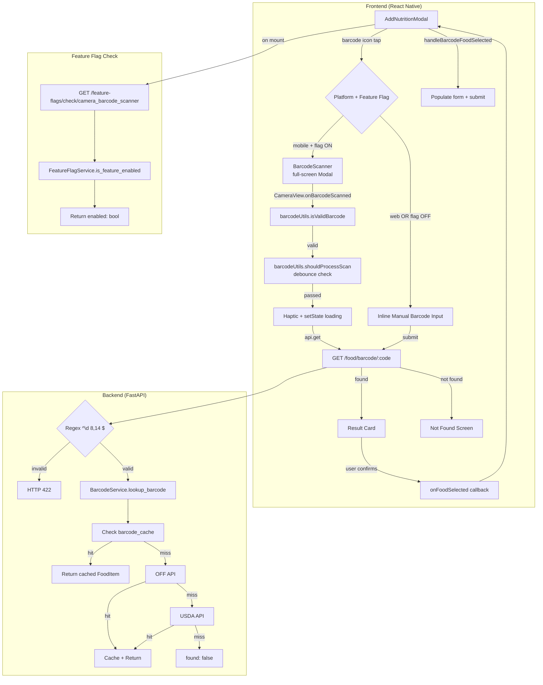

# Design Document: Camera Barcode Scanner

## 1. Overview

This feature enhances the existing barcode scanning flow in the Repwise nutrition logger. The current `BarcodeScanner.tsx` component already implements camera-based scanning via `expo-camera` with haptic feedback, debounce, overlay UI, and the full state machine. The backend barcode lookup chain (cache → OFF → USDA) at `GET /food-database/barcode/{barcode}` is complete and tested.

**What actually needs to be built:**

1. Feature flag gating (`camera_barcode_scanner`) — the barcode icon in `AddNutritionModal` conditionally shows camera scanner vs. text-only input
2. A `GET /feature-flags/check/{flag_name}` endpoint — no such endpoint exists today; the `FeatureFlagService` is only used server-side in guards
3. Extract pure utility functions from `BarcodeScanner.tsx` into `barcodeUtils.ts` for testability
4. Add client-side barcode format validation to the manual entry fallback on web
5. Fix the `handleManualBarcodeEntry` API call in `AddNutritionModal.tsx` — it currently uses query params (`api.get('food/barcode', { params: { code: barcode } })`) but the backend expects a path param (`GET /food/barcode/{barcode}`)

**What already exists and is NOT being rebuilt:**

- `CameraView` with `onBarcodeScanned` (EAN-13, EAN-8, UPC-A, UPC-E, Code 128, Code 39, QR)
- Permission handling via `useCameraPermissions` with denied/settings flow
- 2-second debounce on scan events
- Haptic feedback (`expo-haptics` ImpactFeedbackStyle.Medium)
- Scan overlay with corner markers and instructional text
- Result card with macro display and serving multiplier
- Not-found state with scan-again and manual-fallback (Cancel in found state closes scanner, not rescan)
- Web platform guard (returns text-only message)
- Loading state with ActivityIndicator
- Backend: `BarcodeService`, `off_client`, `usda_client`, `BarcodeCache` model, barcode endpoint with regex validation

**Decision: Why not a full rewrite?**

The existing component is ~350 lines, handles all states correctly, and has passing tests. A rewrite would introduce regression risk for zero user-facing benefit. Instead, we extract testable logic, add the flag gate, and improve the web fallback.

## 2. Architecture



**Component ownership:**

| Component | File | Owner |
|-----------|------|-------|
| Barcode icon + flag gate | `app/components/modals/AddNutritionModal.tsx` | Existing, modified |
| Camera scanner | `app/components/nutrition/BarcodeScanner.tsx` | Existing, minor refactor |
| Pure utilities | `app/utils/barcodeUtils.ts` | **New** |
| Feature flag hook | `app/hooks/useFeatureFlag.ts` | **New** |
| Flag check endpoint | `src/modules/feature_flags/router.py` | **New** |
| Flag check wiring | `src/main.py` | Modified (register router) |
| Feature flag seed | `scripts/seed_camera_barcode_flag.py` | **New** (follows `scripts/seed_training_log_v2_flag.py` pattern) |

## 3. Data Model

### Existing Tables (No Changes)

**`food_items`** — stores barcode-scanned results (already has `barcode` column)

**`barcode_cache`** — maps barcode → food_item_id with source_api and raw_response

**`feature_flags`** — stores flag configuration

| Column | Type | Constraints | Notes |
|--------|------|-------------|-------|
| id | UUID | PK, default gen_random_uuid() | Inherited from Base |
| flag_name | VARCHAR(255) | UNIQUE, NOT NULL | e.g. `camera_barcode_scanner` |
| is_enabled | BOOLEAN | NOT NULL, default FALSE | Global toggle |
| conditions | JSONB | NULLABLE | `{"user_ids": [...], "roles": [...]}` for phased rollout |
| description | VARCHAR(1024) | NULLABLE | Human-readable |
| created_at | TIMESTAMP | NOT NULL | Inherited from Base |
| updated_at | TIMESTAMP | NOT NULL | Inherited from Base |

**Primary access pattern for this feature:** `SELECT * FROM feature_flags WHERE flag_name = 'camera_barcode_scanner'` — already indexed via UNIQUE constraint on `flag_name`. The `FeatureFlagService` has an in-memory TTL cache (60s) so this query fires at most once per minute per server instance.

### New Database Objects: None

No schema changes. No migrations. The feature flag row is seeded via a script.

### Local Storage: None

No AsyncStorage needed. The feature flag is checked on each modal open (no client-side caching across sessions per Requirement 1.3). The scanner is stateless — all data flows through the API.

## 4. API Contracts

### New Endpoint: Check Feature Flag

```
GET /api/v1/feature-flags/check/{flag_name}
```

| Aspect | Detail |
|--------|--------|
| Auth | Required (JWT Bearer) |
| Path param | `flag_name: str` — the flag to check |
| Response 200 | `{ "enabled": true }` or `{ "enabled": false }` |
| Response 401 | Unauthenticated |
| Rate limit | Standard (no special limit — lightweight query with cache) |

**Why a new endpoint?** The `FeatureFlagService` exists but is only used server-side in route guards (e.g., `recomp/router.py`). The frontend has no way to check a flag. This endpoint is intentionally minimal — it returns a single boolean, not the full flag object (no leaking conditions/rollout config to the client).

**Implementation:**

```python
# src/modules/feature_flags/router.py (NEW)
@router.get("/check/{flag_name}")
async def check_feature_flag(
    flag_name: str,
    user: User = Depends(get_current_user),
    db: AsyncSession = Depends(get_db),
) -> dict:
    service = FeatureFlagService(db)
    enabled = await service.is_feature_enabled(flag_name, user)
    return {"enabled": enabled}
```

### Existing Endpoints (No Changes)

| Endpoint | Method | Used By | Notes |
|----------|--------|---------|-------|
| `/food/barcode/{barcode}` | GET | Scanner + manual entry | Already validates `^\d{8,14}$`, returns `BarcodeResponse` |
| `/nutrition/entries` | POST | Confirm flow (via modal) | Already used by `AddNutritionModal.handleSubmit` |

**Decision: Direct submit from scanner vs. pass-back to modal?**

Chose: Keep the existing pass-back pattern (`onFoodSelected` → modal populates form → user submits). Reasons:
1. The modal already handles water logging, micronutrients, favorites, and the full submission flow
2. Direct submit from scanner would duplicate submission logic
3. The user can adjust the entry (add notes, change meal name) before submitting
4. The existing `handleBarcodeFoodSelected` already works correctly

**Bug fix needed:** The existing `handleManualBarcodeEntry` in `AddNutritionModal.tsx` uses `api.get('food/barcode', { params: { code: barcode } })` (query param), but the backend expects a path param: `GET /food/barcode/{barcode}`. This must be fixed to `api.get(\`food/barcode/${barcode}\`)`.

## 5. Frontend Implementation

### New Files

#### `app/utils/barcodeUtils.ts`

Pure functions extracted from `BarcodeScanner.tsx` for testability:

```typescript
/** Validates barcode format: 8-14 digits only */
export function isValidBarcode(barcode: string): boolean {
  return /^\d{8,14}$/.test(barcode);
}

/** Debounce check: returns true if enough time has passed */
export function shouldProcessScan(
  now: number,
  lastScanTime: number,
  debounceMs: number,
): boolean {
  return now - lastScanTime >= debounceMs;
}

/** Scale macro values by multiplier with appropriate rounding */
export function scaleBarcodeResult(
  food: { calories: number; protein_g: number; carbs_g: number; fat_g: number },
  multiplier: number,
): { calories: number; protein_g: number; carbs_g: number; fat_g: number } {
  return {
    calories: Math.round(food.calories * multiplier),
    protein_g: Math.round(food.protein_g * multiplier * 10) / 10,
    carbs_g: Math.round(food.carbs_g * multiplier * 10) / 10,
    fat_g: Math.round(food.fat_g * multiplier * 10) / 10,
  };
}

/** Validates multiplier input: must be a positive finite number */
export function isValidMultiplier(input: string): boolean {
  const n = parseFloat(input);
  return !isNaN(n) && isFinite(n) && n > 0;
}

/**
 * Resolves scanner mode based on platform and feature flag.
 * Returns 'camera' only on mobile with flag enabled.
 */
export function resolveScannerMode(
  platform: 'ios' | 'android' | 'web' | 'windows' | 'macos',
  flagEnabled: boolean,
): 'camera' | 'manual' {
  if (platform === 'web' || platform === 'windows' || platform === 'macos') {
    return 'manual';
  }
  return flagEnabled ? 'camera' : 'manual';
}
```

#### `app/hooks/useFeatureFlag.ts`

```typescript
import { useState, useEffect } from 'react';
import api from '../services/api';

/**
 * Check a feature flag for the current user.
 * Re-evaluates on each mount (no cross-session caching).
 * Defaults to false on error (safe fallback).
 */
export function useFeatureFlag(flagName: string): {
  enabled: boolean;
  loading: boolean;
} {
  const [enabled, setEnabled] = useState(false);
  const [loading, setLoading] = useState(true);

  useEffect(() => {
    let cancelled = false;
    (async () => {
      try {
        const res = await api.get(`feature-flags/check/${flagName}`);
        if (!cancelled) setEnabled(res.data?.enabled === true);
      } catch {
        if (!cancelled) setEnabled(false); // safe fallback
      } finally {
        if (!cancelled) setLoading(false);
      }
    })();
    return () => { cancelled = true; };
  }, [flagName]);

  return { enabled, loading };
}
```

### Modified Files

#### `app/components/modals/AddNutritionModal.tsx`

Changes (minimal):

1. Import `useFeatureFlag` and `resolveScannerMode`
2. Call `useFeatureFlag('camera_barcode_scanner')` at component top
3. Replace the barcode icon `onPress` logic:

```typescript
// BEFORE (lines ~1148-1155):
onPress={() => {
  if (Platform.OS === 'web') {
    setSearchQuery('');
    setSearchError('Type a barcode number in the search field above...');
  } else {
    setShowBarcodeScanner(true);
  }
}}

// AFTER:
onPress={() => {
  const mode = resolveScannerMode(Platform.OS, cameraFlagEnabled);
  if (mode === 'camera') {
    setShowBarcodeScanner(true);
  } else {
    setShowManualBarcode(true); // new state for inline manual entry
  }
}}
```

4. Add `showManualBarcode` state and inline manual barcode input UI with `isValidBarcode` validation
5. The existing `handleManualBarcodeEntry` function already handles the API call — just wire it to the new input

#### `app/components/nutrition/BarcodeScanner.tsx`

Changes (minimal):

1. Import `isValidBarcode`, `shouldProcessScan`, `scaleBarcodeResult` from `barcodeUtils`
2. Replace inline validation/debounce/scaling logic with utility calls
3. No structural changes — same component, same props, same state machine

### Navigation Flow

```
DashboardScreen
  └─ "Log Nutrition" button
      └─ AddNutritionModal (modal overlay via ModalContainer)
          └─ Barcode icon (in search row)
              ├─ [mobile + flag ON] → BarcodeScanner (full-screen Modal, animationType="slide")
              │   ├─ Scan → Result Card → "Add" → back to modal with form populated
              │   └─ "Cancel" → back to modal
              └─ [web OR flag OFF] → Inline manual barcode input (within modal)
                  └─ Submit → lookup → populate form
```

No new screens. No navigation stack changes. The scanner is already rendered as a `<Modal>` inside `AddNutritionModal`.

### State Management

| State | Location | Justification |
|-------|----------|---------------|
| `showBarcodeScanner` | Local (AddNutritionModal) | UI-only, resets on modal close |
| `showManualBarcode` | Local (AddNutritionModal) | UI-only, resets on modal close |
| Scanner state machine | Local (BarcodeScanner) | Component-scoped, no persistence needed |
| Feature flag result | Local (useFeatureFlag hook) | Re-fetched on mount, no global cache |
| Scanned food data | Local (BarcodeScanner → callback → modal) | Flows through callback, not stored globally |

**No Zustand changes.** This feature is entirely local state. The scanned food flows through the existing `onFoodSelected` callback pattern.

### Loading / Empty / Error States

| State | UI | Component |
|-------|-----|-----------|
| Flag loading | Barcode icon shows but defaults to manual mode until flag resolves | AddNutritionModal |
| Permission requesting | Blank screen (expo-camera handles native dialog) | BarcodeScanner |
| Permission denied | Card: "Camera Access Required" + "Open Settings" + "Cancel" | BarcodeScanner |
| Scanning (active) | Full-screen camera with overlay + corner markers + "Point camera at barcode" | BarcodeScanner |
| Lookup loading | Card: ActivityIndicator + "Looking up barcode…" | BarcodeScanner |
| Food found | Card: food name, macros, serving multiplier, "Add" / "Cancel" | BarcodeScanner |
| Food not found | Card: "Not Found" + "Scan Again" + "Search Manually" | BarcodeScanner |
| Network error | Card: error message + "Scan Again" + "Search Manually" | BarcodeScanner |
| Manual entry invalid | Inline red text: "Enter 8-14 digits" | AddNutritionModal |

### Offline Behavior

No offline support. Barcode lookup requires network (OFF/USDA APIs). If offline:
- Feature flag check fails → defaults to `enabled: false` → manual entry mode
- Barcode lookup fails → "Not Found" screen with retry option
- This is acceptable: barcode scanning is inherently an online operation (external DB lookup)

## 6. Data Flow

### Happy Path: Camera Scan → Log

```
1. User opens AddNutritionModal
2. useFeatureFlag('camera_barcode_scanner') fires GET /feature-flags/check/camera_barcode_scanner
3. Backend: FeatureFlagService checks in-memory cache (TTL 60s) → DB if miss → returns {enabled: true}
4. User taps barcode icon → resolveScannerMode('ios', true) → 'camera'
5. setShowBarcodeScanner(true) → <Modal visible={true}> renders BarcodeScanner
6. BarcodeScanner mounts → useCameraPermissions() → permission.granted → setState('scanning')
7. CameraView renders with onBarcodeScanned callback
8. Camera detects EAN-13 barcode "3017620422003"
9. handleBarCodeScanned fires:
   a. isValidBarcode("3017620422003") → true
   b. shouldProcessScan(Date.now(), lastScanRef.current, 2000) → true (first scan)
   c. lastScanRef.current = Date.now()
   d. Haptics.impactAsync(ImpactFeedbackStyle.Medium)
   e. setState('loading')
10. api.get('food/barcode/3017620422003') fires
11. Backend: BarcodeService.lookup_barcode("3017620422003")
    b. get_product_by_barcode("3017620422003") → OFF API returns Nutella data
    c. _create_food_item → INSERT INTO food_items
    d. _cache_result → INSERT INTO barcode_cache
    e. Return BarcodeResponse(found=true, food_item=..., source="off")
12. Frontend receives {found: true, food_item: {name: "Nutella", calories: 539, ...}}
13. setState('found'), setScannedFood(food_item)
14. User sees Result Card: "Nutella — 539 kcal, 6.3g P, 57.5g C, 30.9g F"
15. User taps "Add" → handleConfirm():
    a. isValidMultiplier("1") → true
    b. onFoodSelected(scannedFood, 1)
16. AddNutritionModal.handleBarcodeFoodSelected fires:
    a. setShowBarcodeScanner(false)
    b. scaleMacros(item, 1) → populate calories/protein/carbs/fat fields
    c. setNotes("Nutella")
    d. setSelectedFood(item)
17. User sees populated form, taps "Log" → handleSubmit()
18. POST /nutrition/entries with {entry_date, meal_name: "Nutella", calories: 539, ...}
19. Success → clearForm() → onSuccess() callback refreshes dashboard
```

### Error Path: Network Failure During Lookup

```
1-9. Same as happy path
10. api.get('food/barcode/...') throws (network timeout)
11. catch block: setError('Failed to look up barcode. Please try again.')
12. setState('not_found')
13. User sees: "Not Found — Failed to look up barcode. Please try again."
14. User taps "Scan Again" → setState('scanning'), setError('')
15. Camera resumes scanning
```

### Caching Strategy

| Layer | What's Cached | TTL | Invalidation |
|-------|--------------|-----|-------------|
| Feature flag (server) | In-memory `_cache` dict in `FeatureFlagService` | 60 seconds | `invalidate_cache()` on flag update |
| Feature flag (client) | None — re-fetched on each `useFeatureFlag` mount | N/A | N/A |
| Barcode lookup (server) | `barcode_cache` table (permanent) | Permanent | None (external data doesn't change) |
| Barcode lookup (client) | None | N/A | N/A |

## 7. Edge Cases & Error Handling

| Scenario | Handling | Component |
|----------|----------|-----------|
| **Null/missing data** | OFF returns product with no name → `off_client` returns `None` → falls through to USDA | Backend |
| **Network timeout mid-lookup** | `httpx` 5s timeout → `off_client` returns `None` → USDA fallback. If both fail → `found: false` | Backend |
| **Partial failure (API succeeds, callback fails)** | `onFoodSelected` is synchronous state update — can't fail. If modal's `handleSubmit` fails → error alert, form stays populated for retry | Frontend |
| **Duplicate submissions (double-tap "Add")** | `handleConfirm` calls `onFoodSelected` which closes the scanner modal. Second tap has no target. The modal's submit button has `disabled={loading}` | Frontend |
| **Race condition (concurrent barcode scans)** | 2-second debounce prevents concurrent lookups. `lastScanRef` is a ref (not state) so no stale closure issues | Frontend |
| **Invalid/malicious barcode input** | Client: `isValidBarcode` rejects non-digit and wrong-length strings. Server: regex `^\d{8,14}$` → 422 | Both |
| **Token expiration during scan** | `api` interceptor handles 401 → refresh → retry transparently. Scanner doesn't need to know | Frontend (api.ts) |
| **App backgrounded mid-scan** | Camera pauses automatically (OS behavior). On foreground, `CameraView` resumes. State is preserved in component | Frontend |
| **App killed mid-scan** | No data loss — nothing was persisted yet. User re-opens modal and starts over | Frontend |
| **Device offline** | Feature flag check fails → `enabled: false` → manual mode. Barcode lookup fails → error screen with retry | Frontend |
| **Camera permission revoked while scanning** | `useCameraPermissions` hook detects status change → re-renders → `useEffect` transitions to 'denied' state | Frontend |
| **Barcode scanned but OFF returns incomplete data** | `off_client` requires name + calories. Missing either → returns `None` → USDA fallback | Backend |
| **Concurrent cache writes (same barcode)** | `_cache_result` catches `IntegrityError` on unique constraint → rollback → log debug → continue (existing code) | Backend |
| **Haptic feedback unavailable** | `try/catch` around `Haptics.impactAsync` — silently ignored (existing code) | Frontend |

## 8. Security

### Input Validation

| Layer | Validation | Implementation |
|-------|-----------|----------------|
| Client (scanner) | `isValidBarcode`: `^\d{8,14}$` | `barcodeUtils.ts` — filters before API call |
| Client (manual) | Same regex + inline error message | `AddNutritionModal` manual barcode input |
| Server | `_BARCODE_RE = re.compile(r"^\d{8,14}$")` → 422 | `food_database/router.py` (existing) |

Double validation (client + server) is intentional — defense in depth.

### Authorization

| Endpoint | Auth | Authorization |
|----------|------|---------------|
| `GET /feature-flags/check/{flag_name}` | JWT required | Any authenticated user (flag evaluation handles role-based conditions internally) |
| `GET /food-database/barcode/{barcode}` | JWT required | Any authenticated user |
| `POST /nutrition/entries` | JWT required | User can only create entries for themselves |

### Audit Logging

No new audit logging needed. The existing audit middleware logs all API calls. Barcode lookups are standard GET requests — no destructive operations.

### Data Privacy

- Barcode numbers are not PII
- Food items from OFF/USDA are public data
- No health data is exposed through the barcode lookup — only food nutritional info
- The feature flag check reveals only a boolean, not flag conditions or rollout percentages

## 9. Performance

### Target Latency

| Operation | p50 | p95 | p99 | Notes |
|-----------|-----|-----|-----|-------|
| Feature flag check | <20ms | <50ms | <100ms | In-memory cache hit path |
| Barcode lookup (cache hit) | <30ms | <80ms | <150ms | Single DB query |
| Barcode lookup (OFF API) | <500ms | <1.5s | <3s | External HTTP call, 5s timeout |
| Barcode lookup (USDA fallback) | <800ms | <2s | <4s | OFF miss + USDA call |
| Camera → barcode detection | <100ms | <300ms | <500ms | expo-camera native processing |

**End-to-end scan-to-result: p50 ~600ms, p95 ~2s** (camera detection + API lookup). Meets the "under 1 second" delight target for cache hits and fast OFF responses.

### Database Query Analysis

- Feature flag: `SELECT * FROM feature_flags WHERE flag_name = ?` — indexed (UNIQUE), O(1). Cached in-memory for 60s.
- Barcode cache: `SELECT * FROM barcode_cache WHERE barcode = ?` — indexed (UNIQUE on barcode column), O(1).
- Food item by ID: `SELECT * FROM food_items WHERE id = ?` — PK lookup, O(1).
- No N+1 risks. No full table scans. No joins.

### Frontend Performance

- `BarcodeScanner` is rendered inside a `<Modal>` — only mounts when `showBarcodeScanner` is true. No unnecessary re-renders.
- `CameraView` is the heaviest component — native camera preview. Unmounts when modal closes.
- `useFeatureFlag` fires one API call on mount. No polling. No re-renders beyond the initial load.
- The result card uses simple `Text` and `TextInput` — no virtualization needed.

### Payload Sizes

- Feature flag response: ~20 bytes (`{"enabled":true}`)
- Barcode lookup response: ~500 bytes (single food item with macros)
- Nutrition entry POST: ~200 bytes

All trivially small. No compression needed.


## 10. Correctness Properties

*A property is a characteristic or behavior that should hold true across all valid executions of a system — essentially, a formal statement about what the system should do. Properties serve as the bridge between human-readable specifications and machine-verifiable correctness guarantees.*

### Property 1: Scanner mode selection

*For any* combination of feature flag state (enabled/disabled) and platform (`ios`, `android`, `web`, `windows`, `macos`), `resolveScannerMode(platform, flagEnabled)` should return `'camera'` if and only if the platform is mobile (`ios` or `android`) AND the flag is enabled. In all other cases it should return `'manual'`.

**Validates: Requirements 1.1, 1.2, 6.1**

### Property 2: Scan debounce correctness

*For any* pair of timestamps `(now, lastScanTime)` where `now >= 0` and `lastScanTime >= 0`, and a debounce window `debounceMs > 0`, `shouldProcessScan(now, lastScanTime, debounceMs)` should return `true` if and only if `now - lastScanTime >= debounceMs`.

**Validates: Requirements 3.3**

### Property 3: Macro scaling correctness

*For any* food item with non-negative macro values and any positive multiplier, `scaleBarcodeResult(food, multiplier)` should produce: `calories === Math.round(food.calories * multiplier)`, and for each gram field `x_g === Math.round(food.x_g * multiplier * 10) / 10`. Additionally, scaling by multiplier 1 should return values equal to the original (identity property).

**Validates: Requirements 4.3, 5.1**

### Property 4: Barcode format validation (client)

*For any* string `s`, `isValidBarcode(s)` should return `true` if and only if `s` consists entirely of ASCII digits (`0-9`) and has length between 8 and 14 inclusive. This must agree with the backend regex `^\d{8,14}$`.

**Validates: Requirements 8.1, 6.3, 8.3**

### Property 5: Barcode format validation (backend)

*For any* string that does NOT match `^\d{8,14}$`, the `GET /food-database/barcode/{barcode}` endpoint should return HTTP 422. For any string that DOES match the pattern, the endpoint should NOT return 422.

**Validates: Requirements 8.2**

## 11. Testing Strategy

### Property-Based Tests

| Property | Library | File | Min Iterations | Tag |
|----------|---------|------|----------------|-----|
| P1: Scanner mode selection | fast-check | `app/__tests__/utils/barcodeUtils.test.ts` | 100 | `Feature: camera-barcode-scanner, Property 1: Scanner mode selection` |
| P2: Scan debounce | fast-check | `app/__tests__/utils/barcodeUtils.test.ts` | 100 | `Feature: camera-barcode-scanner, Property 2: Scan debounce correctness` |
| P3: Macro scaling | fast-check | `app/__tests__/utils/barcodeUtils.test.ts` | 100 | `Feature: camera-barcode-scanner, Property 3: Macro scaling correctness` |
| P4: Barcode validation (client) | fast-check | `app/__tests__/utils/barcodeUtils.test.ts` | 100 | `Feature: camera-barcode-scanner, Property 4: Barcode format validation` |
| P5: Barcode validation (backend) | Hypothesis | `tests/test_barcode_properties.py` | 100 | `Feature: camera-barcode-scanner, Property 5: Barcode format validation (backend)` |

Each property test must be a single test function. Each must reference its design property number in a comment.

### Unit Tests

| Test | File | What it covers |
|------|------|---------------|
| `isValidMultiplier` edge cases | `app/__tests__/utils/barcodeUtils.test.ts` | "0", "-1", "abc", "", "Infinity", "0.01" |
| Scanner state transitions | `app/__tests__/components/BarcodeScanner.test.ts` | Existing — already covers all transitions |
| Feature flag hook | `app/__tests__/hooks/useFeatureFlag.test.ts` | Loading state, success, error fallback to false |
| Manual barcode input validation | `app/__tests__/components/AddNutritionModal.test.ts` | Existing file — add manual barcode validation cases |
| Feature flag endpoint | `tests/test_barcode_properties.py` | 200 with valid flag, 401 without auth |

### Existing Test Coverage (Do Not Duplicate)

These tests already exist and pass:
- `tests/test_barcode_properties.py`: Backend lookup chain (P1-P4 in that file), cache round-trip, OFF client parsing, endpoint validation
- `app/__tests__/components/BarcodeScanner.test.ts`: Macro scaling, multiplier validation, debounce logic, state transitions, barcode format

New tests extend these files. Do not rewrite existing tests.

## 12. Implementation Plan

### v1 (MVP) — Ship behind feature flag

| Milestone | Dependencies | Parallelizable | Description |
|-----------|-------------|----------------|-------------|
| M1: Backend flag endpoint | None | Yes (with M2) | Create `feature_flags/router.py`, register in `main.py`, seed script |
| M2: Frontend utilities | None | Yes (with M1) | Create `barcodeUtils.ts`, property tests |
| M3: Feature flag hook | M1 | No | Create `useFeatureFlag.ts`, unit tests |
| M4: Modal integration | M2, M3 | No | Wire flag gate + manual barcode input into `AddNutritionModal` |
| M5: Scanner refactor | M2 | Yes (with M3/M4) | Refactor `BarcodeScanner.tsx` to use `barcodeUtils` |
| M6: Backend property test | M1 | Yes (with M4/M5) | Add P5 to `test_barcode_properties.py` |
| M7: Seed + verify | M1-M6 | No | Seed flag, end-to-end manual verification |

**Estimated effort:** 2-3 days for one developer.

### v2 (Fast-Follow)

- Continuous scanning mode (scan → confirm → immediately scan next, no return to modal)
- Scan history (recently scanned barcodes for quick re-logging)
- Animated transitions between scanner states (Reanimated 4 shared transitions)
- Torch/flashlight toggle for low-light scanning
- Barcode type indicator in overlay (show "EAN-13" when detected)

### Feature Flag Rollout

```
Phase 1: is_enabled=true, conditions={"user_ids": ["<team-member-ids>"]}  → internal testing
Phase 2: is_enabled=true, conditions={"roles": ["premium"]}              → premium users (10%)
Phase 3: is_enabled=true, conditions=null                                 → 100% rollout
```

### Rollback Plan

1. Set `camera_barcode_scanner` flag to `is_enabled=false` → instant rollback, no deploy needed
2. All users fall back to manual barcode entry (existing behavior)
3. No data migration needed — barcode cache entries are still valid regardless of scanner mode
4. If the flag endpoint itself is broken, the `useFeatureFlag` hook defaults to `enabled: false` → safe fallback
