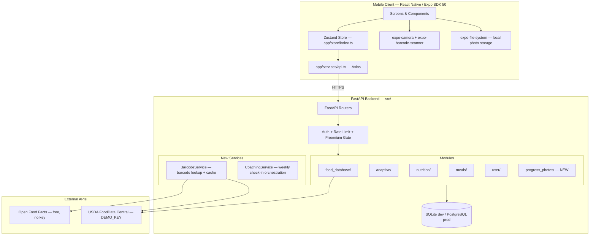
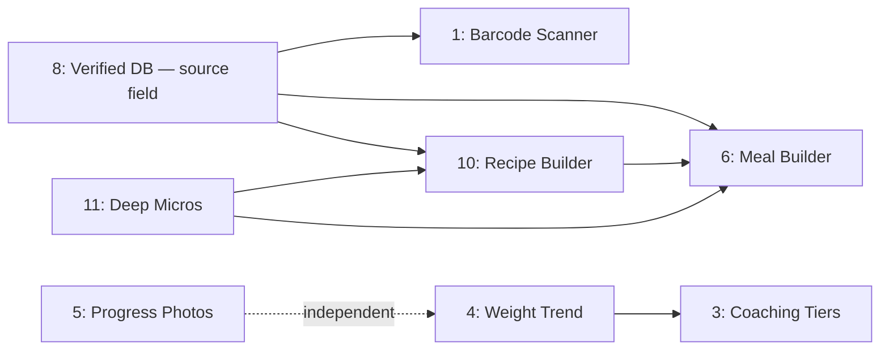

# Design: Competitive Parity V1 — Production-Grade Design

## Overview

Eight features closing the gap against MacroFactor and Cronometer. Each feature is designed to integrate into the existing FastAPI + SQLAlchemy async backend and React Native (Expo SDK 50) frontend without architectural rewrites.

**Scope:** Features 1, 3, 4, 5, 6, 8, 10, 11 from requirements.md.

**Non-goals:** AI photo logging (Feature 2), wearable integrations (Feature 13), data export (Feature 14). These are deferred to future specs.

**Constraints:**
- SQLite in dev, PostgreSQL in prod (SQLAlchemy async handles both)
- Single-server deployment today; design must not preclude horizontal scaling
- Expo SDK 50 — no bare workflow ejection
- Existing test infrastructure: pytest + hypothesis (backend), Jest + fast-check (frontend)

## Architecture

### System Context



### Why This Architecture

**No new infrastructure.** Every feature fits into the existing module pattern (`router.py` → `service.py` → `models.py`). The only new module is `progress_photos/`. Everything else extends existing modules.

**External API strategy:** Open Food Facts is primary for barcode lookups because it's free with no rate limits and has 3M+ products. USDA is the fallback (already integrated). We never block on external APIs — cache aggressively, fail gracefully.

**Photo storage on-device:** Progress photos are large (2-5MB each). Storing them server-side adds storage costs and upload latency for zero benefit in v1. We store metadata in the DB and files on-device via `expo-file-system`. Cloud backup is a v2 concern.

### Feature Dependency Graph



**Critical path:** F8 → F1, F4 → F3. Everything else can be parallelized.

**Implementation order:**
1. F8 (Verified DB) — schema migration, unblocks F1/F6/F10
2. F4 (Weight Trend) — frontend-only, unblocks F3
3. F10 (Recipe Builder) — backend exists, frontend-only
4. F3 (Coaching Tiers) — depends on F4 for check-in card
5. F1 (Barcode Scanner) — depends on F8 for source tagging
6. F6 (Meal Builder) — depends on F8, F10
7. F11 (Deep Micros) — extends existing infrastructure
8. F5 (Progress Photos) — fully independent, can ship anytime

## Components and Interfaces

---

### Feature 8: Verified Food Database with Source Indicators

**Why first:** The `source` field on `FoodItem` is a prerequisite for barcode scanner (tags cached items), meal builder (displays badges), and recipe builder (inherits source from ingredients). Ship this migration before anything else.

#### Backend Changes

**Modified: `src/modules/food_database/models.py`**

Add three columns to `FoodItem`:

```python
source: Mapped[str] = mapped_column(
    String(20), nullable=False, default="community",
    index=True,  # B-tree for sort-by-source queries
)
barcode: Mapped[str | None] = mapped_column(
    String(50), nullable=True, unique=True, index=True,
)
description: Mapped[str | None] = mapped_column(Text, nullable=True)
```

Valid `source` values: `"usda"`, `"verified"`, `"community"`, `"custom"`. Enforced by Pydantic schema validation, not DB constraint (allows future extension without migration).

**Modified: `src/modules/food_database/service.py` — Search ordering**

Current search orders by `FoodItem.name`. Change to:

```python
SOURCE_PRIORITY = {"usda": 0, "verified": 1, "community": 2, "custom": 3}

# In search():
items_stmt = (
    base.order_by(
        case(SOURCE_PRIORITY, value=FoodItem.source, else_=4),
        FoodItem.name,
    )
    .offset(pagination.offset)
    .limit(pagination.limit)
)
```

**Why `case` instead of a join table:** Source priority is a static 4-value enum. A `CASE WHEN` is simpler, faster, and doesn't require a join. If we ever have 20+ source types, we'd move to a lookup table.

**Modified: `src/modules/food_database/service.py` — USDA auto-tagging**

In `_fetch_and_cache_usda`, set `source="usda"` on cached items:

```python
item = FoodItem(
    # ... existing fields ...
    source="usda",
)
```

**Migration: `alembic/versions/xxx_add_food_source_barcode.py`**

```python
def upgrade():
    op.add_column('food_items', sa.Column('source', sa.String(20), nullable=False, server_default='community'))
    op.add_column('food_items', sa.Column('barcode', sa.String(50), nullable=True))
    op.add_column('food_items', sa.Column('description', sa.Text(), nullable=True))
    op.create_index('ix_food_items_source', 'food_items', ['source'])
    op.create_index('ix_food_items_barcode', 'food_items', ['barcode'], unique=True)
    # Tag existing seed data as verified
    op.execute("UPDATE food_items SET source = 'verified' WHERE region != 'USDA'")
    op.execute("UPDATE food_items SET source = 'usda' WHERE region = 'USDA'")
```

#### Frontend Changes

**New: `app/components/nutrition/SourceBadge.tsx`**

```typescript
interface SourceBadgeProps {
  source: 'usda' | 'verified' | 'community' | 'custom';
  size?: number;
}
// Green checkmark (Ionicons "checkmark-circle") for usda/verified
// Gray circle (Ionicons "ellipse-outline") for community/custom
// onPress → tooltip: "USDA verified — lab-tested nutritional data" etc.
```

**Modified: Food search result rows** — Add `<SourceBadge>` next to food name in `AddNutritionModal` search results.

#### Data Flow: Search with Source Priority

```
User types "chicken" → API GET /api/food-database/search?q=chicken
  → FoodDatabaseService.search()
    → SELECT * FROM food_items WHERE name ILIKE '%chicken%' AND deleted_at IS NULL
       ORDER BY CASE source WHEN 'usda' THEN 0 WHEN 'verified' THEN 1 ... END, name
       LIMIT 20
    → If < 20 results: fetch from USDA API, cache with source='usda'
  → Return items with source field
→ Frontend renders each item with <SourceBadge source={item.source} />
```

#### Edge Cases
- **Legacy items without source:** Migration sets default `"community"`. No nulls possible post-migration.
- **Duplicate barcode:** Unique constraint on `barcode` column. If a barcode scan finds a cached item, return it directly.
- **Source field tampering:** Backend schema validates `source in {"usda", "verified", "community", "custom"}`. User-created items always get `source="custom"` server-side, regardless of what the client sends.

---

### Feature 4: Weight Trend Smoothing (EMA Visualization)

**Why second:** Standalone frontend feature with no backend changes. Unblocks Feature 3 (coaching tiers need trend visualization for check-in cards).

#### Frontend — New: `app/utils/emaTrend.ts`

```typescript
export const EMA_ALPHA = 0.25;  // Must match backend engine.py
export const EMA_MIN_POINTS = 3;

export interface WeightPoint {
  date: string;  // ISO date string YYYY-MM-DD
  value: number; // kg
}

/**
 * Compute EMA series from sorted weight entries.
 * Returns empty array if fewer than EMA_MIN_POINTS entries.
 * Filters extreme fluctuations (>2kg/day) matching backend behavior.
 */
export function computeEMA(weights: WeightPoint[]): WeightPoint[];

/**
 * Weekly change = EMA(latest) - EMA(7 days ago).
 * Returns null if insufficient history for 7-day lookback.
 */
export function computeWeeklyChange(emaSeries: WeightPoint[]): number | null;

/**
 * Format weekly change for display: "↓0.3kg" or "↑0.2kg" or "→0.0kg"
 */
export function formatWeeklyChange(change: number | null, unit: 'kg' | 'lbs'): string;
```

**Why duplicate EMA on frontend?** The backend computes EMA for adaptive engine decisions (server-authoritative). The frontend computes EMA for chart rendering (client-side, no network round-trip on every chart pan/zoom). The alpha and window constants are shared via convention, not code sharing. A mismatch would cause visual inconsistency but not data corruption — acceptable tradeoff for responsiveness.

**Tech decision: No charting library change.** The existing `TrendLineChart` component wraps `react-native-svg`. We add a second data series (EMA line) alongside the existing raw dots. No new dependency needed.

#### Frontend — Modified: `app/screens/analytics/AnalyticsScreen.tsx`

- Fetch bodyweight history from existing `GET /api/user/bodyweight` endpoint
- Compute EMA series client-side via `computeEMA()`
- Render two series on `TrendLineChart`: raw (dots, opacity 0.4) + EMA (solid line, theme primary)

#### Frontend — Modified: `app/screens/dashboard/DashboardScreen.tsx`

- Add trend weight display: "Trend: 78.2kg" next to latest raw weight
- Add weekly change badge: "↓0.3kg this week" using `computeWeeklyChange()`
- Info icon with tooltip: "Trend weight smooths out daily fluctuations from water, sodium, and other factors"

#### Edge Cases
- **< 3 data points:** Show raw dots only, no trend line. Dashboard shows raw weight without "Trend:" prefix.
- **Extreme fluctuation (>2kg/day):** Filtered from EMA computation, matching backend `_filter_extreme_fluctuations`. Raw dots still shown.
- **No weight data at all:** Empty state: "Log your weight to see trends"
- **Gap in data (missed days):** EMA computation uses available points only. No interpolation — the line connects available EMA points.

---

### Feature 10: Recipe Builder with Nutritional Scaling

**Why third:** Backend infrastructure exists (`RecipeIngredient` model, `aggregate_recipe_nutrition` function). This is primarily a frontend build with minor backend extensions.

#### Backend Changes

**Modified: `src/modules/food_database/models.py`** — Add `total_servings` to `FoodItem`:

```python
total_servings: Mapped[float | None] = mapped_column(Float, nullable=True, default=1.0)
# Only meaningful when is_recipe=True. Null for regular food items.
```

**Modified: `src/modules/food_database/service.py`** — New methods:

```python
async def create_recipe(
    self, user_id: UUID, name: str, description: str | None,
    total_servings: float, ingredients: list[RecipeIngredientInput],
) -> FoodItem:
    """
    1. Create FoodItem with is_recipe=True, source='custom', total_servings
    2. Create RecipeIngredient rows for each ingredient
    3. Compute aggregate nutrition via aggregate_recipe_nutrition()
    4. Store computed macros on the FoodItem itself (denormalized for search)
    5. Return the recipe with ingredients loaded
    """

async def list_user_recipes(self, user_id: UUID, pagination: PaginationParams) -> PaginatedResult:
    """List recipes created by this user. Recipes are FoodItems with is_recipe=True."""

async def update_recipe(self, user_id: UUID, recipe_id: UUID, ...) -> FoodItem:
    """Update recipe name, description, servings, or ingredients. Recompute nutrition."""
```

**Why denormalize macros on FoodItem?** Recipes appear in food search results alongside regular items. Computing aggregate nutrition on every search would require N+1 queries (load ingredients for each recipe). Instead, we compute once on save and store the per-serving values directly on the `FoodItem` row. Tradeoff: stale if ingredients change externally (they don't — ingredients are immutable food items).

**New API endpoints on `src/modules/food_database/router.py`:**

| Method | Path | Request | Response | Notes |
|--------|------|---------|----------|-------|
| POST | `/api/food-database/recipes` | `RecipeCreateRequest` | `RecipeDetailResponse` | Auth required |
| GET | `/api/food-database/recipes` | query: page, limit | `PaginatedResult[RecipeDetailResponse]` | User's recipes |
| GET | `/api/food-database/recipes/{id}` | — | `RecipeDetailResponse` | With ingredients + nutrition |
| PUT | `/api/food-database/recipes/{id}` | `RecipeUpdateRequest` | `RecipeDetailResponse` | Owner only |
| DELETE | `/api/food-database/recipes/{id}` | — | 204 | Soft delete |

**Request schema:**

```python
class RecipeIngredientInput(BaseModel):
    food_item_id: UUID
    quantity: float = Field(gt=0)
    unit: str = Field(default="g", max_length=20)

class RecipeCreateRequest(BaseModel):
    name: str = Field(min_length=1, max_length=255)
    description: str | None = None
    total_servings: float = Field(gt=0, le=1000)
    ingredients: list[RecipeIngredientInput] = Field(min_length=1)
```

#### Frontend — New: `app/screens/nutrition/RecipeBuilderScreen.tsx`

**State machine:**

```
NAMING → ADDING_INGREDIENTS → REVIEW → SAVED
```

- **NAMING:** Recipe name + description + total servings input
- **ADDING_INGREDIENTS:** Food search (reuses existing search component), quantity input per ingredient. Running total + per-serving display updates on every change.
- **REVIEW:** Full ingredient list with totals. Edit/remove ingredients. Adjust servings.
- **SAVED:** Confirmation, navigate back to nutrition logging.

**Nutrition computation (client-side, real-time):**

```typescript
function computeRecipeNutrition(
  ingredients: { foodItem: FoodItem; quantity: number }[],
  totalServings: number,
): { total: Macros; perServing: Macros } {
  const total = ingredients.reduce((acc, ing) => {
    const scale = ing.quantity / ing.foodItem.serving_size;
    return {
      calories: acc.calories + ing.foodItem.calories * scale,
      protein_g: acc.protein_g + ing.foodItem.protein_g * scale,
      carbs_g: acc.carbs_g + ing.foodItem.carbs_g * scale,
      fat_g: acc.fat_g + ing.foodItem.fat_g * scale,
    };
  }, { calories: 0, protein_g: 0, carbs_g: 0, fat_g: 0 });

  const perServing = {
    calories: total.calories / totalServings,
    protein_g: total.protein_g / totalServings,
    carbs_g: total.carbs_g / totalServings,
    fat_g: total.fat_g / totalServings,
  };

  return { total, perServing };
}
```

**When logging a recipe:** User enters servings consumed (decimal, e.g., 1.5). Logged macros = `perServing * servingsConsumed`. This reuses the existing `NutritionEntryCreate` schema with `source_meal_id` pointing to the recipe's `FoodItem.id`.

#### Data Flow: Create Recipe

```
User fills recipe form → POST /api/food-database/recipes
  → Validate: name non-empty, total_servings > 0, ingredients non-empty
  → For each ingredient: verify food_item_id exists, not deleted
  → Create FoodItem(is_recipe=True, source='custom', total_servings=N)
  → Create RecipeIngredient rows
  → aggregate_recipe_nutrition(ingredients) → compute totals
  → Store per-serving macros on FoodItem (calories/S, protein/S, etc.)
  → Return RecipeDetailResponse with ingredients + nutrition
```

#### Edge Cases
- **Zero total_servings:** Rejected by Pydantic `Field(gt=0)`.
- **Ingredient references deleted food item:** `food_item_id` FK with `ON DELETE CASCADE` handles this. Validation checks existence before creation.
- **Circular recipe (recipe contains itself):** Prevented by checking `food_item_id != recipe_id` in service layer.
- **Very large recipe (100+ ingredients):** No hard limit, but frontend paginates ingredient list at 50. Backend handles any count.
- **Decimal serving sizes (0.5 servings consumed):** Fully supported. Macros scale linearly.

---

### Feature 3: Adaptive Coaching Tiers

**Why fourth:** Depends on Feature 4 (weight trend) for check-in card visualization. The adaptive engine already exists — this feature surfaces it through three coaching modes.

#### Backend Changes

**Modified: `src/modules/user/models.py`** — Add to `UserProfile`:

```python
coaching_mode: Mapped[str] = mapped_column(
    String(20), nullable=False, default="coached",
)
# Valid: "coached", "collaborative", "manual"
```

**New model: `src/modules/adaptive/models.py`** — Add `CoachingSuggestion`:

```python
class CoachingSuggestion(Base):
    __tablename__ = "coaching_suggestions"

    user_id: Mapped[UUID] = mapped_column(ForeignKey("users.id", ondelete="CASCADE"), nullable=False)
    snapshot_id: Mapped[UUID] = mapped_column(ForeignKey("adaptive_snapshots.id", ondelete="CASCADE"), nullable=False)
    status: Mapped[str] = mapped_column(String(20), nullable=False, default="pending")
    # "pending", "accepted", "modified", "dismissed"

    proposed_calories: Mapped[float] = mapped_column(Float, nullable=False)
    proposed_protein_g: Mapped[float] = mapped_column(Float, nullable=False)
    proposed_carbs_g: Mapped[float] = mapped_column(Float, nullable=False)
    proposed_fat_g: Mapped[float] = mapped_column(Float, nullable=False)

    # User modifications (collaborative mode)
    modified_calories: Mapped[float | None] = mapped_column(Float, nullable=True)
    modified_protein_g: Mapped[float | None] = mapped_column(Float, nullable=True)
    modified_carbs_g: Mapped[float | None] = mapped_column(Float, nullable=True)
    modified_fat_g: Mapped[float | None] = mapped_column(Float, nullable=True)

    explanation: Mapped[str] = mapped_column(Text, nullable=False)
    resolved_at: Mapped[datetime | None] = mapped_column(nullable=True)

    __table_args__ = (
        Index("ix_coaching_suggestions_user_status", "user_id", "status"),
    )
```

**New: `src/modules/adaptive/coaching_service.py`**

```python
class CoachingService:
    def __init__(self, db: AsyncSession):
        self.db = db

    async def generate_weekly_checkin(self, user_id: UUID) -> WeeklyCheckinResponse:
        """
        Core orchestration:
        1. Load user profile (coaching_mode, age, sex, activity_level, goal)
        2. Load last 14 days of bodyweight + last 7 days of nutrition entries
        3. If < 7 bodyweight entries: return insufficient_data response
        4. Build AdaptiveInput, call compute_snapshot()
        5. Load previous snapshot for comparison
        6. Generate explanation text via _generate_explanation()
        7. Based on coaching_mode:
           - "coached": persist new snapshot, update user's active targets
           - "collaborative": create CoachingSuggestion(status="pending")
           - "manual": return info-only (no persistence, no suggestion)
        8. Return WeeklyCheckinResponse
        """

    def _generate_explanation(
        self, old: AdaptiveOutput | None, new: AdaptiveOutput,
        ema_current: float, ema_7d_ago: float | None,
    ) -> str:
        """
        Template-based explanation:
        - Weight direction: "You lost 0.3kg" / "You gained 0.2kg" / "Weight stable"
        - Target change: "Calories adjusted from 2200 to 2150 (-50)"
        - Progress: "On track for your goal" / "Slightly ahead of schedule"
        """

    async def accept_suggestion(self, user_id: UUID, suggestion_id: UUID) -> None:
        """Apply proposed targets as active targets. Set status='accepted'."""

    async def modify_suggestion(
        self, user_id: UUID, suggestion_id: UUID,
        modifications: MacroModifications,
    ) -> None:
        """Store user's modified values. Apply modified targets. Set status='modified'."""

    async def dismiss_suggestion(self, user_id: UUID, suggestion_id: UUID) -> None:
        """Set status='dismissed'. No target changes."""
```

**New API endpoints on `src/modules/adaptive/router.py`:**

| Method | Path | Request | Response | Notes |
|--------|------|---------|----------|-------|
| POST | `/api/adaptive/weekly-checkin` | — | `WeeklyCheckinResponse` | Triggers check-in for current user |
| GET | `/api/adaptive/suggestions` | — | `list[CoachingSuggestionResponse]` | Pending suggestions |
| POST | `/api/adaptive/suggestions/{id}/accept` | — | 200 | Apply proposed targets |
| POST | `/api/adaptive/suggestions/{id}/modify` | `MacroModifications` | 200 | Apply modified targets |
| POST | `/api/adaptive/suggestions/{id}/dismiss` | — | 200 | Dismiss without changes |

**Response schemas:**

```python
class WeeklyCheckinResponse(BaseModel):
    has_sufficient_data: bool
    days_remaining: int | None  # How many more days needed (if insufficient)
    new_targets: MacroTargets | None
    previous_targets: MacroTargets | None
    weight_trend: float | None  # Current EMA value
    weekly_weight_change: float | None  # EMA delta
    explanation: str
    suggestion_id: UUID | None  # For collaborative mode
    coaching_mode: str

class MacroTargets(BaseModel):
    calories: float
    protein_g: float
    carbs_g: float
    fat_g: float

class MacroModifications(BaseModel):
    calories: float = Field(ge=1200)
    protein_g: float = Field(ge=0)
    carbs_g: float = Field(ge=0)
    fat_g: float = Field(ge=0)
```

#### Frontend Changes

**New: `app/components/coaching/WeeklyCheckinCard.tsx`**
- Appears on dashboard when `weeklyCheckin` is available in store
- Coached mode: informational card with new targets, explanation, "Got it" dismiss
- Collaborative mode: card with accept/modify/dismiss buttons
- Manual mode: not shown (or minimal "Your targets are self-managed" note)
- Insufficient data: "Log X more days for personalized recommendations" with progress indicator

**New: `app/components/coaching/CoachingModeSelector.tsx`**
- Three-option radio group: Coached / Collaborative / Manual
- Each option has a one-line description
- Used in: onboarding flow (step after goal selection) and Profile/Settings screen

**Modified: `app/store/index.ts`** — Add coaching state:

```typescript
coachingMode: 'coached' | 'collaborative' | 'manual';
weeklyCheckin: WeeklyCheckinResponse | null;
setCoachingMode: (mode: 'coached' | 'collaborative' | 'manual') => void;
setWeeklyCheckin: (checkin: WeeklyCheckinResponse | null) => void;
```

#### Data Flow: Weekly Check-in (Coached Mode)

```
App opens → Dashboard fetches POST /api/adaptive/weekly-checkin
  → CoachingService.generate_weekly_checkin(user_id)
    → Load UserProfile: coaching_mode="coached"
    → Load BodyweightLog: last 14 days → 10 entries
    → Load NutritionEntry: last 7 days → aggregate daily intake
    → Build AdaptiveInput, call compute_snapshot()
    → New targets: 2150 cal, 165g P, 220g C, 60g F
    → Previous snapshot: 2200 cal, 165g P, 230g C, 62g F
    → EMA current: 78.2kg, EMA 7d ago: 78.5kg → weekly change: -0.3kg
    → Explanation: "You lost 0.3kg this week — on track. Calories reduced by 50."
    → coaching_mode="coached" → auto-persist new snapshot, update active targets
  → Return WeeklyCheckinResponse
→ Dashboard shows WeeklyCheckinCard with new targets + explanation
```

#### Edge Cases
- **< 7 days of data:** Return `has_sufficient_data: false`, `days_remaining: 7 - count`. No targets computed.
- **User switches coaching mode mid-week:** Next check-in uses new mode. Pending suggestions from collaborative mode are auto-dismissed.
- **Concurrent check-in requests:** Idempotent — if a snapshot was already created today, return it instead of creating a duplicate. Check `created_at >= today` on latest snapshot.
- **Engine computation error (e.g., division by zero):** Catch exception, log, return previous targets with explanation "Unable to compute new targets — using previous values."
- **User has no previous snapshot:** First check-in uses onboarding-derived targets as baseline. Explanation: "First personalized check-in based on your initial 7 days of data."

---

### Feature 1: Barcode Scanner for Instant Food Logging

**Why fifth:** Depends on Feature 8 (source field for tagging cached items).

#### Backend — New: `src/modules/food_database/off_client.py`

```python
"""Open Food Facts API client."""

import httpx

OFF_BASE_URL = "https://world.openfoodfacts.org/api/v2"

async def get_product_by_barcode(barcode: str) -> dict | None:
    """
    GET https://world.openfoodfacts.org/api/v2/product/{barcode}.json
    
    Returns normalized dict:
    {
        "name": str,
        "calories": float,
        "protein_g": float,
        "carbs_g": float,
        "fat_g": float,
        "serving_size": float,
        "serving_unit": str,
        "micro_nutrients": dict | None,
        "barcode": str,
    }
    
    Returns None if product not found (status != 1) or on error.
    Timeout: 5 seconds.
    """
```

**Why Open Food Facts first?**
- Free, no API key, no rate limits
- 3M+ products (strong for packaged foods)
- USDA is better for raw ingredients but weaker for branded products
- OFF returns barcode-specific data; USDA requires UPC search which is less reliable

#### Backend — New: `src/modules/food_database/barcode_service.py`

```python
class BarcodeService:
    def __init__(self, db: AsyncSession):
        self.db = db

    async def lookup_barcode(self, barcode: str) -> BarcodeResult:
        """
        Lookup chain:
        1. Check barcode_cache table (indexed on barcode, O(1) lookup)
        2. If miss: query Open Food Facts API
        3. If OFF miss: query USDA by UPC
        4. If hit from any API: cache in barcode_cache + create/update FoodItem
        5. Return BarcodeResult(found=True/False, food_item=..., source=...)
        """

    async def _check_cache(self, barcode: str) -> FoodItem | None:
        """SELECT food_item FROM barcode_cache WHERE barcode = :barcode"""

    async def _cache_result(self, barcode: str, food_item: FoodItem, source_api: str, raw: dict) -> None:
        """INSERT INTO barcode_cache (barcode, food_item_id, source_api, raw_response)"""
```

**New model: `src/modules/food_database/models.py`** — Add `BarcodeCache`:

```python
class BarcodeCache(Base):
    __tablename__ = "barcode_cache"

    barcode: Mapped[str] = mapped_column(String(50), unique=True, nullable=False, index=True)
    food_item_id: Mapped[UUID] = mapped_column(ForeignKey("food_items.id", ondelete="CASCADE"), nullable=False)
    source_api: Mapped[str] = mapped_column(String(20), nullable=False)  # "off" or "usda"
    raw_response: Mapped[dict | None] = mapped_column(JSONB, nullable=True)
```

**New API endpoint:**

| Method | Path | Request | Response | Notes |
|--------|------|---------|----------|-------|
| GET | `/api/food-database/barcode/{barcode}` | — | `BarcodeResponse` | Cache-first lookup |

```python
class BarcodeResponse(BaseModel):
    found: bool
    food_item: FoodItemResponse | None
    source: str | None  # "cache", "off", "usda"
```

#### Frontend — New: `app/components/nutrition/BarcodeScanner.tsx`

**Tech decision: `expo-camera` + `expo-barcode-scanner`**

Why not a JS-only barcode library? Native barcode scanning via `expo-barcode-scanner` uses the device's hardware barcode detection (AVFoundation on iOS, ML Kit on Android). It's 10-50x faster than JS-based image processing and handles poor lighting, angles, and motion blur. The tradeoff is a native dependency, but Expo manages this cleanly.

**Component flow:**

```
1. User taps barcode icon in AddNutritionModal search bar
2. Check camera permission: Camera.getCameraPermissionsAsync()
   - If not determined: Camera.requestCameraPermissionsAsync()
   - If denied: show "Enable camera in Settings" with Linking.openSettings()
3. Open camera overlay with BarCodeScanner
4. On scan (onBarCodeScanned callback):
   a. Vibrate (Haptics.impactAsync)
   b. Close camera
   c. Call GET /api/food-database/barcode/{barcode}
   d. If found: show confirmation card with food details + serving adjuster
   e. If not found: show "Not found" with fallback to text search
5. On confirm: pass food item to AddNutritionModal for saving
```

**Scanning overlay:** Semi-transparent black overlay with a centered transparent rectangle (scan area). Animated scan line for visual feedback. "Point camera at barcode" instruction text.

#### Data Flow: Barcode Scan → Log Entry

```
User scans barcode "5901234123457"
→ GET /api/food-database/barcode/5901234123457
  → BarcodeService.lookup_barcode("5901234123457")
    → _check_cache("5901234123457") → MISS
    → off_client.get_product_by_barcode("5901234123457") → HIT
      → Returns: {name: "Oatmeal Bar", calories: 180, protein_g: 5, ...}
    → Create FoodItem(name="Oatmeal Bar", source="off", barcode="5901234123457", ...)
    → _cache_result(barcode, food_item, "off", raw_response)
  → Return BarcodeResponse(found=True, food_item=..., source="off")
→ Frontend shows confirmation card
→ User adjusts serving to 1.5x → macros scale proportionally
→ User taps "Add" → POST /api/nutrition/entries (standard flow)
```

#### Edge Cases
- **Invalid barcode format:** Frontend validates EAN-13 / UPC-A format before API call. Reject with inline error.
- **OFF API timeout (>5s):** Fall through to USDA. If USDA also times out, return `found: false`.
- **OFF returns incomplete data (e.g., missing protein):** Accept partial data, set missing fields to 0. Show warning badge on confirmation card.
- **Duplicate barcode in cache:** Unique constraint prevents duplicates. `ON CONFLICT DO NOTHING` or catch IntegrityError and return existing cached item.
- **Camera permission revoked between scans:** Check permission on every scan attempt, not just first use.
- **Rapid successive scans (same barcode):** Debounce `onBarCodeScanned` — ignore duplicate scans within 2 seconds.

---

### Feature 6: Multi-Item Meal Builder ("The Plate")

**Why sixth:** Depends on Feature 8 (source badges in search results) and Feature 10 (recipes as meal items).

#### Backend Changes

**Modified: `src/modules/nutrition/service.py`** — Add batch creation:

```python
async def create_entries_batch(
    self, user_id: UUID, entries: list[NutritionEntryCreate],
    meal_name: str,
) -> list[NutritionEntry]:
    """
    Atomically create multiple nutrition entries with the same meal_name
    and entry_date. All-or-nothing — if any entry fails validation,
    none are persisted.
    
    Why atomic? A meal is a logical unit. Partial saves (3 of 5 items)
    create confusing state for the user. Better to fail cleanly.
    """
    created = []
    for entry_data in entries:
        entry = NutritionEntry(
            user_id=user_id,
            meal_name=meal_name,
            calories=entry_data.calories,
            protein_g=entry_data.protein_g,
            carbs_g=entry_data.carbs_g,
            fat_g=entry_data.fat_g,
            micro_nutrients=entry_data.micro_nutrients,
            entry_date=entry_data.entry_date,
            source_meal_id=entry_data.source_meal_id,
        )
        self.session.add(entry)
        created.append(entry)
    await self.session.flush()
    return created
```

**New API endpoint:**

| Method | Path | Request | Response | Notes |
|--------|------|---------|----------|-------|
| POST | `/api/nutrition/entries/batch` | `BatchEntryCreate` | `list[NutritionEntryResponse]` | Atomic batch |

```python
class BatchEntryCreate(BaseModel):
    meal_name: str = Field(min_length=1, max_length=255)
    entry_date: date
    entries: list[NutritionEntryCreate] = Field(min_length=1, max_length=50)
```

**Why max 50 items?** No realistic meal has 50+ components. This prevents abuse and keeps the transaction size bounded.

#### Frontend — New: `app/components/nutrition/MealBuilder.tsx`

**State model (local component state, not Zustand):**

```typescript
interface MealBuilderItem {
  tempId: string;          // uuid for React key
  foodItem: FoodItemResponse;
  servingMultiplier: number;  // default 1.0
  scaledMacros: Macros;       // computed from foodItem * servingMultiplier
}

interface MealBuilderState {
  items: MealBuilderItem[];
  mealName: string;
  runningTotals: Macros;  // sum of all scaledMacros
}
```

**Why local state, not Zustand?** The meal builder is transient — it exists only while the user is actively building a meal. Putting it in Zustand would persist it across screen navigations (confusing) and add unnecessary re-renders to unrelated components. Local state with `useReducer` is the right tool.

**Component structure:**

```
MealBuilder (bottom sheet, 80% height)
├── MealNameInput (text input, default: "Lunch", "Dinner", etc. based on time)
├── RunningTotalsBar (sticky top: calories | P | C | F)
├── MealItemList (FlatList)
│   └── MealItemRow (food name, serving adjuster, macros, remove button)
├── AddItemButton → opens food search / barcode scanner / quick add
└── ActionBar
    ├── SaveMealButton → POST /api/nutrition/entries/batch
    └── SaveAsFavoriteButton → POST /api/meals/favorites
```

**Running totals computation:**

```typescript
function computeRunningTotals(items: MealBuilderItem[]): Macros {
  return items.reduce((acc, item) => ({
    calories: acc.calories + item.scaledMacros.calories,
    protein_g: acc.protein_g + item.scaledMacros.protein_g,
    carbs_g: acc.carbs_g + item.scaledMacros.carbs_g,
    fat_g: acc.fat_g + item.scaledMacros.fat_g,
  }), { calories: 0, protein_g: 0, carbs_g: 0, fat_g: 0 });
}
```

#### Data Flow: Build and Save Meal

```
User opens meal builder → empty state
→ User searches "chicken breast" → selects item → appended to items[]
→ User scans barcode for rice → appended to items[]
→ User quick-adds "olive oil 1 tbsp" → appended to items[]
→ Running totals update: 650 cal, 55g P, 60g C, 18g F
→ User adjusts chicken serving to 1.5x → scaledMacros recalculated → totals update
→ User taps "Save Meal"
  → POST /api/nutrition/entries/batch
    {
      meal_name: "Lunch",
      entry_date: "2024-01-15",
      entries: [
        { calories: 247, protein_g: 46, carbs_g: 0, fat_g: 5, ... },
        { calories: 206, protein_g: 4, carbs_g: 45, fat_g: 0, ... },
        { calories: 119, protein_g: 0, carbs_g: 0, fat_g: 14, ... },
      ]
    }
  → 3 NutritionEntry rows created atomically
→ Meal builder closes, dashboard refreshes
```

#### Edge Cases
- **Empty meal save:** "Save Meal" button disabled when `items.length === 0`.
- **Network error during batch save:** Show error toast. Items preserved in local state. User can retry.
- **Serving multiplier ≤ 0:** Clamp to minimum 0.1 in the serving adjuster component.
- **Duplicate items:** Allowed — user might eat two servings of the same food. Each is a separate `MealBuilderItem`.
- **Save as favorite with 0 items:** Button disabled.
- **Very long meal name:** Truncated to 255 chars by backend schema validation.

---

### Feature 11: Deep Micronutrient Tracking (25+ Nutrients)

**Why seventh:** Extends existing infrastructure. No new tables — just expanding the nutrient set and adding RDA visualization.

#### Backend Changes

**No model changes needed.** The `micro_nutrients` JSONB column on `FoodItem` and `NutritionEntry` already stores arbitrary key-value nutrient data. The USDA client's `NUTRIENT_MAP` already maps 25+ nutrients. The only backend gap is that the frontend serializer only handles 8.

**Verification:** The existing `NUTRIENT_MAP` in `usda_client.py` already maps these nutrient IDs:
- Vitamins: A, C, D, E, K, B1 (thiamin), B2 (riboflavin), B3 (niacin), B6, B9 (folate), B12
- Minerals: calcium, iron, zinc, magnesium, potassium, selenium, sodium, phosphorus, manganese, copper
- Other: cholesterol, fibre

**Missing from USDA mapping:** B5 (pantothenic acid, ID 1170), B7 (biotin, ID 1176), omega-3 (ID 1404), omega-6 (ID 1405). Add these to `NUTRIENT_MAP`:

```python
# Add to NUTRIENT_MAP in usda_client.py:
1170: ("pantothenic_acid_mg", 1.0),  # Vitamin B5
1176: ("biotin_mcg", 1.0),           # Vitamin B7
1404: ("omega_3_g", 1.0),            # Omega-3 fatty acids
1405: ("omega_6_g", 1.0),            # Omega-6 fatty acids
```

#### Frontend — Modified: `app/utils/microNutrientSerializer.ts`

Expand `MICRO_FIELDS` from 8 to 27 entries:

```typescript
export const MICRO_FIELDS = [
  // Vitamins
  { key: 'vitamin_a_mcg', label: 'Vitamin A', unit: 'mcg', group: 'vitamins' },
  { key: 'vitamin_c_mg', label: 'Vitamin C', unit: 'mg', group: 'vitamins' },
  { key: 'vitamin_d_mcg', label: 'Vitamin D', unit: 'mcg', group: 'vitamins' },
  { key: 'vitamin_e_mg', label: 'Vitamin E', unit: 'mg', group: 'vitamins' },
  { key: 'vitamin_k_mcg', label: 'Vitamin K', unit: 'mcg', group: 'vitamins' },
  { key: 'thiamin_mg', label: 'Thiamin (B1)', unit: 'mg', group: 'vitamins' },
  { key: 'riboflavin_mg', label: 'Riboflavin (B2)', unit: 'mg', group: 'vitamins' },
  { key: 'niacin_mg', label: 'Niacin (B3)', unit: 'mg', group: 'vitamins' },
  { key: 'pantothenic_acid_mg', label: 'Pantothenic Acid (B5)', unit: 'mg', group: 'vitamins' },
  { key: 'vitamin_b6_mg', label: 'Vitamin B6', unit: 'mg', group: 'vitamins' },
  { key: 'biotin_mcg', label: 'Biotin (B7)', unit: 'mcg', group: 'vitamins' },
  { key: 'folate_mcg', label: 'Folate (B9)', unit: 'mcg', group: 'vitamins' },
  { key: 'vitamin_b12_mcg', label: 'Vitamin B12', unit: 'mcg', group: 'vitamins' },
  // Minerals
  { key: 'calcium_mg', label: 'Calcium', unit: 'mg', group: 'minerals' },
  { key: 'iron_mg', label: 'Iron', unit: 'mg', group: 'minerals' },
  { key: 'zinc_mg', label: 'Zinc', unit: 'mg', group: 'minerals' },
  { key: 'magnesium_mg', label: 'Magnesium', unit: 'mg', group: 'minerals' },
  { key: 'potassium_mg', label: 'Potassium', unit: 'mg', group: 'minerals' },
  { key: 'selenium_mcg', label: 'Selenium', unit: 'mcg', group: 'minerals' },
  { key: 'sodium_mg', label: 'Sodium', unit: 'mg', group: 'minerals' },
  { key: 'phosphorus_mg', label: 'Phosphorus', unit: 'mg', group: 'minerals' },
  { key: 'manganese_mg', label: 'Manganese', unit: 'mg', group: 'minerals' },
  { key: 'copper_mg', label: 'Copper', unit: 'mg', group: 'minerals' },
  // Fatty acids & other
  { key: 'omega_3_g', label: 'Omega-3', unit: 'g', group: 'fatty_acids' },
  { key: 'omega_6_g', label: 'Omega-6', unit: 'g', group: 'fatty_acids' },
  { key: 'cholesterol_mg', label: 'Cholesterol', unit: 'mg', group: 'other' },
  { key: 'fibre_g', label: 'Fibre', unit: 'g', group: 'other' },
] as const;
```

#### Frontend — New: `app/utils/rdaValues.ts`

```typescript
export interface RDAEntry {
  key: string;
  unit: string;
  male: Record<string, number>;   // age bracket → RDA value
  female: Record<string, number>;
}

// Age brackets: "19-30", "31-50", "51+"
// Values from NIH Office of Dietary Supplements
export const RDA_TABLE: Record<string, RDAEntry> = {
  vitamin_a_mcg: {
    key: 'vitamin_a_mcg', unit: 'mcg',
    male: { '19-30': 900, '31-50': 900, '51+': 900 },
    female: { '19-30': 700, '31-50': 700, '51+': 700 },
  },
  // ... 26 more entries
};

export function getAgeBracket(age: number): string {
  if (age <= 30) return '19-30';
  if (age <= 50) return '31-50';
  return '51+';
}

export function getRDA(key: string, sex: 'male' | 'female', age: number): number {
  const entry = RDA_TABLE[key];
  if (!entry) return 0;
  const bracket = getAgeBracket(age);
  return entry[sex][bracket] ?? 0;
}

export function computeRDAPercentage(intake: number, rda: number): number {
  if (rda <= 0) return 0;
  return (intake / rda) * 100;
}

export function rdaColor(percentage: number): 'green' | 'yellow' | 'red' {
  if (percentage >= 80) return 'green';
  if (percentage >= 50) return 'yellow';
  return 'red';
}
```

#### Frontend — New: `app/screens/nutrition/NutritionReportScreen.tsx`

**Layout:**
- Header: "Nutrition Report" with date selector
- Grouped sections: Vitamins, Minerals, Fatty Acids, Other
- Each nutrient: horizontal progress bar with label, intake value, % RDA, color coding
- Tap to expand: shows top 5 contributing foods for that nutrient today

**Nutrient contribution breakdown:**

```typescript
function computeNutrientContributions(
  entries: NutritionEntry[],
  nutrientKey: string,
): { foodName: string; amount: number; percentage: number }[] {
  const contributions = entries
    .filter(e => e.micro_nutrients?.[nutrientKey] > 0)
    .map(e => ({
      foodName: e.meal_name,
      amount: e.micro_nutrients[nutrientKey],
    }));
  const total = contributions.reduce((sum, c) => sum + c.amount, 0);
  return contributions
    .map(c => ({ ...c, percentage: total > 0 ? (c.amount / total) * 100 : 0 }))
    .sort((a, b) => b.amount - a.amount)
    .slice(0, 5);
}
```

#### Edge Cases
- **Missing RDA for a nutrient/age/sex combo:** Return 0, show "—" instead of percentage.
- **Nutrient not present in food item:** Show "—" in report, not 0%.
- **All nutrients at 0% (no food logged):** Show empty state: "Log food to see your nutrition report."
- **RDA = 0 (e.g., no established RDA for omega-3):** Show intake value without percentage bar. Use "AI" (Adequate Intake) where available.

---

### Feature 5: Progress Photos with Side-by-Side Comparison

**Why last (of the 8):** Fully independent of other features. Can be built in parallel with anything.

#### Backend — New module: `src/modules/progress_photos/`

**`models.py`:**

```python
class ProgressPhoto(SoftDeleteMixin, Base):
    __tablename__ = "progress_photos"

    user_id: Mapped[UUID] = mapped_column(
        ForeignKey("users.id", ondelete="CASCADE"), nullable=False,
    )
    capture_date: Mapped[date] = mapped_column(Date, nullable=False)
    bodyweight_kg: Mapped[float | None] = mapped_column(Float, nullable=True)
    pose_type: Mapped[str] = mapped_column(
        String(20), nullable=False, default="front",
    )  # "front", "side", "back"
    notes: Mapped[str | None] = mapped_column(Text, nullable=True)
    # device_path is NOT stored server-side — photos live on-device only
    # Server stores metadata; client maps photo_id → local file path

    __table_args__ = (
        Index("ix_progress_photos_user_date", "user_id", "capture_date"),
    )
```

**Why no `device_path` on server?** Device file paths are meaningless across devices and change on app reinstall. The client maintains a local mapping of `photo_id → file_uri` using `expo-file-system`. The server only stores metadata.

**`service.py`:**

```python
class ProgressPhotoService:
    async def create_photo(self, user_id: UUID, data: PhotoCreate) -> ProgressPhoto:
        """
        1. If bodyweight_kg not provided, fetch latest BodyweightLog for user
        2. Create ProgressPhoto record
        """

    async def list_photos(self, user_id: UUID, pagination: PaginationParams) -> PaginatedResult:
        """List photos ordered by capture_date ASC (chronological timeline)."""

    async def get_photo(self, user_id: UUID, photo_id: UUID) -> ProgressPhoto:
    async def delete_photo(self, user_id: UUID, photo_id: UUID) -> None:
```

**API endpoints:**

| Method | Path | Request | Response | Notes |
|--------|------|---------|----------|-------|
| POST | `/api/progress-photos` | `PhotoCreate` | `PhotoResponse` | Metadata only |
| GET | `/api/progress-photos` | query: page, limit, pose_type | `PaginatedResult[PhotoResponse]` | Chronological |
| GET | `/api/progress-photos/{id}` | — | `PhotoResponse` | Single photo metadata |
| DELETE | `/api/progress-photos/{id}` | — | 204 | Soft delete |

```python
class PhotoCreate(BaseModel):
    capture_date: date
    bodyweight_kg: float | None = None  # Auto-filled from latest log if None
    pose_type: str = Field(default="front", pattern="^(front|side|back)$")
    notes: str | None = None
```

#### Frontend — New: `app/screens/profile/ProgressPhotosScreen.tsx`

**Photo capture flow:**

```
1. User taps "+" button
2. ActionSheet: "Take Photo" / "Choose from Gallery"
3. Take Photo:
   a. Optional: show guided pose overlay (SVG silhouette, semi-transparent)
   b. Capture via expo-camera
4. Choose from Gallery: expo-image-picker
5. Save photo to app's document directory via expo-file-system
6. POST /api/progress-photos (metadata only)
7. Store local mapping: { photoId: serverResponse.id, fileUri: localPath }
   in AsyncStorage under key "progress_photo_paths"
```

**Photo storage strategy:**

```typescript
// Local storage mapping in AsyncStorage
interface PhotoPathMap {
  [photoId: string]: string; // server UUID → local file URI
}

// Save photo locally
const localUri = `${FileSystem.documentDirectory}progress_photos/${uuid()}.jpg`;
await FileSystem.copyAsync({ from: capturedUri, to: localUri });
```

**Why AsyncStorage for the mapping?** It's a simple key-value store for a small amount of data (one string per photo). SQLite would be overkill. The mapping is reconstructable — if lost, photos still exist on disk, just need re-association.

#### Frontend — New: `app/components/photos/PhotoComparison.tsx`

- Two date pickers (left and right)
- Each loads the photo for that date from local storage
- Same-scale rendering: both images use the same `width` and `aspectRatio`
- Swipe gesture on either side to navigate to adjacent dates

#### Edge Cases
- **No bodyweight log for photo date:** `bodyweight_kg` stored as null. Display "No weight recorded" on the photo card.
- **Photo file deleted from device (e.g., user cleared app data):** Show placeholder image. Metadata still exists server-side.
- **Multiple photos on same date:** Allowed. Timeline shows all, grouped by date.
- **Storage permission denied:** Show explanation with Settings deep link. Graceful degradation — metadata still saved, photo not stored.
- **Large photo files:** Compress to 80% JPEG quality before saving. Max dimension 2048px (resize if larger). Keeps files under 1MB typically.

## Data Models — Complete Schema

### New Tables

```sql
-- Barcode lookup cache (Feature 1)
CREATE TABLE barcode_cache (
    id UUID PRIMARY KEY DEFAULT gen_random_uuid(),
    barcode VARCHAR(50) NOT NULL UNIQUE,
    food_item_id UUID NOT NULL REFERENCES food_items(id) ON DELETE CASCADE,
    source_api VARCHAR(20) NOT NULL,  -- 'off' or 'usda'
    raw_response JSONB,
    created_at TIMESTAMPTZ NOT NULL DEFAULT NOW(),
    updated_at TIMESTAMPTZ NOT NULL DEFAULT NOW()
);
CREATE UNIQUE INDEX ix_barcode_cache_barcode ON barcode_cache(barcode);

-- Coaching suggestions for collaborative mode (Feature 3)
CREATE TABLE coaching_suggestions (
    id UUID PRIMARY KEY DEFAULT gen_random_uuid(),
    user_id UUID NOT NULL REFERENCES users(id) ON DELETE CASCADE,
    snapshot_id UUID NOT NULL REFERENCES adaptive_snapshots(id) ON DELETE CASCADE,
    status VARCHAR(20) NOT NULL DEFAULT 'pending',
    proposed_calories FLOAT NOT NULL,
    proposed_protein_g FLOAT NOT NULL,
    proposed_carbs_g FLOAT NOT NULL,
    proposed_fat_g FLOAT NOT NULL,
    modified_calories FLOAT,
    modified_protein_g FLOAT,
    modified_carbs_g FLOAT,
    modified_fat_g FLOAT,
    explanation TEXT NOT NULL,
    resolved_at TIMESTAMPTZ,
    created_at TIMESTAMPTZ NOT NULL DEFAULT NOW(),
    updated_at TIMESTAMPTZ NOT NULL DEFAULT NOW()
);
CREATE INDEX ix_coaching_suggestions_user_status ON coaching_suggestions(user_id, status);

-- Progress photo metadata (Feature 5)
CREATE TABLE progress_photos (
    id UUID PRIMARY KEY DEFAULT gen_random_uuid(),
    user_id UUID NOT NULL REFERENCES users(id) ON DELETE CASCADE,
    capture_date DATE NOT NULL,
    bodyweight_kg FLOAT,
    pose_type VARCHAR(20) NOT NULL DEFAULT 'front',
    notes TEXT,
    created_at TIMESTAMPTZ NOT NULL DEFAULT NOW(),
    updated_at TIMESTAMPTZ NOT NULL DEFAULT NOW(),
    deleted_at TIMESTAMPTZ
);
CREATE INDEX ix_progress_photos_user_date ON progress_photos(user_id, capture_date);
```

### Modified Tables

```sql
-- food_items: add source, barcode, description, total_servings (Features 1, 8, 10)
ALTER TABLE food_items ADD COLUMN source VARCHAR(20) NOT NULL DEFAULT 'community';
ALTER TABLE food_items ADD COLUMN barcode VARCHAR(50) UNIQUE;
ALTER TABLE food_items ADD COLUMN description TEXT;
ALTER TABLE food_items ADD COLUMN total_servings FLOAT DEFAULT 1.0;
CREATE INDEX ix_food_items_source ON food_items(source);
CREATE UNIQUE INDEX ix_food_items_barcode ON food_items(barcode) WHERE barcode IS NOT NULL;

-- user_profiles: add coaching_mode (Feature 3)
ALTER TABLE user_profiles ADD COLUMN coaching_mode VARCHAR(20) NOT NULL DEFAULT 'coached';
```

### Index Strategy

| Table | Index | Type | Access Pattern |
|-------|-------|------|----------------|
| barcode_cache | barcode | Unique B-tree | Barcode lookup O(1) |
| food_items | source | B-tree | Source-priority sorting |
| food_items | barcode | Unique B-tree (partial, WHERE NOT NULL) | Barcode dedup |
| coaching_suggestions | (user_id, status) | Composite B-tree | Fetch pending suggestions |
| progress_photos | (user_id, capture_date) | Composite B-tree | Timeline queries |

### Primary Access Patterns

1. **Barcode lookup:** `SELECT * FROM barcode_cache WHERE barcode = ?` → O(1) via unique index
2. **Food search with source priority:** `SELECT * FROM food_items WHERE name ILIKE ? ORDER BY CASE source ... END, name LIMIT 20` → GIN index on name + B-tree on source
3. **Pending coaching suggestions:** `SELECT * FROM coaching_suggestions WHERE user_id = ? AND status = 'pending' ORDER BY created_at DESC LIMIT 1`
4. **Photo timeline:** `SELECT * FROM progress_photos WHERE user_id = ? AND deleted_at IS NULL ORDER BY capture_date ASC`
5. **Recipe with ingredients:** `SELECT * FROM food_items fi JOIN recipe_ingredients ri ON ri.recipe_id = fi.id WHERE fi.id = ? AND fi.is_recipe = TRUE` → existing index on recipe_id

## Scalability Analysis

**Current scale:** Single-server, SQLite dev / PostgreSQL prod. Hundreds of users.

### What breaks at 10x (thousands of users)

| Concern | Bottleneck | Mitigation |
|---------|-----------|------------|
| Barcode API calls | OFF/USDA rate limits | barcode_cache table eliminates repeat lookups. Popular products cached after first scan. |
| Food search with source sorting | CASE expression in ORDER BY | B-tree index on source column. At 10K food items, this is negligible. |
| Weekly check-in storm | All coached users trigger check-in on Monday morning | Stagger: check-in is triggered on app open, not a cron. Natural distribution across the day. |
| Photo storage | On-device only | No server storage cost. Each user's photos are isolated. |

### What breaks at 100x (tens of thousands of users)

| Concern | Bottleneck | Mitigation |
|---------|-----------|------------|
| barcode_cache table size | Millions of rows (one per unique barcode) | Unique index keeps lookups O(1). Table is append-mostly. No concern until 100M+ rows. |
| Coaching suggestions table | One row per user per week | Partition by user_id or archive resolved suggestions older than 90 days. |
| USDA API rate limits | DEMO_KEY: 1000 req/hour | Upgrade to free registered key (3600 req/hour). Cache aggressively. At 100x, most foods are already cached. |
| Micronutrient JSONB queries | Aggregating 25+ nutrients across entries | Pre-compute daily nutrient totals in a materialized view or summary table. v2 optimization. |
| Recipe ingredient joins | N+1 for recipes in search results | Denormalized macros on FoodItem row (already designed). No join needed for search display. |

### What we explicitly defer to v2
- **Photo cloud backup:** S3 + presigned URLs. Not needed until users request cross-device sync.
- **Real-time coaching push notifications:** Currently pull-based (check-in on app open). Push via FCM/APNs when we have a notification service.
- **Nutrient daily summary table:** Materialized daily totals for fast report generation. Not needed until report queries become slow (>500ms).

## Tech Decisions

| Decision | Choice | Alternatives Considered | Tradeoff |
|----------|--------|------------------------|----------|
| Barcode scanning | expo-barcode-scanner (native) | quagga2 (JS-only) | Native is 10-50x faster, handles poor lighting. Tradeoff: native dependency, but Expo manages it. |
| Primary barcode API | Open Food Facts | USDA only, Nutritionix ($) | OFF is free, no rate limits, 3M+ products. USDA is fallback. Nutritionix costs $0.01/req. |
| Photo storage | On-device (expo-file-system) | S3 + presigned URLs | Zero server cost, zero upload latency. Tradeoff: no cross-device sync in v1. |
| Photo metadata DB | Server-side (progress_photos table) | On-device SQLite only | Server-side enables future cloud backup, sharing, and cross-device sync without migration. |
| Coaching mode storage | Column on user_profiles | Separate coaching_config table | Single column is simpler. If coaching config grows (e.g., notification preferences), migrate to separate table. |
| RDA values | Static TypeScript constants | Database table, API endpoint | RDA values change rarely (every 5-10 years). Static constants avoid a network call and are tree-shakeable. Update via app release. |
| Meal builder state | Local useReducer | Zustand store | Transient state that shouldn't persist across navigations. Zustand would cause unnecessary re-renders. |
| Batch nutrition entry | Single POST with array | Multiple individual POSTs | Atomic — all-or-nothing. Fewer network round-trips. Single transaction. |
| EMA computation | Duplicated on frontend + backend | Shared via API only | Frontend needs EMA for chart rendering without network latency. Backend is authoritative for adaptive decisions. Mismatch is cosmetic only. |
| Micronutrient expansion | Expand MICRO_FIELDS array | New micronutrient table | JSONB column already handles arbitrary nutrients. No schema change needed. Just expand the frontend constant. |

## Correctness Properties

*A property is a characteristic or behavior that should hold true across all valid executions of a system — essentially, a formal statement about what the system should do. Properties serve as the bridge between human-readable specifications and machine-verifiable correctness guarantees.*

### Property 1: Barcode lookup fallback chain

*For any* valid barcode string, if the Open Food Facts API returns no result, the system should query USDA as a fallback. If both return no result, the system should return `found=False`. If either returns a result, the system should return a valid food item with all required macro fields (calories, protein_g, carbs_g, fat_g) populated as non-negative numbers.

**Validates: Requirements 1.1.3**

### Property 2: Barcode result completeness

*For any* food item returned from a barcode lookup (regardless of source API), the result should contain non-null, non-empty values for: name, calories (≥0), protein_g (≥0), carbs_g (≥0), fat_g (≥0), serving_size (>0), and serving_unit (non-empty string).

**Validates: Requirements 1.1.4**

### Property 3: Macro scaling proportionality

*For any* food item with known macros (calories, protein_g, carbs_g, fat_g) and *for any* positive serving multiplier `m`, the scaled macros should satisfy: `|scaled.X - base.X * m| < 0.01` for each macro X. This property applies universally to barcode serving adjustment, recipe serving scaling, and meal builder item serving adjustment.

**Validates: Requirements 1.1.5, 6.1.5, 10.2.1, 10.2.2**

### Property 4: Barcode cache round-trip

*For any* barcode that was successfully looked up from an external API, a subsequent lookup for the same barcode should: (a) not make any external API call, (b) return `found=True`, and (c) return a food item with macros equivalent to the original lookup result (within floating-point tolerance).

**Validates: Requirements 1.1.6**

### Property 5: Coached mode weekly recalculation

*For any* user in "coached" mode with at least 7 days of bodyweight data and at least 7 days of nutrition entries, triggering a weekly check-in should produce a `WeeklyCheckinResponse` where `has_sufficient_data=True` and `new_targets` is non-null with all macro values ≥ 0 and calories ≥ 1200 (the engine's minimum).

**Validates: Requirements 3.2.1**

### Property 6: Check-in card completeness

*For any* weekly check-in result where `has_sufficient_data=True`, the response should contain: non-null `new_targets` (with calories, protein_g, carbs_g, fat_g), non-null `weight_trend`, non-null `weekly_weight_change`, and a non-empty `explanation` string that contains at least one of the words "lost", "gained", or "maintained" (or their equivalents).

**Validates: Requirements 3.2.2, 3.2.3**

### Property 7: Manual mode target invariance

*For any* user in "manual" mode, regardless of bodyweight history length or intake data, triggering the weekly check-in should return a response where `new_targets` equals the user's current active targets (no change), and no `CoachingSuggestion` record is created.

**Validates: Requirements 3.3.3**

### Property 8: Insufficient data handling

*For any* user with fewer than 7 bodyweight log entries, the weekly check-in should return `has_sufficient_data=False`, `days_remaining` equal to `7 - count`, and `new_targets=None`. No `AdaptiveSnapshot` should be created.

**Validates: Requirements 3.3.4, 3.3.5**

### Property 9: Frontend EMA matches reference implementation

*For any* sequence of at least 3 bodyweight entries (date, value pairs sorted by date), the frontend `computeEMA` function should produce EMA values that match the backend `_compute_ema` function output within a tolerance of 0.001 for each point in the series. Both use alpha=0.25 seeded with the first value.

**Validates: Requirements 4.1.2**

### Property 10: Trend line minimum data points

*For any* bodyweight history with fewer than 3 entries, `computeEMA` should return an empty array. *For any* history with 3 or more entries, `computeEMA` should return a non-empty array with length equal to the input length.

**Validates: Requirements 4.1.5**

### Property 11: Weekly change from trend, not raw

*For any* bodyweight history with at least 10 entries spanning at least 8 days, `computeWeeklyChange` should return a value equal to `emaSeries[last].value - emaSeries[last-7days].value` (interpolating if needed), not `rawWeights[last].value - rawWeights[last-7days].value`.

**Validates: Requirements 4.1.6**

### Property 12: Recipe nutrition scaling

*For any* list of ingredients (each with known macros, quantity, and serving_size) and *for any* `total_servings > 0` and *for any* `servings_consumed > 0`, the logged macros should equal `sum(ingredient.macro * ingredient.quantity / ingredient.serving_size) / total_servings * servings_consumed` for each macro, within floating-point tolerance.

**Validates: Requirements 10.1.4, 10.2.2**

### Property 13: Recipe searchability round-trip

*For any* recipe that has been successfully created via the API, searching the food database by the recipe's exact name should return at least one result where `id` matches the created recipe's ID and `is_recipe=True`.

**Validates: Requirements 10.1.6**

### Property 14: Meal builder state consistency

*For any* sequence of N food items added to the meal builder (each with known macros and serving multiplier), the meal list length should equal N, and the running totals should equal the sum of `item.macro * item.servingMultiplier` for each macro (calories, protein_g, carbs_g, fat_g) within floating-point tolerance.

**Validates: Requirements 6.1.2, 6.1.3**

### Property 15: Meal builder item removal

*For any* meal builder state with N ≥ 1 items and *for any* valid index i, removing item at index i should result in: (a) list length = N-1, (b) the removed item not present in the list, (c) running totals decreased by exactly the removed item's scaled macros.

**Validates: Requirements 6.1.4**

### Property 16: Meal builder batch save

*For any* meal builder state with N ≥ 1 items, a given meal_name, and a given entry_date, the batch save API should create exactly N `NutritionEntry` records, all sharing the same `meal_name` and `entry_date`, with each entry's macros matching the corresponding meal builder item's scaled macros.

**Validates: Requirements 6.1.6**

### Property 17: Favorite meal round-trip

*For any* meal saved as a favorite (with N items), loading that favorite into the meal builder should produce a state with N items where each item's food_item_id and serving size match the original meal's items.

**Validates: Requirements 6.1.7**

### Property 18: Food source field integrity

*For any* food item in the database, the `source` field should be one of: "usda", "verified", "community", "custom". *For any* item created from USDA API data, source should be "usda". *For any* user-created item, source should be "custom". The source field should never be null or empty.

**Validates: Requirements 8.1.1, 8.1.5**

### Property 19: Source-based badge rendering

*For any* food item, the `SourceBadge` component should render a green checkmark variant when `source` is "usda" or "verified", and a gray variant when `source` is "community" or "custom". No other visual states should exist.

**Validates: Requirements 8.1.2**

### Property 20: Source-priority search ordering

*For any* search result list containing items with mixed sources, all "usda" items should appear before all "verified" items, all "verified" before "community", and all "community" before "custom", when text relevance is equal. Within the same source tier, items should be ordered alphabetically by name.

**Validates: Requirements 8.1.3**

### Property 21: Expanded nutrient set coverage

The `MICRO_FIELDS` array should contain at least 25 entries. It must include all of: vitamin_a, vitamin_c, vitamin_d, vitamin_e, vitamin_k, thiamin (B1), riboflavin (B2), niacin (B3), pantothenic_acid (B5), vitamin_b6, biotin (B7), folate (B9), vitamin_b12, calcium, iron, zinc, magnesium, potassium, selenium, sodium, phosphorus, manganese, copper, omega_3, omega_6, cholesterol.

**Validates: Requirements 11.1.1**

### Property 22: USDA nutrient mapping completeness

*For any* USDA food item response containing nutrient data for a nutrient ID in our `NUTRIENT_MAP`, the `_extract_nutrients` function should produce a non-zero value for the corresponding internal field name. The mapping should cover all 27+ nutrients in the expanded set.

**Validates: Requirements 11.1.2**

### Property 23: RDA percentage computation and color coding

*For any* nutrient intake value ≥ 0 and *for any* RDA value > 0, `computeRDAPercentage(intake, rda)` should return `intake / rda * 100`. The `rdaColor` function should return "green" when percentage ≥ 80, "yellow" when 50 ≤ percentage < 80, and "red" when percentage < 50. These thresholds must be exact (no off-by-one).

**Validates: Requirements 11.2.2, 11.2.3**

### Property 24: Nutrient contribution breakdown invariant

*For any* set of nutrition entries for a given day and *for any* nutrient key, the sum of individual entry contributions for that nutrient should equal the total daily intake for that nutrient within floating-point tolerance (|sum - total| < 0.01).

**Validates: Requirements 11.2.5**

### Property 25: Progress photo metadata tagging

*For any* progress photo created when the user has at least one bodyweight log, the photo's `bodyweight_kg` field should equal the most recent `BodyweightLog.weight_kg` for that user (not null). When no bodyweight log exists, `bodyweight_kg` should be null.

**Validates: Requirements 5.1.3**

### Property 26: Progress photo chronological ordering

*For any* set of progress photos belonging to a user, the list endpoint should return them sorted by `capture_date` in ascending order. For photos with the same `capture_date`, order by `created_at` ascending.

**Validates: Requirements 5.2.3**

## Error Handling — Comprehensive

### Network Failures (All Features)

| Scenario | Behavior | User Experience |
|----------|----------|-----------------|
| API timeout (>10s) | Axios interceptor retries once with exponential backoff | Loading spinner, then error toast if retry fails |
| 5xx server error | Retry once, then surface error | "Something went wrong. Try again." toast |
| 401 Unauthorized | Token refresh via existing middleware | Transparent to user (auto-refresh) |
| Network offline | Detect via NetInfo, queue writes | "You're offline. Changes will sync when connected." banner |

### Feature-Specific Error Handling

**Feature 1 (Barcode):**
- Camera permission denied → "Enable camera in Settings" with `Linking.openSettings()` button
- Barcode not recognized by camera after 10s → "Having trouble? Try manual search" prompt
- OFF API 5xx → silent fallback to USDA (no user-visible error)
- Both APIs fail → "Barcode not found — search manually or enter macros" (Req 1.1.7)
- Malformed barcode (not EAN-13/UPC-A) → "Invalid barcode format" inline error
- Duplicate barcode in cache → return existing cached item (idempotent)
- Rapid successive scans → debounce 2s, ignore duplicates

**Feature 3 (Coaching):**
- < 7 days data → `has_sufficient_data: false`, "Log X more days" message
- Engine computation error → catch, log, return previous targets with "Unable to update — using previous values"
- Stale suggestion (> 7 days) → auto-dismiss on next check-in
- Concurrent check-in requests → idempotent (return existing today's snapshot)
- User switches mode with pending suggestion → auto-dismiss pending suggestions

**Feature 4 (Weight Trend):**
- < 3 data points → show raw dots only, no trend line
- Extreme fluctuation (>2kg/day) → filtered from EMA, raw dots still shown
- No weight data → empty state: "Log your weight to see trends"
- NaN/Infinity in EMA computation → guard with `isFinite()` check, skip point

**Feature 10 (Recipe):**
- Zero total_servings → rejected by Pydantic `Field(gt=0)`
- Ingredient references deleted food → FK cascade handles; validate existence before creation
- Circular recipe → check `food_item_id != recipe_id` in service
- Empty ingredient list → rejected by `Field(min_length=1)`
- Ingredient quantity ≤ 0 → rejected by `Field(gt=0)`

**Feature 6 (Meal Builder):**
- Empty meal save → "Save" button disabled
- Network error during batch save → error toast, items preserved in local state, retry button
- Serving multiplier ≤ 0 → clamp to 0.1
- Batch save partial failure → impossible (atomic transaction), but if DB error: rollback all, show error

**Feature 8 (Verified DB):**
- Legacy items without source → migration sets "community" default
- Invalid source value from client → backend schema rejects; user-created items always get "custom" server-side

**Feature 11 (Deep Micros):**
- Missing RDA for age/sex → fall back to closest bracket
- Nutrient missing from food → show "—" not "0%"
- RDA = 0 → skip percentage, show raw intake value
- Division by zero → guarded in `computeRDAPercentage`

**Feature 5 (Progress Photos):**
- Storage permission denied → explanation screen with Settings link
- Photo file corrupted/missing → placeholder image: "Photo unavailable"
- No bodyweight for date → `bodyweight_kg: null`, display "No weight recorded"
- Large photo → compress to 80% JPEG, max 2048px dimension

## Testing Strategy

### Framework Configuration

- **Backend:** pytest + hypothesis. Already configured in `conftest.py`.
- **Frontend:** Jest + fast-check. Already configured in `jest.config.js`.
- **Property test minimum:** 100 iterations per property (`@settings(max_examples=100)` / `{ numRuns: 100 }`)

### Dual Testing Approach

**Unit tests** verify specific examples, edge cases, and integration points:
- Known barcode lookups with mocked API responses
- Recipe creation with specific ingredient sets
- Coaching mode transitions (coached → collaborative → manual)
- RDA color thresholds at exact boundaries (49.99%, 50.0%, 79.99%, 80.0%)
- EMA with known input/output pairs from a spreadsheet
- Batch save with 1 item, 50 items (boundary)

**Property-based tests** verify universal properties across generated inputs:
- Each correctness property (P1–P26) maps to exactly one property-based test
- Generators produce random but valid inputs (food items, weight histories, serving multipliers)
- Properties assert invariants that must hold for ALL valid inputs

### Test File Organization

**Backend (pytest + hypothesis):**

| File | Properties | Description |
|------|-----------|-------------|
| `tests/test_barcode_properties.py` | P1, P2, P4 | Barcode lookup chain, completeness, caching |
| `tests/test_macro_scaling_properties.py` | P3 | Universal macro scaling (barcode, recipe, meal) |
| `tests/test_coaching_tier_properties.py` | P5, P6, P7, P8 | Coaching modes, check-in, insufficient data |
| `tests/test_recipe_builder_properties.py` | P12, P13 | Recipe nutrition scaling, searchability |
| `tests/test_meal_builder_properties.py` | P16, P17 | Batch save, favorite round-trip |
| `tests/test_food_source_properties.py` | P18, P20 | Source integrity, search ordering |
| `tests/test_micronutrient_expansion_properties.py` | P22, P24 | USDA mapping, contribution breakdown |
| `tests/test_progress_photo_properties.py` | P25, P26 | Metadata tagging, chronological order |

**Frontend (Jest + fast-check):**

| File | Properties | Description |
|------|-----------|-------------|
| `app/__tests__/utils/emaTrend.test.ts` | P9, P10, P11 | EMA computation, min points, weekly change |
| `app/__tests__/utils/macroScaling.test.ts` | P3 | Frontend macro scaling |
| `app/__tests__/utils/rdaValues.test.ts` | P23 | RDA percentage + color coding |
| `app/__tests__/utils/microNutrientSerializer.test.ts` | P21 | Expanded nutrient set (extends existing) |
| `app/__tests__/components/MealBuilder.test.ts` | P14, P15 | State consistency, item removal |
| `app/__tests__/components/SourceBadge.test.ts` | P19 | Badge rendering by source |

### Property Test Tagging Convention

Each property test includes a comment header:

```python
# Feature: competitive-parity-v1, Property 3: Macro scaling proportionality
# Validates: Requirements 1.1.5, 6.1.5, 10.2.1, 10.2.2
```

```typescript
// Feature: competitive-parity-v1, Property 9: Frontend EMA matches reference implementation
// Validates: Requirements 4.1.2
```
