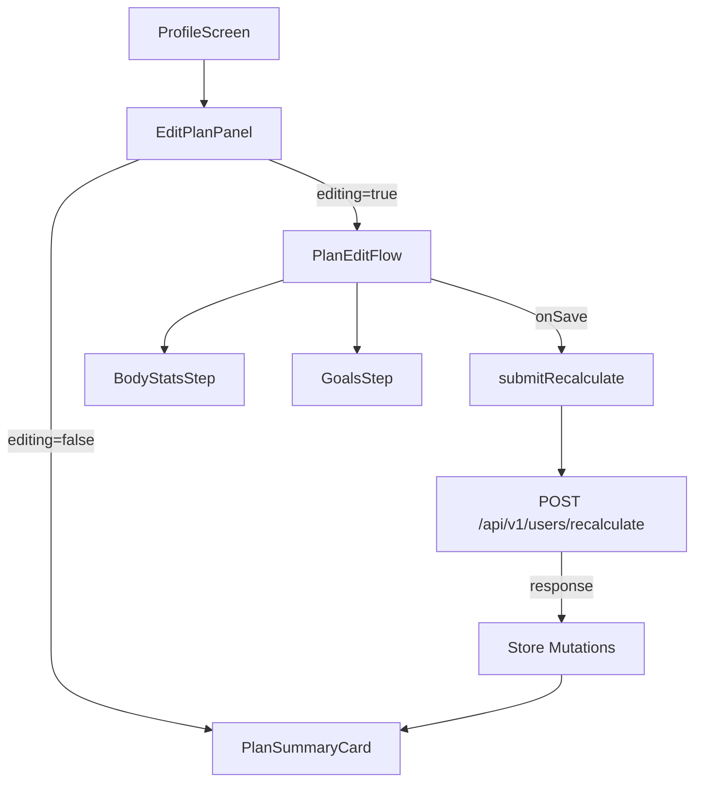
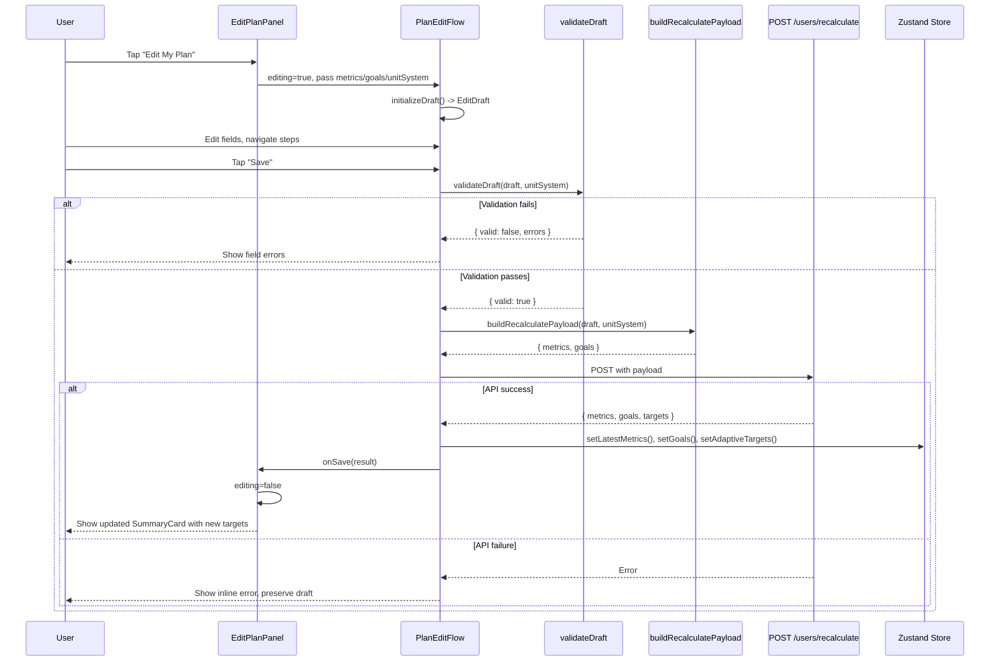

# Design Document: Edit Plan Panel

## Overview

Replace two separate profile sections (`BodyStatsSection`, `GoalsSection`) with a single `EditPlanPanel` component. The panel has two modes: a read-only summary card and an inline two-step edit flow. On save, it submits metrics + goals atomically to `POST /api/v1/users/recalculate` and reveals updated TDEE/macro targets.

This is a frontend-only change. The backend endpoint already exists and is battle-tested.

## Architecture

### Component Tree



### Components

| Component | Responsibility | Why it exists |
|---|---|---|
| `EditPlanPanel` | Top-level orchestrator. Owns `editing` state. Passes store data down. | Single entry point replaces two sections. Keeps ProfileScreen clean. |
| `PlanSummaryCard` | Read-only display of stats + goals + targets. | Separation of concerns: display logic is complex (unit formatting, null handling, macro grid). |
| `PlanEditFlow` | Multi-step form. Owns draft state, step navigation, validation, submission. | Isolates all mutation logic from the summary view. Local state prevents stale store reads during editing. |
| `BodyStatsStep` | Step 0 form fields: weight, height, body fat %, activity level. | Logical grouping matching the mental model and the API's `metrics` payload shape. |
| `GoalsStep` | Step 1 form fields: goal type, target weight, goal rate. | Logical grouping matching the API's `goals` payload shape. |

### Pure Logic Functions (extracted to `app/utils/editPlanLogic.ts`)

| Function | Purpose | Why extracted |
|---|---|---|
| `initializeDraft(metrics, goals, unitSystem)` | Converts store state to `EditDraft` with display-unit strings | Testable without React. Round-trip property target. |
| `buildRecalculatePayload(draft, unitSystem)` | Converts `EditDraft` to API request body `{ metrics, goals }` | Testable without React. Payload correctness property target. |
| `validateDraft(draft, unitSystem)` | Returns `{ valid, errors }` for the draft | Testable without React. Validation property target. |
| `formatSummaryFields(metrics, goals, targets, unitSystem)` | Converts store state to display strings for summary card | Testable without React. Rendering property target. |

**Why this split matters**: Every piece of logic that touches unit conversion or data transformation is a pure function. The React components become thin wrappers that call these functions and render the results. This makes property-based testing straightforward — we test the functions, not the components, for correctness guarantees.

### What we are NOT building

- **No modal/bottom sheet**: Inline expansion is simpler, web-compatible, and avoids Expo web modal quirks. A bottom sheet adds a dependency and native-only gesture handling. Not worth it for a form.
- **No step indicator/progress bar**: Two steps don't need a progress bar. "Next" and "Back" buttons are sufficient. YAGNI.
- **No onboarding component reuse**: Onboarding steps are coupled to `useOnboardingStore`, have skip logic, auto-advance behavior, and wizard-specific navigation. Extracting shared form fields would create a leaky abstraction. Cheaper to write clean form fields from scratch.
- **No optimistic updates**: The recalculate endpoint computes TDEE server-side. We can't predict the result client-side. Wait for the response.

## Components and Interfaces

### EditPlanPanel

```typescript
interface EditPlanPanelProps {
  metrics: {
    id: string;
    heightCm: number | null;
    weightKg: number | null;
    bodyFatPct: number | null;
    activityLevel: string | null;
    recordedAt: string;
  } | null;
  goals: {
    id: string;
    userId: string;
    goalType: string;
    targetWeightKg: number | null;
    goalRatePerWeek: number | null;
  } | null;
  adaptiveTargets: {
    calories: number;
    protein_g: number;
    carbs_g: number;
    fat_g: number;
  } | null;
  unitSystem: 'metric' | 'imperial';
}
```

State: `editing: boolean`. That's it. The component is a switch.

### EditDraft — the canonical form state

```typescript
interface EditDraft {
  // Body stats (all strings — form inputs are strings)
  weight: string;
  heightCm: string;
  heightFeet: string;
  heightInches: string;
  bodyFatPct: string;
  activityLevel: 'sedentary' | 'light' | 'moderate' | 'active' | 'very_active';
  // Goals
  goalType: 'cutting' | 'maintaining' | 'bulking';
  targetWeight: string;
  goalRate: string;
}
```

**Why strings for numeric fields**: Form inputs are strings. Parsing happens once at submission time in `buildRecalculatePayload`. This avoids NaN propagation during typing (e.g., user types "17" then deletes to "1" then types "76" — intermediate states are invalid numbers).

### initializeDraft

```typescript
function initializeDraft(
  metrics: EditPlanPanelProps['metrics'],
  goals: EditPlanPanelProps['goals'],
  unitSystem: 'metric' | 'imperial',
): EditDraft
```

Behavior:
- If `metrics` is null: empty strings, activity defaults to `'moderate'`
- If `metrics.weightKg` exists: convert to display unit, format as string (no trailing zeros beyond 1 decimal)
- If `metrics.heightCm` exists and imperial: `cmToFtIn()`, set `heightFeet` and `heightInches`
- If `metrics.heightCm` exists and metric: set `heightCm` as rounded integer string
- If `goals` is null: goalType defaults to `'maintaining'`, target/rate empty
- If `goals.targetWeightKg` exists: convert to display unit
- If `goals.goalRatePerWeek` exists: convert to display unit (lbs/week if imperial)

### validateDraft

```typescript
interface ValidationResult {
  valid: boolean;
  errors: Partial<Record<keyof EditDraft, string>>;
}

function validateDraft(draft: EditDraft, unitSystem: 'metric' | 'imperial'): ValidationResult
```

Rules:
| Field | Rule | Error message |
|---|---|---|
| `weight` | Required. Must parse to positive number. | "Enter a valid weight" |
| `heightCm` (metric) | Required. Must parse to positive number. | "Enter a valid height" |
| `heightFeet` + `heightInches` (imperial) | Both required. Feet >= 0. Inches 0-11. | "Enter a valid height" |
| `bodyFatPct` | Optional. If non-empty, must be in [0, 100]. | "Must be between 0 and 100" |
| `activityLevel` | Always valid (picker enforces). | n/a |
| `goalType` | Always valid (picker enforces). | n/a |
| `targetWeight` | Optional. If non-empty, must be positive. | "Enter a valid weight" |
| `goalRate` | Optional. If non-empty, must be a number. | "Enter a valid rate" |

When goalType is "maintaining": `targetWeight` and `goalRate` are skipped in validation (hidden in UI, excluded from payload).

### buildRecalculatePayload

```typescript
interface RecalculatePayload {
  metrics: {
    weight_kg: number;
    height_cm: number;
    body_fat_pct?: number;
    activity_level: string;
  };
  goals: {
    goal_type: string;
    target_weight_kg?: number;
    goal_rate_per_week?: number;
  };
}

function buildRecalculatePayload(
  draft: EditDraft,
  unitSystem: 'metric' | 'imperial',
): RecalculatePayload
```

Conversion logic:
- `weight`: `parseWeightInput(parseFloat(draft.weight), unitSystem)` -> `weight_kg`
- Height: imperial -> `ftInToCm(parseInt(feet), parseInt(inches))` -> `height_cm`; metric -> `Math.round(parseFloat(draft.heightCm))` -> `height_cm`
- `bodyFatPct`: if non-empty, `parseFloat` -> `body_fat_pct`; otherwise omitted
- `goalType`: direct mapping to `goal_type`
- `targetWeight`: if non-empty and goalType !== maintaining, `parseWeightInput(...)` -> `target_weight_kg`
- `goalRate`: if non-empty and goalType !== maintaining, convert from display unit to kg/week -> `goal_rate_per_week`

### formatSummaryFields

```typescript
interface SummaryFields {
  weight: string;        // "176.4 lbs" or "80.0 kg" or "—"
  height: string;        // "5'11\"" or "180 cm" or "—"
  bodyFat: string;       // "16%" or "—"
  activityLevel: string; // "Moderate" or "—"
  goalType: string;      // "Cutting" or "—"
  targetWeight: string;  // "165.0 lbs" or "—"
  goalRate: string;      // "+0.5 lbs/week" or "—"
  calories: string;      // "2,150" or "—"
  protein: string;       // "160g" or "—"
  carbs: string;         // "215g" or "—"
  fat: string;           // "72g" or "—"
}

function formatSummaryFields(
  metrics: EditPlanPanelProps['metrics'],
  goals: EditPlanPanelProps['goals'],
  targets: EditPlanPanelProps['adaptiveTargets'],
  unitSystem: 'metric' | 'imperial',
): SummaryFields
```

Every field returns "—" when the source value is null/undefined. Uses existing `formatWeight`, `formatHeight` from `unitConversion.ts`.

## Data Models

### Store Integration

No new Zustand slices. No schema changes. The component reads and writes existing state:

| Operation | Store field | Action |
|---|---|---|
| Read | `latestMetrics` | — |
| Read | `goals` | — |
| Read | `adaptiveTargets` | — |
| Read | `unitSystem` | — |
| Write | `latestMetrics` | `setLatestMetrics()` |
| Write | `goals` | `setGoals()` |
| Write | `adaptiveTargets` | `setAdaptiveTargets()` |

### API Contract

**Endpoint**: `POST /api/v1/users/recalculate` — already exists, no backend changes.

**Request** (matches `RecalculateRequest` Pydantic schema):
```json
{
  "metrics": {
    "weight_kg": 80.0,
    "height_cm": 180,
    "body_fat_pct": 16.0,
    "activity_level": "moderate"
  },
  "goals": {
    "goal_type": "cutting",
    "target_weight_kg": 75.0,
    "goal_rate_per_week": -0.5
  }
}
```

**Response** (matches `RecalculateResponse` Pydantic schema):
```json
{
  "metrics": {
    "id": "uuid", "user_id": "uuid", "weight_kg": 80.0, "height_cm": 180,
    "body_fat_pct": 16.0, "activity_level": "moderate",
    "recorded_at": "2024-01-15T10:00:00Z", "created_at": "...", "updated_at": "..."
  },
  "goals": {
    "id": "uuid", "user_id": "uuid", "goal_type": "cutting",
    "target_weight_kg": 75.0, "goal_rate_per_week": -0.5,
    "created_at": "...", "updated_at": "..."
  },
  "targets": {
    "calories": 2150.0, "protein_g": 160.0, "carbs_g": 215.0, "fat_g": 72.0
  }
}
```

**Status codes**:
| Code | Meaning |
|---|---|
| 200 | Success. Metrics/goals saved, targets recalculated. |
| 401 | Unauthorized. Token expired or missing. (Handled by API interceptor — auto-refresh.) |
| 422 | Validation error. At least one of metrics/goals required, or field constraints violated. |
| 500 | Server error. |

**Critical path note**: The API path is `users/recalculate` (plural). The axios instance has `baseURL` set to `{host}/api/v1/`, so the call is `api.post('users/recalculate', payload)`. This matches the existing usage in `BodyStatsSection` and `GoalsSection`.

### Data Flow



## Edge Cases and Error Handling

| Scenario | Handling | Justification |
|---|---|---|
| **Both metrics and goals are null** (new user) | Show EmptyState with "Set Up My Plan" CTA. `initializeDraft` returns defaults: activity=moderate, goalType=maintaining, all numeric fields empty. | Matches Requirement 2.1. User needs a clear path to first setup. |
| **Metrics exist but goals are null** (or vice versa) | Show SummaryCard with available data, dashes for missing fields. Edit flow pre-fills what exists, defaults what doesn't. | Partial data is valid. The recalculate endpoint accepts either metrics or goals (or both). |
| **User types then deletes a required field** | `validateDraft` catches empty weight/height on save attempt. Error shown inline under the field. Save button remains enabled (validation is on-submit, not on-change) to avoid annoying flicker. | On-submit validation is simpler and less disruptive for a short form. |
| **Body fat % entered as "abc"** | `parseFloat("abc")` returns NaN, validation catches it, shows "Must be between 0 and 100". | Defensive parsing. |
| **Imperial height: inches > 11** | `validateDraft` rejects inches outside 0-11. Error: "Enter a valid height". | 12 inches = 1 foot. Users sometimes enter "5 ft 12 in" meaning 6 ft. We reject and let them correct. |
| **Goal type changed to "maintaining"** | Target weight and goal rate fields are hidden. `buildRecalculatePayload` omits `target_weight_kg` and `goal_rate_per_week` from the goals payload. | Maintaining means no weight change target. Sending these fields would be semantically wrong. |
| **Network timeout / 5xx** | Inline error: "Couldn't save. Check your connection." Draft preserved. User can retry. | The axios instance has a 15s timeout. We don't retry automatically — the user decides. |
| **422 from API** | Display the error message from the response body if parseable, otherwise generic message. | 422 means our client-side validation missed something. Defense in depth. |
| **Duplicate submission (double-tap)** | `saving` state disables the save button and shows ActivityIndicator. | Prevents duplicate API calls. Simple boolean flag is sufficient. |
| **User cancels mid-edit** | Draft is discarded. No API call. Summary card shows unchanged data. | Local draft state is ephemeral. No cleanup needed. |
| **Store updates while editing** (e.g., background refresh) | Edit flow uses local draft state initialized on mount. Store changes don't affect the draft. On save, the API response overwrites the store. | Prevents confusing mid-edit field changes. The save response is the source of truth. |
| **Weight conversion precision loss** | `parseWeightInput` rounds to 1 decimal in kg. Imperial round-trip: 80.0 kg -> 176.4 lbs -> 80.0 kg (within 0.1 kg). | Property 6 validates this bound. |
| **Height conversion precision loss** | `ftInToCm` rounds to nearest cm. Round-trip: 180 cm -> 5'11" -> 180 cm (within 1 cm). | Property 7 validates this bound. |

## Scalability

This is a frontend component with a single API call. Scalability concerns are minimal:

- **Rendering**: The component renders at most ~20 form fields. No virtualization needed.
- **API**: One POST per save. The recalculate endpoint does a DB write + TDEE computation (arithmetic). Not a bottleneck.
- **Store**: Three `set*` calls on save. Zustand handles this efficiently with batched re-renders.
- **Bundle size**: No new dependencies. The component adds ~300 lines of TypeScript. Negligible impact.

## Tech Decisions

| Decision | Choice | Tradeoff |
|---|---|---|
| **Edit mode** | Inline expansion (not modal/bottom sheet) | Pro: Works on web, no new dependency, keeps user in context. Con: Takes up vertical space. Acceptable — the form is short. |
| **State management** | Local `useState` in PlanEditFlow (not Zustand) | Pro: Draft is ephemeral, no store pollution, no stale state bugs. Con: Draft lost on unmount. Acceptable — user explicitly cancels or saves. |
| **Validation timing** | On-submit (not on-change) | Pro: Simpler, no flicker, no "error while typing" UX. Con: User sees errors only after tapping Save. Acceptable for a 7-field form. |
| **Step navigation** | Integer `currentStep` state (0 or 1) | Pro: Dead simple. Con: Doesn't scale to 10 steps. We have 2. YAGNI. |
| **Logic extraction** | Pure functions in `editPlanLogic.ts` | Pro: Property-testable, reusable, no React dependency. Con: Extra file. Worth it for test coverage. |
| **Unit conversion** | Reuse existing `unitConversion.ts` | Pro: DRY, already tested. Con: None. |
| **API path** | `'users/recalculate'` (plural) | Matches the backend router prefix `/api/v1/users/`. The previous spec had a bug using singular "user". |

## Correctness Properties

*A property is a characteristic or behavior that should hold true across all valid executions of a system — essentially, a formal statement about what the system should do. Properties serve as the bridge between human-readable specifications and machine-verifiable correctness guarantees.*

### Property 1: Summary card renders all present fields

*For any* valid combination of metrics (weightKg, heightCm, bodyFatPct, activityLevel), goals (goalType, targetWeightKg, goalRatePerWeek), adaptive targets (calories, protein_g, carbs_g, fat_g), and unit system, `formatSummaryFields` should return non-dash strings for every non-null input field, and each returned string should contain the numeric value (formatted appropriately for the unit system).

**Validates: Requirements 1.1, 1.3, 1.4**

### Property 2: Null optional fields display as dash

*For any* combination of metrics and goals where one or more optional fields (bodyFatPct, targetWeightKg, goalRatePerWeek) are null, `formatSummaryFields` should return the dash character for each null field while returning non-dash strings for all non-null fields.

**Validates: Requirements 1.2**

### Property 3: Draft initialization round-trip

*For any* valid metrics (weightKg in [20, 300], heightCm in [100, 250]) and goals from the store, and any unit system, calling `initializeDraft` to produce an `EditDraft` and then calling `buildRecalculatePayload` on that draft should produce `weight_kg` within 0.1 kg and `height_cm` within 1 cm of the original store values.

**Validates: Requirements 3.1, 4.1, 5.4, 5.5**

### Property 4: Payload builder produces well-formed output

*For any* valid `EditDraft` with non-empty required fields (weight parses to positive number, height parses to positive number, valid activity level, valid goal type) and any unit system, `buildRecalculatePayload` should produce an object where `metrics.weight_kg > 0`, `metrics.height_cm > 0`, `metrics.activity_level` is one of the five valid levels, and `goals.goal_type` is one of "cutting"/"maintaining"/"bulking".

**Validates: Requirements 5.1, 5.4, 5.5, 5.6**

### Property 5: Validation rejects invalid numeric inputs

*For any* `EditDraft` where the weight field is non-numeric, empty, zero, or negative, `validateDraft` should return `valid: false` with an error keyed to `weight`. The same holds for height fields. For body fat %, if a non-empty value parses to a number outside [0, 100], `validateDraft` should return `valid: false` with an error keyed to `bodyFatPct`.

**Validates: Requirements 6.2, 6.3, 6.4**

### Property 6: Weight conversion round-trip

*For any* weight value in kg between 20 and 300, converting to the display unit via `convertWeight(w, 'imperial')` and back via `parseWeightInput(displayed, 'imperial')` should produce a value within 0.1 kg of the original. The same holds trivially for metric (identity conversion).

**Validates: Requirements 8.2**

### Property 7: Height conversion round-trip

*For any* height value in cm between 100 and 250, converting to ft/in via `cmToFtIn(h)` and back via `ftInToCm(feet, inches)` should produce a value within 1 cm of the original.

**Validates: Requirements 8.3**

## Testing Strategy

### Property-Based Testing

**Library**: `fast-check` (TypeScript property-based testing library)

**Configuration**: Minimum 100 iterations per property. Each test tagged with:
`Feature: edit-plan-panel, Property {N}: {title}`

**Test file**: `app/__tests__/utils/editPlanLogic.test.ts`

Tests target the four pure functions:
- `formatSummaryFields` -> Properties 1, 2
- `initializeDraft` + `buildRecalculatePayload` -> Property 3
- `buildRecalculatePayload` -> Property 4
- `validateDraft` -> Property 5
- `convertWeight` + `parseWeightInput` -> Property 6
- `cmToFtIn` + `ftInToCm` -> Property 7

Each correctness property maps to exactly one property-based test.

### Unit Testing

**Test file**: `app/__tests__/components/EditPlanPanel.test.ts`

Unit tests cover specific examples and edge cases that complement the property tests:
- Empty state renders CTA when metrics and goals are both null
- Summary card renders with partial data (metrics only, goals only)
- "Maintaining" goal type hides target weight and goal rate fields
- Imperial mode shows ft/in fields; metric mode shows cm field
- Save button disabled during loading
- Error message displayed on API failure
- Successful save closes edit flow and updates summary

### Test Coverage Matrix

| Requirement | Property Test | Unit Test |
|---|---|---|
| 1.1 Summary display | Property 1 | Summary rendering example |
| 1.2 Null fields as dash | Property 2 | Partial data example |
| 2.1 Empty state | — | Empty state rendering |
| 2.2 Defaults | — | Default values example |
| 3.1 Pre-fill stats | Property 3 | — |
| 4.1 Pre-fill goals | Property 3 | — |
| 4.5 Maintaining hides fields | — | Maintaining example |
| 5.1 Single POST | Property 4 | API mock test |
| 5.4-5.6 Unit conversion | Properties 3, 4 | — |
| 6.1 API error | — | Error handling example |
| 6.2-6.4 Validation | Property 5 | — |
| 6.5 Loading state | — | Loading indicator example |
| 8.2 Weight round-trip | Property 6 | — |
| 8.3 Height round-trip | Property 7 | — |
