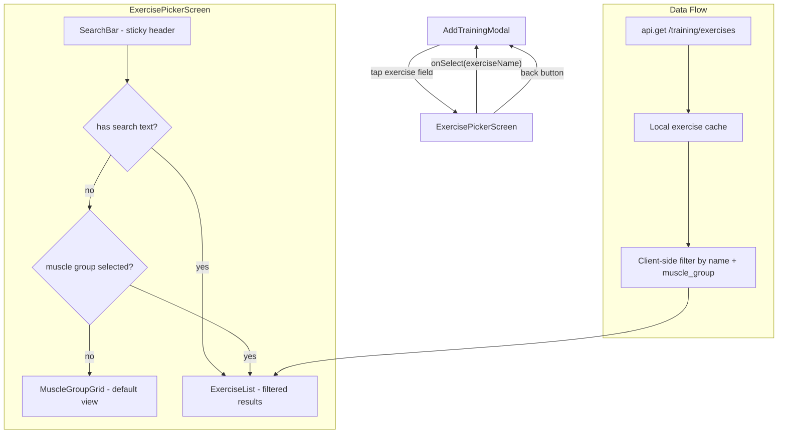
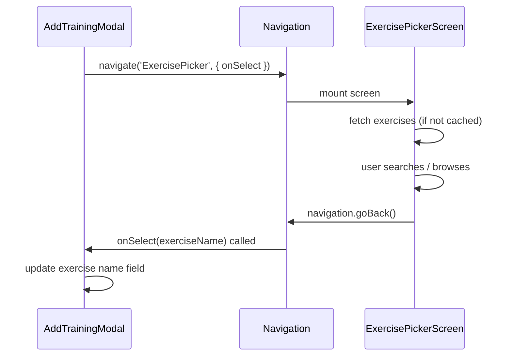

# Design Document: Exercise Picker Redesign

## Overview

This design replaces the inline `ExerciseSearchInput` dropdown in `AddTrainingModal` with a full-page `ExercisePickerScreen` that opens via stack navigation. The new screen provides two discovery paths: a real-time search bar and a visual muscle group grid. Each exercise is displayed as a rich card with an emoji-based image placeholder (swappable for real images via `image_url`), equipment tag, and category tag.

The architecture follows the existing patterns in the codebase: stack navigation via `@react-navigation/stack`, API calls through the shared `api` service, and styling with the dark theme token system.

### Key Design Decisions

1. **Stack navigation over modal**: The exercise picker is a full-page stack screen rather than a nested modal. This gives more screen real estate, avoids z-index issues with the existing training modal, and follows the pattern used by LearnStack (ArticleDetail) and MoreStack (Coaching, Community, etc.).

2. **Callback-based selection**: The picker receives an `onSelect` callback via route params. When an exercise is tapped, the callback fires with the exercise name, and the screen pops itself. This avoids global state for a transient selection flow.

3. **Client-side filtering with API fallback**: The full exercise list (151 items) is small enough to fetch once and filter client-side. The search bar filters locally for instant results. The existing `/exercises/search` API endpoint remains available as a fallback.

4. **Emoji placeholders with image_url escape hatch**: Each muscle group maps to an emoji + background color. The `image_url` field on exercise data allows swapping to real images later without code changes.

## Architecture



### Navigation Flow

The `ExercisePickerScreen` is added to the root-level stack (or a shared modal stack) so it can be presented from any context where the training modal is used (Dashboard, Logs). The training modal navigates to it using `navigation.navigate('ExercisePicker', { onSelect })`.



## Components and Interfaces

### ExercisePickerScreen

The main full-page screen component.

```typescript
// Route params
type ExercisePickerParams = {
  onSelect: (exerciseName: string) => void;
};

// Screen component
function ExercisePickerScreen({ route, navigation }: StackScreenProps) {
  const { onSelect } = route.params;
  // State: exercises[], searchText, selectedMuscleGroup
  // Fetches all exercises on mount, filters client-side
}
```

**State management:**
- `exercises: Exercise[]` — full list fetched once from API
- `searchText: string` — current search input
- `selectedMuscleGroup: string | null` — active muscle group filter
- `loading: boolean` — initial fetch loading state

**Filtering logic (pseudocode):**
```
function getFilteredExercises(exercises, searchText, muscleGroup):
    result = exercises
    if muscleGroup is not null:
        result = result.filter(ex => ex.muscle_group == muscleGroup)
    if searchText is not empty:
        query = searchText.toLowerCase()
        result = result.filter(ex => ex.name.toLowerCase().includes(query))
    return result
```

### SearchBar

A sticky header component with a text input and optional clear button.

```typescript
interface SearchBarProps {
  value: string;
  onChangeText: (text: string) => void;
  onClear: () => void;
  placeholder?: string;
}
```

- Renders at the top of the screen with `position: sticky` behavior (achieved via FlatList's `ListHeaderComponent` or a separate fixed header)
- Includes a clear (✕) button when text is present
- Debounces input at 300ms before updating the filter state
- Displays a result count indicator (e.g., "12 exercises") when filters are active
- The exercise list uses `keyboardDismissMode="on-drag"` to dismiss the keyboard when scrolling

### MuscleGroupGrid

A grid of tappable tiles, each representing a muscle group.

```typescript
interface MuscleGroupTileProps {
  muscleGroup: string;
  emoji: string;
  color: string;
  label: string;
  exerciseCount: number;
  onPress: (muscleGroup: string) => void;
}
```

**Layout:** 2-column grid using FlatList with `numColumns={2}` or a flexbox wrap layout. Each tile shows:
- Emoji icon (large, centered)
- Muscle group label below
- Exercise count badge (e.g., "17 exercises")
- Colored background per muscle group

**Muscle group icon/color mapping:**

| Muscle Group | Emoji | Background Color |
|---|---|---|
| chest | 🫁 | #EF4444 (red) |
| back | 🔙 | #3B82F6 (blue) |
| shoulders | 🏔️ | #8B5CF6 (purple) |
| biceps | 💪 | #F59E0B (amber) |
| triceps | 🦾 | #F97316 (orange) |
| quads | 🦵 | #22C55E (green) |
| hamstrings | 🦿 | #14B8A6 (teal) |
| glutes | 🍑 | #EC4899 (pink) |
| calves | 🦶 | #06B6D4 (cyan) |
| abs | 🎯 | #EAB308 (yellow) |
| traps | 🔺 | #6366F1 (indigo) |
| forearms | ✊ | #D97706 (dark amber) |
| full_body | 🏋️ | #2563EB (brand blue) |

These colors are used at low opacity (e.g., `rgba(color, 0.15)`) as tile backgrounds to maintain the dark theme aesthetic.

### ExerciseCard

A list item component for displaying a single exercise.

```typescript
interface ExerciseCardProps {
  exercise: Exercise;
  onPress: (exercise: Exercise) => void;
}
```

**Layout:**
- Left: Image placeholder (emoji on colored circle, 48x48) or remote image if `image_url` is set
- Center: Exercise name (primary text), equipment tag + category tag below
- Right: Chevron indicator
- On tap: brief highlight animation (opacity flash) before calling `onPress`

### RecentExercises

A horizontal scrollable row of recently used exercises, shown above the muscle group grid.

```typescript
interface RecentExercisesProps {
  exercises: Exercise[];
  onPress: (exercise: Exercise) => void;
}
```

**Data source:** Fetched from `GET /training/sessions?limit=5` on mount. The component extracts distinct exercise names (up to 10) from the most recent sessions, then maps them to the full exercise objects from the cached exercise list.

**Layout:** Horizontal `FlatList` with compact cards (emoji icon + exercise name, ~120px wide). Shown only when the user has previous sessions and no search/filter is active.

### Navigation Integration

The `ExercisePickerScreen` is registered in the navigation stack that wraps the training modal context. Since the training modal is opened from both `DashboardScreen` and `LogsScreen`, the picker screen should be added to both `DashboardStack` and `LogsStack` param lists:

```typescript
// Added to DashboardStackParamList and LogsStackParamList
type ExercisePickerParams = {
  ExercisePicker: {
    onSelect: (exerciseName: string) => void;
  };
};
```

Alternatively, a root-level modal stack can be used. The simplest approach is adding the screen to each stack that needs it, following the existing pattern (e.g., `ArticleDetail` in `LearnStack`).

## Data Models

### Exercise (Frontend)

```typescript
interface Exercise {
  id: string;
  name: string;
  muscle_group: string;
  equipment: string;
  category: 'compound' | 'isolation';
  image_url: string | null;
}
```

### Exercise (Backend — updated)

The existing exercise dict in `exercises.py` gains an `image_url` field:

```python
{
    "id": "barbell-bench-press",
    "name": "Barbell Bench Press",
    "muscle_group": "chest",
    "equipment": "barbell",
    "category": "compound",
    "image_url": None  # null until real images are hosted
}
```

### MuscleGroupConfig (Frontend)

```typescript
interface MuscleGroupConfig {
  key: string;        // e.g. "chest"
  label: string;      // e.g. "Chest"
  emoji: string;      // e.g. "🫁"
  color: string;      // e.g. "#EF4444"
}

const MUSCLE_GROUP_CONFIG: MuscleGroupConfig[] = [
  { key: 'chest', label: 'Chest', emoji: '🫁', color: '#EF4444' },
  { key: 'back', label: 'Back', emoji: '🔙', color: '#3B82F6' },
  // ... all 13 groups
];
```

### Filtering Function Signature

```typescript
function filterExercises(
  exercises: Exercise[],
  searchText: string,
  muscleGroup: string | null,
): Exercise[]
```

This is a pure function — given the full exercise list, search text, and optional muscle group, it returns the filtered subset. This makes it straightforward to test.


## Correctness Properties

*A property is a characteristic or behavior that should hold true across all valid executions of a system — essentially, a formal statement about what the system should do. Properties serve as the bridge between human-readable specifications and machine-verifiable correctness guarantees.*

The following properties were derived from the acceptance criteria through prework analysis. Redundant criteria were consolidated (e.g., search filtering, muscle group filtering, and combined filtering are all special cases of a single filtering property).

### Property 1: Filter function correctness

*For any* list of exercises, any search text (including empty), and any muscle group (including null), `filterExercises(exercises, searchText, muscleGroup)` should return exactly those exercises where: (a) if muscleGroup is non-null, the exercise's muscle_group equals muscleGroup, AND (b) if searchText is non-empty, the exercise's name contains searchText (case-insensitive). No exercises outside this set should be included, and no matching exercises should be excluded.

**Validates: Requirements 2.1, 3.2, 8.1, 8.2, 8.3**

### Property 2: Exercise selection returns correct name

*For any* exercise in the displayed list, tapping it should invoke the `onSelect` callback with exactly that exercise's `name` string.

**Validates: Requirements 1.4**

### Property 3: Exercise card displays all required information

*For any* exercise, the rendered Exercise_Card should contain the exercise name, an image element (placeholder or remote), the equipment value, and the category value ("compound" or "isolation").

**Validates: Requirements 4.1**

### Property 4: Image placeholder maps correctly to muscle group

*For any* exercise with a null or empty `image_url`, the rendered placeholder should display the emoji and background color defined in `MUSCLE_GROUP_CONFIG` for that exercise's `muscle_group`.

**Validates: Requirements 4.2, 5.2**

### Property 5: Remote image replaces placeholder when image_url is set

*For any* exercise with a non-empty `image_url`, the rendered card should display an Image component with that URL as the source, and should NOT display the emoji placeholder.

**Validates: Requirements 4.3**

### Property 6: All exercises include image_url field

*For any* exercise in the dataset returned by the backend, the exercise object should contain an `image_url` field (which may be null).

**Validates: Requirements 5.1**

### Property 7: Muscle group colors are unique

*For all* entries in `MUSCLE_GROUP_CONFIG`, no two muscle groups should share the same `color` value.

**Validates: Requirements 6.2**

### Property 8: Rendered card count matches filtered results

*For any* filter state (search text + muscle group), the number of Exercise_Cards rendered should equal the length of the array returned by `filterExercises`.

**Validates: Requirements 2.3**

### Property 9: Muscle group tiles have accessibility labels

*For all* muscle group tiles in the Muscle_Group_Grid, each tile should have an `accessibilityLabel` that includes the muscle group's display name and an `accessibilityRole` of "button".

**Validates: Requirements 12.2**

### Property 10: Exercise cards have accessibility labels

*For any* exercise, the Exercise_Card's `accessibilityLabel` should contain the exercise name, equipment type, and category.

**Validates: Requirements 12.3**

### Property 11: Muscle group tile exercise count accuracy

*For any* muscle group, the count displayed on its tile in the Muscle_Group_Grid should equal the number of exercises in the dataset whose `muscle_group` field matches that group.

**Validates: Requirements 9.1**

### Property 12: Recent exercises are distinct and capped

*For any* list of recent training sessions, the "Recent" section should display at most 10 exercises, all with distinct names, ordered by most recently used first.

**Validates: Requirements 7.1**

## Error Handling

| Scenario | Handling |
|---|---|
| Exercise fetch fails (network error) | Display an error message with a "Retry" button. Keep the Search_Bar visible but disable muscle group tiles until data loads. |
| Exercise fetch returns empty list | Display an "No exercises found" empty state. This should not happen with the static dataset but guards against API issues. |
| Search returns no results | Display a "No exercises match your search" message with a suggestion to try different terms or clear the muscle group filter. |
| `onSelect` callback is undefined | Guard with optional chaining. Log a warning. Navigate back without crashing. |
| `image_url` points to a broken image | Use the `Image` component's `onError` handler to fall back to the emoji placeholder. |
| Navigation params missing | Default to a no-op `onSelect` and show the picker in browse-only mode. |

## Testing Strategy

### Unit Tests

Unit tests cover specific examples and edge cases:

- Rendering the ExercisePickerScreen in its initial state (grid visible, no search)
- Tapping a muscle group tile updates the filter state
- Tapping an exercise calls `onSelect` with the correct name
- Clearing search text restores the grid view
- Error state renders retry button
- Empty search results show the empty state message
- Debounce behavior: rapid typing triggers only one filter update after 300ms

### Property-Based Tests

Property tests use a property-based testing library (e.g., `fast-check`) to verify universal properties across generated inputs. Each test runs a minimum of 100 iterations.

| Property | Test Description | Library |
|---|---|---|
| Property 1: Filter function correctness | Generate random exercise lists, search strings, and muscle groups. Verify `filterExercises` returns exactly the correct subset. | fast-check |
| Property 4: Image placeholder mapping | Generate random muscle group keys. Verify the placeholder component renders the correct emoji and color from the config. | fast-check |
| Property 6: All exercises include image_url | Iterate over the full exercise dataset. Verify each has an `image_url` key. | fast-check (or direct assertion over dataset) |
| Property 7: Unique muscle group colors | Verify the MUSCLE_GROUP_CONFIG array has no duplicate color values. | Direct assertion |
| Property 11: Muscle group tile exercise count | For random exercise lists, verify the count per muscle group matches the actual filtered count. | fast-check |
| Property 12: Recent exercises distinct and capped | Generate random session histories, verify extracted recents are distinct, capped at 10, and ordered by recency. | fast-check |

**Tag format for property tests:**
```
// Feature: exercise-picker-redesign, Property 1: Filter function correctness
```

### Testing Approach

- **fast-check** is the property-based testing library for TypeScript/JavaScript
- Each property test references its design document property number
- Property tests focus on the pure `filterExercises` function and the `MUSCLE_GROUP_CONFIG` data structure, which are the most testable units
- UI-specific properties (3, 5, 8, 9, 10) are better validated through component tests with React Native Testing Library, using example-based tests with representative data
- Property 2 (onSelect callback) is tested as a component integration test
