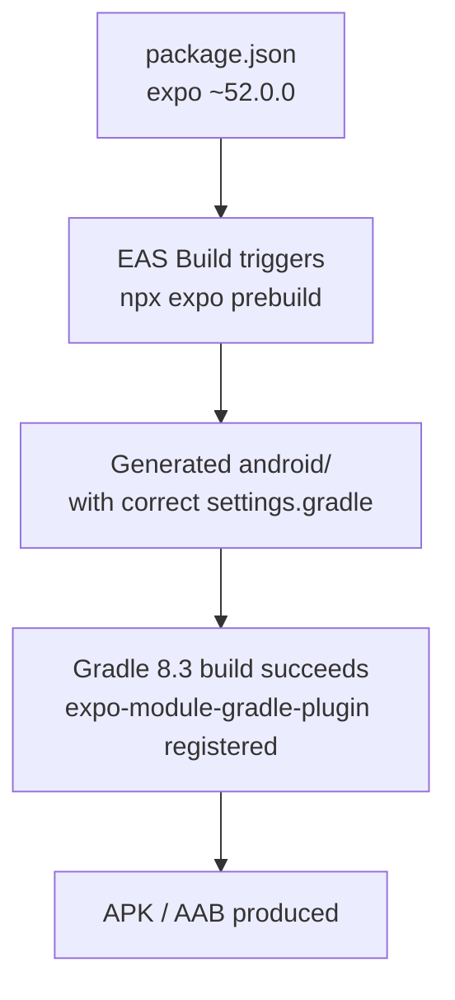

# Design Document: Expo SDK 52 Upgrade

## Overview

This upgrade replaces Expo SDK 50 / React Native 0.73.6 with Expo SDK 52 / React Native 0.76.x. The primary driver is a hard build failure: SDK 50's generated `settings.gradle` does not register `expo-module-gradle-plugin` via `includeBuild`, which Gradle 8.3 (used in the current EAS build environment) requires. SDK 52 ships a fixed prebuild template that resolves this.

Secondary changes:
- `expo-barcode-scanner` is removed from the Expo ecosystem in SDK 52; its functionality is absorbed into `expo-camera` via the `CameraView` component and `useCameraPermissions` hook.
- React Native 0.76.x enables the New Architecture (Fabric + JSI) by default.
- All `expo-*` peer packages must be bumped to their SDK 52 compatible versions.

The upgrade is a dependency-and-code change only — no new features, no schema changes, no backend changes.

## Architecture

The app uses a managed Expo workflow with EAS Build. There are no committed native folders (`android/`, `ios/`); they are generated at build time via `expo prebuild`. This means the Gradle fix is entirely handled by upgrading the `expo` package — the new prebuild template in SDK 52 generates a correct `settings.gradle` automatically.



### Dependency Change Summary

| Package | SDK 50 version | SDK 52 version |
|---|---|---|
| `expo` | `~50.0.0` | `~52.0.0` |
| `react-native` | `0.73.6` | `0.76.x` |
| `react` | `18.2.0` | `18.3.x` |
| `expo-camera` | `~14.1.3` | `~16.0.x` |
| `expo-av` | `~13.10.6` | `~15.0.x` |
| `expo-barcode-scanner` | `~12.9.3` | **removed** |
| `expo-haptics` | `~12.8.1` | `~14.0.x` |
| `expo-secure-store` | `~13.0.0` | `~14.0.x` |
| `expo-file-system` | `~16.0.9` | `~18.0.x` |
| `expo-image-picker` | `^17.0.10` | `~16.0.x` |
| `expo-status-bar` | `~1.11.0` | `~2.0.x` |
| `@expo/metro-runtime` | `~3.1.3` | `~4.0.x` |
| `react-native-reanimated` | `~3.6.0` | `~3.16.x` |
| `react-native-screens` | `~3.29.0` | `~4.4.x` |
| `react-native-safe-area-context` | `4.8.2` | `4.12.x` |

## Components and Interfaces

### BarcodeScanner.tsx Migration

This is the only source file requiring code changes. The current implementation lazy-requires `BarCodeScanner` from `expo-barcode-scanner` and `Camera` from `expo-camera`. In SDK 52, `expo-barcode-scanner` does not exist and `expo-camera` exposes a new API surface.

**SDK 50 pattern (current):**
```tsx
BarCodeScanner = require('expo-barcode-scanner').BarCodeScanner;
Camera = require('expo-camera').Camera;

// Permission check
const { status } = await Camera.getCameraPermissionsAsync();

// Render
<BarCodeScanner
  onBarCodeScanned={handleBarCodeScanned}
  style={StyleSheet.absoluteFillObject}
/>
```

**SDK 52 pattern (target):**
```tsx
import { CameraView, useCameraPermissions } from 'expo-camera';

// Permission via hook
const [permission, requestPermission] = useCameraPermissions();

// Render
<CameraView
  style={StyleSheet.absoluteFillObject}
  onBarcodeScanned={handleBarCodeScanned}
  barcodeScannerSettings={{ barcodeTypes: ['ean13', 'ean8', 'upc_a', 'upc_e', 'qr', 'code128', 'code39'] }}
/>
```

Key API differences:
- `BarCodeScanner` component → `CameraView` component
- `onBarCodeScanned` prop → `onBarcodeScanned` prop (note: no capital C in SDK 52)
- `Camera.getCameraPermissionsAsync()` / `Camera.requestCameraPermissionsAsync()` → `useCameraPermissions()` hook
- Barcode types must be explicitly listed in `barcodeScannerSettings.barcodeTypes`
- The scan callback signature remains `({ type, data }: { type: string; data: string }) => void`

The lazy-require pattern can be replaced with a top-level import guarded by `Platform.OS !== 'web'` since `expo-camera` is always installed and handles the web case gracefully.

### app.json Changes

Add `newArchEnabled: true` explicitly to document the intent, even though SDK 52 defaults to it:

```json
{
  "expo": {
    "newArchEnabled": true,
    ...
  }
}
```

### eas.json Changes

Update the CLI version floor:
```json
{
  "cli": { "version": ">= 13.0.0" },
  ...
}
```

## Data Models

No data model changes. This upgrade touches only build configuration and one UI component. The `FoodItem` interface in `BarcodeScanner.tsx` and the API contract for `food/barcode/{barcode}` are unchanged.

## Correctness Properties

*A property is a characteristic or behavior that should hold true across all valid executions of a system — essentially, a formal statement about what the system should do. Properties serve as the bridge between human-readable specifications and machine-verifiable correctness guarantees.*

### Property 1: Barcode scan data passthrough

*For any* valid barcode string scanned by `CameraView`, the `data` field received in `onBarcodeScanned` should be passed unchanged to the API call `food/barcode/{data}`.

**Validates: Requirements 4.5**

### Property 2: Permission state drives render state

*For any* camera permission status (`granted`, `undetermined`, `denied`), the component's rendered state should be deterministically derived from that permission status — `granted` → scanning view, `undetermined` → triggers request, `denied` → settings prompt.

**Validates: Requirements 4.3**

### Property 3: Web/unavailable fallback is always shown

*For any* render of `BarcodeScanner` on `Platform.OS === 'web'`, the component should render the fallback message card and never attempt to render `CameraView`.

**Validates: Requirements 4.4**

### Property 4: Scan debounce prevents duplicate API calls

*For any* two barcode scan events separated by less than 2000ms, only the first event should trigger an API call; the second should be silently ignored.

**Validates: Requirements 4.2** (implicit — the debounce logic is unchanged and must remain correct after the migration)

### Property 5: Package version alignment

*For any* `expo-*` package listed in `package.json` after the upgrade, the installed version should satisfy the range specified by `npx expo install --fix` for SDK 52.

**Validates: Requirements 2.1**

## Error Handling

| Scenario | Handling |
|---|---|
| `expo-camera` unavailable at runtime (web) | Web guard renders fallback message card |
| Camera permission denied | `denied` state renders settings-link card |
| Barcode API returns 404 / network error | `not_found` state with retry option |
| `CameraView` throws during mount | Caught by existing try/catch in lazy import block; falls back to web message |
| `yarn install` peer conflict | Developer resolves manually; `--legacy-peer-deps` is a last resort |

## Testing Strategy

### Unit Tests

The existing test at `app/__tests__/components/BarcodeScanner.test.ts` should be updated to:
- Mock `expo-camera` instead of `expo-barcode-scanner`
- Test that `CameraView` is rendered (not `BarCodeScanner`) when permission is granted
- Test the web fallback path
- Test the permission-denied path

### Property-Based Tests

Property-based testing library: **fast-check** (already installed as a dev dependency).

Each property test must run a minimum of 100 iterations.

**Property 1 — Barcode data passthrough**
Tag: `Feature: expo-sdk-52-upgrade, Property 1: barcode scan data passthrough`
Generate arbitrary barcode strings; mock `CameraView`'s `onBarcodeScanned` callback; assert the API is called with the exact same string.

**Property 2 — Permission state drives render**
Tag: `Feature: expo-sdk-52-upgrade, Property 2: permission state drives render state`
Generate arbitrary permission status values from the set `{granted, undetermined, denied}`; assert the rendered output matches the expected state machine transition.

**Property 3 — Web fallback**
Tag: `Feature: expo-sdk-52-upgrade, Property 3: web/unavailable fallback`
Mock `Platform.OS` to `'web'`; for any props, assert the fallback card is rendered.

**Property 4 — Debounce**
Tag: `Feature: expo-sdk-52-upgrade, Property 4: scan debounce`
Generate pairs of scan events with random inter-event delays; assert API call count equals the number of events with delay ≥ 2000ms.

**Unit Test Balance**: Property tests cover the universal behaviors. Unit tests should focus on the specific edge cases: empty barcode string, barcode with special characters, multiplier input validation (non-numeric, zero, negative).
