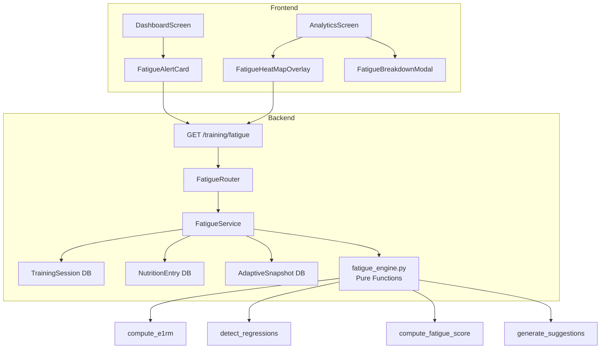
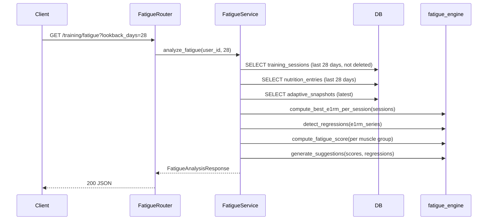

# Design Document: Fatigue Detection and Smart Deload Suggestions

## Overview

This feature adds a fatigue detection pipeline that analyzes training session history to identify performance regressions, compute per-muscle-group fatigue scores, and generate proactive deload suggestions. The design follows the existing architecture pattern: pure computation functions in a service module, a thin async service layer for DB access, Pydantic schemas for API contracts, and React Native components for the frontend.

The core computation is intentionally kept as pure functions (no DB, no side effects) so they can be thoroughly tested with property-based tests. The async service layer handles data fetching and delegates to pure functions for all calculations.

No new database tables or migrations required. No new secrets or permissions. No feature flags for v1 — the endpoint is additive (new GET route) and the frontend components are additive (new card, new overlay). Rollback is a code revert.

### Prerequisites (Before Implementation Starts)

- Existing `exercise_mapping.py` with `get_muscle_group()` function — already exists, read-only dependency
- Existing `TrainingSession` model with `exercises` JSONB column and `not_deleted()` filter — already exists
- Existing `NutritionEntry` model with `calories` field and date filtering — already exists
- Existing `AdaptiveSnapshot` model with `target_calories` field — already exists
- Existing auth middleware (`get_current_user_id`) — already exists
- Hypothesis library installed — already in dev dependencies
- No new environment variables, secrets, config files, or infrastructure changes needed

### What's NOT in v1 (Explicitly Cut)

- No wearable/sleep data integration (v2)
- No background job or caching layer (request-time computation is fast enough)
- No user-configurable fatigue weights (hardcoded defaults, configurable in code only)
- No push notifications for fatigue alerts (dashboard card only)
- No historical fatigue score tracking/persistence (computed on-the-fly each request)
- No feature flag gating (endpoint is additive, frontend degrades gracefully)
- No user-defined exercise-to-muscle-group mappings (uses existing static map)

## Architecture



### Dependency Chain (Build Order)

The implementation must follow this strict dependency order. Each step lists its inputs, outputs, risk, and rollback.

| Step | File | Depends On | Risk | Rollback |
|------|------|-----------|------|----------|
| 1 | `fatigue_engine.py` — dataclasses + all pure functions | `exercise_mapping.py` (existing, read-only) | Logic bugs in formula | Delete file |
| 2 | `tests/test_fatigue_properties.py` + `tests/test_fatigue_unit.py` | Step 1 | Flaky generators | Fix generators |
| **CHECKPOINT A** | Run `pytest tests/test_fatigue_properties.py tests/test_fatigue_unit.py -v` | Steps 1-2 | Tests fail | Fix engine before proceeding |
| 3 | `fatigue_schemas.py` — Pydantic models | Nothing | Schema mismatch with engine types | Delete file |
| 4 | `fatigue_service.py` — async orchestration | Steps 1, 3, existing DB models | Wrong SQL query excludes valid sessions | Delete file |
| 5 | `fatigue_router.py` — HTTP endpoint | Steps 3, 4 | Auth dependency wired wrong | Delete file |
| 6 | Wire router into `main.py` | Step 5 | Import path typo breaks app startup | Revert one-line change |
| 7 | `tests/test_fatigue_integration.py` | Steps 4-6 | Test DB setup issues | Fix test fixtures |
| **CHECKPOINT B** | Run `pytest tests/test_fatigue_integration.py -v` + full backend suite | Steps 1-7 | Integration failures | Fix service/router before proceeding |
| 8 | `fatigueColorMapping.ts` — pure color utility | Nothing | N/A — trivial pure function | Delete file |
| 9 | `app/__tests__/utils/fatigueColorMapping.test.ts` | Step 8 | N/A | Delete file |
| 10 | `FatigueAlertCard.tsx` — dashboard card component | API contract from Step 3 | API shape mismatch | Delete file |
| 11 | `app/__tests__/components/FatigueAlertCard.test.ts` | Step 10 | N/A | Delete file |
| 12 | Wire `FatigueAlertCard` into `DashboardScreen.tsx` | Steps 10, 6 | Breaks dashboard if API call throws | Wrap in try/catch, revert if needed |
| 13 | `FatigueHeatMapOverlay.tsx` + `FatigueBreakdownModal.tsx` | Steps 3, 8 | Heat map component API unclear | Delete files |
| 14 | Wire overlay into `AnalyticsScreen.tsx` | Step 13 | Breaks analytics if API call throws | Wrap in try/catch, revert if needed |
| **CHECKPOINT C** | Run `npx jest --testPathPattern=fatigue` + full frontend suite | Steps 8-14 | Frontend test failures | Fix components before shipping |

No circular dependencies. Each step only references artifacts from prior steps. Steps 1-2 and 3 are parallelizable. Steps 8-9 are parallelizable with steps 3-7.

### Request Flow

The system follows a request-time computation model — no background jobs or caching for v1. The fatigue engine processes the last ~28 days of training data per request, which is bounded and fast enough for synchronous responses.



## Components and Interfaces

### Backend Components

#### 1. `src/modules/training/fatigue_engine.py` — Pure Computation Module

All computation lives here with zero side effects. Functions are deterministic given the same inputs.

```python
# --- Data structures ---

@dataclass(frozen=True)
class SetData:
    reps: int
    weight_kg: float
    rpe: float | None = None

@dataclass(frozen=True)
class SessionExerciseData:
    """Flattened view of one exercise in one session."""
    session_date: date
    exercise_name: str
    sets: list[SetData]

@dataclass(frozen=True)
class ExerciseE1RM:
    """Best e1RM for an exercise in a single session."""
    session_date: date
    exercise_name: str
    best_e1rm: float
    best_weight_kg: float
    best_reps: int

@dataclass(frozen=True)
class RegressionSignal:
    """Detected performance regression for an exercise."""
    exercise_name: str
    muscle_group: str
    consecutive_declines: int
    peak_e1rm: float
    current_e1rm: float
    decline_pct: float  # positive value, e.g. 8.0 means 8% decline

@dataclass(frozen=True)
class FatigueScoreResult:
    """Fatigue score for a single muscle group."""
    muscle_group: str
    score: float  # 0-100
    regression_component: float
    volume_component: float
    frequency_component: float
    nutrition_component: float

@dataclass(frozen=True)
class DeloadSuggestion:
    """A deload recommendation for a fatigued muscle group."""
    muscle_group: str
    fatigue_score: float
    top_regressed_exercise: str
    decline_pct: float
    decline_sessions: int
    message: str

@dataclass(frozen=True)
class FatigueConfig:
    """Configurable weights and thresholds."""
    regression_weight: float = 0.35
    volume_weight: float = 0.30
    frequency_weight: float = 0.20
    nutrition_weight: float = 0.15
    fatigue_threshold: float = 70.0
    min_sessions_for_regression: int = 2
    lookback_days: int = 28

# --- Static reference data ---

MRV_SETS_PER_WEEK: dict[str, int] = {
    "chest": 22, "back": 22, "shoulders": 22, "quads": 20,
    "hamstrings": 16, "glutes": 16, "biceps": 20, "triceps": 18,
    "calves": 16, "abs": 20, "traps": 16, "forearms": 16,
}

# --- Pure functions ---

def compute_e1rm(weight_kg: float, reps: int) -> float:
    """Epley formula: weight * (1 + reps/30). Returns 0 if reps=0 or weight=0."""

def compute_best_e1rm_per_session(
    sessions: list[SessionExerciseData],
) -> dict[str, list[ExerciseE1RM]]:
    """Group by exercise name (case-insensitive), compute best e1RM per session, return sorted by date."""

def detect_regressions(
    e1rm_series: dict[str, list[ExerciseE1RM]],
    min_consecutive: int = 2,
) -> list[RegressionSignal]:
    """Detect exercises with N+ consecutive e1RM declines. Uses exercise_mapping.get_muscle_group."""

def compute_nutrition_compliance(
    total_calories: float,
    target_calories: float,
) -> float:
    """Return ratio of actual/target calories, clamped to [0, 2.0]. Returns 1.0 if target is 0."""

def compute_fatigue_score(
    muscle_group: str,
    regressions: list[RegressionSignal],
    weekly_sets: int,
    mrv_sets: int,
    weekly_frequency: int,
    nutrition_compliance: float | None,
    config: FatigueConfig = FatigueConfig(),
) -> FatigueScoreResult:
    """Compute fatigue score for one muscle group. Pure function. Score clamped to [0, 100]."""

def generate_suggestions(
    scores: list[FatigueScoreResult],
    regressions: list[RegressionSignal],
    config: FatigueConfig = FatigueConfig(),
) -> list[DeloadSuggestion]:
    """Generate deload suggestions for muscle groups exceeding threshold."""

def get_fatigue_color(score: float) -> str:
    """Return hex color: green (#4CAF50) for 0-30, yellow (#FFC107) for 31-60, red (#F44336) for 61-100."""
```

#### 2. `src/modules/training/fatigue_service.py` — Async Service Layer

Fetches data from DB, delegates to pure engine functions. This is the only module with side effects.

```python
class FatigueService:
    def __init__(self, session: AsyncSession) -> None:
        self.session = session

    async def analyze_fatigue(
        self, user_id: UUID, lookback_days: int = 28
    ) -> FatigueAnalysisResponse:
        """
        Orchestration steps:
        1. Fetch non-deleted training sessions in [today - lookback_days, today]
        2. Flatten sessions into SessionExerciseData list
        3. Compute best e1RM per session per exercise
        4. Detect regressions
        5. Compute weekly set counts and frequency per muscle group
        6. Fetch nutrition entries + latest adaptive snapshot for compliance
        7. Compute fatigue score per muscle group
        8. Generate suggestions
        9. Return FatigueAnalysisResponse
        """
```

#### 3. `src/modules/training/fatigue_schemas.py` — Pydantic API Schemas

```python
class FatigueScoreResponse(BaseModel):
    muscle_group: str
    score: float = Field(ge=0, le=100)
    regression_component: float = Field(ge=0)
    volume_component: float = Field(ge=0)
    frequency_component: float = Field(ge=0)
    nutrition_component: float = Field(ge=0)

class DeloadSuggestionResponse(BaseModel):
    muscle_group: str
    fatigue_score: float = Field(ge=0, le=100)
    top_regressed_exercise: str
    decline_pct: float = Field(ge=0)
    decline_sessions: int = Field(ge=2)
    message: str

class FatigueAnalysisResponse(BaseModel):
    scores: list[FatigueScoreResponse]
    suggestions: list[DeloadSuggestionResponse]
    lookback_days: int = Field(ge=7, le=90)
    analyzed_at: datetime
```

#### 4. `src/modules/training/fatigue_router.py` — FastAPI Router

```python
router = APIRouter(prefix="/training", tags=["training"])

@router.get("/fatigue", response_model=FatigueAnalysisResponse)
async def get_fatigue_analysis(
    lookback_days: int = Query(default=28, ge=7, le=90),
    user_id: UUID = Depends(get_current_user_id),
    session: AsyncSession = Depends(get_session),
) -> FatigueAnalysisResponse:
    service = FatigueService(session)
    return await service.analyze_fatigue(user_id, lookback_days)
```

### Frontend Components

#### 1. `app/utils/fatigueColorMapping.ts` — Pure Color Utility

```typescript
export function getFatigueColor(score: number): string {
  if (score <= 30) return '#4CAF50';  // green
  if (score <= 60) return '#FFC107';  // yellow
  return '#F44336';                    // red
}

export function getFatigueLabel(score: number): string {
  if (score <= 30) return 'Low';
  if (score <= 60) return 'Moderate';
  return 'High';
}
```

#### 2. `app/components/dashboard/FatigueAlertCard.tsx` — Dashboard Warning Card

Displays when any muscle group has a deload suggestion. Shows the highest-fatigue muscle group's suggestion. Tappable to navigate to analytics. Does not render when suggestions array is empty.

#### 3. `app/components/analytics/FatigueHeatMapOverlay.tsx` — Heat Map Fatigue Layer

Colors muscle groups on the existing heat map by fatigue score using the `getFatigueColor` utility. Tappable to show breakdown modal.

#### 4. `app/components/analytics/FatigueBreakdownModal.tsx` — Score Detail Modal

Shows the four fatigue components (regression, volume, frequency, nutrition) as a horizontal bar breakdown for a selected muscle group.

## Data Models

No new database tables or migrations required. The fatigue detection system computes everything on-the-fly from existing tables:

- **`training_sessions`** — Source for exercise sets, session dates, e1RM computation. Uses existing `exercises` JSONB column.
- **`nutrition_entries`** — Source for nutrition compliance calculation. Aggregates `calories` over the lookback window.
- **`adaptive_snapshots`** — Source for caloric targets (latest snapshot's `target_calories` used to compute compliance ratio).

### Fatigue Score Formula

The fatigue score for a muscle group is a weighted sum of four normalized components, each scaled to [0, 1]:

```
raw = regression_weight * regression_component
    + volume_weight * volume_component
    + frequency_weight * frequency_component
    + nutrition_weight * nutrition_component

fatigue_score = clamp(raw * 100, 0, 100)
```

Where:
- **regression_component** = `min(regression_count_for_this_muscle_group / 3, 1.0)` — saturates at 3 regressing exercises
- **volume_component** = `min(weekly_sets / mrv_sets, 1.0)` — ratio of current volume to MRV. If mrv_sets = 0, component = 0.0
- **frequency_component** = `min(weekly_sessions / 5, 1.0)` — saturates at 5 sessions/week for this muscle group
- **nutrition_component** = when `nutrition_compliance is None`: 0.0. When `nutrition_compliance >= 0.8`: 0.0. When `nutrition_compliance < 0.8`: `1.0 - nutrition_compliance`

Default weights sum to 1.0 (0.35 + 0.30 + 0.20 + 0.15 = 1.0), so maximum raw score before clamping is 1.0, yielding max fatigue_score = 100.

## Correctness Properties

*A property is a characteristic or behavior that should hold true across all valid executions of a system — essentially, a formal statement about what the system should do. Properties serve as the bridge between human-readable specifications and machine-verifiable correctness guarantees.*

### Property 1: e1RM Epley formula correctness

*For any* weight_kg > 0 and reps > 0, `compute_e1rm(weight_kg, reps)` SHALL equal `weight_kg * (1 + reps / 30)`. For weight_kg = 0 or reps = 0, the result SHALL be 0.

**Validates: Requirements 1.1**

### Property 2: Regression detection from declining e1RM series

*For any* exercise with a time-ordered list of best-set e1RM values, if there exist 2 or more consecutive values where each is strictly less than its predecessor, `detect_regressions` SHALL return a RegressionSignal for that exercise with `consecutive_declines >= 2`. Conversely, if no such consecutive decline of length >= 2 exists, no RegressionSignal SHALL be returned for that exercise.

**Validates: Requirements 1.2**

### Property 3: Fatigue score equals weighted sum

*For any* valid inputs (regression count, weekly sets, MRV sets, weekly frequency, nutrition compliance, and config weights), the fatigue score SHALL equal `clamp(weighted_sum * 100, 0, 100)` where `weighted_sum = config.regression_weight * regression_component + config.volume_weight * volume_component + config.frequency_weight * frequency_component + config.nutrition_weight * nutrition_component`, and each component is computed per the defined normalization formulas.

**Validates: Requirements 2.1**

### Property 4: Fatigue score clamped to [0, 100]

*For any* combination of inputs to `compute_fatigue_score` (including adversarial configs with extreme weights), the resulting `score` field SHALL satisfy `0 <= score <= 100`.

**Validates: Requirements 2.2**

### Property 5: Nutrition component behavior

*For any* nutrition_compliance value: when `nutrition_compliance is None`, the nutrition_component SHALL be 0.0. When `nutrition_compliance >= 0.8`, the nutrition_component SHALL be 0.0. When `nutrition_compliance < 0.8`, the nutrition_component SHALL equal `1.0 - nutrition_compliance` (positive value). The nutrition_component SHALL always be >= 0.

**Validates: Requirements 2.3, 2.4**

### Property 6: Suggestion threshold property

*For any* list of FatigueScoreResults and a threshold value, `generate_suggestions` SHALL return a DeloadSuggestion for every muscle group whose score strictly exceeds the threshold, and SHALL return no suggestion for any muscle group whose score is at or below the threshold.

**Validates: Requirements 3.1**

### Property 7: Suggestion completeness

*For any* DeloadSuggestion returned by `generate_suggestions`, the suggestion SHALL have a non-empty `muscle_group`, a `fatigue_score > 0`, a non-empty `top_regressed_exercise`, a `decline_pct > 0`, a `decline_sessions >= 2`, and a non-empty `message`.

**Validates: Requirements 3.2**

### Property 8: Schema serialization round-trip

*For any* valid FatigueAnalysisResponse object, serializing to JSON via `.model_dump_json()` and deserializing back via `FatigueAnalysisResponse.model_validate_json()` SHALL produce an equivalent object.

**Validates: Requirements 4.3**

### Property 9: Fatigue color band mapping

*For any* fatigue score in [0, 100], the color mapping function SHALL return green for scores 0-30, yellow for scores 31-60, and red for scores 61-100. Boundary values: 30 -> green, 31 -> yellow, 60 -> yellow, 61 -> red.

**Validates: Requirements 6.2**

## Error Handling

| Scenario | Behavior | Rollback |
|---|---|---|
| No training sessions in lookback window | Return empty scores list, empty suggestions list | N/A — valid response |
| Exercise not found in muscle group mapping | Map to "Other" muscle group (consistent with existing `get_muscle_group`) | N/A |
| Division by zero in MRV ratio (MRV = 0 or missing muscle group) | Default volume_component to 0.0 | N/A |
| Nutrition data unavailable (no entries or no snapshot) | Set nutrition_component to 0.0, compute score from training factors only | N/A |
| Invalid lookback_days parameter (< 7 or > 90) | FastAPI validation returns 422 with field-level error | N/A |
| Unauthenticated request | Existing auth middleware returns 401 | N/A |
| Database connection failure | Existing error handling returns 500 | N/A |
| Frontend API call fails | Dashboard card and heat map overlay silently degrade (don't render) | N/A |

## Risks and Mitigations

| Risk | Impact | Mitigation |
|---|---|---|
| Slow query on training_sessions for users with many sessions | Endpoint latency > 500ms | Lookback window capped at 90 days; existing session_date index covers the query. Monitor p99 latency. |
| Exercise names not in mapping — all exercises map to "Other" | Fatigue scores meaningless for custom exercises | Existing `get_muscle_group` returns "Other"; document limitation. v2 can add user-defined mappings. |
| Nutrition compliance calculation wrong if user has no adaptive snapshot | Division by zero or misleading compliance | `compute_nutrition_compliance` returns 1.0 (no penalty) when target is 0 or missing. |
| Frontend calls fatigue endpoint on every dashboard load | Unnecessary load | Single GET call, response is small JSON. Acceptable for v1. v2 can add client-side caching. |
| Weights don't sum to 1.0 if config is overridden | Score exceeds 100 or is misleadingly low | Clamp enforces [0, 100] regardless. Document that weights should sum to 1.0. |

## Monitoring (Post-Launch)

- **Endpoint latency**: Track p50/p95/p99 of `GET /training/fatigue` via existing FastAPI middleware logging. Alert if p99 > 1s.
- **Error rate**: Monitor 5xx responses on the fatigue endpoint. Alert if error rate > 1% over 5 minutes.
- **Adoption**: Log when suggestions are generated (count per request). Track how many dashboard loads include a fatigue alert card render.
- **No new infrastructure**: Uses existing structured logging and API metrics. No new dashboards needed for v1.

## Rollback Plan

This feature is fully additive:
- **Backend**: New files only (`fatigue_engine.py`, `fatigue_service.py`, `fatigue_schemas.py`, `fatigue_router.py`) plus one line in `main.py` to register the router. Rollback = revert the commit.
- **Frontend**: New components (`FatigueAlertCard`, `FatigueHeatMapOverlay`, `FatigueBreakdownModal`, `fatigueColorMapping.ts`) plus additions to `DashboardScreen.tsx` and `AnalyticsScreen.tsx`. Rollback = revert the commit.
- **Database**: No migrations. Nothing to roll back.
- **If step N fails during implementation**: All prior steps are independently functional. The engine works without the router. The router works without the frontend. Partial deployment is safe — the frontend gracefully handles missing/failed API calls.

## Testing Strategy

Every new code path, handler, state transition, and failure mode has corresponding test coverage. No workflow ships without tests.

### Property-Based Tests (Hypothesis) — `tests/test_fatigue_properties.py`

The project already uses Hypothesis for property-based testing. Each correctness property maps to exactly one Hypothesis test. 9 properties = 9 tests.

- Minimum 100 examples per property test
- Each test tagged with: `# Feature: fatigue-detection, Property N: <title>`
- Custom Hypothesis strategies for: `SetData`, `SessionExerciseData`, `ExerciseE1RM` series, `FatigueConfig`, `FatigueScoreResult`, `DeloadSuggestion`

| Property | Test Function | Code Path Covered |
|----------|--------------|-------------------|
| P1: e1RM formula | `test_e1rm_epley_correctness` | `compute_e1rm` |
| P2: Regression detection | `test_regression_detection` | `detect_regressions` |
| P3: Weighted sum | `test_fatigue_score_weighted_sum` | `compute_fatigue_score` formula |
| P4: Clamp [0,100] | `test_fatigue_score_clamped` | `compute_fatigue_score` boundary |
| P5: Nutrition component | `test_nutrition_component_behavior` | `compute_fatigue_score` nutrition branch |
| P6: Threshold | `test_suggestion_threshold` | `generate_suggestions` threshold logic |
| P7: Completeness | `test_suggestion_completeness` | `generate_suggestions` output structure |
| P8: Round-trip | `test_schema_round_trip` | `FatigueAnalysisResponse` serialization |
| P9: Color bands | `test_fatigue_color_bands` | `getFatigueColor` / `get_fatigue_color` |

### Unit Tests — `tests/test_fatigue_unit.py`

Cover edge cases, specific examples, and every failure mode:

| Test | Code Path | Failure Mode |
|------|-----------|-------------|
| Empty session list | `compute_best_e1rm_per_session([])` | Returns empty dict |
| Single session per exercise | `detect_regressions` with 1 data point | Returns no regression |
| Zero-weight / zero-rep sets | `compute_e1rm(0, 10)`, `compute_e1rm(100, 0)` | Returns 0 |
| Known e1RM (100kg x 10 = 133.33) | `compute_e1rm(100, 10)` | Exact value check |
| 3 sessions declining | `detect_regressions` with known decline | Returns regression with correct fields |
| Nutrition compliance = 0.8 exactly | `compute_fatigue_score` | nutrition_component = 0.0 |
| Nutrition compliance = None | `compute_fatigue_score` | nutrition_component = 0.0 |
| Nutrition compliance = 0.5 | `compute_fatigue_score` | nutrition_component = 0.5 |
| MRV = 0 (unknown muscle group) | `compute_fatigue_score` | volume_component = 0.0 |
| All scores below threshold | `generate_suggestions` | Returns empty list |
| `compute_nutrition_compliance(0, 0)` | Division by zero guard | Returns 1.0 |

### Integration Tests — `tests/test_fatigue_integration.py`

| Test | Code Path | What It Validates |
|------|-----------|-------------------|
| Happy path with seeded data | `FatigueService.analyze_fatigue` full flow | End-to-end orchestration |
| Deleted sessions excluded | Service query filtering | `TrainingSession.not_deleted` applied |
| No training data | Service with empty DB | Returns empty scores/suggestions |
| No nutrition data | Service with no entries/snapshots | nutrition_component = 0 for all groups |
| Response schema validation | Router response | Matches `FatigueAnalysisResponse` |
| Invalid lookback_days (< 7) | Router validation | Returns 422 |
| Invalid lookback_days (> 90) | Router validation | Returns 422 |
| Unauthenticated request | Auth middleware | Returns 401 |

### Frontend Tests

| Test File | What It Validates |
|-----------|-------------------|
| `app/__tests__/utils/fatigueColorMapping.test.ts` | Color band logic, boundary values (0, 30, 31, 60, 61, 100), label mapping |
| `app/__tests__/components/FatigueAlertCard.test.ts` | Renders with suggestions, hides when empty, shows highest-fatigue group, navigation on tap |

### Testing Checkpoints (Gates)

| Checkpoint | Gate Command | Blocks |
|-----------|-------------|--------|
| A: Engine complete | `pytest tests/test_fatigue_properties.py tests/test_fatigue_unit.py -v` | Proceeding to service/router |
| B: Backend complete | `pytest tests/test_fatigue_integration.py -v` + full backend suite | Proceeding to frontend |
| C: Frontend complete | `npx jest --testPathPattern=fatigue` + full frontend suite | Shipping |
| D: Full regression | `pytest -v` + `npx jest` | Deploy |
