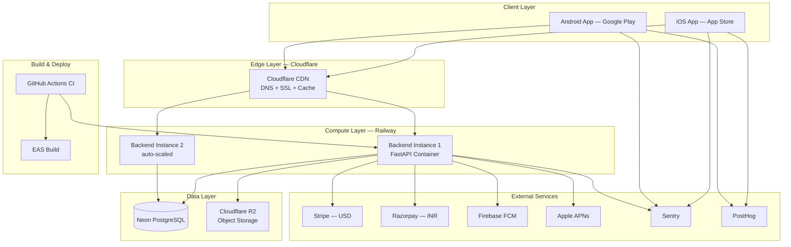
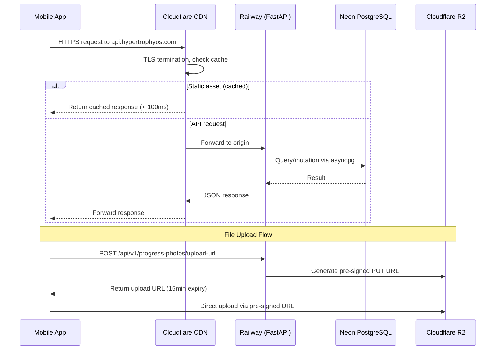

# Design Document: Go-To-Market Plan

## Overview

This design covers the complete infrastructure, deployment, and distribution architecture to take Hypertrophy OS from local development to production on both app stores. The guiding principle is **cheapest viable infrastructure** — selecting providers with generous free tiers and low entry costs that can scale without code changes.

The app is stateless by design (JWT auth, async SQLAlchemy, no server-side sessions), which means horizontal scaling is straightforward. The existing Dockerfile, Alembic migrations, and CI pipeline (GitHub Actions) provide a solid foundation.

### Key Design Decisions

| Decision | Choice | Considered | Why |
|----------|--------|------------|-----|
| Backend hosting | Railway | Render, Fly.io, Hetzner, AWS ECS | $5/mo, Docker-native, auto-deploy from GitHub, zero DevOps overhead for solo founder |
| Database | Neon PostgreSQL | Supabase, Railway PG, DigitalOcean, AWS RDS | Free tier with auto-suspend, branching for staging, native asyncpg compatibility |
| Object storage | Cloudflare R2 | AWS S3, Backblaze B2, DO Spaces | Zero egress fees (critical for progress photos), S3-compatible, 10GB free |
| CDN | Cloudflare Free | AWS CloudFront, Bunny CDN | Unlimited bandwidth free, pairs with R2 and DNS |
| Push notifications | FCM + APNs | OneSignal, Expo Notifications | Both free, no third-party dependency, industry standard |
| Crash reporting | Sentry | Bugsnag, Firebase Crashlytics | Covers both React Native + Python with one tool, 5K events/mo free |
| Analytics | PostHog Cloud | Mixpanel, Amplitude | Already integrated via EXPO_PUBLIC_POSTHOG_KEY, 1M events/mo free |
| App builds | EAS Build | GitHub Actions + Fastlane, Codemagic | Native to Expo 50, handles code signing, 30 free builds/mo |

### What Ships in v1 (MVP) vs v2

| v1 (Launch) | v2 (Fast-follow) |
|-------------|-------------------|
| Railway single instance | Auto-scaling to 3 instances |
| Neon free tier | Neon Pro ($19/mo) at 5K users |
| Stripe + Razorpay live keys | Apple/Google IAP receipt validation |
| FCM + APNs basic push | Rich notifications, scheduled sends |
| Sentry basic crash reporting | Performance monitoring, session replay |
| Manual EAS builds on merge | Automated OTA updates via EAS Update |
| Single region (US-West) | Multi-region with Fly.io at 50K+ users |

## Architecture



### Request Flow



### Deployment Pipeline

```mermaid
graph LR
    Push[Push to main] --> CI[GitHub Actions<br/>lint + type-check + test]
    CI --> Migrate[alembic upgrade head<br/>against Neon]
    Migrate --> Deploy[Railway auto-deploy<br/>from Dockerfile]
    Deploy --> Health[/api/v1/health<br/>returns 200]
    Health --> Live[Traffic routed<br/>via Cloudflare]
```

## Components and Interfaces

### 1. Backend Deployment (Railway)

Railway deploys directly from the GitHub repo using the existing Dockerfile. Zero config needed beyond environment variables.

**Where it lives:** No new code. Railway reads the existing `Dockerfile` and `src/main.py`.

**Configuration:**
- Service: Web service from Dockerfile
- Region: US-West (serves both US and India via Cloudflare edge)
- Start command: `uvicorn src.main:app --host 0.0.0.0 --port 8000`
- Health check: `GET /api/v1/health` (already exists in `src/main.py`)
- Auto-deploy: On push to `main` branch
- Scaling: 1 instance at launch, manual scale to 3 at $5/instance/mo

**Environment Variables (Railway secrets):**

| Variable | Value | Source |
|----------|-------|--------|
| DATABASE_URL | `postgresql+asyncpg://<neon-connection-string>` | Neon dashboard |
| JWT_SECRET | 256-bit random string | `openssl rand -hex 32` |
| JWT_ALGORITHM | HS256 | Existing default |
| ACCESS_TOKEN_EXPIRE_MINUTES | 15 | Existing default |
| REFRESH_TOKEN_EXPIRE_DAYS | 7 | Existing default |
| USDA_API_KEY | Production key | USDA FoodData Central |
| STRIPE_API_KEY | `sk_live_...` | Stripe Dashboard |
| STRIPE_WEBHOOK_SECRET | `whsec_...` | Stripe Dashboard |
| RAZORPAY_KEY_ID | `rzp_live_...` | Razorpay Dashboard |
| RAZORPAY_KEY_SECRET | Live secret | Razorpay Dashboard |
| RAZORPAY_WEBHOOK_SECRET | Webhook secret | Razorpay Dashboard |
| CORS_ORIGINS | `["https://hypertrophyos.com"]` | Custom |
| SENTRY_DSN | `https://...@sentry.io/...` | Sentry project |
| R2_ACCESS_KEY | R2 API token | Cloudflare dashboard |
| R2_SECRET_KEY | R2 API secret | Cloudflare dashboard |
| R2_ENDPOINT_URL | `https://<account-id>.r2.cloudflarestorage.com` | Cloudflare dashboard |
| FCM_SERVER_KEY | Firebase server key | Firebase console |

### 2. Database (Neon PostgreSQL)

Neon provides serverless PostgreSQL with auto-suspend (saves cost when idle) and branching (free staging databases).

**Why Neon over Railway PG:** Auto-suspend means $0 when no users are active. Branching gives free staging databases. Connection pooling built-in.

**Configuration:**
- Plan: Free tier → Pro ($19/mo) at ~5K users
- Compute: 0.25 CU (free) → 1 CU (Pro)
- Storage: 0.5GB free → 10GB included in Pro
- Region: US-East
- Connection pooling: Built-in PgBouncer, max 100 connections on free tier
- Branching: Create a branch for staging (free, shares storage)

**Migration from SQLite:** The existing `src/config/database.py` already uses `create_async_engine` with the `DATABASE_URL` from settings. The `main.py` lifespan has SQLite-specific patching (JSONB→JSON, gen_random_uuid removal) that only runs when `"sqlite" in settings.DATABASE_URL`. Switching to Neon requires only changing the `DATABASE_URL` env var — no code changes.

**Connection pool tuning** (modify `src/config/database.py`):
```python
engine = create_async_engine(
    settings.DATABASE_URL,
    echo=settings.DEBUG,
    pool_size=10,          # default connections
    max_overflow=20,       # burst capacity
    pool_timeout=30,       # queue timeout before error
    pool_recycle=3600,     # recycle connections hourly
)
```

### 3. Object Storage (Cloudflare R2)

R2 is S3-compatible with zero egress fees — critical for serving progress photos without surprise bills.

**Where it lives:** New file `src/shared/storage.py`

```python
# src/shared/storage.py
import boto3
from src.config.settings import settings

def get_r2_client():
    return boto3.client(
        "s3",
        endpoint_url=settings.R2_ENDPOINT_URL,
        aws_access_key_id=settings.R2_ACCESS_KEY,
        aws_secret_access_key=settings.R2_SECRET_KEY,
        region_name="auto",
    )

def generate_upload_url(user_id: str, filename: str) -> str:
    client = get_r2_client()
    key = f"users/{user_id}/{filename}"
    return client.generate_presigned_url(
        "put_object",
        Params={
            "Bucket": settings.R2_BUCKET_NAME,
            "Key": key,
            "ContentType": "image/jpeg",
        },
        ExpiresIn=900,  # 15 minutes
    )

def generate_read_url(key: str) -> str:
    # Public via CDN: https://cdn.hypertrophyos.com/{key}
    return f"https://cdn.hypertrophyos.com/{key}"
```

**Integration with existing `progress_photos` module:** The existing `PhotoCreate` schema stores a `url` field. In production, the flow becomes:
1. Client calls new endpoint `POST /api/v1/progress-photos/upload-url` → gets pre-signed URL
2. Client uploads directly to R2 via pre-signed URL
3. Client calls existing `POST /api/v1/progress-photos` with the R2 key as the `url`

### 4. CDN (Cloudflare Free Tier)

**Where it lives:** Cloudflare dashboard configuration, no application code.

**DNS Setup:**
- `hypertrophyos.com` → Cloudflare Pages (landing page) or redirect
- `api.hypertrophyos.com` → CNAME to Railway service URL (proxied through Cloudflare)
- `cdn.hypertrophyos.com` → R2 public bucket custom domain

**Cache Rules:**
| Path Pattern | Cache Behavior | TTL |
|-------------|----------------|-----|
| `api.hypertrophyos.com/static/*` | Cache Everything | 1 year (immutable) |
| `api.hypertrophyos.com/api/*` | Bypass Cache | — |
| `cdn.hypertrophyos.com/*` | Cache Everything | 1 year |

**SSL:** Full (strict) mode — Cloudflare terminates TLS, re-encrypts to Railway origin.

### 5. Push Notifications (FCM + APNs)

**Where it lives:** New module `src/modules/notifications/`

**New files:**
- `src/modules/notifications/models.py` — DeviceToken model
- `src/modules/notifications/service.py` — NotificationService
- `src/modules/notifications/router.py` — Token registration endpoint
- `src/modules/notifications/schemas.py` — Request/response schemas

**Dependencies added to `pyproject.toml`:**
- `firebase-admin>=6.0.0` — FCM sends
- `aioapns>=3.0` — APNs sends

### 6. Monitoring & Crash Reporting (Sentry)

**Where it lives:**
- Backend: `src/main.py` (Sentry init) + new `src/middleware/logging_middleware.py`
- Frontend: `app/App.tsx` (Sentry init)

**Backend integration** (add to `src/main.py`):
```python
import sentry_sdk
from sentry_sdk.integrations.fastapi import FastApiIntegration
from sentry_sdk.integrations.sqlalchemy import SqlalchemyIntegration

if settings.SENTRY_DSN:
    sentry_sdk.init(
        dsn=settings.SENTRY_DSN,
        integrations=[FastApiIntegration(), SqlalchemyIntegration()],
        traces_sample_rate=0.1,  # 10% of requests traced
        environment="production",
    )
```

**Frontend integration** (add to `app/App.tsx`):
```typescript
import * as Sentry from '@sentry/react-native';
Sentry.init({
  dsn: process.env.EXPO_PUBLIC_SENTRY_DSN,
  tracesSampleRate: 0.1,
  environment: __DEV__ ? 'development' : 'production',
});
```

**New dependency:** `@sentry/react-native` added to `app/package.json`

**Structured logging middleware** (`src/middleware/logging_middleware.py`):
```python
import json, logging, time, uuid
from fastapi import Request, Response
from starlette.middleware.base import BaseHTTPMiddleware

logger = logging.getLogger("hypertrophy_os.access")

class StructuredLoggingMiddleware(BaseHTTPMiddleware):
    async def dispatch(self, request: Request, call_next) -> Response:
        request_id = str(uuid.uuid4())[:8]
        start = time.monotonic()
        response = await call_next(request)
        duration_ms = round((time.monotonic() - start) * 1000)
        
        logger.info(json.dumps({
            "request_id": request_id,
            "method": request.method,
            "path": request.url.path,
            "status": response.status_code,
            "duration_ms": duration_ms,
            "user_id": getattr(request.state, "user_id", None),
        }))
        return response
```

### 7. EAS Build Configuration

**Where it lives:** New file `app/eas.json`

```json
{
  "cli": { "version": ">= 12.0.0" },
  "build": {
    "development": {
      "developmentClient": true,
      "distribution": "internal"
    },
    "staging": {
      "distribution": "internal",
      "env": {
        "EXPO_PUBLIC_API_URL": "https://staging-api.hypertrophyos.com",
        "EXPO_PUBLIC_POSTHOG_KEY": "<staging-key>",
        "EXPO_PUBLIC_SENTRY_DSN": "<staging-sentry-dsn>"
      }
    },
    "production": {
      "distribution": "store",
      "env": {
        "EXPO_PUBLIC_API_URL": "https://api.hypertrophyos.com",
        "EXPO_PUBLIC_POSTHOG_KEY": "<production-key>",
        "EXPO_PUBLIC_SENTRY_DSN": "<production-sentry-dsn>"
      }
    }
  },
  "submit": {
    "production": {
      "ios": {
        "appleId": "<apple-id>",
        "ascAppId": "<app-store-connect-app-id>",
        "appleTeamId": "<team-id>"
      },
      "android": {
        "serviceAccountKeyPath": "./google-play-service-account.json",
        "track": "internal"
      }
    }
  }
}
```

**New GitHub Actions workflow** (`.github/workflows/build-mobile.yml`):
```yaml
name: Build Mobile
on:
  push:
    branches: [main]
    paths: ['app/**']
  workflow_dispatch:
    inputs:
      profile:
        description: 'Build profile'
        required: true
        default: 'staging'
        type: choice
        options: [staging, production]
jobs:
  build:
    runs-on: ubuntu-latest
    steps:
      - uses: actions/checkout@v4
      - uses: expo/expo-github-action@v8
        with:
          eas-version: latest
          token: ${{ secrets.EXPO_TOKEN }}
      - name: Build
        working-directory: app
        run: eas build --platform all --profile ${{ github.event.inputs.profile || 'staging' }} --non-interactive
```

### 8. Payment Provider Production Setup

**Stripe (USD/Global):**
- Products: "HOS Premium Monthly" ($9.99/mo), "HOS Premium Annual" ($79.99/yr)
- Webhook endpoint: `https://api.hypertrophyos.com/api/v1/payments/webhook/stripe`
- Events: `invoice.paid`, `invoice.payment_failed`, `customer.subscription.deleted`, `customer.subscription.updated`
- Code change: Replace `NotImplementedError` stubs in `src/modules/payments/stripe_provider.py` with real `stripe` SDK calls
- New dependency: `stripe>=8.0.0` in `pyproject.toml`

**Razorpay (INR/India):**
- Plans: "HOS Premium Monthly" (₹499/mo), "HOS Premium Annual" (₹3,999/yr)
- Webhook endpoint: `https://api.hypertrophyos.com/api/v1/payments/webhook/razorpay`
- Events: `subscription.activated`, `subscription.charged`, `subscription.cancelled`, `payment.failed`
- Code change: Replace `NotImplementedError` stubs in `src/modules/payments/razorpay_provider.py` with real `razorpay` SDK calls
- New dependency: `razorpay>=1.4.0` in `pyproject.toml`

**In-App Purchase Reconciliation (v2):**
- iOS: App Store Server API v2 for receipt validation
- Android: Google Play Developer API for purchase verification
- Both validate receipts server-side before activating subscriptions
- Deferred to v2 because Stripe/Razorpay web checkout works for v1 launch

## API Contracts

### New Endpoints

| Method | Path | Auth | Request Body | Response | Status Codes | Notes |
|--------|------|------|-------------|----------|-------------|-------|
| POST | `/api/v1/progress-photos/upload-url` | JWT | `{ "filename": "front_2024.jpg", "content_type": "image/jpeg" }` | `{ "upload_url": "https://...", "key": "users/{id}/..." }` | 200, 401, 422 | Pre-signed R2 upload URL |
| POST | `/api/v1/notifications/register-device` | JWT | `{ "platform": "ios", "token": "abc123..." }` | `{ "id": "uuid", "registered": true }` | 201, 401, 422 | Register push token |
| DELETE | `/api/v1/notifications/register-device/{token_id}` | JWT | — | — | 204, 401, 404 | Unregister push token |
| GET | `/api/v1/notifications/preferences` | JWT | — | `{ "push_enabled": true, "coaching_reminders": true, "subscription_alerts": true }` | 200, 401 | Get notification prefs |
| PATCH | `/api/v1/notifications/preferences` | JWT | `{ "push_enabled": false }` | Updated preferences | 200, 401, 422 | Update notification prefs |

### Modified Endpoints

No existing endpoints change. The existing payment webhook endpoints (`POST /api/v1/payments/webhook/stripe` and `POST /api/v1/payments/webhook/razorpay`) already exist in `src/modules/payments/router.py` — they just need the provider stubs replaced with real SDK calls.

### Rate Limiting

| Endpoint Pattern | Limit | Window | Because |
|-----------------|-------|--------|---------|
| `POST /api/v1/auth/*` | 5 requests | 15 min | Already implemented in `rate_limiter.py` |
| `POST /api/v1/payments/webhook/*` | 100 requests | 1 min | Prevent webhook replay attacks |
| `POST /api/v1/progress-photos/upload-url` | 10 requests | 1 min | Prevent storage abuse |

## Data Models

### New Models

**DeviceToken** (`src/modules/notifications/models.py`):

| Column | Type | Constraints | Index | Notes |
|--------|------|-------------|-------|-------|
| id | UUID | PK, default gen_random_uuid | — | |
| user_id | UUID | NOT NULL | ix_device_tokens_user_id | FK to users.id |
| platform | String(10) | NOT NULL, CHECK IN ('ios', 'android') | — | |
| token | String(500) | NOT NULL, UNIQUE | ix_device_tokens_token | FCM/APNs token |
| is_active | Boolean | NOT NULL, default true | — | Set false on delivery failure |
| created_at | DateTime(tz) | NOT NULL, default now() | — | |
| updated_at | DateTime(tz) | NOT NULL, default now() | — | |

**Primary access pattern:** `SELECT * FROM device_tokens WHERE user_id = ? AND is_active = true` — covered by `ix_device_tokens_user_id`.

**NotificationPreference** (`src/modules/notifications/models.py`):

| Column | Type | Constraints | Index | Notes |
|--------|------|-------------|-------|-------|
| id | UUID | PK | — | |
| user_id | UUID | NOT NULL, UNIQUE | ix_notification_prefs_user_id | FK to users.id |
| push_enabled | Boolean | NOT NULL, default true | — | Master toggle |
| coaching_reminders | Boolean | NOT NULL, default true | — | Weekly check-in reminders |
| subscription_alerts | Boolean | NOT NULL, default true | — | Payment/renewal alerts |
| created_at | DateTime(tz) | NOT NULL | — | |
| updated_at | DateTime(tz) | NOT NULL | — | |

### Modified Models

**Settings class** (`src/config/settings.py`) — add new fields:

```python
# Production infrastructure
SENTRY_DSN: str = ""
R2_ACCESS_KEY: str = ""
R2_SECRET_KEY: str = ""
R2_ENDPOINT_URL: str = ""
R2_BUCKET_NAME: str = "hypertrophy-os-uploads"
FCM_SERVER_KEY: str = ""
APNS_KEY_ID: str = ""
APNS_TEAM_ID: str = ""
APNS_AUTH_KEY_PATH: str = ""
STRIPE_API_KEY: str = ""
RAZORPAY_KEY_ID: str = ""
RAZORPAY_KEY_SECRET: str = ""
```

### Migration Plan

**Alembic migration** (`alembic/versions/xxx_add_notifications.py`):
```python
def upgrade():
    op.create_table("device_tokens", ...)
    op.create_table("notification_preferences", ...)
    op.create_index("ix_device_tokens_user_id", "device_tokens", ["user_id"])
    op.create_index("ix_device_tokens_token", "device_tokens", ["token"], unique=True)
    op.create_index("ix_notification_prefs_user_id", "notification_preferences", ["user_id"], unique=True)

def downgrade():
    op.drop_table("notification_preferences")
    op.drop_table("device_tokens")
```

**Impact on existing data:** None. New tables only. No existing table modifications.

## Data Flow

### Happy Path: User Subscribes via Stripe

```
1. User taps "Upgrade to Premium" in UpgradeModal.tsx
2. Frontend calls POST /api/v1/payments/subscribe { plan_id: "monthly", region: "US", currency: "USD" }
3. Backend: PaymentService.initiate_subscription()
   → get_provider_for_region("US") → StripeProvider
   → stripe.checkout.Session.create() → returns checkout URL
   → Subscription record created with status "pending_payment"
4. Frontend opens Stripe Checkout URL in in-app browser
5. User completes payment on Stripe
6. Stripe sends webhook POST /api/v1/payments/webhook/stripe
   → StripeProvider.verify_webhook() validates HMAC-SHA256
   → PaymentService._process_webhook_event() transitions status → "active"
7. Frontend polls GET /api/v1/payments/status → status: "active"
8. Zustand store: setSubscription({ status: "active" })
9. isPremium() returns true → premium features unlocked
```

### Error Path: Webhook Signature Mismatch

```
1. Attacker sends POST /api/v1/payments/webhook/stripe with forged payload
2. StripeProvider.verify_webhook() computes HMAC-SHA256
3. hmac.compare_digest() returns false
4. UnprocessableError raised → 422 response
5. Sentry captures the error with request metadata
6. Structured log entry: { "path": "/api/v1/payments/webhook/stripe", "status": 422, ... }
7. No subscription state change occurs
```

### Happy Path: Progress Photo Upload

```
1. User taps "Add Photo" in ProgressPhotosScreen.tsx
2. expo-image-picker opens camera/gallery → user selects image
3. Frontend calls POST /api/v1/progress-photos/upload-url { filename: "front_2024.jpg" }
4. Backend: generate_upload_url(user_id, filename) → pre-signed R2 PUT URL
5. Frontend uploads image directly to R2 via pre-signed URL (bypasses backend)
6. Frontend calls POST /api/v1/progress-photos { url: "users/{id}/front_2024.jpg", pose_type: "front_relaxed" }
7. Backend creates ProgressPhoto record with R2 key
8. Frontend displays photo via CDN URL: https://cdn.hypertrophyos.com/users/{id}/front_2024.jpg
```

### Caching Strategy

| Data | Cache Location | TTL | Invalidation |
|------|---------------|-----|-------------|
| Exercise images (`/static/`) | Cloudflare edge | 1 year | Versioned filenames |
| Progress photos | Cloudflare edge (via R2 CDN) | 1 year | Immutable keys |
| API responses | No caching | — | Real-time data |
| Subscription status | Zustand in-memory | Session | Re-fetched on app foreground |
| User profile | Zustand in-memory | Session | Re-fetched on app foreground |

## Edge Cases & Error Handling

| Scenario | Handling | Recovery |
|----------|----------|----------|
| **Network timeout during subscription** | Stripe Checkout handles retries. Backend subscription stays "pending_payment" | User retries from UpgradeModal. Webhook eventually arrives and updates status |
| **Webhook arrives before frontend polls** | Subscription already "active" when frontend checks | No issue — frontend sees correct state |
| **Webhook arrives after user closes app** | Backend processes webhook independently | Next app launch fetches updated subscription status |
| **Duplicate webhook delivery** | `_process_webhook_event` is idempotent — re-applying "active" to "active" is a no-op via `validate_transition` | No duplicate charges or state corruption |
| **R2 upload fails (network)** | Frontend shows error toast, photo not saved | User retries upload. Pre-signed URL regenerated |
| **R2 upload exceeds 10MB** | R2 rejects with 413. Frontend shows size error | Client-side validation before upload (check file size) |
| **Invalid device token (push)** | FCM/APNs returns error. Backend marks token `is_active = false` | Token refreshed on next app launch, new token registered |
| **User deletes account with active subscription** | Existing `AccountService.request_deletion()` already cancels active subscriptions | 30-day grace period, reactivation possible |
| **Alembic migration fails on deploy** | Railway deploy fails, previous version stays live | Fix migration locally, test against Neon branch, re-deploy |
| **Neon auto-suspend wakes slowly** | First request after idle may take 1-3 seconds (cold start) | Acceptable for low-traffic periods. Neon Pro has configurable suspend timeout |
| **Stripe/Razorpay API down** | Subscription creation returns 503. Frontend shows "try again later" | Payment providers have 99.99% uptime. Retry after 5 minutes |
| **JWT expired during payment flow** | Token refresh interceptor in `app/services/api.ts` handles 401 → refresh → retry | Existing interceptor already handles this transparently |
| **App killed during photo upload** | Upload to R2 may complete but photo record not created | Orphaned R2 objects cleaned up by lifecycle rules (90-day expiry on unlinked files) |
| **Feature flag off** | Existing `feature_flags` module gates new features | Graceful degradation — premium features hidden, not broken |
| **Free tier user hits premium endpoint** | Existing `require_premium` middleware returns 403 `PremiumRequiredError` | Frontend shows UpgradeModal |

## Security

### Input Validation

| Layer | What | How |
|-------|------|-----|
| Frontend | File size before upload | Check `file.size < 10 * 1024 * 1024` before requesting pre-signed URL |
| Frontend | Device token format | Validate non-empty string before registration |
| Backend | All request bodies | Pydantic schemas with `Field(min_length=..., max_length=...)` — existing pattern |
| Backend | Webhook signatures | HMAC-SHA256 verification before processing any webhook payload |
| Backend | File upload URLs | Pre-signed URLs scoped to `users/{user_id}/` — no path traversal possible |
| Backend | JWT validation | Existing `_decode_token()` in `auth/service.py` validates signature, expiry, type |

### Authorization

| Resource | Who Can Access | How Enforced |
|----------|---------------|-------------|
| User's subscription | Owner only | `user_id` from JWT matched against `Subscription.user_id` |
| User's photos | Owner only | `user_id` from JWT matched against `ProgressPhoto.user_id` |
| User's device tokens | Owner only | `user_id` from JWT matched against `DeviceToken.user_id` |
| Webhook endpoints | Payment providers only | HMAC-SHA256 signature verification (no JWT) |
| Admin endpoints | Admin role only | `user.role == "admin"` check in existing middleware |

### Audit Logging

The existing `AuditLog` model and `audit_logger.py` middleware already capture:
- Account deletion/reactivation (Requirement 22.5)
- Subscription state changes

New audit events to add:
- Payment webhook received (provider, event_type, subscription_id)
- Device token registration/removal

### Data Privacy

| Data Type | Storage | Encryption | Retention | Deletion |
|-----------|---------|------------|-----------|----------|
| Email, password hash | Neon PostgreSQL | At rest (Neon default) | Until account deletion | Soft-delete → 30-day hard delete |
| Body measurements, nutrition logs | Neon PostgreSQL | At rest | Until account deletion | Cascade delete with user |
| Progress photos | Cloudflare R2 | At rest (R2 default) | Until account deletion | R2 objects deleted on hard delete |
| Device tokens | Neon PostgreSQL | At rest | Until token invalidated | Removed on delivery failure or user request |
| Payment data | Stripe/Razorpay (PCI compliant) | Provider-managed | Provider retention policy | Provider handles |

### Production JWT Secret

The existing `JWT_SECRET` default is `"change-me-in-production"`. For production:
```bash
# Generate a 256-bit secret
openssl rand -hex 32
# → e.g., "a3f8b2c1d4e5f6a7b8c9d0e1f2a3b4c5d6e7f8a9b0c1d2e3f4a5b6c7d8e9f0"
```

The `Settings` class should validate minimum secret length:
```python
@field_validator("JWT_SECRET")
@classmethod
def validate_jwt_secret(cls, v: str) -> str:
    if not v or v == "change-me-in-production" or len(v) < 32:
        if not Settings.model_config.get("env_file"):  # skip in test
            raise ValueError("JWT_SECRET must be at least 32 characters in production")
    return v
```

## Performance

### Target Latencies

| Operation | p50 | p95 | p99 | Notes |
|-----------|-----|-----|-----|-------|
| API health check | 5ms | 20ms | 50ms | No DB query |
| Auth login | 100ms | 300ms | 500ms | bcrypt hash comparison |
| Nutrition log CRUD | 30ms | 100ms | 200ms | Single table query |
| Training session CRUD | 50ms | 150ms | 300ms | Joins with exercises |
| Subscription status | 20ms | 80ms | 150ms | Indexed query |
| Pre-signed URL generation | 50ms | 150ms | 300ms | R2 API call |
| Webhook processing | 100ms | 300ms | 500ms | Signature verify + DB update |

### Database Query Analysis

| Query | Access Pattern | Index | Risk |
|-------|---------------|-------|------|
| Get subscription by user_id | `WHERE user_id = ? AND deleted_at IS NULL ORDER BY created_at DESC LIMIT 1` | `ix_subscriptions_user_status` | None — indexed |
| Get device tokens by user_id | `WHERE user_id = ? AND is_active = true` | `ix_device_tokens_user_id` | None — indexed |
| Webhook lookup by provider_subscription_id | `WHERE provider_subscription_id = ?` | Needs index (add) | N/A after index |
| List photos by user_id | `WHERE user_id = ? AND deleted_at IS NULL` | Existing index | None |

**Action:** Add index on `subscriptions.provider_subscription_id` for webhook lookups.

### Frontend Performance

- No new screens — only configuration changes (API URL, Sentry DSN)
- Sentry SDK adds ~200KB to bundle — acceptable
- PostHog already integrated — no additional bundle impact
- Photo upload is direct to R2 — no backend bottleneck

## Cost Comparison

### Backend Hosting (Compute)

| Provider | Free Tier | Starter | 10K Users | 100K Users | Notes |
|----------|-----------|---------|-----------|------------|-------|
| **Railway** | $5 credit/mo | **$5/mo** | $20/mo (2x) | $60/mo (3x) | Docker-native, auto-deploy, zero config |
| Render | Free (sleeps) | $7/mo | $25/mo | $85/mo | Free tier sleeps after 15min — bad UX |
| Fly.io | 3 shared VMs | $5/mo | $20/mo | $70/mo | Good global distribution, more config needed |
| DigitalOcean App Platform | — | $5/mo | $24/mo | $96/mo | Reliable but less developer-friendly |
| Hetzner Cloud | — | €3.29/mo | €7.49/mo | €15.59/mo | Cheapest raw compute, requires manual Docker/nginx/SSL setup |
| AWS ECS Fargate | — | ~$15/mo | ~$45/mo | ~$150/mo | Most expensive, most enterprise features |

### Database (PostgreSQL)

| Provider | Free Tier | Starter | 10K Users | 100K Users | Notes |
|----------|-----------|---------|-----------|------------|-------|
| **Neon** | 0.5GB, auto-suspend | **Free** | $19/mo (Pro) | $69/mo | Serverless, branching, auto-suspend |
| Supabase | 500MB, 2 projects | Free | $25/mo | $75/mo | More features than needed |
| Railway PostgreSQL | — | $5/mo | $10/mo | $30/mo | No auto-suspend, no branching |
| DigitalOcean Managed DB | — | $15/mo | $15/mo | $50/mo | Fixed pricing, reliable |
| AWS RDS | — | ~$15/mo | ~$30/mo | ~$100/mo | Most expensive |

### Object Storage

| Provider | Free Tier | Egress Cost | Notes |
|----------|-----------|-------------|-------|
| **Cloudflare R2** | 10GB, 10M reads | **$0 (free)** | Zero egress — critical for photo-heavy app |
| AWS S3 | 5GB (12mo) | $0.09/GB | Egress costs add up fast |
| Backblaze B2 | 10GB | Free via CF | Good with Cloudflare bandwidth alliance |
| DigitalOcean Spaces | — ($5/mo min) | $0.01/GB | Fixed minimum |

### Total Monthly Cost

| Scale | Compute | Database | Storage | CDN | Push | Monitoring | Analytics | Builds | **Total** |
|-------|---------|----------|---------|-----|------|------------|-----------|--------|-----------|
| **100 users** | $5 | $0 | $0 | $0 | $0 | $0 | $0 | $0 | **$5/mo** |
| **1K users** | $5 | $0 | $0 | $0 | $0 | $0 | $0 | $0 | **$5/mo** |
| **10K users** | $20 | $19 | $0 | $0 | $0 | $26 | $0 | $0 | **$65/mo** |
| **100K users** | $60 | $69 | $1.50 | $0 | $0 | $26 | $0 | $29 | **$185/mo** |

**$5/mo at launch. $185/mo at 100K users. Well under the $50/mo target for the first 1,000 users.**

## App Store Submission Artifacts

### Apple App Store

| Artifact | Value |
|----------|-------|
| App name | Hypertrophy OS |
| Subtitle | Smart Training & Nutrition |
| Category | Health & Fitness |
| Age rating | 4+ |
| Price | Free (with IAP) |
| Screenshots | 6.7", 6.5", 5.5" — Dashboard, Active Workout, Nutrition, Analytics, Coaching (5 screens × 3 sizes) |
| Privacy URL | https://hypertrophyos.com/privacy |
| Support URL | https://hypertrophyos.com/support |
| Demo account | reviewer@hypertrophyos.com / ReviewPass123 |
| Review notes | "Freemium fitness app. Free users get nutrition tracking and basic training. Premium ($9.99/mo or $79.99/yr) unlocks coaching, advanced analytics, and meal plans. Demo account has premium access." |
| IAP Products | "HOS Premium Monthly" ($9.99/mo auto-renew), "HOS Premium Annual" ($79.99/yr auto-renew) |

### Google Play Store

| Artifact | Value |
|----------|-------|
| App name | Hypertrophy OS |
| Short description | Adaptive training & nutrition for serious lifters |
| Category | Health & Fitness |
| Content rating | IARC — Everyone |
| Feature graphic | 1024x500 branded image |
| Screenshots | Phone — 8 screenshots (Dashboard, Active Workout, Nutrition, Analytics, Coaching, Onboarding, Profile, Exercise Picker) |
| Privacy URL | https://hypertrophyos.com/privacy |
| Data safety | Collects: email, body measurements, nutrition logs, training logs, photos. Encrypted in transit. Deletable on request. |
| IAP Products | "HOS Premium Monthly" (₹499/mo or $9.99/mo), "HOS Premium Annual" (₹3,999/yr or $79.99/yr) |

## Correctness Properties

*A property is a characteristic or behavior that should hold true across all valid executions of a system — essentially, a formal statement about what the system should do. Properties serve as the bridge between human-readable specifications and machine-verifiable correctness guarantees.*

Most requirements in this GTM spec are infrastructure/configuration concerns (deployment, DNS, CDN, app store submissions) that cannot be verified through property-based testing. The testable properties focus on the application code that changes or is added as part of production readiness.

### Property 1: Region-based provider routing

*For any* supported region string in the PROVIDER_MAP, calling `get_provider_for_region(region)` should return an instance of the correct PaymentProvider subclass (StripeProvider for "US", RazorpayProvider for "IN"). *For any* unsupported region string, the function should raise a ValueError.

**Validates: Requirements 5.1, 5.2**

### Property 2: Webhook signature verification

*For any* valid JSON payload and a correctly computed HMAC-SHA256 signature, calling `verify_webhook(payload, signature)` should return a WebhookEvent with the correct event_type. *For any* payload with a tampered or incorrect signature, `verify_webhook` should raise an UnprocessableError.

**Validates: Requirements 5.3, 5.5**

### Property 3: Pre-signed URL user scoping

*For any* user ID (UUID) and filename string, the generated object storage key should always match the pattern `users/{user_id}/{filename}`, and the pre-signed URL should have an expiry no greater than 15 minutes.

**Validates: Requirements 6.3, 6.4**

### Property 4: Device token storage round-trip

*For any* user ID and device token string, storing the token and then retrieving all active tokens for that user should return a set containing the stored token.

**Validates: Requirements 7.4**

### Property 5: Notification opt-out enforcement

*For any* user with `push_enabled` set to false in their notification preferences, the notification service should skip sending and return zero deliveries. *For any* user with `push_enabled` true and valid device tokens, the service should attempt delivery.

**Validates: Requirements 7.5**

### Property 6: Structured log completeness

*For any* HTTP request (any method, any path, any status code), the logging middleware should produce a JSON log entry containing all required fields: `request_id`, `method`, `path`, `status`, and `duration_ms`.

**Validates: Requirements 8.1**

### Property 7: Soft-delete user exclusion

*For any* user that has been soft-deleted (`deleted_at` is set), querying users by email or ID using the standard query patterns (`WHERE deleted_at IS NULL`) should return no results for that user.

**Validates: Requirements 11.6**

### Property 8: Environment variable validation

*For any* configuration where `JWT_SECRET` is shorter than 32 characters or equals the default `"change-me-in-production"`, the Settings initialization should raise a validation error in production mode.

**Validates: Requirements 1.5**

## Error Handling

### Backend Deployment Errors

| Error | Detection | Handling | Recovery |
|-------|-----------|----------|----------|
| Dockerfile build fails | GitHub Actions CI | Block deploy, notify via GitHub | Fix Dockerfile, re-push |
| Health check fails post-deploy | Railway health probe | Railway rolls back to previous version | Investigate Sentry/logs, fix, re-deploy |
| Database connection refused | Sentry alert + structured log | App returns 500 on all DB-dependent endpoints | Check Neon status, verify DATABASE_URL |
| Alembic migration fails | GitHub Actions step failure | Deploy blocked, previous version stays live | Fix migration, test against Neon branch, re-deploy |
| Neon cold start (auto-suspend wake) | First request latency spike | 1-3 second delay on first request after idle | Acceptable for low-traffic. Neon Pro has configurable suspend timeout |

### Payment Errors

| Error | Detection | Handling | Recovery |
|-------|-----------|----------|----------|
| Stripe/Razorpay API key invalid | 401 from provider API | Subscription creation returns 500, Sentry alert | Verify key in provider dashboard, update Railway secret |
| Webhook signature mismatch | `verify_webhook` raises UnprocessableError | Return 422, log with provider name + timestamp | Verify webhook secret matches provider dashboard |
| Invalid state transition | `validate_transition` raises UnprocessableError | Log and ignore for webhooks (idempotent) | Investigate event sequence if recurring |
| Provider API timeout | httpx timeout | Return 503 to client, retry webhook processing | Provider uptime is 99.99%. Retry after 5 minutes |

### Storage Errors

| Error | Detection | Handling | Recovery |
|-------|-----------|----------|----------|
| R2 pre-signed URL generation fails | boto3 exception | Return 500, Sentry alert | Check R2 credentials and bucket existence |
| Upload exceeds 10MB | R2 rejects with 413 | Client shows file size error | Client-side validation before upload |
| Orphaned R2 objects | No matching DB record | R2 lifecycle rules clean up after 90 days | Acceptable — storage is cheap |

### Push Notification Errors

| Error | Detection | Handling | Recovery |
|-------|-----------|----------|----------|
| Invalid device token | FCM/APNs error response | Mark token `is_active = false` | Token refreshed on next app launch |
| FCM/APNs service down | Connection timeout | Queue for retry (max 3 attempts, exponential backoff) | Delivered on retry |
| User has no device tokens | Empty query result | Skip silently, no error | Normal for new users |

## Testing Strategy

### Unit Tests

Unit tests validate specific examples and edge cases. Existing test infrastructure: `pytest` + `pytest-asyncio` for backend, `jest` for frontend.

| Component | Test File | Key Assertions |
|-----------|-----------|----------------|
| Storage URL generation | `tests/test_storage_unit.py` | Correct key format, correct expiry, correct bucket |
| Logging middleware | `tests/test_logging_middleware_unit.py` | JSON output, all required fields present |
| Device token CRUD | `tests/test_notifications_unit.py` | Store, retrieve, deactivate, cleanup |
| Notification preferences | `tests/test_notifications_unit.py` | Opt-out skips send, opt-in attempts send |
| Settings validation | `tests/test_settings_unit.py` | Weak JWT_SECRET rejected, valid secret accepted |
| Stripe provider (real SDK) | `tests/test_stripe_integration.py` | Checkout session created, webhook verified |
| Razorpay provider (real SDK) | `tests/test_razorpay_integration.py` | Subscription created, webhook verified |

### Property-Based Tests

Property tests use **Hypothesis** (Python, already in dev dependencies). Minimum 100 iterations per property.

| Property | Test File | Tag |
|----------|-----------|-----|
| Property 1: Region routing | `tests/test_gtm_properties.py` | `Feature: go-to-market-plan, Property 1: Region-based provider routing` |
| Property 2: Webhook verification | `tests/test_gtm_properties.py` | `Feature: go-to-market-plan, Property 2: Webhook signature verification` |
| Property 3: URL scoping | `tests/test_gtm_properties.py` | `Feature: go-to-market-plan, Property 3: Pre-signed URL user scoping` |
| Property 4: Token round-trip | `tests/test_gtm_properties.py` | `Feature: go-to-market-plan, Property 4: Device token storage round-trip` |
| Property 5: Opt-out enforcement | `tests/test_gtm_properties.py` | `Feature: go-to-market-plan, Property 5: Notification opt-out enforcement` |
| Property 6: Log completeness | `tests/test_gtm_properties.py` | `Feature: go-to-market-plan, Property 6: Structured log completeness` |
| Property 7: Soft-delete exclusion | `tests/test_gtm_properties.py` | `Feature: go-to-market-plan, Property 7: Soft-delete user exclusion` |
| Property 8: Env validation | `tests/test_gtm_properties.py` | `Feature: go-to-market-plan, Property 8: Environment variable validation` |

### Integration Tests

| Test | What It Validates | Environment |
|------|-------------------|-------------|
| Health check against staging | Backend deployed and responding | Staging (Railway) |
| Alembic migration on Neon branch | Migrations run cleanly on real PostgreSQL | Neon branch |
| Stripe test-mode checkout | End-to-end subscription flow | Stripe test keys |
| Razorpay test-mode subscription | End-to-end subscription flow | Razorpay test keys |
| Push notification to test device | FCM/APNs delivery | Firebase test project |
| Photo upload to R2 | Pre-signed URL → upload → CDN read | R2 dev bucket |

### Pre-Launch Checklist (Manual)

- [ ] App installs from TestFlight on physical iPhone
- [ ] App installs from internal testing on physical Android
- [ ] Login/register works against production API
- [ ] Subscription purchase completes (Stripe test card)
- [ ] Subscription purchase completes (Razorpay test UPI)
- [ ] Webhook updates subscription status
- [ ] Progress photo upload and CDN retrieval works
- [ ] Push notification received on both platforms
- [ ] Crash appears in Sentry dashboard
- [ ] Analytics event appears in PostHog dashboard
- [ ] Account deletion triggers soft-delete
- [ ] Privacy policy URL loads correctly
