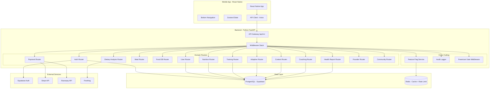
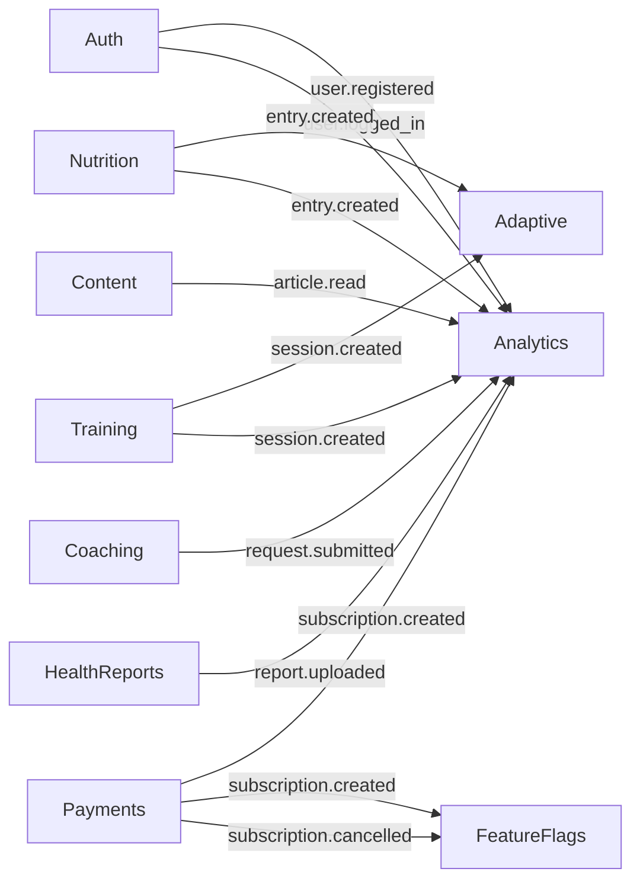
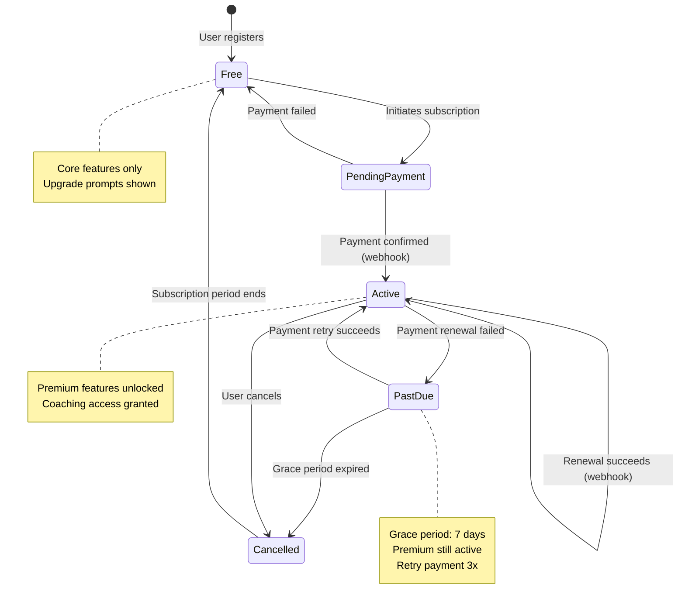
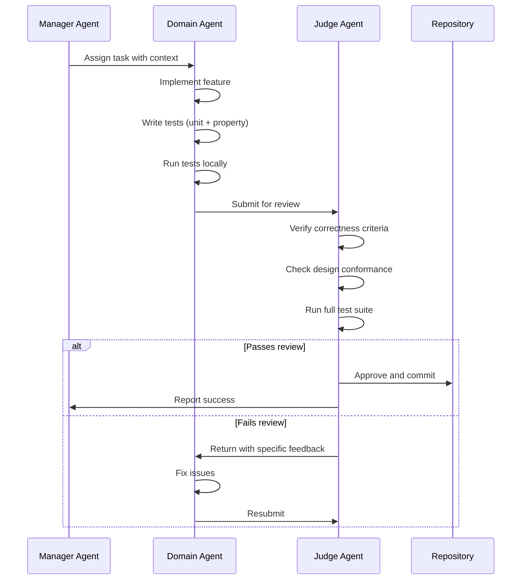

# Design Document: HypertrophyOS Platform

## Overview

HypertrophyOS is a cross-platform mobile application (iOS + Android) with a Python backend API, designed for serious lifters who want adaptive nutrition and training optimization. The system follows a freemium model with core features available to all users and premium features gated behind a subscription.

### Technology Stack

- **Frontend**: React Native with TypeScript — single codebase for iOS and Android, testable on localhost via Expo
- **Backend**: Python 3.12+ with FastAPI — async REST API server, Pydantic for validation
- **ORM**: SQLAlchemy 2.0 with async support
- **Database**: PostgreSQL via Supabase — supports JSONB, row-level security
- **Authentication**: Supabase Auth (email/password, Google OAuth, Apple OAuth) + FastAPI JWT middleware
- **Payments**: Stripe (US/global), Razorpay (India/UPI)
- **Analytics**: PostHog
- **Deployment Phase 1**: Railway (backend) + Supabase (database + auth)
- **Deployment Phase 2**: Docker + Fly.io or AWS ECS

### Design Principles

1. **Modularity**: Each domain is a self-contained FastAPI router with its own service, schema, and model layers
2. **Extensibility**: JSONB for evolving fields, feature flags for runtime toggles, content modules without schema changes
3. **Freemium-first**: Every feature is designed with access control from the start
4. **Testability**: Every endpoint and business logic function is independently testable
5. **Separation of concerns**: Routes → Controllers → Services → Repositories → Models

### MVP Phasing

#### Phase 1 — MVP (Weeks 1–8)
- User auth (email + Google OAuth)
- User profile and metrics
- Basic nutrition logging (macros only)
- Basic training session logging
- Adaptive engine (v1 — simple TDEE calculation)
- Stripe payments (USD only)
- Free content articles
- Bottom navigation UI shell
- Soft deletion, audit logging, feature flags

#### Phase 2 — Growth (Weeks 9–16)
- Apple OAuth
- Micro-nutrient tracking
- Custom meals and favorites
- Indian food database
- Razorpay integration (INR/UPI)
- Premium content gating
- Learn section UI (favorites, progress indicator)
- Coaching system (requests + sessions)
- Dietary trend analysis (basic)

#### Phase 3 — Maturity (Weeks 17–24)
- Health reports and lipid profile analysis
- Dietary gap analysis with food recommendations
- Founder story module with media gallery
- Community module (Telegram, email)
- Multi-coach support
- Content versioning and localization
- Advanced adaptive engine (smoothed trends, training load integration)
- PayPal integration
- Horizontal scaling, Docker, CI/CD pipeline

## Architecture

### High-Level Architecture



### Service Boundaries

Each domain module is a vertical slice with clear boundaries:

| Module | Owns Tables | Depends On | Exposes Events |
|--------|-------------|------------|----------------|
| Auth | Users | Supabase Auth | user.registered, user.logged_in |
| User | UserProfiles, UserMetrics, BodyweightLogs, UserGoals | Auth | profile.updated, metrics.logged |
| Nutrition | NutritionEntries | Auth, Meals | entry.created, entry.updated, entry.deleted |
| Meals | CustomMeals, MealFavorites | Auth, FoodDB | meal.created, favorite.added |
| FoodDB | FoodItems, RecipeIngredients | — | — |
| Training | TrainingSessions | Auth | session.created, session.updated |
| Adaptive | AdaptiveSnapshots | User, Nutrition, Training | snapshot.generated |
| Payments | Subscriptions, PaymentTransactions | Auth | subscription.created, subscription.cancelled |
| Content | ContentModules, ContentArticles, ArticleVersions, ArticleFavorites | Auth, Payments (gating) | article.published, article.read |
| Coaching | CoachingRequests, CoachingSessions, CoachProfiles | Auth, Payments (gating) | request.submitted, session.completed |
| HealthReports | HealthReports, MarkerReferenceRanges | Auth, Nutrition, Payments (gating) | report.uploaded |
| DietaryAnalysis | — (reads Nutrition) | Nutrition, FoodDB, Payments (gating) | — |
| Founder | FounderContent | Auth (admin) | — |
| Community | — (static config) | — | — |
| Admin | — (manages Content, FoodDB, Founder, HealthReports) | All content modules | content.updated, food.updated |

### Domain Event Model

Events are emitted for cross-domain communication and analytics. In MVP, events are synchronous function calls. In Phase 3, they can be migrated to an async event bus.



### Subscription State Machine



Subscription statuses: `free`, `pending_payment`, `active`, `past_due`, `cancelled`

Valid transitions:
- `free` → `pending_payment` (user initiates)
- `pending_payment` → `active` (webhook: payment success)
- `pending_payment` → `free` (webhook: payment failed)
- `active` → `active` (webhook: renewal success)
- `active` → `past_due` (webhook: renewal failed)
- `active` → `cancelled` (user cancels)
- `past_due` → `active` (webhook: retry success)
- `past_due` → `cancelled` (grace period expired)
- `cancelled` → `free` (subscription period ends)

### Failure Handling Strategy

| Failure Type | Strategy | Retry | Fallback |
|-------------|----------|-------|----------|
| Database connection | Connection pool with health checks | Auto-reconnect, 3 retries with backoff | Return 503 |
| Stripe/Razorpay API | Timeout 10s, circuit breaker | 3 retries with exponential backoff | Queue for retry, return 502 |
| Supabase Auth | Timeout 5s | 2 retries | Return 503 |
| PostHog analytics | Fire-and-forget async | No retry | Silently drop (non-critical) |
| Redis cache | Timeout 1s | No retry | Fall through to database |
| Webhook processing | Idempotent handlers | Provider retries automatically | Log and alert |
| File upload (health reports) | Timeout 30s | 1 retry | Return 502 |

## Adaptive Engine — Formal Specification

### Mathematical Model

The Adaptive Engine computes daily caloric and macro targets using a modified Mifflin-St Jeor equation with adaptive adjustments.

#### Step 1: Basal Metabolic Rate (BMR)

```
BMR_male   = 10 × weight_kg + 6.25 × height_cm - 5 × age_years + 5
BMR_female = 10 × weight_kg + 6.25 × height_cm - 5 × age_years - 161
```

#### Step 2: Total Daily Energy Expenditure (TDEE)

```
TDEE = BMR × activity_multiplier

Activity multipliers:
  sedentary     = 1.2
  light         = 1.375
  moderate      = 1.55
  active        = 1.725
  very_active   = 1.9
```

#### Step 3: Smoothed Bodyweight Trend

Uses exponential moving average (EMA) to smooth daily fluctuations:

```
EMA_today = α × weight_today + (1 - α) × EMA_yesterday
α = 2 / (N + 1), where N = smoothing window (default 7 days)
```

#### Step 4: Adaptive Adjustment

```
weekly_weight_change = EMA_current - EMA_7_days_ago
expected_weekly_change = goal_rate_per_week  (e.g., -0.5 kg for cutting)

adjustment_factor = (expected_weekly_change - weekly_weight_change) × 500 kcal/kg
  clamped to [-300, +300] kcal/day to prevent extreme swings

target_calories = TDEE + goal_offset + adjustment_factor

Where goal_offset:
  cutting:     -500 kcal
  maintaining:    0 kcal
  bulking:     +300 kcal
```

#### Step 5: Macro Distribution

```
protein_g = weight_kg × protein_multiplier
  cutting:     2.2 g/kg
  maintaining: 1.8 g/kg
  bulking:     2.0 g/kg

fat_g = target_calories × fat_percentage / 9
  fat_percentage: 25% (default, configurable)

carbs_g = (target_calories - protein_g × 4 - fat_g × 9) / 4
```

#### Deterministic Inputs/Outputs

Inputs (all required for computation):
- `weight_kg`: current weight
- `height_cm`: height
- `age_years`: age
- `sex`: male/female
- `activity_level`: enum
- `goal_type`: cutting/maintaining/bulking
- `goal_rate_per_week`: kg/week (e.g., -0.5)
- `bodyweight_history`: array of (date, weight) for last 14 days minimum
- `training_load_score`: numeric score from recent training sessions (0-100)

Outputs (deterministic given identical inputs):
- `target_calories`: float
- `target_protein_g`: float
- `target_carbs_g`: float
- `target_fat_g`: float
- `ema_current`: float
- `adjustment_factor`: float

#### Recalculation Triggers

A recalculation is recommended when:
1. `|EMA_current - EMA_at_last_snapshot| > 1.0 kg` (significant weight change)
2. `|training_load_current - training_load_at_last_snapshot| > 20` (significant training change)
3. `days_since_last_snapshot > 7` (staleness)
4. User changes goal_type or goal_rate

#### Edge Cases

- **Fewer than 7 days of bodyweight data**: Use simple average instead of EMA. Flag as "limited data" in snapshot.
- **No training data**: Set training_load_score to 0. Use sedentary multiplier if no activity_level set.
- **Negative carbs result**: If protein + fat calories exceed target, set carbs to minimum 50g and adjust target_calories upward.
- **Extreme weight fluctuations (>2kg in 1 day)**: Exclude from EMA calculation, flag as outlier.

## Feature Flag Service and Freemium Gating

### Feature Flag Schema

```python
class FeatureFlag(Base):
    __tablename__ = "feature_flags"
    id: UUID
    flag_name: str          # unique, e.g., "premium_content", "coaching_system"
    is_enabled: bool        # global toggle
    conditions: dict        # JSONB: {"roles": ["premium"], "regions": ["US"], "user_ids": [...]}
    description: str
    updated_at: datetime
```

### Evaluation Logic

```python
def is_feature_enabled(flag_name: str, user: User) -> bool:
    flag = cache.get(f"ff:{flag_name}") or db.get_flag(flag_name)
    if not flag or not flag.is_enabled:
        return False
    conditions = flag.conditions
    if not conditions:
        return True  # enabled for all
    if "roles" in conditions and user.role not in conditions["roles"]:
        return False
    if "regions" in conditions and user.region not in conditions["regions"]:
        return False
    if "user_ids" in conditions and str(user.id) not in conditions["user_ids"]:
        return False
    return True
```

### Freemium Gating Middleware

```python
# FastAPI dependency
async def require_premium(
    user: User = Depends(get_current_user),
    db: AsyncSession = Depends(get_db)
) -> User:
    subscription = await get_active_subscription(db, user.id)
    if not subscription or subscription.status not in ("active", "past_due"):
        raise HTTPException(
            status_code=403,
            detail={"code": "PREMIUM_REQUIRED", "message": "Active subscription required"}
        )
    return user
```

### Gating Matrix

| Feature | Free | Premium | Admin |
|---------|------|---------|-------|
| Auth (email, Google, Apple) | ✅ | ✅ | ✅ |
| Profile & metrics | ✅ | ✅ | ✅ |
| Basic nutrition logging (macros) | ✅ | ✅ | ✅ |
| Micro-nutrient tracking | ❌ | ✅ | ✅ |
| Custom meals & favorites | ✅ | ✅ | ✅ |
| Food database search | ✅ | ✅ | ✅ |
| Training logging | ✅ | ✅ | ✅ |
| Adaptive engine (basic) | ✅ | ✅ | ✅ |
| Adaptive engine (advanced smoothing) | ❌ | ✅ | ✅ |
| Free content articles | ✅ | ✅ | ✅ |
| Premium content articles | ❌ | ✅ | ✅ |
| Coaching | ❌ | ✅ | ✅ |
| Health reports | ❌ | ✅ | ✅ |
| Dietary trend analysis (basic) | ✅ | ✅ | ✅ |
| Dietary gap analysis + recommendations | ❌ | ✅ | ✅ |
| Community links | ✅ | ✅ | ✅ |
| Founder story | ✅ | ✅ | ✅ |
| Content management | ❌ | ❌ | ✅ |
| Food DB management | ❌ | ❌ | ✅ |

## Data Privacy and Health Data Handling

### Data Classification

| Classification | Examples | Handling |
|---------------|----------|---------|
| Public | Founder story, community links | No restrictions |
| User PII | Email, name, profile | Encrypted at rest (Supabase), access-controlled |
| Health Data | Blood reports, lipid profiles, bodyweight | Encrypted at rest, audit-logged access, user-deletable |
| Financial | Payment info, subscription details | Never stored directly — delegated to Stripe/Razorpay |
| Credentials | Passwords, tokens | Hashed (bcrypt), never logged, short-lived tokens |

### Policies

1. **Data minimization**: Only collect data necessary for the feature
2. **Right to deletion**: Users can request full account deletion (hard delete after 30-day grace period)
3. **Health data consent**: Users must explicitly consent before uploading health reports
4. **No health data sharing**: Health data is never shared with third parties
5. **Audit trail**: All access to health data is logged
6. **Backup**: Daily automated backups via Supabase, 30-day retention
7. **Disaster recovery**: Point-in-time recovery via Supabase WAL archiving, RPO < 1 hour, RTO < 4 hours

## JSONB Usage Constraints

To prevent performance degradation with JSONB columns:

1. **No querying inside JSONB for list endpoints**: JSONB fields are for storage/retrieval, not filtering. Use indexed relational columns for filtering.
2. **GIN indexes only where needed**: Only add GIN indexes on JSONB columns that are actually searched (e.g., tags on ContentArticles).
3. **Size limits**: JSONB fields are limited to 100KB per record (enforced at application level).
4. **Schema validation**: Pydantic models validate JSONB structure before storage — no arbitrary data.
5. **Migration path**: If a JSONB field is queried frequently, promote it to a relational column in a future migration.

### JSONB Field Inventory

| Table | Column | Purpose | Indexed? | Max Size |
|-------|--------|---------|----------|----------|
| NutritionEntries | micro_nutrients | Extensible micro-nutrient values | No | 10KB |
| TrainingSessions | exercises | Structured exercise data | No | 50KB |
| TrainingSessions | metadata | Extensible session metadata | No | 10KB |
| AdaptiveSnapshots | input_parameters | Snapshot computation inputs | No | 10KB |
| HealthReports | markers | Health marker values | No | 20KB |
| FoodItems | micro_nutrients | Food micro-nutrient profiles | No | 10KB |
| ContentArticles | tags | Article tags | GIN | 5KB |
| FeatureFlags | conditions | Flag evaluation conditions | No | 5KB |
| FounderContent | content | Localized content blocks | No | 100KB |
| UserProfiles | preferences | User preferences | No | 10KB |

## Indexing Strategy

### Primary Indexes

All tables have a primary key index on `id` (UUID).

### Composite Indexes

| Table | Columns | Type | Purpose |
|-------|---------|------|---------|
| users | email | UNIQUE B-tree | Login lookup |
| users | auth_provider, auth_provider_id | B-tree | OAuth lookup |
| user_metrics | user_id, recorded_at DESC | B-tree | Time-series queries |
| bodyweight_logs | user_id, recorded_date DESC | B-tree | Date range queries |
| nutrition_entries | user_id, entry_date DESC | B-tree | Daily log queries |
| nutrition_entries | deleted_at | Partial (WHERE NULL) | Soft delete filter |
| training_sessions | user_id, session_date DESC | B-tree | Date range queries |
| training_sessions | deleted_at | Partial (WHERE NULL) | Soft delete filter |
| adaptive_snapshots | user_id, created_at DESC | B-tree | History queries |
| subscriptions | user_id, status | B-tree | Active subscription check |
| content_articles | module_id, status | B-tree | Published articles by category |
| content_articles | tags | GIN | Tag-based search |
| food_items | name | GIN (pg_trgm) | Fuzzy text search |
| food_items | region, category | B-tree | Filtered browsing |
| health_reports | user_id, report_date DESC | B-tree | Report history |
| coaching_requests | user_id, status | B-tree | Request lookup |
| audit_logs | user_id, created_at DESC | B-tree | Audit trail queries |
| audit_logs | entity_type, entity_id | B-tree | Entity history |
| feature_flags | flag_name | UNIQUE B-tree | Flag lookup |
| custom_meals | user_id | B-tree | User's meals |
| meal_favorites | user_id | B-tree | User's favorites |
| article_favorites | user_id, article_id | UNIQUE B-tree | Prevent duplicates |

## Load Projections

### User Tiers

| Metric | 1K Users | 10K Users | 100K Users |
|--------|----------|-----------|------------|
| Daily active users (40%) | 400 | 4,000 | 40,000 |
| API requests/day | ~20K | ~200K | ~2M |
| Peak requests/second | ~5 | ~50 | ~500 |
| Database size | ~500MB | ~5GB | ~50GB |
| Nutrition entries/day | ~2K | ~20K | ~200K |
| Training sessions/day | ~800 | ~8K | ~80K |
| Concurrent connections | ~50 | ~500 | ~5,000 |

### Scaling Strategy

- **1K users**: Single Railway instance + Supabase free/pro tier. No caching needed.
- **10K users**: Railway with 2 instances + Supabase pro. Add Redis for feature flags and rate limiting. Connection pooling via PgBouncer.
- **100K users**: Migrate to Docker + Fly.io/AWS ECS with auto-scaling. Read replicas for analytics queries. CDN for static content. Background job queue (Celery/Redis) for health report processing and analytics.

## CI/CD and Git Workflow

### Git Workflow

- **Main branch**: `main` — always deployable
- **Feature branches**: `feature/{ticket-id}-{description}`
- **Pull request required**: All changes go through PR with at least 1 review
- **Commit convention**: Conventional Commits (`feat:`, `fix:`, `chore:`, `docs:`)

### CI Pipeline (GitHub Actions)

```
On PR:
  1. Lint (ruff for Python, eslint for React Native)
  2. Type check (mypy for Python, tsc for TypeScript)
  3. Unit tests (pytest)
  4. Property tests (pytest + hypothesis)
  5. Coverage check (>80% required)

On merge to main:
  1. All CI checks
  2. Build Docker image
  3. Run database migrations (dry-run)
  4. Deploy to staging
  5. Smoke tests
  6. Deploy to production (manual approval)
```

### Migration Workflow

1. Create migration: `alembic revision --autogenerate -m "description"`
2. Review generated SQL
3. Test migration up/down locally
4. Include in PR
5. CI runs migration dry-run against staging DB copy
6. On deploy: migrations run before new code starts

## Risk Register

| # | Risk | Likelihood | Impact | Mitigation |
|---|------|-----------|--------|------------|
| R1 | Scope creep delays MVP | High | High | Strict MVP phasing. Feature flags for incomplete features. Ship core first. |
| R2 | Payment webhook failures cause subscription state drift | Medium | High | Idempotent webhook handlers. Reconciliation job runs daily. Manual override in admin. |
| R3 | Adaptive engine produces unreasonable targets | Medium | High | Clamp all outputs to safe ranges. Flag extreme adjustments for review. Unit test edge cases. |
| R4 | JSONB queries become slow at scale | Medium | Medium | No JSONB filtering in list queries. Promote hot fields to columns. Monitor query performance. |
| R5 | Health data privacy breach | Low | Critical | Encrypt at rest. Audit all access. Minimize data collection. Regular security review. |
| R6 | Razorpay/Stripe API changes break payments | Low | High | Abstract behind PaymentProvider interface. Pin API versions. Monitor deprecation notices. |
| R7 | React Native performance on low-end Android | Medium | Medium | Lazy loading. Virtualized lists. Performance profiling on budget devices. |
| R8 | Indian food database incomplete or inaccurate | High | Medium | Start with curated set of 200 items. Allow admin additions. Community feedback loop. |
| R9 | Single point of failure (Railway) | Medium | High | Phase 2 migration to multi-instance. Health checks. Automated failover. |
| R10 | OAuth provider outage blocks login | Low | Medium | Support email/password as fallback. Cache OAuth tokens. Graceful degradation. |


## Components and Interfaces

### Backend Module Structure

```
src/
├── main.py                          # FastAPI app entry point
├── config/
│   ├── settings.py                  # Pydantic Settings (env vars)
│   ├── database.py                  # SQLAlchemy async engine + session
│   └── redis.py                     # Redis client
├── middleware/
│   ├── authenticate.py              # JWT verification dependency
│   ├── authorize.py                 # Role-based access dependency
│   ├── rate_limiter.py              # Rate limiting (Redis-backed)
│   ├── audit_logger.py              # Audit log middleware
│   └── freemium_gate.py             # Premium subscription check
├── modules/
│   ├── auth/
│   │   ├── router.py
│   │   ├── service.py
│   │   ├── schemas.py               # Pydantic request/response models
│   │   └── models.py                # SQLAlchemy models
│   ├── user/
│   ├── nutrition/
│   ├── meals/
│   ├── food_database/
│   ├── training/
│   ├── adaptive/
│   │   ├── router.py
│   │   ├── service.py
│   │   ├── engine.py                # Pure function: compute_snapshot()
│   │   ├── schemas.py
│   │   └── models.py
│   ├── payments/
│   │   ├── router.py
│   │   ├── service.py
│   │   ├── provider_interface.py    # Abstract PaymentProvider
│   │   ├── stripe_provider.py
│   │   ├── razorpay_provider.py
│   │   ├── schemas.py
│   │   └── models.py
│   ├── content/
│   ├── coaching/
│   ├── health_reports/
│   ├── dietary_analysis/
│   ├── founder/
│   ├── community/
│   └── analytics/
├── shared/
│   ├── types.py                     # Shared enums and types
│   ├── errors.py                    # Custom exception classes
│   ├── pagination.py                # Pagination utilities
│   ├── soft_delete.py               # Soft delete mixin
│   └── event_bus.py                 # Simple sync event emitter (Phase 1)
└── database/
    └── migrations/                  # Alembic migration files
```

### Key Interfaces (Python)

#### Auth Service

```python
class AuthService:
    async def register_email(self, email: str, password: str) -> AuthTokens: ...
    async def login_email(self, email: str, password: str) -> AuthTokens: ...
    async def login_oauth(self, provider: str, token: str) -> AuthTokens: ...
    async def refresh_token(self, refresh_token: str) -> AuthTokens: ...
    async def logout(self, user_id: UUID) -> None: ...

@dataclass
class AuthTokens:
    access_token: str
    refresh_token: str
    expires_in: int
```

#### Nutrition Service

```python
class NutritionService:
    async def create_entry(self, user_id: UUID, data: NutritionEntryCreate) -> NutritionEntry: ...
    async def get_entries(self, user_id: UUID, filters: DateRangeFilter, pagination: PaginationParams) -> PaginatedResult[NutritionEntry]: ...
    async def update_entry(self, user_id: UUID, entry_id: UUID, data: NutritionEntryUpdate) -> NutritionEntry: ...
    async def soft_delete_entry(self, user_id: UUID, entry_id: UUID) -> None: ...

class NutritionEntryCreate(BaseModel):
    meal_name: str
    calories: float = Field(ge=0)
    protein_g: float = Field(ge=0)
    carbs_g: float = Field(ge=0)
    fat_g: float = Field(ge=0)
    micro_nutrients: dict[str, float] | None = None  # JSONB
    entry_date: date
    source_meal_id: UUID | None = None
```

#### Payment Provider Interface

```python
from abc import ABC, abstractmethod

class PaymentProvider(ABC):
    @abstractmethod
    async def create_subscription(self, params: CreateSubscriptionParams) -> ProviderSubscription: ...
    
    @abstractmethod
    async def verify_webhook(self, payload: bytes, signature: str) -> WebhookEvent: ...
    
    @abstractmethod
    async def cancel_subscription(self, provider_subscription_id: str) -> None: ...
    
    @abstractmethod
    async def refund(self, provider_transaction_id: str, amount: float | None = None) -> RefundResult: ...

class StripeProvider(PaymentProvider): ...
class RazorpayProvider(PaymentProvider): ...
class PaypalProvider(PaymentProvider): ...  # Phase 3

# Provider routing
PROVIDER_MAP: dict[str, type[PaymentProvider]] = {
    "US": StripeProvider,
    "IN": RazorpayProvider,
}
```

#### Adaptive Engine (Pure Function)

```python
@dataclass
class AdaptiveInput:
    weight_kg: float
    height_cm: float
    age_years: int
    sex: Literal["male", "female"]
    activity_level: ActivityLevel
    goal_type: GoalType
    goal_rate_per_week: float
    bodyweight_history: list[tuple[date, float]]  # min 3 days
    training_load_score: float  # 0-100

@dataclass
class AdaptiveOutput:
    target_calories: float
    target_protein_g: float
    target_carbs_g: float
    target_fat_g: float
    ema_current: float
    adjustment_factor: float

def compute_snapshot(input: AdaptiveInput) -> AdaptiveOutput:
    """Pure, deterministic function. No side effects."""
    ...
```

#### Health Report Service

```python
class HealthReportService:
    async def upload_report(self, user_id: UUID, data: HealthReportCreate) -> HealthReport: ...
    async def get_reports(self, user_id: UUID, pagination: PaginationParams) -> PaginatedResult[HealthReport]: ...
    async def get_report_detail(self, user_id: UUID, report_id: UUID) -> HealthReportDetail: ...
    async def cross_reference_nutrition(self, user_id: UUID, report_id: UUID) -> list[NutritionCorrelation]: ...
    async def get_sample_reports(self) -> list[HealthReport]: ...

def flag_markers(markers: dict[str, float], reference_ranges: dict[str, MarkerRange]) -> dict[str, MarkerResult]:
    """Pure function: classify each marker as low/normal/high."""
    ...
```

#### Dietary Analysis Service

```python
class DietaryAnalysisService:
    async def analyze_trends(self, user_id: UUID, window_days: int) -> DietaryTrendReport: ...
    async def identify_gaps(self, user_id: UUID, window_days: int) -> list[NutritionGap]: ...
    async def get_recommendations(self, user_id: UUID, gaps: list[NutritionGap]) -> list[FoodRecommendation]: ...

def compute_daily_averages(entries: list[NutritionEntry], num_days: int) -> DailyAverages:
    """Pure function: compute average intake per nutrient."""
    ...

def detect_gaps(averages: DailyAverages, recommended: RecommendedIntake) -> list[NutritionGap]:
    """Pure function: identify nutrients below recommended levels."""
    ...
```

### Middleware Stack (Request Flow)

```
Request → Rate Limiter → JWT Auth → Role Check → Freemium Gate (if needed) → Validation → Controller → Audit Log → Response
```

```python
# FastAPI dependency injection chain
@router.post("/coaching/requests")
async def submit_coaching_request(
    data: CoachingRequestCreate,
    user: User = Depends(require_premium),  # checks JWT + premium subscription
    db: AsyncSession = Depends(get_db),
):
    ...
```

## Data Models

### Entity Relationship Diagram

```mermaid
erDiagram
    users ||--o| user_profiles : has
    users ||--o{ user_metrics : logs
    users ||--o{ bodyweight_logs : logs
    users ||--o| user_goals : sets
    users ||--o{ nutrition_entries : logs
    users ||--o{ custom_meals : creates
    users ||--o{ meal_favorites : saves
    users ||--o{ training_sessions : logs
    users ||--o{ adaptive_snapshots : generates
    users ||--o{ subscriptions : subscribes
    users ||--o{ coaching_requests : submits
    users ||--o{ health_reports : uploads
    users ||--o{ article_favorites : saves
    
    subscriptions ||--o{ payment_transactions : records
    coaching_requests ||--o| coaching_sessions : creates
    coaching_sessions }o--|| coach_profiles : assigned_to
    
    content_modules ||--o{ content_articles : contains
    content_articles ||--o{ article_versions : versions
    
    food_items ||--o{ recipe_ingredients : contains

    users {
        uuid id PK
        string email UK
        string auth_provider
        string auth_provider_id
        string role "user | premium | admin"
        timestamp created_at
        timestamp updated_at
        timestamp deleted_at
    }
    
    user_profiles {
        uuid id PK
        uuid user_id FK UK
        string display_name
        string avatar_url
        string timezone
        string preferred_currency
        string region
        jsonb preferences
        timestamp updated_at
    }
    
    user_metrics {
        uuid id PK
        uuid user_id FK
        float height_cm
        float weight_kg
        float body_fat_pct
        string activity_level
        jsonb additional_metrics
        timestamp recorded_at
    }
    
    bodyweight_logs {
        uuid id PK
        uuid user_id FK
        float weight_kg
        date recorded_date
        timestamp created_at
    }
    
    user_goals {
        uuid id PK
        uuid user_id FK UK
        string goal_type
        float target_weight_kg
        float target_body_fat_pct
        float goal_rate_per_week
        jsonb additional_goals
        timestamp updated_at
    }
    
    nutrition_entries {
        uuid id PK
        uuid user_id FK
        string meal_name
        float calories
        float protein_g
        float carbs_g
        float fat_g
        jsonb micro_nutrients
        date entry_date
        uuid source_meal_id
        timestamp created_at
        timestamp updated_at
        timestamp deleted_at
    }
    
    custom_meals {
        uuid id PK
        uuid user_id FK
        string name
        float calories
        float protein_g
        float carbs_g
        float fat_g
        jsonb micro_nutrients
        timestamp created_at
        timestamp updated_at
        timestamp deleted_at
    }
    
    meal_favorites {
        uuid id PK
        uuid user_id FK
        uuid meal_id
        string source_type "custom | food_database"
        timestamp created_at
    }
    
    food_items {
        uuid id PK
        string name
        string category
        string region
        float serving_size
        string serving_unit
        float calories
        float protein_g
        float carbs_g
        float fat_g
        jsonb micro_nutrients
        boolean is_recipe
        timestamp created_at
        timestamp updated_at
        timestamp deleted_at
    }
    
    recipe_ingredients {
        uuid id PK
        uuid recipe_id FK
        uuid ingredient_id FK
        float quantity
        string unit
    }
    
    training_sessions {
        uuid id PK
        uuid user_id FK
        date session_date
        jsonb exercises
        string notes
        jsonb metadata
        timestamp created_at
        timestamp updated_at
        timestamp deleted_at
    }
    
    adaptive_snapshots {
        uuid id PK
        uuid user_id FK
        float target_calories
        float target_protein_g
        float target_carbs_g
        float target_fat_g
        float ema_current
        float adjustment_factor
        jsonb input_parameters
        timestamp created_at
    }
    
    subscriptions {
        uuid id PK
        uuid user_id FK
        string provider_name
        string provider_subscription_id
        string provider_customer_id
        string plan_id
        string status "free | pending_payment | active | past_due | cancelled"
        string currency
        string region
        timestamp current_period_start
        timestamp current_period_end
        timestamp created_at
        timestamp updated_at
        timestamp deleted_at
    }
    
    payment_transactions {
        uuid id PK
        uuid subscription_id FK
        uuid user_id FK
        string provider_name
        string provider_transaction_id
        float amount
        string currency
        string type "charge | refund"
        string status "pending | succeeded | failed"
        jsonb metadata
        timestamp created_at
    }
    
    content_modules {
        uuid id PK
        string name UK
        string slug UK
        string description
        integer sort_order
        timestamp created_at
        timestamp updated_at
    }
    
    content_articles {
        uuid id PK
        uuid module_id FK
        string title
        text content_markdown
        string status "draft | published"
        boolean is_premium
        integer version
        jsonb tags
        integer estimated_read_time_min
        jsonb youtube_links
        timestamp published_at
        timestamp created_at
        timestamp updated_at
        timestamp deleted_at
    }
    
    article_versions {
        uuid id PK
        uuid article_id FK
        integer version_number
        text content_markdown
        string title
        timestamp created_at
    }
    
    article_favorites {
        uuid id PK
        uuid user_id FK
        uuid article_id FK
        timestamp created_at
    }
    
    coach_profiles {
        uuid id PK
        uuid user_id FK
        string bio
        jsonb specializations
        boolean is_active
        timestamp created_at
        timestamp updated_at
    }
    
    coaching_requests {
        uuid id PK
        uuid user_id FK
        string status "pending | approved | rejected | cancelled"
        string goals
        jsonb progress_data
        jsonb document_urls
        timestamp created_at
        timestamp updated_at
    }
    
    coaching_sessions {
        uuid id PK
        uuid request_id FK UK
        uuid coach_id FK
        string status "scheduled | in_progress | completed | cancelled"
        text notes
        jsonb document_urls
        timestamp scheduled_at
        timestamp completed_at
        timestamp created_at
        timestamp updated_at
    }
    
    health_reports {
        uuid id PK
        uuid user_id FK
        date report_date
        jsonb markers
        jsonb flagged_markers
        boolean is_sample
        string source_file_url
        timestamp created_at
        timestamp deleted_at
    }
    
    marker_reference_ranges {
        uuid id PK
        string marker_name UK
        string unit
        float min_normal
        float max_normal
        string category
        jsonb metadata
        timestamp updated_at
    }
    
    founder_content {
        uuid id PK
        string section_key
        string locale
        jsonb content
        integer version
        timestamp updated_at
    }
    
    feature_flags {
        uuid id PK
        string flag_name UK
        boolean is_enabled
        jsonb conditions
        string description
        timestamp updated_at
    }
    
    audit_logs {
        uuid id PK
        uuid user_id
        string action "create | update | delete"
        string entity_type
        uuid entity_id
        jsonb changes
        timestamp created_at
    }
```

### Migration Strategy

1. Alembic for migration management with auto-generation support
2. Each migration has `upgrade()` and `downgrade()` functions
3. Migrations are tested in CI against a staging DB copy
4. JSONB columns handle evolving fields — new keys added without migration
5. New content categories, food items, and health markers are data inserts
6. Feature flags control new functionality rollout


## Visual Design System

### Design Philosophy

Bloomberg Terminal × modern fintech × elite training brand. Dark-first with layered depth. Institutional, trustworthy, engineered. Never consumer-gimmick fitness.

### Color Tokens

```typescript
// theme/tokens.ts
export const colors = {
  // Backgrounds (layered depth, not flat black)
  bg: {
    base: '#0B0F14',           // Primary background
    surface: '#111827',         // Elevated cards, panels
    surfaceRaised: '#161C24',   // Second elevation layer
    overlay: 'rgba(0,0,0,0.6)', // Modal overlays
  },
  
  // Borders (subtle depth separators)
  border: {
    subtle: 'rgba(255,255,255,0.04)',  // 1px inner borders on surfaces
    default: 'rgba(255,255,255,0.08)', // Visible dividers
    focus: '#2563EB',                   // Focus rings
  },
  
  // Text hierarchy (never pure white — max 92% brightness)
  text: {
    primary: '#E5E7EB',    // Headings, key data
    secondary: '#9CA3AF',  // Labels, descriptions
    muted: '#6B7280',      // Timestamps, tertiary info
    inverse: '#0B0F14',    // Text on light/accent backgrounds
  },
  
  // Accent (interactive elements)
  accent: {
    primary: '#2563EB',       // Buttons, links, active states
    primaryHover: '#1D4ED8',  // Hover state
    primaryMuted: 'rgba(37,99,235,0.12)', // Subtle backgrounds
  },
  
  // Semantic
  semantic: {
    positive: '#22C55E',       // Positive performance, gains
    positiveSubtle: 'rgba(34,197,94,0.12)',
    negative: '#EF4444',       // Alert, destructive, deficit
    negativeSubtle: 'rgba(239,68,68,0.12)',
    warning: '#F59E0B',        // Warning thresholds
    warningSubtle: 'rgba(245,158,11,0.12)',
  },
  
  // Premium
  premium: {
    gold: '#D4AF37',           // Lock icons, badges ONLY — never large surfaces
    goldSubtle: 'rgba(212,175,55,0.12)',
  },
  
  // Chart palette (restrained)
  chart: {
    calories: '#2563EB',       // Blue for calorie targets
    positiveTrend: '#22C55E',  // Green for positive trend
    negativeDev: '#EF4444',    // Red for negative deviation
    warningThreshold: '#F59E0B', // Amber for warning
    neutral: '#6B7280',        // Baseline/reference lines
  },
} as const;
```

### Elevation Tokens

```typescript
export const elevation = {
  none: 'none',
  sm: '0 1px 2px rgba(0,0,0,0.3)',
  md: '0 4px 12px rgba(0,0,0,0.4)',     // Cards, buttons
  lg: '0 8px 24px rgba(0,0,0,0.5)',     // Modals, dropdowns
  button: '0 2px 12px rgba(0,0,0,0.4)', // CTA buttons
} as const;
```

### Typography Scale

Font: Inter (primary) / SF Pro (iOS fallback). Numeric sections use tabular lining numerals.

```typescript
export const typography = {
  // Font families
  fontFamily: {
    sans: 'Inter, SF Pro Display, -apple-system, sans-serif',
    mono: 'JetBrains Mono, SF Mono, monospace', // For data/numbers
  },
  
  // Font weights
  weight: {
    regular: '400',   // Body text
    medium: '500',    // Subtle emphasis
    semibold: '600',  // Headings
  },
  
  // Type scale (rem-based, 1rem = 16px)
  size: {
    xs: '0.75rem',    // 12px — timestamps, badges
    sm: '0.8125rem',  // 13px — secondary labels
    base: '0.875rem', // 14px — body text
    md: '1rem',       // 16px — prominent body
    lg: '1.125rem',   // 18px — section headers
    xl: '1.25rem',    // 20px — page titles
    '2xl': '1.5rem',  // 24px — hero numbers
    '3xl': '2rem',    // 32px — dashboard KPIs
  },
  
  // Line heights
  lineHeight: {
    tight: '1.2',     // Headings, KPIs
    normal: '1.5',    // Body text
    relaxed: '1.625', // Long-form content
  },
  
  // Numeric display (tabular lining for data alignment)
  numeric: {
    fontFeatureSettings: '"tnum" on, "lnum" on',
  },
} as const;
```

### Spacing Scale (8px grid)

```typescript
export const spacing = {
  0: '0px',
  1: '4px',
  2: '8px',
  3: '12px',
  4: '16px',    // Standard card padding
  5: '20px',
  6: '24px',    // Generous card padding
  8: '32px',
  10: '40px',
  12: '48px',
  16: '64px',
} as const;
```

### Border Radius Scale

```typescript
export const radius = {
  sm: '8px',
  md: '12px',     // Standard cards
  lg: '16px',     // Buttons, prominent cards
  full: '9999px', // Pills, avatars
} as const;
```

### Motion Tokens

Restrained motion — 200ms easing for all transitions.

```typescript
export const motion = {
  duration: {
    fast: '100ms',
    default: '200ms',
    slow: '300ms',
  },
  easing: {
    default: 'cubic-bezier(0.4, 0, 0.2, 1)',
    in: 'cubic-bezier(0.4, 0, 1, 1)',
    out: 'cubic-bezier(0, 0, 0.2, 1)',
  },
} as const;
```

### Component Patterns

#### Card

```
Background: colors.bg.surface (#111827)
Border: 1px solid colors.border.subtle (rgba(255,255,255,0.04))
Border radius: radius.md (12px)
Padding: spacing.4 to spacing.6 (16–24px)
Shadow: elevation.md
```

#### Primary Button (CTA)

```
Background: linear-gradient(135deg, #2563EB, #1E3A8A) — only gradient allowed
Border radius: radius.lg (16px)
Shadow: elevation.button
Padding: spacing.3 spacing.6 (12px 24px)
Text: typography.weight.semibold, colors.text.primary
Transition: motion.duration.default motion.easing.default
```

#### Secondary Button

```
Background: transparent
Border: 1px solid colors.border.default
Border radius: radius.lg (16px)
Text: colors.accent.primary
Hover: background colors.accent.primaryMuted
```

#### Premium Lock Badge

```
Icon color: colors.premium.gold (#D4AF37)
Badge background: colors.premium.goldSubtle
Size: typography.size.xs
— Gold accent ONLY for lock icons and small badges, never large surfaces
```

#### Data Display (KPI Cards)

```
Number: typography.size.3xl, typography.weight.semibold, typography.numeric
Label: typography.size.sm, colors.text.secondary
Trend indicator: colors.semantic.positive or colors.semantic.negative
Font feature: tabular lining numerals for column alignment
```

### Screen-Level Guidelines

| Screen | Key Elements | Data Density |
|--------|-------------|-------------|
| Dashboard | KPI cards (calories, protein, weight trend), daily summary, quick-log buttons | High — Bloomberg-style data grid |
| Logs | Date-grouped nutrition + training entries, expandable cards | Medium — clean list with inline data |
| Analytics | Charts (line, bar), trend indicators, period selectors | High — chart-forward with restrained colors |
| Learn | Article cards with read time, category pills, premium lock indicators | Medium — editorial layout with breathing room |
| Profile | Settings list, subscription status, metrics summary | Low — clean settings pattern |

### Constraints

- No bright neon colors
- No saturated greens (use #22C55E which is already desaturated)
- No fitness-app aesthetics (no muscle icons, no motivational quotes in UI)
- No gradient overuse — only on premium CTA buttons
- No pure white (#FFFFFF) on dark backgrounds
- All spacing on 8px grid
- Minimum touch target: 44×44px (accessibility)

## Multi-Agent Development Architecture

### Agent Roles

The implementation follows a multi-agent approach where specialized agents handle different domains, coordinated by a manager agent, with a judge agent validating correctness.

#### Manager Agent
- Decomposes tasks and delegates to domain agents
- Coordinates dependencies between agents
- Synthesizes outputs and resolves conflicts
- Manages the implementation sequence per the task list

#### Domain Agents (Specialists)

| Agent | Responsibility | Owns |
|-------|---------------|------|
| Auth Agent | Authentication, JWT, OAuth, rate limiting | `modules/auth/`, middleware |
| Data Model Agent | SQLAlchemy models, Alembic migrations, indexes | `database/`, all `models.py` |
| Nutrition Agent | Nutrition tracking, meals, food database | `modules/nutrition/`, `modules/meals/`, `modules/food_database/` |
| Training Agent | Training session tracking | `modules/training/` |
| Adaptive Agent | Adaptive engine math, snapshot computation | `modules/adaptive/` |
| Payment Agent | Stripe, Razorpay, webhook handling, subscription state machine | `modules/payments/` |
| Content Agent | Articles, content modules, versioning | `modules/content/` |
| Coaching Agent | Coaching requests, sessions, status transitions | `modules/coaching/` |
| Health Agent | Health reports, marker flagging, dietary analysis | `modules/health_reports/`, `modules/dietary_analysis/` |
| Frontend Agent | React Native screens, components, navigation, design tokens | `app/` |
| Infrastructure Agent | CI/CD, Docker, deployment configs, environment setup | `.github/`, `Dockerfile`, configs |

#### Judge Agent (Quality Gate)

The Judge Agent reviews all code produced by domain agents before it is merged. It operates as an independent reviewer with the following responsibilities:

1. **Correctness Verification**: For each task completed by a domain agent, the Judge Agent verifies:
   - All referenced acceptance criteria are satisfied
   - Property-based tests pass with 100+ iterations
   - Unit tests cover edge cases listed in the design
   - No regressions in existing tests

2. **Design Conformance**: The Judge Agent checks:
   - Code follows the module structure defined in the design
   - Interfaces match the specifications in Components and Interfaces
   - Data models match the ER diagram and schema definitions
   - Error responses follow the ApiError format
   - Design tokens are applied correctly (no hardcoded colors/spacing)

3. **Cross-Domain Consistency**: The Judge Agent validates:
   - Shared types are used consistently across modules
   - Freemium gating is applied to all premium endpoints
   - Audit logging is present on all state-changing operations
   - Soft deletion is used (not hard deletion) for all primary entities
   - Pagination is implemented on all list endpoints

4. **Security Review**: The Judge Agent checks:
   - JWT authentication on all protected endpoints
   - Role-based access control where specified
   - Input validation via Pydantic schemas
   - No secrets in code or logs
   - Webhook signature verification

### Agent Workflow



### Judge Agent Checklist (per task)

```
□ All acceptance criteria from requirements are met
□ Property tests pass (hypothesis, 100+ examples)
□ Unit tests cover happy path + edge cases
□ No test regressions (full suite passes)
□ Code follows module structure from design
□ Interfaces match design specifications
□ Pydantic schemas validate all inputs
□ Error responses use ApiError format
□ Audit logging on state-changing operations
□ Soft deletion (not hard deletion)
□ Pagination on list endpoints
□ JWT auth on protected endpoints
□ Role/premium gating where required
□ Design tokens used (no hardcoded values)
□ No secrets in code
□ Type hints on all functions
□ Docstrings on public functions
```

## Correctness Properties

*A property is a characteristic or behavior that should hold true across all valid executions of a system — essentially, a formal statement about what the system should do. Properties serve as the bridge between human-readable specifications and machine-verifiable correctness guarantees.*

### Property 1: Entity creation round-trip

*For any* valid entity input (nutrition entry, custom meal, training session, adaptive snapshot, or health report), creating the entity and then retrieving it by ID SHALL produce an object with equivalent field values to the input.

**Validates: Requirements 3.1, 4.1, 6.1, 7.2, 8.1**

### Property 2: Date range filtering correctness

*For any* date range query on a time-series entity (nutrition entries, training sessions, bodyweight logs), all returned records SHALL have their date field within the specified start and end dates (inclusive), and no records outside the range SHALL be returned.

**Validates: Requirements 3.2, 6.2**

### Property 3: Soft deletion preserves records

*For any* primary entity that is soft-deleted, the record SHALL still exist in the database with a non-null deleted_at timestamp, and SHALL NOT appear in standard list queries that filter out deleted records.

**Validates: Requirements 3.4, 6.4, 15.1**

### Property 4: Input validation rejects invalid data

*For any* API request containing invalid field values (negative numbers for numeric fields, missing required fields, malformed email addresses, or strings exceeding length limits), the system SHALL reject the request with a structured error response and SHALL NOT create or modify any database records.

**Validates: Requirements 1.6, 3.5, 14.6**

### Property 5: JSON serialization round-trip

*For any* valid API response object (Pydantic model), serializing it to JSON and then deserializing the JSON back SHALL produce an object equivalent to the original.

**Validates: Requirements 20.3**

### Property 6: Freemium gating enforcement

*For any* premium-gated feature (premium content, coaching requests, detailed dietary analysis, health report cross-referencing) and any user, access SHALL be granted if and only if the user has an active premium subscription. Free users SHALL receive a 403 response with PREMIUM_REQUIRED code.

**Validates: Requirements 10.9, 11.4, 12.4, 9.5**

### Property 7: History append-only invariant

*For any* append-only entity collection (user_metrics, bodyweight_logs, adaptive_snapshots), adding a new record SHALL increase the total count by exactly one, and all previously existing records SHALL remain unchanged.

**Validates: Requirements 2.5, 7.4**

### Property 8: Favorites round-trip

*For any* favoritable entity (meal or article) and any user, adding the entity to favorites and then retrieving the user's favorites list SHALL include that entity. Removing it from favorites SHALL exclude it from the list.

**Validates: Requirements 4.2, 4.3, 11.8**

### Property 9: Adaptive engine determinism

*For any* valid AdaptiveInput, invoking compute_snapshot twice with identical inputs SHALL produce identical AdaptiveOutput values (same caloric and macro targets, same EMA, same adjustment factor).

**Validates: Requirements 7.5**

### Property 10: Payment provider routing by region

*For any* subscription initiation with a specified region, the Payment Gateway SHALL select the correct provider: StripeProvider for "US" region, RazorpayProvider for "IN" region. The selected provider class SHALL match the PROVIDER_MAP.

**Validates: Requirements 10.1**

### Property 11: Webhook signature verification

*For any* incoming webhook payload, if the cryptographic signature does not match the expected value for the provider, verify_webhook SHALL raise an exception. If the signature is valid, it SHALL return a parsed WebhookEvent.

**Validates: Requirements 10.3, 16.5**

### Property 12: Health marker flagging correctness

*For any* health marker value and its corresponding reference range (min_normal, max_normal), flag_markers SHALL classify the marker as 'low' if value < min_normal, 'high' if value > max_normal, and 'normal' if min_normal <= value <= max_normal.

**Validates: Requirements 8.2**

### Property 13: Dietary analysis average computation

*For any* set of nutrition entries over a time window of N distinct days, compute_daily_averages SHALL return the sum of all entries' values divided by N for each nutrient.

**Validates: Requirements 9.2**

### Property 14: Nutritional gap detection

*For any* nutrient where the computed average daily intake is strictly below the recommended daily value, detect_gaps SHALL include it in the gaps list with deficit_percentage = (recommended - average) / recommended × 100. Nutrients at or above the recommended value SHALL NOT appear in the gaps list.

**Validates: Requirements 9.3**

### Property 15: Recipe nutritional aggregation

*For any* recipe composed of ingredient food items with specified quantities, the recipe's total nutritional values (calories, protein, carbs, fat, and each micro-nutrient) SHALL equal the sum of each ingredient's nutritional values scaled by (quantity / serving_size).

**Validates: Requirements 5.3**

### Property 16: Food search relevance

*For any* search query against the Food Database, all returned food items SHALL contain the search term (case-insensitive) in their name field. No items that do not match SHALL be returned.

**Validates: Requirements 5.2**

### Property 17: Audit logging completeness

*For any* state-changing operation (create, update, soft-delete) on any primary entity, an audit_logs entry SHALL be created containing the user_id, action type, entity_type, entity_id, and a created_at timestamp.

**Validates: Requirements 16.4**

### Property 18: JWT authentication enforcement

*For any* protected API endpoint, a request without a valid JWT token SHALL receive a 401 response. A request with an expired JWT SHALL receive a 401 response. A request with a valid, non-expired JWT SHALL be processed.

**Validates: Requirements 14.2**

### Property 19: Role-based access control

*For any* API endpoint with role restrictions and any user whose role does not meet the requirement, the request SHALL receive a 403 response. Users with the required role SHALL be granted access.

**Validates: Requirements 14.3**

### Property 20: Pagination metadata correctness

*For any* list endpoint called with pagination parameters (page, limit), the response SHALL include a total_count field reflecting the actual number of matching records, and the number of returned items SHALL not exceed the specified limit.

**Validates: Requirements 14.4**

### Property 21: Content versioning preservation

*For any* content article that is updated, the previous version SHALL be preserved in article_versions with the previous version_number, and the article's version field SHALL be incremented by exactly one.

**Validates: Requirements 11.7, 15.3**

### Property 22: Coaching status transitions

*For any* coaching request, only valid status transitions SHALL be allowed: pending → approved, pending → rejected, pending → cancelled. For coaching sessions: scheduled → in_progress → completed, scheduled → cancelled. Invalid transitions SHALL raise an error.

**Validates: Requirements 12.2, 12.3**

### Property 23: Custom meal edit isolation

*For any* custom meal that has been used to log nutrition entries (via source_meal_id), editing the custom meal's definition SHALL NOT alter any nutrition_entries rows that reference it. The historical entries SHALL retain their original calorie and macro values.

**Validates: Requirements 4.5**

### Property 24: Token expiration configuration

*For any* issued JWT access token, its expiration claim (exp) SHALL be set to current_time + configured_access_token_ttl (default 900 seconds). For any issued refresh token, its expiration SHALL be current_time + configured_refresh_token_ttl (default 604800 seconds).

**Validates: Requirements 16.1, 16.2**

### Property 25: Feature flag toggling

*For any* feature flag, when is_enabled is set to False, is_feature_enabled SHALL return False for all users. When is_enabled is set to True with no conditions, is_feature_enabled SHALL return True for all users.

**Validates: Requirements 15.6**

### Property 26: Founder content update round-trip

*For any* update to founder_content by an Admin, the next read of that section_key and locale SHALL return the updated content.

**Validates: Requirements 13.2**

### Property 27: Health report chronological ordering

*For any* user's health report history query, the returned reports SHALL be sorted by report_date in ascending chronological order.

**Validates: Requirements 8.4**

### Property 28: Meal pre-fill correctness

*For any* meal selected from custom_meals or food_items, the pre-filled NutritionEntryCreate SHALL have calories, protein_g, carbs_g, fat_g, and micro_nutrients values exactly matching the source meal's corresponding fields.

**Validates: Requirements 4.4, 5.4**

### Property 29: Adaptive engine output safety bounds

*For any* valid AdaptiveInput, compute_snapshot SHALL produce target_calories >= 1200 (safety floor), target_protein_g >= 0, target_carbs_g >= 50 (minimum), target_fat_g >= 0, and adjustment_factor clamped to [-300, +300].

**Validates: Requirements 7.1**

### Property 30: Subscription state machine validity

*For any* subscription status transition, only transitions defined in the valid transition map SHALL be allowed. Attempting an invalid transition (e.g., free → active, cancelled → active) SHALL raise an error.

**Validates: Requirements 10.2, 10.4**

## Error Handling

### Error Response Format

All API errors follow a consistent Pydantic model:

```python
class ApiError(BaseModel):
    status: int              # HTTP status code
    code: str                # Machine-readable: VALIDATION_ERROR, UNAUTHORIZED, etc.
    message: str             # Human-readable message
    details: Any | None      # Validation errors, field-level details
    request_id: str          # UUID for tracing
```

### Error Categories

| HTTP Status | Code | When Used |
|-------------|------|-----------|
| 400 | VALIDATION_ERROR | Invalid request body, missing fields, bad format |
| 401 | UNAUTHORIZED | Missing or expired JWT token |
| 403 | FORBIDDEN | Insufficient role |
| 403 | PREMIUM_REQUIRED | Feature requires active subscription |
| 404 | NOT_FOUND | Entity not found or soft-deleted |
| 409 | CONFLICT | Duplicate registration, duplicate favorite |
| 422 | UNPROCESSABLE | Valid format but business rule violation (e.g., invalid state transition) |
| 429 | RATE_LIMITED | Too many requests (includes Retry-After header) |
| 500 | INTERNAL_ERROR | Unexpected server error (sanitized in production) |
| 502 | PROVIDER_ERROR | External service failure (Stripe, Razorpay, PostHog) |

### Domain-Specific Error Handling

1. **Auth**: Failed login increments rate-limit counter in Redis. After threshold (default 5), returns 429 with Retry-After header.
2. **Payments**: Webhook signature failures logged to audit_logs, return 400. Provider API failures retried with exponential backoff (max 3 retries, base 1s).
3. **Health Reports**: Invalid marker values or unparseable data return 422 with field-level errors.
4. **Adaptive Engine**: Insufficient data (< 3 days bodyweight) returns 422 with message indicating minimum data requirements.
5. **Content**: Premium access violations return 403 with `{"code": "PREMIUM_REQUIRED", "upgrade_url": "/api/v1/payments/plans"}`.

### Global Exception Handler

```python
@app.exception_handler(Exception)
async def global_exception_handler(request: Request, exc: Exception) -> JSONResponse:
    # 1. Log full error with traceback
    # 2. Create audit_log entry for 5xx errors
    # 3. Send error event to PostHog (async, fire-and-forget)
    # 4. Return sanitized ApiError (no stack traces in production)
```

## Testing Strategy

### Dual Testing Approach

Unit tests for specific examples and edge cases. Property-based tests for universal correctness guarantees. Both are required and complementary.

### Testing Framework

- **Unit Testing**: pytest
- **Property-Based Testing**: Hypothesis (Python PBT library, integrates with pytest)
- **API Testing**: httpx + pytest-asyncio (for FastAPI TestClient)
- **Database Testing**: pytest fixtures with test PostgreSQL (via testcontainers or SQLite for unit tests)
- **Mocking**: unittest.mock + pytest-mock

### Property-Based Testing Configuration

- Library: `hypothesis` (pip package)
- Minimum iterations per property: 100 (`@settings(max_examples=100)`)
- Each property test references its design document property number
- Tag format: `Feature: hypertrophy-os-platform, Property {N}: {title}`

### Test Organization

```
tests/
├── unit/
│   ├── test_auth_service.py
│   ├── test_nutrition_service.py
│   ├── test_training_service.py
│   ├── test_adaptive_engine.py
│   ├── test_payment_service.py
│   ├── test_content_service.py
│   ├── test_coaching_service.py
│   ├── test_health_report_service.py
│   ├── test_dietary_analysis.py
│   ├── test_food_database.py
│   ├── test_meal_library.py
│   ├── test_feature_flags.py
│   └── test_middleware.py
├── properties/
│   ├── test_entity_roundtrip.py          # Property 1
│   ├── test_date_filtering.py            # Property 2
│   ├── test_soft_delete.py               # Property 3
│   ├── test_input_validation.py          # Property 4
│   ├── test_json_roundtrip.py            # Property 5
│   ├── test_freemium_gating.py           # Property 6
│   ├── test_history_append.py            # Property 7
│   ├── test_favorites_roundtrip.py       # Property 8
│   ├── test_adaptive_determinism.py      # Property 9
│   ├── test_payment_routing.py           # Property 10
│   ├── test_webhook_verification.py      # Property 11
│   ├── test_marker_flagging.py           # Property 12
│   ├── test_dietary_average.py           # Property 13
│   ├── test_gap_detection.py             # Property 14
│   ├── test_recipe_aggregation.py        # Property 15
│   ├── test_food_search.py               # Property 16
│   ├── test_audit_logging.py             # Property 17
│   ├── test_jwt_auth.py                  # Property 18
│   ├── test_rbac.py                      # Property 19
│   ├── test_pagination.py               # Property 20
│   ├── test_content_versioning.py        # Property 21
│   ├── test_coaching_transitions.py      # Property 22
│   ├── test_meal_edit_isolation.py       # Property 23
│   ├── test_token_expiration.py          # Property 24
│   ├── test_feature_flags_prop.py        # Property 25
│   ├── test_founder_roundtrip.py         # Property 26
│   ├── test_report_ordering.py           # Property 27
│   ├── test_meal_prefill.py              # Property 28
│   ├── test_adaptive_safety.py           # Property 29
│   └── test_subscription_state.py        # Property 30
├── integration/
│   ├── test_auth_flow.py
│   ├── test_payment_webhook.py
│   └── test_coaching_flow.py
└── conftest.py                           # Shared fixtures, test DB setup
```

### Property Test Implementation Pattern

```python
# Example: Property 12 - Health marker flagging correctness
# Feature: hypertrophy-os-platform, Property 12: Health marker flagging correctness
from hypothesis import given, settings
from hypothesis import strategies as st

@settings(max_examples=100)
@given(
    value=st.floats(min_value=0, max_value=1000, allow_nan=False, allow_infinity=False),
    range_min=st.floats(min_value=0, max_value=500, allow_nan=False, allow_infinity=False),
    range_delta=st.floats(min_value=0.1, max_value=500, allow_nan=False, allow_infinity=False),
)
def test_marker_flagging_correctness(value: float, range_min: float, range_delta: float):
    range_max = range_min + range_delta
    result = flag_markers({"test_marker": value}, {"test_marker": MarkerRange(min=range_min, max=range_max)})
    marker = result["test_marker"]
    if value < range_min:
        assert marker.status == "low"
    elif value > range_max:
        assert marker.status == "high"
    else:
        assert marker.status == "normal"
```

### Unit Test Focus Areas

- Specific examples for each service method (happy path)
- Edge cases: empty inputs, boundary values, None handling
- Error conditions: invalid credentials, expired tokens, missing data
- OAuth mock responses (Google, Apple)
- Payment provider mock responses (Stripe, Razorpay webhooks)
- Adaptive engine edge cases (insufficient data, extreme values, negative carbs)
- Subscription state machine: all valid and invalid transitions
