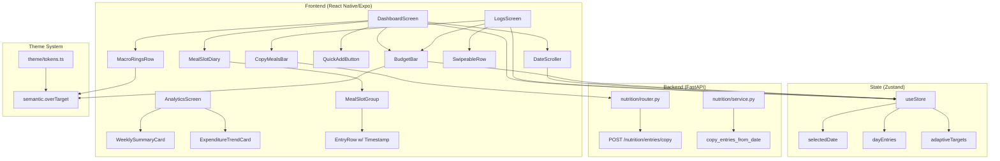

# Design Document: MacroFactor Parity

## Overview

This design covers 10 features that transform HypertrophyOS from a basic macro tracker into a competitive daily nutrition companion. The architecture follows the existing patterns: React Native/Expo frontend with Zustand state management, FastAPI/SQLAlchemy backend, and a design token system for theming.

The features are designed to be additive — they extend existing screens and components rather than replacing them. All features ship behind a `macrofactor_parity` feature flag and can be individually toggled.

### Design Principles

1. **Additive, not destructive** — New components slot into existing screens. No existing component is removed or fundamentally altered.
2. **Client-side first** — Most computations (meal slot grouping, budget calculation, weekly summary, TDEE estimation) happen client-side from data already fetched. Only the copy-meals feature requires a new backend endpoint.
3. **Adherence over accuracy** — The color system and UX choices prioritize keeping users logging over punishing them for imperfect days.

## Architecture



## Components and Interfaces

### New Frontend Components

#### 1. DateScroller (`app/components/dashboard/DateScroller.tsx`)

A horizontal scrollable week view that controls which date the dashboard displays.

```typescript
interface DateScrollerProps {
  selectedDate: string; // ISO date string "YYYY-MM-DD"
  onDateSelect: (date: string) => void;
  loggedDates: Set<string>; // dates with at least one entry
}

// Internal state: weekOffset (number) controlling which week is visible
// Renders 7 day cells per week, each showing:
//   - Abbreviated day name (Mon, Tue, ...)
//   - Day number (1-31)
//   - Dot indicator if date is in loggedDates
//   - Highlighted background if date === selectedDate
```

Gesture handling: `ScrollView` with `horizontal` and `pagingEnabled`. Each week is a full-width page. Swipe left/right navigates weeks. Tap on a day cell calls `onDateSelect`.

Debouncing: When `onDateSelect` fires, the parent debounces API calls with a 300ms delay to handle rapid tapping.

#### 2. BudgetBar (`app/components/nutrition/BudgetBar.tsx`)

Displays remaining calories and macros with a progress indicator.

```typescript
interface BudgetBarProps {
  consumed: { calories: number; protein_g: number; carbs_g: number; fat_g: number };
  targets: { calories: number; protein_g: number; carbs_g: number; fat_g: number };
}

// Computed values:
//   remaining.calories = targets.calories - consumed.calories
//   remaining.protein_g = targets.protein_g - consumed.protein_g
//   (same for carbs, fat)
//   progressRatio = clamp(consumed.calories / targets.calories, 0, 1)
//
// Color logic:
//   if remaining >= 0: use colors.text.primary for the number
//   if remaining < 0: use colors.semantic.overTarget (muted blue)
//
// If targets.calories === 0 or targets are null: render a "Set targets" prompt
```

#### 3. MealSlotDiary (`app/components/dashboard/MealSlotDiary.tsx`)

Groups nutrition entries by meal slot and renders expandable sections.

```typescript
type MealSlotName = 'Breakfast' | 'Lunch' | 'Snack' | 'Dinner';

interface MealSlotDiaryProps {
  entries: NutritionEntry[];
  onAddToSlot: (slotName: MealSlotName) => void;
}

// Pure function for slot assignment:
function assignMealSlot(mealName: string): MealSlotName {
  const lower = mealName.toLowerCase();
  if (lower.includes('breakfast')) return 'Breakfast';
  if (lower.includes('lunch')) return 'Lunch';
  if (lower.includes('dinner')) return 'Dinner';
  if (lower.includes('snack')) return 'Snack';
  return 'Snack'; // default
}

// Each MealSlotGroup renders:
//   - Header: slot name + calorie subtotal + macro subtotals
//   - Expandable body: list of EntryRow components
//   - Empty state: "+" button calling onAddToSlot(slotName)
```

#### 4. QuickAddModal (`app/components/modals/QuickAddModal.tsx`)

Minimal form for calorie-only entry.

```typescript
interface QuickAddModalProps {
  visible: boolean;
  onClose: () => void;
  onSuccess: () => void;
  targetDate: string; // ISO date string
}

// Form fields:
//   - calories: TextInput (numeric, required)
//   - protein_g: TextInput (numeric, optional, default 0)
//   - carbs_g: TextInput (numeric, optional, default 0)
//   - fat_g: TextInput (numeric, optional, default 0)
//
// Validation:
//   - calories must be > 0
//   - calories > 10000 triggers confirmation prompt
//
// On submit: POST to nutrition/entries with meal_name="Quick add"
```

#### 5. SwipeableRow (`app/components/common/SwipeableRow.tsx`)

A generic swipeable row component using `react-native-gesture-handler`.

```typescript
interface SwipeableRowProps {
  children: React.ReactNode;
  onDelete: () => void;
  deleteThreshold?: number; // default 0.3 (30% of row width)
}

// Uses PanGestureHandler or Swipeable from react-native-gesture-handler
// Swipe left reveals red delete button with trash icon
// Swipe < threshold snaps back
// Swipe >= threshold reveals button, tap triggers onDelete
// Slide-out animation on delete (Animated.timing, 200ms)
```

#### 6. CopyMealsBar (`app/components/nutrition/CopyMealsBar.tsx`)

Action bar with copy buttons for the food diary.

```typescript
interface CopyMealsBarProps {
  targetDate: string;
  onCopyComplete: () => void;
}

// Two buttons:
//   "Copy Yesterday" — calls POST /nutrition/entries/copy with source=yesterday
//   "Copy from Date" — opens DateTimePicker, then calls same endpoint
//
// Loading state while copy is in progress
// Success: calls onCopyComplete to refresh entries
// Error: shows Alert with error message
// Empty source: shows "No entries found for that date"
```

#### 7. WeeklySummaryCard (`app/components/analytics/WeeklySummaryCard.tsx`)

Displays 7-day nutrition aggregates.

```typescript
interface WeeklySummaryCardProps {
  entries: NutritionEntry[]; // all entries for the past 7 days
  targetCalories: number;
}

// Pure computation function (exported for testing):
function computeWeeklySummary(
  entries: NutritionEntry[],
  targetCalories: number
): WeeklySummary {
  // Group entries by date
  // For each date with entries, sum calories/protein/carbs/fat/water
  // Calculate averages from days WITH data only
  // Find best/worst adherence days (min/max abs(dayCalories - targetCalories))
  // Return { avgCalories, avgProtein, avgCarbs, avgFat, totalWater,
  //          bestDay, worstDay, daysLogged, totalDays: 7 }
}
```

#### 8. ExpenditureTrendCard (`app/components/analytics/ExpenditureTrendCard.tsx`)

Displays estimated TDEE trend.

```typescript
interface ExpenditureTrendCardProps {
  weightHistory: TrendPoint[]; // from bodyweight API
  caloriesByDate: Record<string, number>; // daily calorie totals
}

// Pure computation function (exported for testing):
function computeTDEEEstimate(
  weightHistory: TrendPoint[],
  caloriesByDate: Record<string, number>,
  windowDays: number = 28
): { tdee: number; dataPoints: TrendPoint[] } | null {
  // Filter to last windowDays
  // Need >= 14 days of both weight and calorie data
  // weight_change_kg = last EMA - first EMA (using same EMA logic as adaptive engine)
  // avg_daily_calories = sum(calories) / days_with_calorie_data
  // TDEE = avg_daily_calories + (weight_change_kg * 7700 / windowDays)
  // Return null if insufficient data
}
```

### Backend Changes

#### New Endpoint: Copy Entries

```python
# src/modules/nutrition/router.py — new endpoint

@router.post("/entries/copy", response_model=list[NutritionEntryResponse], status_code=201)
async def copy_entries(
    data: CopyEntriesRequest,
    user: User = Depends(get_current_user),
    service: NutritionService = Depends(_get_service),
) -> list[NutritionEntryResponse]:
    """Copy all entries from source_date to target_date."""
    entries = await service.copy_entries_from_date(
        user_id=user.id,
        source_date=data.source_date,
        target_date=data.target_date,
    )
    return [NutritionEntryResponse.model_validate(e) for e in entries]
```

```python
# src/modules/nutrition/schemas.py — new schema

class CopyEntriesRequest(BaseModel):
    source_date: date
    target_date: date
```

```python
# src/modules/nutrition/service.py — new method

async def copy_entries_from_date(
    self,
    user_id: uuid.UUID,
    source_date: date,
    target_date: date,
) -> list[NutritionEntry]:
    """Duplicate all non-deleted entries from source_date to target_date."""
    # Fetch source entries
    source_entries = await self.get_entries(
        user_id=user_id,
        filters=DateRangeFilter(start_date=source_date, end_date=source_date),
        pagination=PaginationParams(page=1, limit=100),
    )
    
    copied = []
    for entry in source_entries.items:
        new_entry = NutritionEntry(
            user_id=user_id,
            meal_name=entry.meal_name,
            calories=entry.calories,
            protein_g=entry.protein_g,
            carbs_g=entry.carbs_g,
            fat_g=entry.fat_g,
            micro_nutrients=entry.micro_nutrients,
            entry_date=target_date,
        )
        self.session.add(new_entry)
        copied.append(new_entry)
    
    await self.session.flush()
    return copied
```

### Zustand Store Extensions

```typescript
// app/store/index.ts — new state fields and actions

interface AppState {
  // ... existing fields ...
  
  // Date navigation
  selectedDate: string; // ISO date "YYYY-MM-DD", defaults to today
  
  // Adaptive targets (cached from last API fetch)
  adaptiveTargets: {
    calories: number;
    protein_g: number;
    carbs_g: number;
    fat_g: number;
  } | null;
}

interface AppActions {
  // ... existing actions ...
  
  setSelectedDate: (date: string) => void;
  setAdaptiveTargets: (targets: AppState['adaptiveTargets']) => void;
}
```

### Theme Token Changes

```typescript
// app/theme/tokens.ts — additions

colors: {
  // ... existing colors ...
  semantic: {
    // ... existing semantic colors ...
    overTarget: '#6B8FBF', // muted blue — adherence-neutral overflow
    overTargetSubtle: 'rgba(107, 143, 191, 0.15)', // background tint
  },
}
```

## Data Models

### Existing Models (No Changes)

The `NutritionEntry` model already has all fields needed:

```python
class NutritionEntry(Base):
    id: UUID
    user_id: UUID
    meal_name: str
    calories: float
    protein_g: float
    carbs_g: float
    fat_g: float
    micro_nutrients: dict | None  # includes water_ml, fibre_g
    entry_date: date
    created_at: datetime  # auto-set, used for timestamps feature
    deleted_at: datetime | None  # soft delete
```

### New Schema

```python
class CopyEntriesRequest(BaseModel):
    source_date: date
    target_date: date
    
    @model_validator(mode='after')
    def dates_must_differ(self) -> 'CopyEntriesRequest':
        if self.source_date == self.target_date:
            raise ValueError('source_date and target_date must be different')
        return self
```

### Client-Side Data Structures

```typescript
// Meal slot grouping
interface MealSlotData {
  name: MealSlotName;
  entries: NutritionEntry[];
  totals: { calories: number; protein_g: number; carbs_g: number; fat_g: number };
}

// Weekly summary
interface WeeklySummary {
  avgCalories: number;
  avgProtein: number;
  avgCarbs: number;
  avgFat: number;
  totalWaterMl: number;
  bestDay: { date: string; deviation: number } | null;
  worstDay: { date: string; deviation: number } | null;
  daysLogged: number;
}

// TDEE estimate
interface TDEEEstimate {
  tdee: number;
  windowDays: number;
  avgDailyCalories: number;
  weightChangeKg: number;
}
```


## API Contracts

### Existing Endpoints (No Changes, New Usage)

```
GET /nutrition/entries?start_date=YYYY-MM-DD&end_date=YYYY-MM-DD&limit=100
  → 200: { items: NutritionEntry[], total_count: number, page: number, limit: number }
  → Used by: DateScroller date switching, MealSlotDiary, BudgetBar, WeeklySummary

GET /adaptive/snapshots?limit=1
  → 200: { items: [{ target_calories, target_protein_g, target_carbs_g, target_fat_g }] }
  → Used by: BudgetBar targets, WeeklySummary adherence calculation

GET /user/bodyweight/history?limit=90
  → 200: { items: [{ recorded_date, weight_kg }] }
  → Used by: ExpenditureTrendCard

DELETE /nutrition/entries/{entry_id}
  → 204: No content
  → Used by: SwipeableRow delete action
```

### New Endpoint

```
POST /nutrition/entries/copy
  Request:  { source_date: "YYYY-MM-DD", target_date: "YYYY-MM-DD" }
  → 201: NutritionEntryResponse[]  (list of newly created entries)
  → 200: []                         (empty list if source has no entries)
  → 422: { detail: "source_date and target_date must be different" }
  → 401: Unauthorized
  → 500: Internal server error (transaction rolled back)
```

**Rate limiting:** Inherits existing per-user rate limit (60 req/min). Copy is a single request regardless of entry count — no N+1 concern.

**Idempotency:** NOT idempotent. Calling twice creates duplicate entries. This is acceptable because:
1. The UI disables the copy button during the request
2. Users can see and delete duplicates
3. Adding idempotency keys adds complexity without proportional value for this use case

## Data Flow

### Dashboard Load (with Date Scroller)

```
User opens app / taps date
  → DashboardScreen reads selectedDate from Zustand store
  → Promise.allSettled([
      GET /nutrition/entries?start_date={selectedDate}&end_date={selectedDate}
      GET /adaptive/snapshots?limit=1
      GET /training/sessions?start_date={selectedDate}&end_date={selectedDate}
      GET /content/articles?limit=5
    ])
  → On nutrition response:
      entries → assignMealSlot() for each → group into MealSlotData[]
      entries → sum totals → consumed values for BudgetBar
      entries → extract unique entry_dates → loggedDates for DateScroller dots
  → On adaptive response:
      snapshot → targets for BudgetBar and MacroRingsRow
  → Zustand store updated → all child components re-render
```

**Debounce on date switch:** When `onDateSelect` fires from DateScroller, a 300ms debounce timer starts. If another date is selected within 300ms, the previous fetch is cancelled (AbortController). Only the last selected date triggers an API call.

### Copy Meals Flow

```
User taps "Copy Yesterday"
  → CopyMealsBar computes source_date = selectedDate - 1 day
  → POST /nutrition/entries/copy { source_date, target_date: selectedDate }
  → Backend:
      1. SELECT * FROM nutrition_entries WHERE user_id=X AND entry_date=source AND deleted_at IS NULL
      2. For each entry: INSERT new row with new UUID, target_date, same macros
      3. COMMIT transaction (all-or-nothing)
  → Frontend receives new entries
  → Calls onCopyComplete → parent refetches entries for selectedDate
  → MealSlotDiary, BudgetBar, MacroRings all update
```

### Quick Add Flow

```
User taps ⚡ Quick Add button
  → QuickAddModal opens with targetDate from Zustand store
  → User types calories (required), optionally protein/carbs/fat
  → Validation: calories > 0, calories <= 10000 (or confirm)
  → POST /nutrition/entries {
      entry_date: targetDate,
      meal_name: "Quick add",
      calories: N,
      protein_g: 0,  // or user value
      carbs_g: 0,    // or user value
      fat_g: 0       // or user value
    }
  → onSuccess callback → parent refetches → all components update
```

## Scalability Considerations

### What breaks at 10x users (10K → 100K DAU)

**Bottleneck:** `GET /nutrition/entries` is called on every date switch. At 100K DAU with ~5 date switches per session, that's 500K reads/day on the nutrition_entries table.

**Mitigation:** Already handled — the query is indexed on `(user_id, entry_date)` and returns at most ~20 entries per day per user. This is a simple index scan, not a table scan.

### What breaks at 100x users (10K → 1M DAU)

**Bottleneck:** The copy endpoint does N inserts in a single transaction. If a user has 30 entries/day and copies, that's 30 INSERTs. At scale, this could cause write contention.

**Mitigation:** 
1. Cap source entries at 100 (already in pagination limit)
2. The copy endpoint is used infrequently (once per day at most)
3. If needed: batch inserts using `session.add_all()` + single flush (already implemented)

**Client-side computation is the key scaling decision.** Meal slot grouping, budget calculation, weekly summary, and TDEE estimation all happen on the client. The backend serves raw entries — no new aggregation queries.

### What we'd add in v2 if scale demands it

- Server-side daily aggregation table (pre-computed daily totals per user)
- Redis cache for adaptive targets (currently fetched from DB on every dashboard load)
- CDN for the date scroller's logged-dates lookup (batch query for a week's worth of dates)

## Tech Decisions

| Decision | Choice | Reasoning |
|----------|--------|-----------|
| Swipe gesture library | `react-native-gesture-handler` Swipeable | Already in the dependency tree (Expo includes it). Native-driven gestures, no JS thread blocking. |
| Date scroller implementation | `FlatList` with `horizontal` + `getItemLayout` | Better performance than ScrollView for potentially many weeks. `getItemLayout` enables instant scroll-to-today. |
| TDEE computation location | Client-side (TypeScript) | Avoids new backend endpoint. Data is already fetched for analytics. Computation is O(n) where n ≤ 90 data points. |
| Weekly summary computation | Client-side (TypeScript) | Same reasoning as TDEE. Entries for 7 days are already in memory from the analytics fetch. |
| Copy endpoint transaction | Single DB transaction | All-or-nothing semantics. Partial copies would confuse users. 30 inserts in one transaction is trivial for PostgreSQL. |
| Adherence color token | `#6B8FBF` (muted steel blue) | Tested against WCAG AA contrast on dark background (`colors.bg.base`). Visually distinct from green (positive) and red (negative). Neutral emotional valence. |
| Feature flag granularity | Single flag for all 10 features | Simplicity. These features are designed as a cohesive set. Individual flags would create 1024 possible states to test. |
| State management for selectedDate | Zustand store (not component state) | Multiple components need the selected date (DateScroller, MealSlotDiary, BudgetBar, QuickAddModal). Zustand avoids prop drilling. |

## Correctness Properties

*A property is a characteristic or behavior that should hold true across all valid executions of a system — essentially, a formal statement about what the system should do. Properties serve as the bridge between human-readable specifications and machine-verifiable correctness guarantees.*

### Property 1: Meal slot assignment is total and deterministic

*For any* string `mealName`, calling `assignMealSlot(mealName)` SHALL return exactly one of `'Breakfast'`, `'Lunch'`, `'Snack'`, or `'Dinner'`. Specifically: if the lowercase `mealName` contains "breakfast" the result is `'Breakfast'`; if it contains "lunch" the result is `'Lunch'`; if it contains "dinner" the result is `'Dinner'`; otherwise the result is `'Snack'`.

**Validates: Requirements 1.1, 1.5**

### Property 2: Slot grouping preserves calorie and macro totals

*For any* list of `NutritionEntry` objects, grouping them into meal slots and summing each slot's calories, protein_g, carbs_g, and fat_g SHALL produce slot subtotals whose sum equals the sum of all entries' respective values. No calories or macros are created or lost during grouping.

**Validates: Requirements 1.2, 1.6**

### Property 3: Budget remaining equals target minus consumed

*For any* target values `{calories, protein_g, carbs_g, fat_g}` and consumed values `{calories, protein_g, carbs_g, fat_g}`, the budget computation SHALL return remaining values where each `remaining.X = target.X - consumed.X` for all four macro fields.

**Validates: Requirements 3.1, 3.2**

### Property 4: Over-target color selection

*For any* numeric `value` and `target` where `target > 0`: if `value > target`, the color selection function SHALL return `colors.semantic.overTarget`; if `value <= target`, the color selection function SHALL return the standard color (not `overTarget`). This applies to both ProgressRing overflow and BudgetBar negative remaining.

**Validates: Requirements 3.4, 10.1, 10.2, 10.4**

### Property 5: Progress ratio is clamped to [0, 1]

*For any* `consumed` (≥ 0) and `target` (> 0), the progress ratio `consumed / target` SHALL be clamped to the range [0, 1]. Values below 0 map to 0, values above 1 map to 1.

**Validates: Requirements 3.5**

### Property 6: Week generation produces 7 consecutive days starting from Monday

*For any* date, computing the week that contains that date SHALL produce exactly 7 dates starting from the Monday of that week through Sunday, in ascending order, where each consecutive date is exactly 1 day after the previous.

**Validates: Requirements 4.1, 4.5**

### Property 7: Logged dates indicator matches entry dates

*For any* list of `NutritionEntry` objects, the set of dates with dot indicators SHALL equal the set of unique `entry_date` values from those entries.

**Validates: Requirements 4.4**

### Property 8: Quick add creates entry with correct defaults

*For any* positive calorie value `c` and target date `d`, submitting a quick add with calories=`c` SHALL create a NutritionEntry where `calories == c`, `protein_g == 0`, `carbs_g == 0`, `fat_g == 0`, `meal_name == "Quick add"`, and `entry_date == d`.

**Validates: Requirements 2.2, 2.3**

### Property 9: Quick add rejects non-positive calories

*For any* numeric value `c` where `c <= 0`, the quick add validation function SHALL return an error and no NutritionEntry SHALL be created.

**Validates: Requirements 2.4**

### Property 10: Timestamp formatting produces valid time strings

*For any* valid `Date` object, the timestamp formatting function SHALL produce a non-empty string matching the pattern of a localized short time (containing hour and minute components).

**Validates: Requirements 5.1**

### Property 11: Entries within a meal slot are sorted chronologically

*For any* list of `NutritionEntry` objects within the same meal slot, after sorting by `created_at`, each entry's `created_at` SHALL be less than or equal to the next entry's `created_at`.

**Validates: Requirements 5.2**

### Property 12: Copied entries preserve nutritional data with new identity

*For any* list of source `NutritionEntry` objects and a target date, the copy operation SHALL produce entries where: (a) each copied entry has a unique ID different from the source, (b) each copied entry has `entry_date` equal to the target date, (c) each copied entry has identical `meal_name`, `calories`, `protein_g`, `carbs_g`, `fat_g`, and `micro_nutrients` to its source, and (d) the number of copied entries equals the number of source entries.

**Validates: Requirements 6.1, 6.3**

### Property 13: Weekly summary averages are computed from logged days only

*For any* set of `NutritionEntry` objects spanning up to 7 days, the weekly summary SHALL compute `avgCalories` as the sum of daily calorie totals divided by the number of days that have at least one entry (not divided by 7). The `daysLogged` count SHALL equal the number of unique `entry_date` values, and `totalWaterMl` SHALL equal the sum of all `water_ml` values from `micro_nutrients`.

**Validates: Requirements 8.1, 8.3, 8.5**

### Property 14: Best and worst adherence days are correctly identified

*For any* set of daily calorie totals and a target calorie value, the best adherence day SHALL have the minimum absolute deviation `|dayCalories - target|` among all logged days, and the worst adherence day SHALL have the maximum absolute deviation.

**Validates: Requirements 8.2**

### Property 15: TDEE estimation follows the specified formula

*For any* weight history (≥ 14 points) and daily calorie map (≥ 14 days), the TDEE estimate SHALL equal `avgDailyCalories + (weightChangeKg * 7700 / windowDays)`, where `weightChangeKg` is derived from the EMA of the weight history over the window, and `avgDailyCalories` is the mean of daily calorie totals within the window.

**Validates: Requirements 9.1, 9.2, 9.4**

## Error Handling

### Frontend Error Handling

| Scenario | Behavior |
|----------|----------|
| Dashboard data fetch fails | Fall back to existing "X meals logged" summary; hide meal slots, budget bar |
| Quick add submission fails | Show Alert with "Failed to log entry. Try again." |
| Copy entries fails | Show Alert with error message; re-enable copy buttons |
| Date scroller API call fails | Show stale data for previous date; show subtle error indicator |
| Null adaptive targets | Budget bar shows "Set targets" prompt instead of numbers |
| Null created_at on entry | Hide timestamp for that entry; other entries unaffected |
| Empty source date for copy | Show "No entries found for that date" message |

### Backend Error Handling

| Scenario | Behavior |
|----------|----------|
| Copy entries with same source/target date | Return 422 validation error |
| Copy entries with no source entries | Return empty list (200 OK) |
| Copy entries exceeds 100 items | Paginate source query; copy all pages |
| Database error during copy | Transaction rollback; return 500 |

### Graceful Degradation

All new features are behind the `macrofactor_parity` feature flag. When disabled:
- Dashboard renders the existing `TodaySummaryRow` instead of meal slots
- No date scroller, budget bar, or quick add button
- Logs screen uses existing delete flow (long-press + Alert)
- Analytics screen shows existing charts without weekly summary or TDEE

## Testing Strategy

### Property-Based Testing

All 15 correctness properties will be implemented as property-based tests using `fast-check` (TypeScript frontend) and `hypothesis` (Python backend).

Each property test runs a minimum of 100 iterations with randomized inputs.

**Frontend (fast-check):**
- Properties 1-7, 10-11, 13-14: Pure TypeScript utility functions tested with `fast-check`
- Tag format: `Feature: macrofactor-parity, Property N: <title>`

**Backend (hypothesis):**
- Properties 8-9, 12, 15: Python service/computation functions tested with `hypothesis`
- Tag format: `Feature: macrofactor-parity, Property N: <title>`

### Unit Testing

Unit tests complement property tests for specific examples and edge cases:

- **Edge cases:** Null targets, empty entry lists, entries with null created_at, calorie values at boundaries (0, 10000, negative)
- **Integration points:** DateScroller ↔ Dashboard data loading, BudgetBar ↔ Zustand store reactivity
- **Component rendering:** Empty states for each new component, loading states, error states
- **Backend:** Copy endpoint with 0 entries, copy with same source/target date validation

### Test File Organization

```
app/__tests__/utils/mealSlotLogic.test.ts      — Properties 1, 2, 11
app/__tests__/utils/budgetComputation.test.ts   — Properties 3, 4, 5
app/__tests__/utils/dateScrollerLogic.test.ts   — Properties 6, 7
app/__tests__/utils/quickAddValidation.test.ts  — Properties 8, 9
app/__tests__/utils/timestampFormat.test.ts     — Property 10
app/__tests__/utils/weeklySummary.test.ts       — Properties 13, 14
tests/test_macrofactor_parity_properties.py     — Properties 12, 15
```
