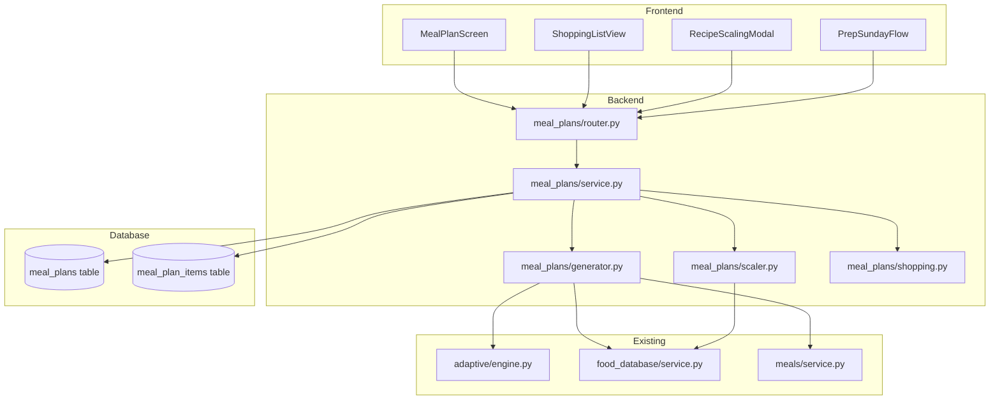

# Design Document: Meal Prep Assistant

## Overview

The Meal Prep Assistant adds weekly meal plan generation, shopping list consolidation, recipe scaling, and a guided "Prep Sunday" flow to Hypertrophy OS. It integrates with the existing adaptive TDEE engine for macro targets, the food database (USDA + Open Food Facts) for ingredient data, and the recipe builder for recipe structures.

The backend introduces a new `meal_plans` module with pure computation functions for plan generation, recipe scaling, and shopping list aggregation. New `meal_plans` and `meal_plan_items` DB tables store saved plans. The frontend adds a `MealPlanScreen`, `ShoppingListView`, recipe scaling modal, and the Prep Sunday multi-step flow.

## Architecture



### Dependency Chain

The build order is dictated by data flow. Each layer depends only on layers below it:

```
Layer 0: Database migration (meal_plans, meal_plan_items tables)
Layer 1: SQLAlchemy models (models.py) — depends on Layer 0
Layer 2: Pydantic schemas (schemas.py) — depends on Layer 1 for field alignment
Layer 3: Pure computation modules (scaler.py, shopping.py, generator.py) — zero DB deps
Layer 4: Service layer (service.py) — depends on Layers 1-3 + existing services
Layer 5: Router (router.py) — depends on Layer 4
Layer 6: Frontend screens — depend on Layer 5 API contracts
```

No circular dependencies. Layer 3 modules are pure functions with no imports from Layers 4-6.

## Components and Interfaces

### Backend Components

#### 1. `meal_plans/scaler.py` — Pure Recipe Scaling (Layer 3, no deps)

Pure functions. No DB access. No side effects. Built first because generator.py depends on it.

```python
@dataclass(frozen=True)
class IngredientInput:
    food_item_id: uuid.UUID
    name: str
    quantity: float
    unit: str

@dataclass(frozen=True)
class ScaledIngredient:
    food_item_id: uuid.UUID
    name: str
    original_quantity: float
    scaled_quantity: float
    unit: str

@dataclass(frozen=True)
class ScaledRecipe:
    original_recipe_id: uuid.UUID
    scale_factor: float
    ingredients: list[ScaledIngredient]
    calories: float
    protein_g: float
    carbs_g: float
    fat_g: float

def compute_scale_factor(original_value: float, target_value: float) -> float:
    """Raises ValueError if original is zero or negative."""
    ...

def scale_recipe(
    recipe_id: uuid.UUID,
    recipe_calories: float,
    recipe_protein_g: float,
    recipe_carbs_g: float,
    recipe_fat_g: float,
    ingredients: list[IngredientInput],
    target_value: float,
    target_macro: str = "calories",
) -> ScaledRecipe:
    """Scale all ingredients and macros by target/original ratio.
    Returns new ScaledRecipe; inputs not mutated."""
    ...
```

#### 2. `meal_plans/shopping.py` — Pure Shopping List Computation (Layer 3, no deps)

```python
VALID_CATEGORIES = {"produce", "protein", "dairy", "grains", "pantry", "other"}

UNIT_CONVERSIONS: dict[tuple[str, str], float] = {
    ("ml", "l"): 0.001, ("l", "ml"): 1000.0,
    ("g", "kg"): 0.001, ("kg", "g"): 1000.0,
    ("tsp", "tbsp"): 1/3, ("tbsp", "tsp"): 3.0,
}

CATEGORY_MAP: dict[str, str] = {
    "vegetables": "produce", "fruits": "produce", "leafy greens": "produce",
    "chicken": "protein", "beef": "protein", "fish": "protein",
    "eggs": "protein", "tofu": "protein", "paneer": "protein",
    "milk": "dairy", "cheese": "dairy", "yogurt": "dairy", "curd": "dairy",
    "rice": "grains", "bread": "grains", "pasta": "grains",
    "oats": "grains", "wheat": "grains", "roti": "grains",
}

@dataclass(frozen=True)
class IngredientEntry:
    name: str
    quantity: float
    unit: str
    food_category: str

@dataclass(frozen=True)
class ShoppingItem:
    name: str
    quantity: float
    unit: str
    category: str  # one of VALID_CATEGORIES

@dataclass(frozen=True)
class ShoppingList:
    items: list[ShoppingItem]

def resolve_category(food_category: str) -> str:
    """Map food item category to shopping list category."""
    ...

def normalize_unit(quantity: float, unit: str, target_unit: str) -> float | None:
    """Convert quantity to target_unit. Returns None if no conversion exists."""
    ...

def consolidate_ingredients(all_ingredients: list[IngredientEntry]) -> ShoppingList:
    """Aggregate ingredients, combine duplicates by name+unit, group by category.
    Falls back to separate items when unit conversion is unknown."""
    ...
```

#### 3. `meal_plans/generator.py` — Pure Plan Generation (Layer 3, depends on scaler dataclasses)

```python
@dataclass(frozen=True)
class MacroSummary:
    calories: float
    protein_g: float
    carbs_g: float
    fat_g: float

@dataclass(frozen=True)
class MealSlotTarget:
    slot: str
    calories: float
    protein_g: float
    carbs_g: float
    fat_g: float

@dataclass(frozen=True)
class FoodCandidate:
    food_item_id: uuid.UUID
    name: str
    calories: float
    protein_g: float
    carbs_g: float
    fat_g: float
    is_recipe: bool
    source_priority: int  # 0=favorite, 1=recent, 2=database

@dataclass(frozen=True)
class MealAssignment:
    slot: str
    food_item_id: uuid.UUID
    name: str
    calories: float
    protein_g: float
    carbs_g: float
    fat_g: float
    scale_factor: float
    is_recipe: bool

@dataclass(frozen=True)
class DayPlan:
    day_index: int
    assignments: list[MealAssignment]
    unfilled_slots: list[str]

@dataclass(frozen=True)
class GeneratedPlan:
    days: list[DayPlan]
    daily_macro_summaries: list[MacroSummary]
    weekly_macro_summary: MacroSummary

DEFAULT_SLOT_SPLITS: dict[str, float] = {
    "breakfast": 0.25, "lunch": 0.30, "dinner": 0.35, "snack": 0.10,
}

def distribute_macros(
    daily_targets: MacroSummary,
    slot_splits: dict[str, float] = DEFAULT_SLOT_SPLITS,
) -> list[MealSlotTarget]:
    """Split daily targets across slots. Raises ValueError if splits don't sum to ~1.0."""
    ...

def compute_day_summary(assignments: list[MealAssignment]) -> MacroSummary:
    """Sum macros across all assignments for a day."""
    ...

def compute_weekly_summary(day_summaries: list[MacroSummary]) -> MacroSummary:
    """Sum macros across all days."""
    ...

def generate_plan(
    daily_targets: MacroSummary,
    candidates: list[FoodCandidate],
    slot_splits: dict[str, float] = DEFAULT_SLOT_SPLITS,
    num_days: int = 5,
    tolerance: float = 0.05,
) -> GeneratedPlan:
    """Greedy assignment: for each slot, pick closest candidate by priority.
    Scale if needed. Mark unfilled if no candidate works."""
    ...
```

#### 4. `meal_plans/models.py` — SQLAlchemy Models (Layer 1)

```python
class MealPlan(SoftDeleteMixin, Base):
    __tablename__ = "meal_plans"
    user_id: Mapped[uuid.UUID]  # FK to users
    name: Mapped[str]  # String(255)
    start_date: Mapped[date]
    num_days: Mapped[int]  # default 5
    slot_splits: Mapped[dict]  # JSONB
    weekly_calories: Mapped[float]
    weekly_protein_g: Mapped[float]
    weekly_carbs_g: Mapped[float]
    weekly_fat_g: Mapped[float]
    items: Mapped[list["MealPlanItem"]]  # relationship, selectin

class MealPlanItem(Base):
    __tablename__ = "meal_plan_items"
    plan_id: Mapped[uuid.UUID]  # FK to meal_plans, CASCADE
    day_index: Mapped[int]
    slot: Mapped[str]  # String(20)
    food_item_id: Mapped[uuid.UUID]  # FK to food_items, CASCADE
    scale_factor: Mapped[float]  # default 1.0
    calories: Mapped[float]
    protein_g: Mapped[float]
    carbs_g: Mapped[float]
    fat_g: Mapped[float]
    plan: Mapped["MealPlan"]  # relationship back_populates
```

#### 5. `meal_plans/schemas.py` — Pydantic Schemas (Layer 2)

Key schemas following existing `meals/schemas.py` pattern:
- `GeneratePlanRequest`: `slot_splits` (optional), `num_days` (optional, default 5)
- `SavePlanRequest`: `name`, `plan` payload
- `DuplicatePlanRequest`: `new_start_date`
- `ScaleRecipeRequest`: `recipe_id`, `target_value` (gt=0), `target_macro` (enum)
- `MealPlanResponse`, `MealPlanItemResponse`, `ShoppingListResponse`, `ScaledRecipeResponse`

#### 6. `meal_plans/service.py` — Orchestration + Persistence (Layer 4)

```python
class MealPlanService:
    def __init__(self, db: AsyncSession) -> None:
        self.db = db

    async def generate_plan(self, user_id, slot_splits=None, num_days=5) -> GeneratedPlan:
        """Fetch latest adaptive snapshot → targets. Fetch candidates (favorites priority 0,
        recent priority 1, food DB priority 2). Call generator.generate_plan().
        Raises NotFoundError if no adaptive snapshot."""
        ...

    async def save_plan(self, user_id, plan: GeneratedPlan, name: str) -> MealPlan:
        """Persist GeneratedPlan → MealPlan + MealPlanItem rows."""
        ...

    async def get_plan(self, user_id, plan_id) -> MealPlan:
        """Load saved plan with items. Raises NotFoundError."""
        ...

    async def list_plans(self, user_id, pagination) -> PaginatedResult:
        """List plans ordered by created_at DESC."""
        ...

    async def duplicate_plan(self, user_id, plan_id, new_start_date) -> MealPlan:
        """Clone plan with new dates, same items."""
        ...

    async def delete_plan(self, user_id, plan_id) -> None:
        """Soft-delete via SoftDeleteMixin."""
        ...

    async def scale_recipe(self, recipe_id, target_value, target_macro) -> ScaledRecipe:
        """Load recipe from food_database, call scaler.scale_recipe()."""
        ...

    async def get_shopping_list(self, user_id, plan_id) -> ShoppingList:
        """Load plan items → resolve ingredients → consolidate_ingredients()."""
        ...
```

#### 7. `meal_plans/router.py` — API Endpoints (Layer 5)

| Method | Path | Description | Auth |
|--------|------|-------------|------|
| POST | `/api/meal-plans/generate` | Generate a new meal plan | Required |
| POST | `/api/meal-plans/save` | Save a generated plan | Required |
| GET | `/api/meal-plans` | List saved plans (paginated) | Required |
| GET | `/api/meal-plans/{plan_id}` | Get a saved plan with items | Required |
| POST | `/api/meal-plans/{plan_id}/duplicate` | Duplicate a plan | Required |
| DELETE | `/api/meal-plans/{plan_id}` | Soft-delete a plan | Required |
| POST | `/api/meal-plans/scale-recipe` | Scale a recipe to target | Required |
| GET | `/api/meal-plans/{plan_id}/shopping-list` | Get consolidated shopping list | Required |

All endpoints use existing `authorize` middleware.

### Frontend Components

#### 1. `MealPlanScreen.tsx`
Day-by-day card layout. Each day card shows meal slots with assigned items and macro summaries. Actions: generate, save, view shopping list.

#### 2. `ShoppingListView.tsx`
Categorized, collapsible sections. Items show name, quantity, unit. Local checkbox state for purchased items.

#### 3. `RecipeScalingModal.tsx`
Modal with target input. Real-time preview via local `mealPrepLogic.ts` computation. Confirm calls API.

#### 4. `PrepSundayFlow.tsx`
5-step flow: select days → configure slots → auto-fill/swap → macro review → confirm+save.

#### 5. `mealPrepLogic.ts` — Frontend utility
Pure TypeScript functions mirroring backend logic for real-time UI:
- `computeScaleFactor(original, target)`
- `scaleIngredients(ingredients, factor)`
- `computeDaySummary(assignments)`
- `computeWeeklySummary(daySummaries)`

## Data Models

### Database Schema

```sql
CREATE TABLE meal_plans (
    id UUID PRIMARY KEY DEFAULT gen_random_uuid(),
    user_id UUID NOT NULL REFERENCES users(id) ON DELETE CASCADE,
    name VARCHAR(255) NOT NULL,
    start_date DATE NOT NULL,
    num_days INTEGER NOT NULL DEFAULT 5,
    slot_splits JSONB NOT NULL DEFAULT '{"breakfast":0.25,"lunch":0.30,"dinner":0.35,"snack":0.10}',
    weekly_calories FLOAT NOT NULL,
    weekly_protein_g FLOAT NOT NULL,
    weekly_carbs_g FLOAT NOT NULL,
    weekly_fat_g FLOAT NOT NULL,
    deleted_at TIMESTAMPTZ,
    created_at TIMESTAMPTZ NOT NULL DEFAULT now(),
    updated_at TIMESTAMPTZ NOT NULL DEFAULT now()
);
CREATE INDEX ix_meal_plans_user_id ON meal_plans(user_id);

CREATE TABLE meal_plan_items (
    id UUID PRIMARY KEY DEFAULT gen_random_uuid(),
    plan_id UUID NOT NULL REFERENCES meal_plans(id) ON DELETE CASCADE,
    day_index INTEGER NOT NULL,
    slot VARCHAR(20) NOT NULL,
    food_item_id UUID NOT NULL REFERENCES food_items(id) ON DELETE CASCADE,
    scale_factor FLOAT NOT NULL DEFAULT 1.0,
    calories FLOAT NOT NULL,
    protein_g FLOAT NOT NULL,
    carbs_g FLOAT NOT NULL,
    fat_g FLOAT NOT NULL,
    created_at TIMESTAMPTZ NOT NULL DEFAULT now(),
    updated_at TIMESTAMPTZ NOT NULL DEFAULT now()
);
CREATE INDEX ix_meal_plan_items_plan_id ON meal_plan_items(plan_id);
```

### Key Data Flows

1. **Plan Generation**: Adaptive engine → daily targets → `distribute_macros()` → slot targets → `generate_plan()` with candidates → `GeneratedPlan`
2. **Recipe Scaling**: Recipe from food DB → `compute_scale_factor()` → `scale_recipe()` → `ScaledRecipe`
3. **Shopping List**: Saved plan items → resolve ingredients per food item → `consolidate_ingredients()` → `ShoppingList`
4. **Persistence**: `GeneratedPlan` → `MealPlan` + `MealPlanItem` rows → JSON serialization for API

## Correctness Properties

*A property is a characteristic or behavior that should hold true across all valid executions of a system — essentially, a formal statement about what the system should do. Properties serve as the bridge between human-readable specifications and machine-verifiable correctness guarantees.*

### Property 1: Macro distribution conservation

*For any* valid daily macro targets and *for any* slot split percentages that sum to 1.0, the sum of all slot targets produced by `distribute_macros()` shall equal the original daily targets (within floating-point tolerance of 0.01).

**Validates: Requirements 1.2**

### Property 2: Daily macro summary equals sum of assignments

*For any* day plan with one or more meal assignments (including scaled items), the daily macro summary (calories, protein, carbs, fat) shall equal the sum of the individual assignment macros.

**Validates: Requirements 1.6, 6.1, 6.2**

### Property 3: Weekly macro summary equals sum of daily summaries

*For any* generated plan with one or more days, the weekly macro summary shall equal the sum of all daily macro summaries.

**Validates: Requirements 6.3**

### Property 4: Generated plan tolerance invariant

*For any* generated plan where all slots are filled, each day's total macros shall be within 5% of the daily macro targets for each macro (calories, protein, carbs, fat).

**Validates: Requirements 1.4**

### Property 5: Scaling factor computation

*For any* recipe with a non-zero value for the target macro (calories, protein_g, carbs_g, or fat_g) and *for any* positive target value, the computed scaling factor shall equal `target_value / original_value`.

**Validates: Requirements 3.1, 3.4**

### Property 6: Scaling proportionality

*For any* recipe and *for any* positive scaling factor, all scaled ingredient quantities shall equal `original_quantity * scale_factor`, and all scaled macro values shall equal `original_macro * scale_factor`.

**Validates: Requirements 3.2, 3.3**

### Property 7: Scaling immutability

*For any* recipe scaling operation, the original recipe input data (ingredient quantities and macro values) shall remain unchanged after the scaling function returns.

**Validates: Requirements 3.6**

### Property 8: Ingredient consolidation preserves totals

*For any* list of ingredients, after consolidation the total quantity for each unique ingredient name (in a common unit) shall equal the sum of all individual quantities for that name (converted to the same unit) in the original list.

**Validates: Requirements 2.1, 2.2**

### Property 9: Shopping list structural invariants

*For any* shopping list produced by the Shopping_List_Engine, every item shall have a non-empty name, a quantity greater than zero, a non-empty unit, and a valid category from {produce, protein, dairy, grains, pantry, other}.

**Validates: Requirements 2.3, 2.5**

### Property 10: Auto-fill priority ordering

*For any* candidate pool containing items from favorites, recent meals, and food database sources, the auto-fill algorithm shall select favorites before recent meals, and recent meals before food database items, when multiple candidates are equally suitable for a slot.

**Validates: Requirements 4.6**

### Property 11: Plan history ordering

*For any* user with two or more saved meal plans, the list returned by plan history shall be sorted by creation date in descending order.

**Validates: Requirements 5.2**

### Property 12: Plan duplication preserves assignments

*For any* saved meal plan, duplicating it shall produce a new plan with a different ID and date range but identical meal slot assignments (same food items, same scale factors, same macros per slot).

**Validates: Requirements 5.4**

### Property 13: Meal plan serialization round-trip

*For any* valid MealPlan object, serializing it to JSON and then deserializing the JSON back shall produce an equivalent MealPlan object.

**Validates: Requirements 5.1, 5.3, 7.1, 7.2, 7.3**

## Error Handling

| Scenario | Behavior |
|----------|----------|
| No adaptive snapshot for user | 400: "No macro targets available. Complete an adaptive snapshot first." |
| Empty candidate pool | Generator marks all slots unfilled with reason "No candidates available" |
| Recipe has zero calories/target macro | `compute_scale_factor` raises `ValueError`; API returns 400 |
| Negative or zero target value | Schema validation rejects (Pydantic `Field(gt=0)`) |
| Slot splits don't sum to ~1.0 | `distribute_macros` raises `ValueError`; API returns 400 |
| Plan not found / not owned by user | 404 via `NotFoundError` (existing pattern) |
| DB constraint violation on save | Transaction rollback, 500 |
| Unit conversion not supported | Shopping list keeps items separate (no combine) |

## Testing Strategy

### Property-Based Testing

Library: **Hypothesis** (Python) for backend, **fast-check** (TypeScript) for frontend logic.

Minimum 100 iterations per property test. Each test tagged:
`Feature: meal-prep-assistant, Property {N}: {title}`

Property test files:
- `tests/test_meal_plan_generator_properties.py` — Properties 1, 2, 3, 4
- `tests/test_recipe_scaler_properties.py` — Properties 5, 6, 7
- `tests/test_shopping_list_properties.py` — Properties 8, 9
- `tests/test_meal_plan_service_properties.py` — Properties 10, 11, 12, 13

### Unit Testing

Unit tests complement property tests for:
- Specific examples with known inputs/outputs (e.g., scale 400 cal recipe to 500 cal → factor 1.25)
- Edge cases: empty candidate pool, zero-calorie recipe, single-day plan, single ingredient
- Error conditions: missing adaptive snapshot, invalid slot splits, zero-value scaling
- Integration: service layer calling generator + adaptive engine + food database

### Test Organization

```
tests/
  test_meal_plan_generator_properties.py
  test_recipe_scaler_properties.py
  test_shopping_list_properties.py
  test_meal_plan_service_properties.py
app/__tests__/
  utils/mealPrepLogic.test.ts
```

## Risks and Mitigations

| Risk | Impact | Mitigation |
|------|--------|------------|
| Adaptive snapshot missing for new users | Plan generation fails | Check before generation; clear 400 error with guidance |
| Food database insufficient variety | Plans repeat same items daily | Generator avoids same candidate in same slot on consecutive days |
| Unit conversion gaps | Items not consolidated | Graceful fallback: keep separate items |
| Large candidate pools slow generation | Slow API response | Limit pool to top 100 by priority; log response times |
| Floating-point drift in macro summation | Tolerance check fails | `round()` to 2 decimal places on all macro computations |
| Alembic migration conflicts | Migration fails on merge | Descriptive revision IDs; coordinate in CI |

## Rollback Plan

Each layer rolls back independently:
- **Migration**: `alembic downgrade -1` drops new tables. No existing tables modified.
- **Backend module**: Remove `meal_plans/` and router registration in `main.py`. No existing modules modified.
- **Frontend**: Remove new screen files and navigation entries. No existing screens modified.
- **Feature flag** (optional): Gate meal plan tab behind feature flag for gradual rollout.

## Monitoring (Post-Launch)

| Metric | Alert Threshold | Source |
|--------|----------------|--------|
| `/api/meal-plans/generate` p99 latency | > 3s | API middleware timing |
| `/api/meal-plans/generate` error rate | > 5% | Error logging |
| Unfilled slot rate | > 30% of slots | Application logging |
| Shopping list computation errors | Any 500 | Error logging |
| `meal_plans` table row growth | > 10k/day anomaly | DB monitoring |
