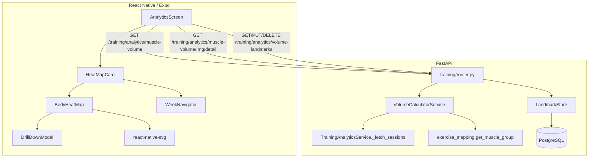

# Design Document: Muscle Group Volume Tracker and Heat Map

## Overview

This feature adds weekly muscle group volume tracking with evidence-based landmark comparisons and an interactive SVG body diagram heat map to the Hypertrophy OS analytics suite. The backend extends the existing `TrainingAnalyticsService` with volume computation, landmark storage, and new API endpoints. The frontend introduces an SVG-based `BodyHeatMap` component using `react-native-svg` (already in dependencies) and a drill-down modal, integrated into the existing `AnalyticsScreen`.

### Key Design Decisions

1. **RIR-adjusted effort tiers** (not continuous formula): Three discrete tiers (1.0, 0.75, 0.5) based on RPE thresholds keep the model simple, explainable, and testable while still differentiating junk volume from productive sets.
2. **Landmarks stored as user-level overrides**: Default landmarks are defined in code as a constant dict. User customizations are stored in a new `volume_landmarks` DB table and merged at query time. This avoids seeding defaults into the DB for every user.
3. **Single endpoint for weekly summary + separate detail endpoint**: The summary endpoint returns all muscle groups for the heat map in one call. The detail endpoint returns per-exercise breakdown for drill-down, avoiding over-fetching.
4. **SVG paths defined as static data**: Body diagram muscle regions are defined as SVG path data in a TypeScript constant file, not fetched from the server. This keeps rendering fast and offline-capable.

## Architecture



## Components and Interfaces

### Backend Components

#### 1. VolumeCalculatorService (`src/modules/training/volume_service.py`)

Core computation engine. Extends the analytics module.

```python
class VolumeCalculatorService:
    def __init__(self, session: AsyncSession) -> None: ...

    async def get_weekly_muscle_volume(
        self, user_id: UUID, week_start: date
    ) -> list[MuscleGroupVolume]: ...

    async def get_muscle_group_detail(
        self, user_id: UUID, muscle_group: str, week_start: date
    ) -> MuscleGroupDetail: ...

    @staticmethod
    def compute_effort(rpe: float | None) -> float:
        """Return effort multiplier: 1.0 if RPE >= 8 or None, 0.75 if 6 <= RPE < 8, 0.5 if RPE < 6."""
        if rpe is None:
            return 1.0
        if rpe >= 8:
            return 1.0
        if rpe >= 6:
            return 0.75
        return 0.5

    @staticmethod
    def classify_status(
        effective_sets: float, mev: int, mav: int, mrv: int
    ) -> str:
        """Return volume status string based on landmark comparison."""
        if effective_sets < mev:
            return "below_mev"
        if effective_sets <= mav:
            return "optimal"
        if effective_sets <= mrv:
            return "approaching_mrv"
        return "above_mrv"
```

#### 2. LandmarkStore (`src/modules/training/landmark_store.py`)

Manages default and user-customized volume landmarks.

```python
DEFAULT_LANDMARKS: dict[str, tuple[int, int, int]] = {
    "chest": (10, 16, 22),
    "back": (10, 18, 24),
    "shoulders": (8, 16, 22),
    "quads": (8, 16, 22),
    "hamstrings": (6, 12, 18),
    "glutes": (4, 12, 18),
    "biceps": (6, 14, 20),
    "triceps": (6, 12, 18),
    "calves": (6, 12, 16),
    "abs": (4, 10, 16),
    "traps": (4, 10, 16),
    "forearms": (4, 8, 14),
}

class LandmarkStore:
    def __init__(self, session: AsyncSession) -> None: ...

    async def get_landmarks(self, user_id: UUID) -> dict[str, VolumeLandmark]: ...
    async def set_landmark(self, user_id: UUID, muscle_group: str, mev: int, mav: int, mrv: int) -> VolumeLandmark: ...
    async def delete_landmark(self, user_id: UUID, muscle_group: str) -> None: ...
```

#### 3. Volume Schemas (`src/modules/training/volume_schemas.py`)

```python
class VolumeLandmark(BaseModel):
    muscle_group: str
    mev: int = Field(ge=0)
    mav: int = Field(ge=0)
    mrv: int = Field(ge=0)
    is_custom: bool = False

class MuscleGroupVolume(BaseModel):
    muscle_group: str
    effective_sets: float = Field(ge=0)
    frequency: int = Field(ge=0)
    volume_status: str  # "below_mev" | "optimal" | "approaching_mrv" | "above_mrv"
    mev: int
    mav: int
    mrv: int

class ExerciseVolumeDetail(BaseModel):
    exercise_name: str
    working_sets: int
    effective_sets: float
    sets: list[SetDetail]

class SetDetail(BaseModel):
    weight_kg: float
    reps: int
    rpe: float | None = None
    effort: float

class MuscleGroupDetail(BaseModel):
    muscle_group: str
    effective_sets: float
    frequency: int
    volume_status: str
    mev: int
    mav: int
    mrv: int
    exercises: list[ExerciseVolumeDetail]

class WeeklyVolumeResponse(BaseModel):
    week_start: date
    week_end: date
    muscle_groups: list[MuscleGroupVolume]

class LandmarkUpdateRequest(BaseModel):
    muscle_group: str
    mev: int = Field(ge=0)
    mav: int = Field(ge=0)
    mrv: int = Field(ge=0)

class LandmarkConfigResponse(BaseModel):
    landmarks: list[VolumeLandmark]
```

#### 4. Volume Landmark Model (`src/modules/training/volume_models.py`)

```python
class UserVolumeLandmark(Base):
    __tablename__ = "user_volume_landmarks"

    id: Mapped[UUID] = mapped_column(primary_key=True, default=uuid4)
    user_id: Mapped[UUID] = mapped_column(ForeignKey("users.id"), index=True)
    muscle_group: Mapped[str] = mapped_column(String(50))
    mev: Mapped[int]
    mav: Mapped[int]
    mrv: Mapped[int]
    created_at: Mapped[datetime] = mapped_column(default=func.now())
    updated_at: Mapped[datetime] = mapped_column(default=func.now(), onupdate=func.now())

    __table_args__ = (
        UniqueConstraint("user_id", "muscle_group", name="uq_user_muscle_landmark"),
    )
```

#### 5. Router Extensions (`src/modules/training/router.py`)

New endpoints added to the existing training router:

- `GET /training/analytics/muscle-volume?week_start=YYYY-MM-DD` → `WeeklyVolumeResponse`
- `GET /training/analytics/muscle-volume/{muscle_group}/detail?week_start=YYYY-MM-DD` → `MuscleGroupDetail`
- `GET /training/analytics/volume-landmarks` → `LandmarkConfigResponse`
- `PUT /training/analytics/volume-landmarks` → `VolumeLandmark`
- `DELETE /training/analytics/volume-landmarks/{muscle_group}` → 204

### Frontend Components

#### 1. BodyHeatMap (`app/components/analytics/BodyHeatMap.tsx`)

SVG body diagram component using `react-native-svg`. Renders front and back views with pressable muscle group regions.

```typescript
interface BodyHeatMapProps {
  muscleVolumes: MuscleGroupVolume[];
  onMusclePress: (muscleGroup: string) => void;
  isLoading?: boolean;
}
```

#### 2. Body SVG Paths (`app/components/analytics/bodySvgPaths.ts`)

Static data file defining SVG path data for each muscle group region in front and back views.

```typescript
interface MuscleRegion {
  muscleGroup: string;
  view: 'front' | 'back';
  pathData: string;
  labelPosition: { x: number; y: number };
}

export const BODY_REGIONS: MuscleRegion[] = [...]
```

#### 3. DrillDownModal (`app/components/analytics/DrillDownModal.tsx`)

Modal showing per-exercise volume breakdown for a selected muscle group.

```typescript
interface DrillDownModalProps {
  visible: boolean;
  muscleGroup: string | null;
  weekStart: string;
  onClose: () => void;
}
```

#### 4. HeatMapCard (`app/components/analytics/HeatMapCard.tsx`)

Container card for the heat map with week navigation, legend, and frequency summary.

```typescript
interface HeatMapCardProps {
  // Self-contained — fetches its own data
}
```

#### 5. WeekNavigator (`app/components/analytics/WeekNavigator.tsx`)

Week selector with previous/next arrows and current week label.

```typescript
interface WeekNavigatorProps {
  currentWeekStart: string;
  onWeekChange: (weekStart: string) => void;
  disableNext?: boolean;
}
```

## Data Models

### Database: `user_volume_landmarks` table

| Column       | Type         | Constraints                          |
|-------------|-------------|--------------------------------------|
| id          | UUID         | PK, default uuid4                    |
| user_id     | UUID         | FK → users.id, indexed              |
| muscle_group| VARCHAR(50)  | NOT NULL                             |
| mev         | INTEGER      | NOT NULL, >= 0                       |
| mav         | INTEGER      | NOT NULL, >= 0                       |
| mrv         | INTEGER      | NOT NULL, >= 0                       |
| created_at  | TIMESTAMP    | default now()                        |
| updated_at  | TIMESTAMP    | default now(), on update now()       |

Unique constraint on `(user_id, muscle_group)`.

### Data Flow

1. Frontend calls `GET /training/analytics/muscle-volume?week_start=2024-01-15`
2. Backend fetches all training sessions for that ISO week (Mon–Sun)
3. For each session, iterates exercises → sets, excludes warm-ups, computes effort per set
4. Aggregates effective sets per muscle group, counts distinct session dates per group
5. Fetches user landmarks (merged defaults + customizations)
6. Classifies each muscle group's volume status
7. Returns `WeeklyVolumeResponse` with all muscle groups

### Volume Computation Algorithm

```
for each session in week:
    for each exercise in session:
        muscle_group = get_muscle_group(exercise.name)
        for each set in exercise.sets:
            if set.set_type == "warm-up":
                continue
            effort = compute_effort(set.rpe)
            weekly_volume[muscle_group] += effort
        session_tracker[muscle_group].add(session.date)

for each muscle_group:
    landmarks = get_landmarks(user_id, muscle_group)
    status = classify_status(weekly_volume[muscle_group], landmarks.mev, landmarks.mav, landmarks.mrv)
```


## Correctness Properties

*A property is a characteristic or behavior that should hold true across all valid executions of a system — essentially, a formal statement about what the system should do. Properties serve as the bridge between human-readable specifications and machine-verifiable correctness guarantees.*

### Property 1: Effort computation correctness

*For any* RPE value in the range [0, 10] or None, `compute_effort(rpe)` SHALL return 1.0 when RPE is None or RPE >= 8, 0.75 when 6 <= RPE < 8, and 0.5 when RPE < 6.

**Validates: Requirements 1.3, 1.4**

### Property 2: Volume aggregation correctness

*For any* list of training sessions containing exercises with known muscle group mappings and non-warm-up sets, the total effective sets computed per muscle group SHALL equal the sum of `compute_effort(set.rpe)` for each non-warm-up set in exercises mapping to that muscle group, and the frequency SHALL equal the count of distinct session dates containing at least one exercise for that muscle group.

**Validates: Requirements 1.1, 1.5, 5.1**

### Property 3: Warm-up exclusion (metamorphic)

*For any* list of training sessions, adding additional sets with `set_type = "warm-up"` to any exercise SHALL NOT change the computed effective sets for any muscle group.

**Validates: Requirements 1.2**

### Property 4: Volume status classification correctness

*For any* non-negative effective_sets value and valid landmark tuple (mev, mav, mrv) where 0 < mev < mav < mrv, `classify_status(effective_sets, mev, mav, mrv)` SHALL return "below_mev" when effective_sets < mev, "optimal" when mev <= effective_sets <= mav, "approaching_mrv" when mav < effective_sets <= mrv, and "above_mrv" when effective_sets > mrv.

**Validates: Requirements 3.1, 3.2, 3.3, 3.4**

### Property 5: Landmark customization round-trip

*For any* user and valid landmark tuple (muscle_group, mev, mav, mrv) where mev < mav < mrv and all values >= 0, setting a custom landmark then retrieving landmarks SHALL return the custom values for that muscle group, and all non-customized muscle groups SHALL return their default values.

**Validates: Requirements 2.2, 2.3, 9.1, 9.2**

### Property 6: Landmark validation rejects invalid configurations

*For any* landmark tuple (mev, mav, mrv) where the ordering mev < mav < mrv is violated OR any value is negative, the Landmark_Store SHALL reject the configuration with a validation error.

**Validates: Requirements 2.4, 2.5, 9.3, 9.4**

### Property 7: Landmark deletion reverts to defaults

*For any* user with a customized landmark for a muscle group, deleting that customization then retrieving landmarks SHALL return the default values for that muscle group.

**Validates: Requirements 9.5**

### Property 8: Volume status to color mapping

*For any* valid Volume_Status string ("below_mev", "optimal", "approaching_mrv", "above_mrv"), the color mapping function SHALL return the corresponding hex color (#6B7280, #22C55E, #EAB308, #EF4444 respectively), and the mapping SHALL be total (every valid status maps to exactly one color).

**Validates: Requirements 4.2**

### Property 9: Frequency format string

*For any* muscle group name, non-negative frequency integer, and non-negative sets number, the format function SHALL produce a string containing the muscle group name, the frequency followed by "×/week", and the sets count followed by "sets".

**Validates: Requirements 5.2**

### Property 10: Week start validation

*For any* date that is not a Monday, the week_start parameter validation SHALL reject it. *For any* date that is a Monday, the validation SHALL accept it.

**Validates: Requirements 8.4**

### Property 11: Volume data serialization round-trip

*For any* valid `WeeklyVolumeResponse` object, serializing to JSON then deserializing SHALL produce an equivalent object.

**Validates: Requirements 10.1, 10.2, 10.3**

### Property 12: Week navigation disable logic

*For any* week start date, the "next week" control SHALL be disabled if and only if the week start date represents the current ISO week or a future week.

**Validates: Requirements 7.5**

## Error Handling

### Backend Errors

| Scenario | HTTP Status | Error Response |
|----------|------------|----------------|
| Invalid week_start (not a Monday) | 422 | `{"detail": "week_start must be a Monday date"}` |
| Invalid landmark values (MEV >= MAV or MAV >= MRV) | 422 | `{"detail": "Landmarks must satisfy MEV < MAV < MRV"}` |
| Negative landmark values | 422 | `{"detail": "Landmark values must be non-negative"}` |
| Unknown muscle group in detail endpoint | 404 | `{"detail": "Muscle group not found"}` |
| Unauthenticated request | 401 | Standard auth error |
| Database connection failure | 500 | Standard server error |

### Frontend Error Handling

- API fetch failures: Show the heat map card with an error message and retry button
- Partial data: Render available muscle groups, show gray for missing ones
- Network timeout: Use cached data if available, show stale indicator

## Implementation Dependency Chain

The following is the strict build order. Each phase depends only on artifacts from prior phases. No step references anything not yet built.

### Phase 1: Data Layer (no dependencies)
1. Volume schemas (`volume_schemas.py`) — pure Pydantic models, no imports from new code
2. Volume landmark DB model (`volume_models.py`) — depends only on SQLAlchemy Base and users FK
3. Alembic migration for `user_volume_landmarks` table — depends on volume_models.py

### Phase 2: Pure Business Logic (depends on Phase 1 schemas only)
4. `compute_effort(rpe)` static method — pure function, no DB
5. `classify_status(sets, mev, mav, mrv)` static method — pure function, no DB
6. `DEFAULT_LANDMARKS` constant dict — pure data
7. Week start validation helper — pure function

### Phase 3: Storage Layer (depends on Phase 1 + 2)
8. `LandmarkStore` — CRUD for user_volume_landmarks, uses DEFAULT_LANDMARKS for merge
9. `VolumeCalculatorService.get_weekly_muscle_volume` — uses _fetch_sessions (existing), compute_effort, classify_status, LandmarkStore
10. `VolumeCalculatorService.get_muscle_group_detail` — uses same dependencies as step 9

### Phase 4: API Layer (depends on Phase 3)
11. Router endpoints: muscle-volume, muscle-volume detail, volume-landmarks CRUD
12. Wire endpoints into existing training router with auth middleware

### Phase 5: Frontend Utilities (no backend dependency for pure logic)
13. `muscleVolumeLogic.ts` — color mapping, format string, week navigation helpers
14. `bodySvgPaths.ts` — static SVG path data

### Phase 6: Frontend Components (depends on Phase 5)
15. `WeekNavigator` component
16. `BodyHeatMap` component — uses bodySvgPaths, muscleVolumeLogic
17. `DrillDownModal` component — uses API client
18. `HeatMapCard` container — composes WeekNavigator + BodyHeatMap + DrillDownModal

### Phase 7: Integration (depends on Phase 4 + 6)
19. Add HeatMapCard to AnalyticsScreen
20. Wire API calls in HeatMapCard to backend endpoints

### Risks and Mitigations

| Step | Risk | Mitigation |
|------|------|------------|
| 3 (migration) | Migration conflicts with other branches | Run `alembic heads` before generating; single-head merge if needed |
| 9 (volume calc) | `_fetch_sessions` returns exercises as JSON dicts, not typed objects | Existing pattern already handles this; add defensive `.get()` calls |
| 14 (SVG paths) | Incorrect SVG paths produce broken visuals | Manual visual QA checkpoint after Phase 6; paths are static data |
| 16 (BodyHeatMap) | `react-native-svg` Pressable regions may not fire onPress on all platforms | Test on both iOS and Android; fallback to wrapping paths in TouchableOpacity |
| 19 (integration) | AnalyticsScreen already large (300+ lines) | Extract heat map section as self-contained card; minimal changes to AnalyticsScreen |

### Rollback Plan

- **Database**: Migration is additive (new table only). Rollback = `alembic downgrade -1` to drop `user_volume_landmarks`.
- **Backend code**: All new code is in new files (`volume_service.py`, `volume_schemas.py`, `volume_models.py`, `landmark_store.py`). Rollback = remove new files + remove new router endpoints. No existing code is modified except `router.py` (new endpoints appended).
- **Frontend code**: All new code is in new component files. Rollback = remove new components + revert the single import/JSX addition in `AnalyticsScreen.tsx`.
- **Feature flag**: Not required for v1 (additive UI section). If needed, wrap the HeatMapCard render in a simple `showMuscleHeatMap` boolean from the store.

### Monitoring (Post-Launch)

- **API latency**: Monitor P50/P99 of `/training/analytics/muscle-volume` endpoint. Alert if P99 > 2s (query scans training_sessions for a week window).
- **Error rate**: Alert if 5xx rate on new endpoints exceeds 1% over 5 minutes.
- **Query performance**: Log slow queries (> 500ms) from VolumeCalculatorService. If frequent, add a composite index on `(user_id, session_date)` to `training_sessions` (likely already exists).
- **Frontend**: Track heat map card render errors via existing error boundary. Log API fetch failures to analytics.

## Testing Strategy

### Property-Based Testing

Library: **Hypothesis** (Python backend) and **fast-check** (TypeScript frontend)

Each property test runs a minimum of 100 iterations. Each test is tagged with a comment referencing the design property:

```python
# Feature: muscle-volume-heatmap, Property 1: Effort computation correctness
```

```typescript
// Feature: muscle-volume-heatmap, Property 8: Volume status to color mapping
```

**Backend property tests** (`tests/test_muscle_volume_properties.py`):
- Property 1: Effort computation — generate random RPE values (0–10 and None), verify tier
- Property 2: Volume aggregation — generate random sessions with known exercises, verify sums against a simple reference implementation
- Property 3: Warm-up exclusion — generate sessions, add warm-up sets, verify no change in effective sets
- Property 4: Status classification — generate random (sets, mev, mav, mrv) tuples where mev < mav < mrv, verify correct status string
- Property 5: Landmark round-trip — generate valid landmarks, set/get, verify equality; verify non-customized groups return defaults
- Property 6: Landmark validation — generate invalid landmarks (mev >= mav, mav >= mrv, negatives), verify rejection
- Property 7: Landmark delete — set custom then delete then get, verify defaults restored
- Property 10: Week start validation — generate random dates, verify Monday acceptance / non-Monday rejection
- Property 11: Serialization round-trip — generate valid WeeklyVolumeResponse via Hypothesis, serialize to JSON dict, deserialize back, verify equality

**Frontend property tests** (`app/__tests__/utils/muscleVolumeLogic.test.ts`):
- Property 8: Color mapping — generate random valid statuses from the enum, verify correct hex color returned
- Property 9: Frequency format — generate random muscle group names and non-negative integers, verify output string contains all components
- Property 12: Week navigation — generate random dates, verify disable-next is true iff date >= current week's Monday

### Unit Tests

**Backend unit tests** (`tests/test_muscle_volume_unit.py`):
- Default landmarks contain all 12 expected muscle groups with correct (mev, mav, mrv) values
- `compute_effort` returns correct values for boundary RPE values: 0, 5.9, 6.0, 7.9, 8.0, 10.0, None
- `classify_status` returns correct values for boundary cases: sets = mev-1, mev, mav, mav+1, mrv, mrv+1
- API endpoint returns 422 for non-Monday week_start
- API endpoint defaults to current week when week_start omitted
- Empty sessions return all muscle groups with zero volume and "below_mev" status
- Detail endpoint returns 404 for unknown muscle group
- Landmark PUT returns 422 for mev >= mav
- Landmark DELETE returns 204 and subsequent GET returns defaults

**Frontend unit tests** (`app/__tests__/components/BodyHeatMap.test.ts`):
- Heat map renders front and back view containers
- Tapping a muscle region calls onMusclePress with correct muscle group string
- Loading state shows skeleton placeholder
- Empty data state shows all regions in gray (#6B7280)
- Legend renders all four status colors with labels

**Frontend unit tests** (`app/__tests__/components/DrillDownModal.test.ts`):
- Modal displays muscle group name and landmark values
- Modal lists exercises with set counts
- Empty state message when no exercises
- Dismiss calls onClose

### Integration Tests

- Full flow: create training sessions via API → GET muscle-volume → verify computed effective_sets and frequency match expected values
- Landmark customization: PUT custom landmarks → GET muscle-volume → verify custom thresholds used in status classification
- Drill-down consistency: GET muscle-volume summary → GET detail for each group → verify detail effective_sets sum matches summary
- Delete landmark: PUT custom → DELETE → GET → verify reverted to defaults

### Testing Checkpoints

1. **After Phase 2**: Run `tests/test_muscle_volume_properties.py` (Properties 1, 4) and unit tests for pure functions. Gate: all pass.
2. **After Phase 3**: Run full `tests/test_muscle_volume_properties.py` (Properties 2, 3, 5, 6, 7, 10, 11) and `tests/test_muscle_volume_unit.py`. Gate: all pass.
3. **After Phase 4**: Run integration tests (API-level). Gate: all endpoints return correct responses.
4. **After Phase 6**: Run `app/__tests__/utils/muscleVolumeLogic.test.ts` (Properties 8, 9, 12) and `app/__tests__/components/BodyHeatMap.test.ts`. Gate: all pass.
5. **After Phase 7**: Manual visual QA of heat map on iOS and Android simulators. Verify tap interactions, week navigation, drill-down modal.
