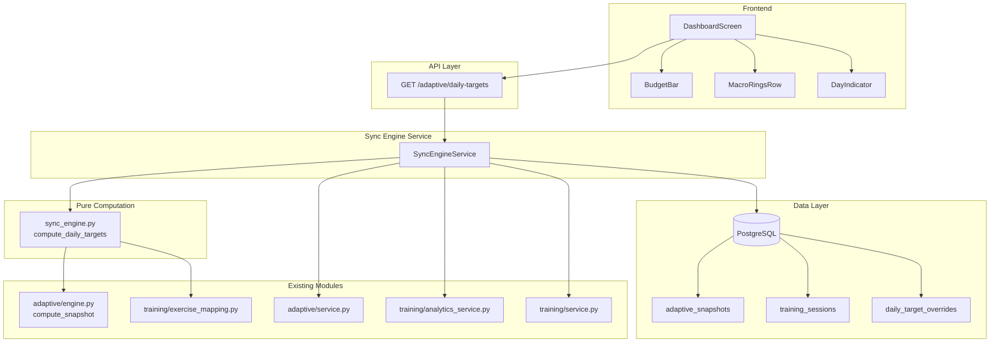

# Design Document: Nutrition-Training Sync Engine

## Overview

The Nutrition-Training Sync Engine is a new computation layer that sits between the existing adaptive TDEE engine and the frontend dashboard. It takes the user's weekly Baseline_Targets (from `compute_snapshot`) and produces day-specific Adjusted_Targets by factoring in:

1. Whether the day is a training day or rest day
2. Which muscle groups were trained (glycogen demand)
3. How much total volume was performed relative to the user's norm
4. The current training phase (accumulation/deload/etc.)
5. Any manual user overrides

The engine follows the same pure-function design philosophy as the existing adaptive engine: given identical inputs, it produces identical outputs with no side effects. A thin service layer handles database I/O and wiring.

### Key Design Decisions

- **Pure computation core**: `sync_engine.py` is a pure function module (like `engine.py`). No DB access, no side effects.
- **Extend, don't modify**: The existing `engine.py` and `service.py` are not modified. The sync engine consumes their output.
- **Single API endpoint**: One new endpoint (`GET /adaptive/daily-targets`) returns everything the frontend needs.
- **Override table**: User overrides are stored in a dedicated table, not mixed into the adaptive snapshots.

## Architecture



### Request Flow

1. Frontend calls `GET /adaptive/daily-targets?date=2025-01-15`
2. `SyncEngineService` fetches: latest adaptive snapshot, training session(s) for the date, scheduled templates, 4-week volume history, user override for the date
3. `SyncEngineService` builds a `DailyTargetInput` and calls the pure `compute_daily_targets()` function
4. If a user override exists, it's included alongside the computed values
5. Response is returned with full context (classification, multipliers, explanation)

## Components and Interfaces

### 1. Pure Computation Module: `src/modules/adaptive/sync_engine.py`

```python
@dataclass(frozen=True)
class DailyTargetInput:
    baseline_calories: float
    baseline_protein_g: float
    baseline_carbs_g: float
    baseline_fat_g: float
    is_training_day: bool
    session_exercises: list[SessionExercise]  # empty if rest day
    session_volume: float                      # 0.0 if rest day
    rolling_avg_volume: float                  # 4-week average
    training_phase: TrainingPhase              # accumulation | intensification | deload | none
    training_day_surplus_pct: float            # default 0.15
    rest_day_modifier_pct: float               # default -0.05

@dataclass(frozen=True)
class SessionExercise:
    exercise_name: str
    muscle_group: str       # from exercise_mapping
    is_compound: bool       # from exercise_mapping
    total_sets: int
    total_reps: int
    total_volume: float     # reps × weight summed across sets

class TrainingPhase(StrEnum):
    ACCUMULATION = "accumulation"
    INTENSIFICATION = "intensification"
    DELOAD = "deload"
    NONE = "none"

@dataclass(frozen=True)
class DailyTargetOutput:
    adjusted_calories: float
    adjusted_protein_g: float
    adjusted_carbs_g: float
    adjusted_fat_g: float
    day_classification: str           # "training_day" | "rest_day"
    muscle_group_demand: float        # 0.0 - 1.0 score
    volume_multiplier: float          # 0.7 - 1.5
    phase_modifier: float             # multiplier applied
    calorie_delta: float              # difference from baseline
    explanation: str                  # human-readable reason

def compute_daily_targets(input: DailyTargetInput) -> DailyTargetOutput:
    """Pure, deterministic computation of daily adjusted targets."""
    ...
```

### Computation Steps

**Step 1: Day Classification**
- If `is_training_day` is True → "training_day", else → "rest_day"

**Step 2: Muscle Group Demand Score (0.0 – 1.0)**
- Leg muscle groups (quads, hamstrings, glutes, calves) contribute 0.15 each (max from legs: 0.60)
- Back contributes 0.10
- Chest contributes 0.08
- Shoulders contributes 0.06
- Arms (biceps, triceps, forearms) contribute 0.03 each
- Abs, traps contribute 0.02 each
- Each compound exercise adds 0.03 bonus (capped at 0.15 total compound bonus)
- Score is clamped to [0.0, 1.0]
- Rest days have demand score 0.0

**Step 3: Volume Multiplier**
- If `rolling_avg_volume` is 0 or `session_volume` is 0: multiplier = 1.0
- Otherwise: `raw_ratio = session_volume / rolling_avg_volume`
- `volume_multiplier = clamp(raw_ratio, 0.7, 1.5)`

**Step 4: Calorie Adjustment**
- Training day: `surplus = baseline_calories * training_day_surplus_pct * volume_multiplier`
- Rest day: `adjustment = baseline_calories * rest_day_modifier_pct`

**Step 5: Phase Modifier**
- Accumulation: multiply surplus by 1.05
- Deload: set surplus to 0 (use baseline)
- Intensification / None: no change (1.0)

**Step 6: Macro Distribution**
- `calorie_delta = surplus * phase_modifier` (training day) or `adjustment` (rest day)
- `adjusted_calories = baseline_calories + calorie_delta`
- Protein: `max(baseline_protein_g, baseline_protein_g)` (never reduced)
- Carb shift: `carb_extra = calorie_delta * (0.5 + 0.3 * muscle_group_demand) / 4.0` (higher demand → more carbs)
- Fat gets the remainder: `fat_delta = (calorie_delta - carb_extra * 4.0) / 9.0`
- `adjusted_carbs_g = baseline_carbs_g + carb_extra`
- `adjusted_fat_g = baseline_fat_g + fat_delta`
- Floor carbs at `MIN_CARBS_G` (50g), floor fat at 20g

**Step 7: Explanation String**
- Build a human-readable string: e.g., "Leg day · +180 kcal · Volume 1.2×"

### 2. Service Layer: `src/modules/adaptive/sync_service.py`

```python
class SyncEngineService:
    def __init__(self, session: AsyncSession) -> None: ...

    async def get_daily_targets(
        self, user_id: uuid.UUID, target_date: date
    ) -> DailyTargetResponse: ...

    async def set_override(
        self, user_id: uuid.UUID, target_date: date, override: OverrideCreate
    ) -> DailyTargetOverride: ...

    async def remove_override(
        self, user_id: uuid.UUID, target_date: date
    ) -> None: ...

    async def _get_rolling_avg_volume(
        self, user_id: uuid.UUID, end_date: date, weeks: int = 4
    ) -> float: ...

    async def _classify_day(
        self, user_id: uuid.UUID, target_date: date
    ) -> tuple[bool, list[dict]]: ...
```

### 3. API Router: New endpoints in `src/modules/adaptive/router.py`

| Method | Path | Description |
|--------|------|-------------|
| GET | `/adaptive/daily-targets` | Get adjusted targets for a date |
| POST | `/adaptive/daily-targets/override` | Set manual override for a date |
| DELETE | `/adaptive/daily-targets/override` | Remove override for a date |

### 4. Frontend Components

**New: `DayIndicator` component** (`app/components/dashboard/DayIndicator.tsx`)
- Displays "Training Day" or "Rest Day" pill/badge
- Shows explanation text (e.g., "Leg day · +180 kcal")
- Shows override indicator when User_Override is active

**Modified: `DashboardScreen`**
- Calls `GET /adaptive/daily-targets?date={selectedDate}` instead of (or in addition to) the snapshots endpoint
- Passes adjusted targets to BudgetBar and MacroRingsRow
- Renders DayIndicator component

**Modified: `BudgetBar`**
- No structural changes needed — already accepts `targets` prop
- Will receive adjusted targets from DashboardScreen

**Modified: `MacroRingsRow`**
- No structural changes needed — already accepts target values as props
- Will receive adjusted targets from DashboardScreen

## Data Models

### New Table: `daily_target_overrides`

```python
class DailyTargetOverride(Base):
    __tablename__ = "daily_target_overrides"

    user_id: Mapped[uuid.UUID] = mapped_column(
        ForeignKey("users.id", ondelete="CASCADE"), nullable=False
    )
    target_date: Mapped[date] = mapped_column(nullable=False)
    calories: Mapped[float] = mapped_column(Float, nullable=False)
    protein_g: Mapped[float] = mapped_column(Float, nullable=False)
    carbs_g: Mapped[float] = mapped_column(Float, nullable=False)
    fat_g: Mapped[float] = mapped_column(Float, nullable=False)

    __table_args__ = (
        Index("ix_daily_target_overrides_user_date", "user_id", "target_date", unique=True),
    )
```

### New Pydantic Schemas

```python
class DailyTargetResponse(BaseModel):
    date: date
    day_classification: str                # "training_day" | "rest_day"
    classification_reason: str             # "Session logged" | "Scheduled" | "No session"
    baseline: MacroTargets
    adjusted: MacroTargets
    override: MacroTargets | None          # present if user override exists
    effective: MacroTargets                 # override if set, else adjusted
    muscle_group_demand: float
    volume_multiplier: float
    training_phase: str
    calorie_delta: float
    explanation: str

class OverrideCreate(BaseModel):
    calories: float = Field(ge=800)
    protein_g: float = Field(ge=0)
    carbs_g: float = Field(ge=0)
    fat_g: float = Field(ge=0)

class OverrideResponse(BaseModel):
    user_id: uuid.UUID
    target_date: date
    calories: float
    protein_g: float
    carbs_g: float
    fat_g: float
    created_at: datetime

    model_config = {"from_attributes": True}
```

### TrainingPhase Enum (added to `src/shared/types.py`)

```python
class TrainingPhase(StrEnum):
    ACCUMULATION = "accumulation"
    INTENSIFICATION = "intensification"
    DELOAD = "deload"
    NONE = "none"
```


## Correctness Properties

*A property is a characteristic or behavior that should hold true across all valid executions of a system — essentially, a formal statement about what the system should do. Properties serve as the bridge between human-readable specifications and machine-verifiable correctness guarantees.*

### Property 1: Day classification correctness

*For any* date, if a training session is logged for that date, the Sync_Engine shall classify it as "training_day". If no session is logged but a scheduled template exists, it shall classify it as "training_day". If neither exists, it shall classify it as "rest_day".

**Validates: Requirements 1.1, 1.2, 1.3**

### Property 2: Training day increases calories, rest day decreases calories

*For any* valid Baseline_Targets and default configuration, if the day is classified as a Training_Day (with volume_multiplier=1.0 and phase=none), the Adjusted_Targets calories shall be greater than the Baseline_Targets calories. If the day is classified as a Rest_Day, the Adjusted_Targets calories shall be less than or equal to the Baseline_Targets calories.

**Validates: Requirements 1.4, 1.5**

### Property 3: Leg sessions have higher demand than upper-body isolation sessions

*For any* two training sessions where one contains only leg exercises (quads, hamstrings, glutes) and the other contains only upper-body isolation exercises (biceps, triceps, forearms), the leg session shall have a strictly higher Muscle_Group_Demand score.

**Validates: Requirements 2.2**

### Property 4: Adding compound exercises never decreases demand score

*For any* training session, adding a compound exercise to the session shall result in a Muscle_Group_Demand score that is greater than or equal to the original score.

**Validates: Requirements 2.3**

### Property 5: Higher muscle group demand produces higher carb proportion

*For any* two Training_Day computations with identical Baseline_Targets, volume_multiplier, and training_phase, but different Muscle_Group_Demand scores, the computation with the higher demand score shall allocate a greater or equal proportion of the calorie surplus to carbohydrates.

**Validates: Requirements 2.4**

### Property 6: Protein never drops below baseline

*For any* valid DailyTargetInput (training day or rest day, any phase, any volume), the adjusted_protein_g shall be greater than or equal to baseline_protein_g.

**Validates: Requirements 2.5**

### Property 7: Session volume computation correctness

*For any* list of exercises with sets, the computed Session_Volume shall equal the sum of (reps × weight_kg) for every set across all exercises.

**Validates: Requirements 3.1**

### Property 8: Volume multiplier is proportional to volume ratio and clamped

*For any* session_volume and rolling_avg_volume (both > 0), the Volume_Multiplier shall equal clamp(session_volume / rolling_avg_volume, 0.7, 1.5). When session_volume > 1.2 × rolling_avg_volume, the multiplier shall be > 1.0. When session_volume < 0.8 × rolling_avg_volume, the multiplier shall be < 1.0. The multiplier shall always be in [0.7, 1.5].

**Validates: Requirements 3.2, 3.3, 3.4, 3.5**

### Property 9: Phase modifier correctness

*For any* valid DailyTargetInput on a Training_Day, if training_phase is accumulation, the adjusted_calories shall be approximately 5% higher than the same input with training_phase=none. If training_phase is deload, the adjusted_calories shall equal the baseline_calories. If training_phase is intensification or none, the phase modifier shall be 1.0.

**Validates: Requirements 4.2, 4.3, 4.4**

### Property 10: Override round-trip

*For any* user and date, setting a User_Override and then querying the daily targets shall return effective targets equal to the override values. Removing the override and querying again shall return effective targets equal to the computed Adjusted_Targets.

**Validates: Requirements 5.1, 5.3**

### Property 11: JSON serialization round-trip

*For any* valid DailyTargetResponse object, serializing to JSON and then deserializing shall produce an equivalent object.

**Validates: Requirements 8.1, 8.2**

## Error Handling

| Scenario | Behavior |
|----------|----------|
| No adaptive snapshot exists for user | Return 400 with message "No adaptive snapshot found. Generate a snapshot first." |
| Invalid date format in query parameter | Return 422 (FastAPI automatic validation) |
| Override with calories < 800 | Return 422 with validation error (Pydantic constraint) |
| Training session has no exercises | Treat as rest day (session_exercises is empty) |
| Exercise name not found in mapping | Assign muscle group "Other" with demand contribution 0.0 |
| Rolling average volume is 0 (new user) | Set volume_multiplier to 1.0 |
| Negative computed carbs or fat | Floor at minimum values (50g carbs, 20g fat) |
| Database connection failure | Return 500 with generic error (existing middleware handles) |

## Testing Strategy

### Property-Based Testing

Library: **Hypothesis** (Python) for backend, **fast-check** (TypeScript) for frontend utility tests.

Each property test runs a minimum of 100 iterations. Each test is tagged with:
`Feature: nutrition-training-sync, Property {N}: {title}`

Properties 1–9 test the pure `compute_daily_targets()` function and its helpers directly — no database needed.
Property 10 tests the service layer with a test database.
Property 11 tests Pydantic serialization round-trip.

### Unit Testing

Unit tests complement property tests by covering:
- Specific edge cases: zero volume, empty exercise list, all-compound session, all-isolation session
- Error conditions: missing snapshot, invalid override values
- API integration: endpoint returns correct status codes and response shapes
- Frontend: DayIndicator renders correct labels, DashboardScreen passes adjusted targets to BudgetBar/MacroRingsRow

### Test Organization

```
tests/
  test_sync_engine_properties.py    # Properties 1-9 (pure function)
  test_sync_service_properties.py   # Property 10 (override round-trip)
  test_sync_serialization.py        # Property 11 (JSON round-trip)
  test_sync_engine_unit.py          # Edge cases and examples

app/__tests__/
  utils/syncTargets.test.ts         # Frontend utility tests
  components/DayIndicator.test.ts   # Component rendering tests
```
