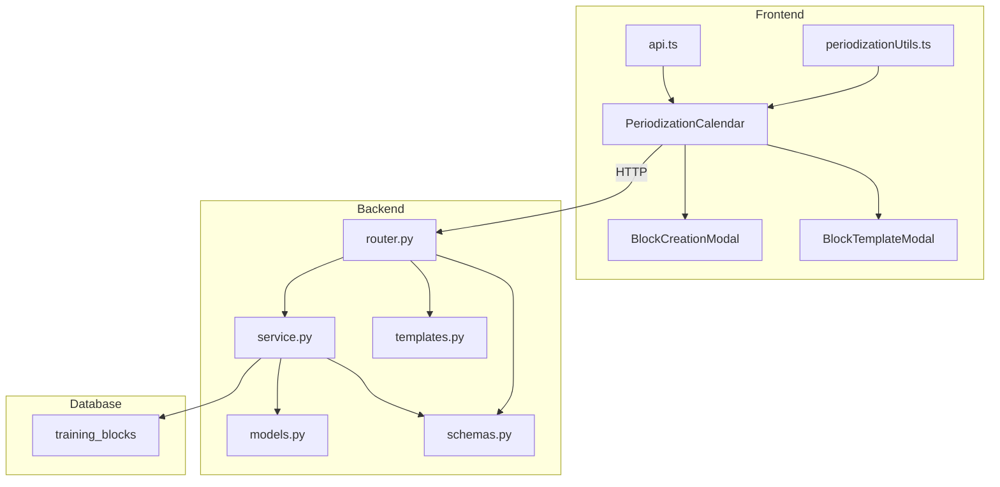

# Design Document: Periodization Calendar

## Overview

The Periodization Calendar adds a visual planning layer to Hypertrophy OS, allowing users to define training blocks with phase types, view them on a color-coded weekly calendar, align nutrition phases, plan deload weeks, and apply pre-built block templates.

New backend module `src/modules/periodization/` (model, schemas, service, router, templates) following existing patterns. New frontend components integrated into the Analytics screen. Single new database table `training_blocks`.

## Architecture



### Strict Dependency Chain

```
Layer 0: Alembic migration — CREATE TABLE training_blocks
         Depends on: nothing
         Risk: migration syntax error → blocks all subsequent layers
         Rollback: alembic downgrade (DROP TABLE)

Layer 1: models.py — TrainingBlock SQLAlchemy model
         Depends on: Layer 0 (table must exist for tests)
         Risk: column mismatch with migration → runtime errors
         Mitigation: model mirrors migration exactly, tested in Layer 4

Layer 2: schemas.py — Pydantic request/response schemas
         Depends on: Layer 1 (field names must align)
         Risk: validator logic bugs → silent bad data
         Mitigation: property tests in Layer 4

Layer 3: templates.py — static block template definitions
         Depends on: nothing (pure data)
         Risk: none (static data, no I/O)

Layer 4: service.py — business logic (CRUD, overlap, template expansion)
         Depends on: Layers 1, 2, 3
         Risk: overlap detection logic error → data corruption
         Mitigation: property tests P2, P3, P4, P5 run here
         CHECKPOINT: all backend property + unit tests pass before proceeding

Layer 5: router.py — FastAPI endpoints
         Depends on: Layers 2, 4
         Risk: wrong status codes, missing auth
         Mitigation: integration tests against each endpoint

Layer 6: main.py — register router
         Depends on: Layer 5
         Risk: import error → app won't start
         Mitigation: smoke test (app starts, /docs loads)
         CHECKPOINT: backend fully functional, all tests green

Layer 7: periodizationUtils.ts — pure frontend utility functions
         Depends on: nothing (pure logic)
         Risk: none
         Mitigation: Jest property + unit tests

Layer 8: API hooks in api.ts or dedicated hook file
         Depends on: Layer 6 (backend must be running)
         Risk: wrong endpoint paths
         Mitigation: matches router paths exactly

Layer 9: PeriodizationCalendar, BlockCreationModal, BlockTemplateModal
         Depends on: Layers 7, 8
         Risk: rendering bugs
         Mitigation: component tests

Layer 10: AnalyticsScreen integration
          Depends on: Layer 9
          Risk: layout regression
          Mitigation: visual review
          CHECKPOINT: full feature functional end-to-end
```

No circular dependencies. Each layer depends only on lower layers.

## Components and Interfaces

### Backend

#### 1. Database Migration

New Alembic migration creating `training_blocks` table. Additive only — no existing tables modified.

```sql
CREATE TABLE training_blocks (
    id UUID PRIMARY KEY DEFAULT gen_random_uuid(),
    user_id UUID NOT NULL REFERENCES users(id) ON DELETE CASCADE,
    name VARCHAR(100) NOT NULL,
    phase_type VARCHAR(20) NOT NULL,
    start_date DATE NOT NULL,
    end_date DATE NOT NULL,
    nutrition_phase VARCHAR(20),
    deleted_at TIMESTAMPTZ,
    created_at TIMESTAMPTZ NOT NULL DEFAULT now(),
    updated_at TIMESTAMPTZ NOT NULL DEFAULT now(),
    CONSTRAINT ck_training_blocks_date_range CHECK (end_date >= start_date)
);
CREATE INDEX ix_training_blocks_user_dates
    ON training_blocks (user_id, start_date, end_date);
CREATE INDEX ix_training_blocks_not_deleted
    ON training_blocks (deleted_at) WHERE deleted_at IS NULL;
```

Rollback: `DROP TABLE training_blocks;`

#### 2. TrainingBlock Model (`src/modules/periodization/models.py`)

```python
class TrainingBlock(SoftDeleteMixin, AuditLogMixin, Base):
    __tablename__ = "training_blocks"
    user_id: Mapped[uuid.UUID] = mapped_column(
        ForeignKey("users.id", ondelete="CASCADE"), index=True, nullable=False)
    name: Mapped[str] = mapped_column(String(100), nullable=False)
    phase_type: Mapped[str] = mapped_column(String(20), nullable=False)
    start_date: Mapped[date] = mapped_column(Date, nullable=False)
    end_date: Mapped[date] = mapped_column(Date, nullable=False)
    nutrition_phase: Mapped[str | None] = mapped_column(String(20), nullable=True)
    __table_args__ = (
        CheckConstraint("end_date >= start_date",
                        name="ck_training_blocks_date_range"),
        Index("ix_training_blocks_user_dates",
              "user_id", "start_date", "end_date"),
        Index("ix_training_blocks_not_deleted", "deleted_at",
              postgresql_where=text("deleted_at IS NULL")),
    )
```

#### 3. Pydantic Schemas (`src/modules/periodization/schemas.py`)

```python
VALID_PHASE_TYPES = {"accumulation", "intensification", "deload", "peak"}
VALID_NUTRITION_PHASES = {"bulk", "cut", "maintenance"}
```

Schemas:
- `TrainingBlockCreate(name, phase_type, start_date, end_date, nutrition_phase?)` with validators: phase_type in VALID_PHASE_TYPES, nutrition_phase in VALID_NUTRITION_PHASES or None, end_date >= start_date
- `TrainingBlockUpdate` — all fields optional, same validators for non-None
- `TrainingBlockResponse(id, user_id, name, phase_type, start_date, end_date, nutrition_phase, created_at, updated_at)` with `from_attributes=True` and `from_orm_model` classmethod
- `TemplatePhase(phase_type, duration_weeks)`
- `BlockTemplateResponse(id, name, description, phases: list[TemplatePhase])`
- `ApplyTemplateRequest(template_id, start_date)`
- `DeloadSuggestion(message, suggested_start_date, consecutive_weeks)`

#### 4. Block Templates (`src/modules/periodization/templates.py`)

Static list. No I/O, no dependencies.

```python
BLOCK_TEMPLATES = [
    {"id": "hypertrophy-4-1",
     "name": "4-Week Hypertrophy + 1-Week Deload",
     "description": "4 weeks accumulation, 1 week deload",
     "phases": [
         {"phase_type": "accumulation", "duration_weeks": 4},
         {"phase_type": "deload", "duration_weeks": 1}]},
    {"id": "strength-6",
     "name": "6-Week Strength Block",
     "description": "4 weeks accumulation, 1 week intensification, 1 week deload",
     "phases": [
         {"phase_type": "accumulation", "duration_weeks": 4},
         {"phase_type": "intensification", "duration_weeks": 1},
         {"phase_type": "deload", "duration_weeks": 1}]},
    {"id": "hypertrophy-8",
     "name": "8-Week Hypertrophy Mesocycle",
     "description": "3+3 weeks accumulation with deload breaks",
     "phases": [
         {"phase_type": "accumulation", "duration_weeks": 3},
         {"phase_type": "deload", "duration_weeks": 1},
         {"phase_type": "accumulation", "duration_weeks": 3},
         {"phase_type": "deload", "duration_weeks": 1}]},
    {"id": "peaking-3",
     "name": "3-Week Peaking Block",
     "description": "2 weeks intensification, 1 week peak",
     "phases": [
         {"phase_type": "intensification", "duration_weeks": 2},
         {"phase_type": "peak", "duration_weeks": 1}]},
]

def get_templates() -> list[dict]: ...
def get_template_by_id(template_id: str) -> dict | None: ...
def expand_template(template_id: str, start_date: date) -> list[dict]: ...
```

`expand_template` logic:
1. For each phase: `block_start = prev_end + 1 day` (or start_date for first).
2. `block_end = block_start + (duration_weeks * 7) - 1 day`.
3. `name = "{template_name} — {Phase_Type}"`.
4. Returns list of dicts ready for `TrainingBlockCreate`.

#### 5. PeriodizationService (`src/modules/periodization/service.py`)

```python
class PeriodizationService:
    def __init__(self, session: AsyncSession): ...

    async def create_block(self, user_id, data: TrainingBlockCreate) -> TrainingBlock:
        # 1. Check overlap via _check_overlap(user_id, data.start_date, data.end_date)
        # 2. Create TrainingBlock, add to session, flush
        # 3. Write audit log (CREATE)
        # 4. Return block

    async def list_blocks(self, user_id, start_date=None, end_date=None) -> list[TrainingBlock]:
        # Query non-deleted blocks for user, optional date range filter
        # ORDER BY start_date ASC

    async def get_block(self, user_id, block_id) -> TrainingBlock:
        # Single block lookup, raise NotFoundError if missing/not owned

    async def update_block(self, user_id, block_id, data: TrainingBlockUpdate) -> TrainingBlock:
        # 1. Fetch block or raise NotFoundError
        # 2. Apply updates from data (exclude_unset)
        # 3. If dates changed, check overlap excluding self
        # 4. Write audit log (UPDATE) with old/new values
        # 5. Flush and return

    async def soft_delete_block(self, user_id, block_id) -> None:
        # 1. Fetch block or raise NotFoundError
        # 2. Set deleted_at = now()
        # 3. Write audit log (DELETE)
        # 4. Flush

    async def apply_template(self, user_id, template_id, start_date) -> list[TrainingBlock]:
        # 1. Get template or raise NotFoundError
        # 2. Expand template into block dicts
        # 3. Check overlap for entire expanded range at once
        # 4. Create all blocks atomically
        # 5. Return created blocks

    async def check_deload_suggestions(self, user_id) -> list[DeloadSuggestion]:
        # 1. List all non-deleted blocks ordered by start_date
        # 2. Walk blocks, track consecutive non-deload weeks
        # 3. If consecutive span > 4 weeks, emit suggestion

    async def _check_overlap(self, user_id, start_date, end_date, exclude_id=None) -> None:
        # Query: SELECT 1 FROM training_blocks
        #   WHERE user_id=:uid AND deleted_at IS NULL
        #   AND id != :exclude_id
        #   AND start_date <= :end AND end_date >= :start
        # If exists, raise ConflictError
```

#### 6. Router (`src/modules/periodization/router.py`)

| Method | Path | Status | Description |
|--------|------|--------|-------------|
| POST | `/blocks` | 201 | Create block |
| GET | `/blocks` | 200 | List blocks (optional `start_date`, `end_date` query) |
| GET | `/blocks/deload-suggestions` | 200 | Get deload suggestions |
| GET | `/blocks/{block_id}` | 200 | Get single block |
| PUT | `/blocks/{block_id}` | 200 | Update block |
| DELETE | `/blocks/{block_id}` | 204 | Soft delete block |
| GET | `/templates` | 200 | List templates |
| POST | `/templates/apply` | 201 | Apply template |

Note: `/blocks/deload-suggestions` must be defined BEFORE `/blocks/{block_id}` to avoid path conflict.

All endpoints use `Depends(get_current_user)` for auth. Router registered in `main.py` with prefix `"/periodization"`.

### Frontend

#### 1. `app/utils/periodizationUtils.ts` — Pure Functions

```typescript
const PHASE_COLORS: Record<string, string> = {
  accumulation: colors.chart.calories,
  intensification: colors.accent.primary,
  deload: colors.semantic.positive,
  peak: colors.semantic.warning,
};
const NUTRITION_LABELS: Record<string, string> = {
  bulk: "Bulk", cut: "Cut", maintenance: "Maint",
};

interface TrainingBlock {
  id: string; name: string; phase_type: string;
  start_date: string; end_date: string; nutrition_phase: string | null;
}
interface WeekRow {
  weekStart: string; weekEnd: string;
  blockName: string | null; phaseType: string | null;
  phaseColor: string | null; nutritionPhase: string | null;
  nutritionLabel: string | null;
  weekNumber: number | null; totalWeeks: number | null;
  isCurrentWeek: boolean; sessionDates: string[];
}

function buildWeekRows(blocks: TrainingBlock[], sessionDates: string[], today: string): WeekRow[]
function needsDeloadSuggestion(blocks: TrainingBlock[]): boolean
function getPhaseColor(phaseType: string): string
function getNutritionLabel(nutritionPhase: string | null): string | null
```

#### 2. `app/components/periodization/PeriodizationCalendar.tsx`

Fetches blocks via `GET /periodization/blocks` and session dates via existing `GET /training/sessions`. Calls `buildWeekRows` to compute display data. Renders week rows with phase color band, block name, week label, session dots, nutrition badge. Highlights current week. Shows empty state when no blocks. FAB button opens BlockCreationModal. Template button opens BlockTemplateModal.

#### 3. `app/components/periodization/BlockCreationModal.tsx`

Form: name (TextInput), phase_type (picker), start_date (DatePicker), end_date (DatePicker), nutrition_phase (optional picker). Validates locally before submit. Calls `POST /periodization/blocks` or `PUT /periodization/blocks/{id}`. Displays API error messages (overlap, validation).

#### 4. `app/components/periodization/BlockTemplateModal.tsx`

Lists templates from `GET /periodization/templates`. User selects template + start date. Calls `POST /periodization/templates/apply`. Displays error on overlap.

#### 5. Analytics Screen Integration

Add `<PeriodizationCalendar />` section to `AnalyticsScreen.tsx` between the title and the time range selector.

## Data Models

### training_blocks Table

| Column | Type | Constraints |
|--------|------|-------------|
| id | UUID | PK, default gen_random_uuid() |
| user_id | UUID | NOT NULL, FK users(id) ON DELETE CASCADE |
| name | VARCHAR(100) | NOT NULL |
| phase_type | VARCHAR(20) | NOT NULL |
| start_date | DATE | NOT NULL |
| end_date | DATE | NOT NULL, CHECK >= start_date |
| nutrition_phase | VARCHAR(20) | NULLABLE |
| deleted_at | TIMESTAMPTZ | NULLABLE |
| created_at | TIMESTAMPTZ | NOT NULL, default now() |
| updated_at | TIMESTAMPTZ | NOT NULL, default now() |

Indexes: `(user_id, start_date, end_date)`, partial on `deleted_at IS NULL`.

## Correctness Properties

*A property is a characteristic or behavior that should hold true across all valid executions of a system — essentially, a formal statement about what the system should do.*

### Property 1: Training block serialization round-trip

*For any* valid training block object (valid name, phase type, date range, optional nutrition phase), serializing to JSON via `TrainingBlockResponse` and deserializing back via `TrainingBlockCreate` SHALL produce an equivalent object with matching field values.

**Validates: Requirements 7.3, 7.1, 7.2, 1.5, 4.2**

### Property 2: Overlap invariant

*For any* user and any set of non-deleted training blocks belonging to that user, no two blocks SHALL have overlapping date ranges. For distinct blocks A and B: either `A.end_date < B.start_date` or `B.end_date < A.start_date`.

**Validates: Requirements 1.4, 2.2, 6.3**

### Property 3: Invalid date range rejection

*For any* block creation or update where `end_date < start_date`, the service SHALL reject with a validation error and the block list SHALL remain unchanged.

**Validates: Requirements 1.2**

### Property 4: Invalid phase type rejection

*For any* string not in `{accumulation, intensification, deload, peak}`, block creation with that phase type SHALL be rejected with a validation error.

**Validates: Requirements 1.3**

### Property 5: Soft delete exclusion and list ordering

*For any* user with a mix of deleted and non-deleted blocks, listing blocks SHALL return only non-deleted blocks sorted by `start_date` ascending.

**Validates: Requirements 2.3, 2.4**

### Property 6: Block-to-week mapping

*For any* training block with a phase type and optional nutrition phase, every week within the block's date range SHALL map to a calendar row containing the block's name, phase type label, phase color, and nutrition label (if assigned).

**Validates: Requirements 3.1, 3.2, 4.1, 4.3**

### Property 7: Session dots placement

*For any* set of session dates and blocks, the calendar SHALL place a session dot on each date with a logged session, and only on those dates.

**Validates: Requirements 3.4**

### Property 8: Deload suggestion trigger

*For any* sequence of consecutive non-deload blocks spanning more than 4 weeks total, the system SHALL produce a deload suggestion.

**Validates: Requirements 5.3**

### Property 9: Template expansion correctness

*For any* block template and valid start date, applying the template SHALL produce blocks where: (a) phase types match the template sequence, (b) blocks are contiguous (each starts day after previous ends), (c) each block's duration = `duration_weeks * 7` days, (d) total range = sum of all durations.

**Validates: Requirements 6.2**

## Error Handling

| Scenario | HTTP | Error |
|----------|------|-------|
| Name empty or > 100 chars | 422 | Validation error |
| end_date < start_date | 422 | "end_date must be on or after start_date" |
| Invalid phase_type | 422 | "phase_type must be one of: accumulation, intensification, deload, peak" |
| Invalid nutrition_phase | 422 | "nutrition_phase must be one of: bulk, cut, maintenance" |
| Overlap with existing block | 409 | "Training block overlaps with existing block" |
| Block not found | 404 | "Training block not found" |
| Template not found | 404 | "Block template not found" |
| Template creates overlaps | 409 | "Template blocks would overlap with existing block" |

Follows existing `src/shared/errors.py` patterns (NotFoundError, ConflictError).

## Testing Strategy

### Test Files and Coverage Map

| Test File | Type | Covers |
|-----------|------|--------|
| `tests/test_periodization_properties.py` | Property (hypothesis, 100+ iterations each) | P1–P5, P8, P9 |
| `tests/test_periodization_unit.py` | Unit (pytest) | Edge cases, template list, specific examples |
| `app/__tests__/utils/periodizationUtils.test.ts` | Property + Unit (fast-check + Jest) | P6, P7, frontend logic |
| `app/__tests__/components/PeriodizationCalendar.test.ts` | Component (Jest) | Rendering, empty state, interactions |

### Backend Property Tests (`tests/test_periodization_properties.py`)

Each test runs minimum 100 iterations via `@settings(max_examples=100)`.

| Test | Property | Strategy |
|------|----------|----------|
| `test_serialization_round_trip` | P1 | Generate random valid TrainingBlockCreate, serialize via `.model_dump()`, reconstruct, assert equality |
| `test_overlap_invariant` | P2 | Generate two blocks with overlapping ranges, create first, assert second raises ConflictError |
| `test_invalid_date_range_rejected` | P3 | Generate date pairs where end < start, assert ValidationError on TrainingBlockCreate |
| `test_invalid_phase_type_rejected` | P4 | Generate strings not in VALID_PHASE_TYPES, assert ValidationError |
| `test_soft_delete_exclusion_and_ordering` | P5 | Generate N blocks, soft-delete random subset, list, assert only non-deleted returned and sorted by start_date |
| `test_deload_suggestion_trigger` | P8 | Generate consecutive non-deload blocks > 4 weeks, assert suggestion produced |
| `test_template_expansion_correctness` | P9 | For each template × random start dates, expand, verify contiguity + phase types + durations |

### Backend Unit Tests (`tests/test_periodization_unit.py`)

| Test | What it verifies |
|------|-----------------|
| `test_template_list_contains_required` | 4 required templates exist (Req 6.4) |
| `test_adjacent_blocks_no_overlap` | Blocks ending day N and starting day N+1 are not overlapping |
| `test_single_day_block_valid` | Block with start_date == end_date is valid |
| `test_overlap_edge_same_day` | Two blocks sharing exactly one day are detected as overlapping |
| `test_create_block_returns_all_fields` | Created block response has all expected fields |
| `test_update_block_partial` | Updating only name preserves other fields |
| `test_delete_block_not_in_list` | Deleted block excluded from list |
| `test_apply_template_overlap_rolls_back` | If template expansion hits overlap, no blocks are created |
| `test_deload_suggestion_not_triggered_under_4_weeks` | 3 consecutive non-deload weeks → no suggestion |
| `test_nutrition_phase_persisted` | Block with nutrition_phase="bulk" returns nutrition_phase="bulk" |

### Frontend Property Tests (`app/__tests__/utils/periodizationUtils.test.ts`)

Using `fast-check` library, minimum 100 iterations.

| Test | Property |
|------|----------|
| `test_buildWeekRows_maps_all_weeks` | P6: For any block, every week in range appears in output with correct name/phase/color |
| `test_buildWeekRows_session_dots` | P7: For any session dates, dots appear on exactly those dates |
| `test_needsDeloadSuggestion` | P8 (frontend mirror): consecutive non-deload > 4 weeks → true |

### Frontend Unit Tests

| Test | What it verifies |
|------|-----------------|
| `test_current_week_highlight` | Given today's date, correct week row has isCurrentWeek=true (Req 3.3) |
| `test_empty_blocks_empty_rows` | No blocks → empty array (Req 3.5) |
| `test_deload_phase_color` | Deload phase gets PHASE_COLORS.deload (Req 5.1) |
| `test_nutrition_label_mapping` | "bulk" → "Bulk", null → null |

### Testing Checkpoints

1. **After Layer 4 (service)**: Run `pytest tests/test_periodization_properties.py tests/test_periodization_unit.py`. All must pass. Gate: no proceeding to router until green.
2. **After Layer 6 (main.py registration)**: Run full backend test suite. Smoke test: app starts, `GET /periodization/templates` returns 200. Gate: no frontend work until green.
3. **After Layer 7 (frontend utils)**: Run `jest app/__tests__/utils/periodizationUtils.test.ts`. All must pass. Gate: no component work until green.
4. **After Layer 10 (integration)**: Full test suite (backend + frontend). Manual visual review of calendar on Analytics screen.

## Risks and Mitigations

| # | Risk | Impact | Mitigation | Rollback |
|---|------|--------|------------|----------|
| R1 | Overlap race condition (concurrent creates) | Duplicate overlapping blocks | V1: app-level check. V2: DB exclusion constraint. | Manual cleanup of duplicate blocks |
| R2 | Migration failure | Table not created, all layers blocked | Additive migration only. Test on staging. | `alembic downgrade` |
| R3 | Template expansion spans years | Unreasonable data | Cap total duration at 52 weeks in expand_template | N/A (validation prevents) |
| R4 | Calendar slow with many blocks | Poor UX | Limit view to 6-month window. Typical user < 20 blocks. | N/A (performance tuning) |
| R5 | Router path conflict `/blocks/deload-suggestions` vs `/blocks/{block_id}` | 404 or wrong handler | Define static paths before parameterized paths | Reorder routes |

## Rollback Plan

| Layer | Rollback Action | Side Effects |
|-------|----------------|--------------|
| Database | `DROP TABLE training_blocks` | None — new table only |
| Backend | Remove `periodization` router from `main.py` | Module files remain harmless |
| Frontend | Remove PeriodizationCalendar section from AnalyticsScreen | Component files remain harmless |

Each layer rolls back independently. No existing functionality is modified by this feature.

## Monitoring (Post-Launch)

| Metric | Alert | Source |
|--------|-------|--------|
| `periodization.block_create.count` | Baseline | Router middleware |
| `periodization.block_create.error_rate` | > 5% 4xx/5xx | Router middleware |
| `periodization.overlap_conflict.count` | > 20/hour | Service logging |
| `periodization.template_apply.count` | Baseline | Router middleware |
| `periodization.api.latency_p99` | > 500ms | Router middleware |
