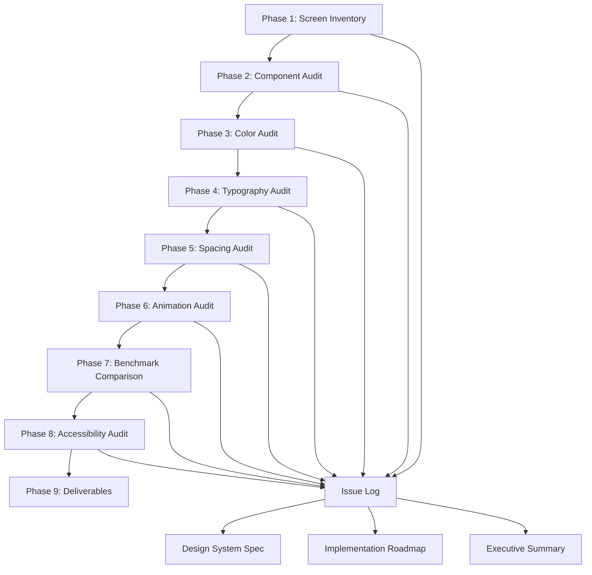

# Design Document — Premium UI/UX Audit

## Overview

This design defines the architecture, methodology, data models, and execution plan for a comprehensive UI/UX audit of Hypertrophy OS. The audit is a systematic codebase walkthrough — not a runtime visual inspection — that produces structured findings by parsing component files, extracting style values, comparing against the token system, and benchmarking against premium competitors.

The audit produces three deliverables: (1) a complete Issue Log with severity-categorized findings, (2) a Design System Specification, and (3) a prioritized 8-week Implementation Roadmap.

### Key Design Decisions

1. **Static analysis over runtime inspection**: The audit walks `.tsx` files and `tokens.ts` directly. This is deterministic, reproducible, and doesn't require running the app on multiple devices.
2. **Token-centric methodology**: Every finding is anchored to the token system in `app/theme/tokens.ts`. A "violation" means a component uses a hardcoded value instead of a token, or uses a token incorrectly.
3. **Severity-driven prioritization**: Findings are categorized Critical/High/Medium/Low with effort estimates, enabling the roadmap to optimize for impact-per-hour.
4. **Benchmark-relative scoring**: The premium score is relative to the 6 benchmark apps, not an abstract scale.

## Architecture

The audit is structured as 9 sequential phases, each producing structured output that feeds into the final deliverables.



### Phase Dependencies

- Phases 1–2 (Screen Inventory + Component Audit) must complete first — they establish the catalog of what exists.
- Phases 3–6 (Color, Typography, Spacing, Animation) can run in parallel — each examines a different dimension of the same components.
- Phase 7 (Benchmark) depends on Phases 3–6 — it compares findings against external references.
- Phase 8 (Accessibility) depends on Phases 3–6 — contrast ratios, touch targets, and motion sensitivity build on earlier findings.
- Phase 9 (Deliverables) synthesizes all prior phases.

## Components and Interfaces

### Audit Scope — Complete File Inventory

The audit covers these specific files and directories:

#### Screens (25 files across 17 directories)

| Directory | Files | Primary Tab |
|-----------|-------|-------------|
| `screens/dashboard/` | DashboardScreen.tsx | Dashboard |
| `screens/logs/` | LogsScreen.tsx | Log |
| `screens/analytics/` | AnalyticsScreen.tsx | Analytics |
| `screens/profile/` | ProfileScreen.tsx, ProgressPhotosScreen.tsx | Profile |
| `screens/auth/` | LoginScreen.tsx, RegisterScreen.tsx, ForgotPasswordScreen.tsx | Auth |
| `screens/onboarding/` | OnboardingScreen.tsx, OnboardingWizard.tsx + 6 steps | Onboarding |
| `screens/training/` | ActiveWorkoutScreen.tsx, SessionDetailScreen.tsx, SessionDetailView.tsx | Log→Training |
| `screens/nutrition/` | NutritionReportScreen.tsx, RecipeBuilderScreen.tsx | Log→Nutrition |
| `screens/exercise-picker/` | ExercisePickerScreen.tsx | Log→Training |
| `screens/meal-prep/` | MealPlanScreen.tsx, PrepSundayFlow.tsx, ShoppingListView.tsx | Log→Nutrition |
| `screens/coaching/` | CoachingScreen.tsx | Secondary |
| `screens/community/` | CommunityScreen.tsx | Secondary |
| `screens/learn/` | LearnScreen.tsx, ArticleDetailScreen.tsx | Secondary |
| `screens/health/` | HealthReportsScreen.tsx | Secondary |
| `screens/founder/` | FounderStoryScreen.tsx | Secondary |
| `screens/reports/` | WeeklyReportScreen.tsx | Secondary |

#### Components (~60 files across 18 directories)

| Directory | Files | Category |
|-----------|-------|----------|
| `components/common/` | Button, Card, EditableField, EmptyState, ErrorBoundary, FilterPill, Icon, ModalContainer, ProgressBar, ProgressRing, SectionHeader, SetupBanner, Skeleton, SwipeableRow, Tooltip | Foundation |
| `components/dashboard/` | ArticleCardCompact, DateScroller, DayBadge, DayIndicator, FatigueAlertCard, MacroRingsRow, MealSlotDiary, MealSlotGroup, QuickActionButton, ReadinessGauge, RecompDashboardCard, StreakIndicator, TodaySummaryRow | Dashboard |
| `components/training/` | ConfirmationSheet, DurationTimer, ExerciseContextMenu, ExerciseDetailSheet, FinishBar, OverloadSuggestionBadge, PRBanner, PreviousPerformance, RestTimer, RestTimerBar, RestTimerOverlay, RestTimerRing, RestTimerV2, RPEBadge, RPEPicker, SetTypeSelector, TemplatePicker, TypeBadge, VolumeIndicatorPill, WarmUpSuggestion | Training |
| `components/modals/` | AddBodyweightModal, AddNutritionModal, AddTrainingModal, QuickAddModal, RecoveryCheckinModal | Modals |
| `components/nutrition/` | BarcodeScanner, BudgetBar, CopyMealsBar, MealBuilder, SourceBadge, WaterTracker | Nutrition |
| `components/analytics/` | anatomicalPaths, BodyHeatMap, BodySilhouette, DrillDownModal, ExpenditureTrendCard, FatigueBreakdownModal, FatigueHeatMapOverlay, HeatMapCard, HeatMapLegend, ReadinessTrendChart, StrengthLeaderboard, StrengthStandardsCard, WeeklySummaryCard, WeekNavigator | Analytics |
| `components/charts/` | TimeRangeSelector, TrendLineChart | Charts |
| `components/exercise-picker/` | CustomExerciseForm, ExerciseCard, MuscleGroupGrid, MuscleGroupIcon, RecentExercises, SearchBar | Exercise Picker |
| `components/photos/` | AlignedComparison, GuidedCameraView, LightingReminder, PhotoComparison, PoseOverlay, PoseSelector, TimelineSlider | Photos |
| `components/premium/` | PremiumBadge, UpgradeBanner, UpgradeModal | Premium |
| `components/profile/` | AccountSection, BodyStatsSection, EditPlanPanel, FeatureNavItem, GoalsSection, PlanEditFlow, PlanSummaryCard, PreferencesSection | Profile |
| `components/achievements/` | AchievementCard, AchievementGrid, CelebrationModal, ShareableCard | Achievements |
| `components/coaching/` | CoachingModeSelector, WeeklyCheckinCard | Coaching |
| `components/learn/` | ArticleChart | Learn |
| `components/log/` | CollapsibleSection, QuickRelogRow, StartWorkoutCard, TemplateRow | Log |
| `components/meal-prep/` | RecipeScalingModal | Meal Prep |
| `components/periodization/` | BlockCreationModal, BlockTemplateModal, PeriodizationCalendar | Periodization |
| `components/reports/` | ReportCard | Reports |

#### Infrastructure Files

| File | Purpose |
|------|---------|
| `app/theme/tokens.ts` | Design token system — colors, spacing, typography, radius, shadows, springs, opacity |
| `app/navigation/BottomTabNavigator.tsx` | Tab navigation, stack navigators, screen transitions |
| `app/hooks/usePressAnimation.ts` | Press scale+opacity animation hook |
| `app/hooks/useStaggeredEntrance.ts` | Staggered fade+slide entrance hook |
| `app/hooks/useHoverState.ts` | Web hover state hook |
| `app/hooks/useSkeletonPulse.ts` | Skeleton loading pulse hook |
| `app/hooks/useCountingValue.ts` | Animated number counting hook |
| `app/hooks/useDailyTargets.ts` | Daily nutrition target data hook |
| `app/hooks/useHealthData.ts` | Health data integration hook |
| `app/store/index.ts` | Zustand store |
| `app/App.tsx` | App entry point |

### Audit Methodology Per Phase

#### Phase 1: Screen Inventory

For each screen file, the audit:
1. Reads the component function and identifies all conditional rendering branches
2. Maps each branch to one of the 6 states: default, empty, loading, error, interactive, overflow
3. Checks for imports of `EmptyState`, `Skeleton`, `ErrorBoundary`
4. Records which states are present and which are missing
5. Examines navigation registration in `BottomTabNavigator.tsx`

Output: Screen catalog table + missing state issues

#### Phase 2: Component Audit

For each component file, the audit:
1. Reads the component interface/props to identify variants, sizes, states
2. Reads the `StyleSheet.create` block and inline styles
3. Checks every style value against token imports — flags hardcoded values
4. Checks for `usePressAnimation`, `useHoverState`, `useStaggeredEntrance` usage on interactive components
5. Checks animation library (`react-native` Animated vs `react-native-reanimated`)
6. Verifies `activeOpacity` on `TouchableOpacity` components

Output: Component specification table + token violation issues

#### Phase 3: Color Audit

1. Parses the complete `colors` object from `tokens.ts`
2. Computes WCAG AA contrast ratios for all text/background combinations using relative luminance formula
3. Searches all `.tsx` files for hex literals and `rgba()` values not imported from tokens
4. Simulates color vision deficiency for macro color set
5. Compares palette against benchmark screenshots

Output: Color inventory + contrast report + violation list + benchmark comparison

#### Phase 4: Typography Audit

1. Parses the complete `typography` object from `tokens.ts`
2. Walks all screen files checking heading/body/caption size+weight consistency
3. Searches for numeric displays missing `fontVariant: ['tabular-nums']`
4. Checks text truncation patterns (`numberOfLines`, `ellipsizeMode`)
5. Verifies letter spacing usage on headings

Output: Type ramp documentation + consistency issues

#### Phase 5: Spacing Audit

1. Parses the `spacing` and `radius` objects from `tokens.ts`
2. Checks screen-level `paddingHorizontal` consistency across 4 primary tabs
3. Measures section gaps, item gaps, and component internal gaps
4. Evaluates content density on high-density screens
5. Checks primary action positioning relative to thumb zone

Output: Spacing standards + density assessment + hotspot findings

#### Phase 6: Animation Audit

1. Catalogs all animation patterns by searching for Reanimated/Animated imports
2. Flags mixed animation library usage
3. Verifies spring preset usage vs custom values
4. Checks skeleton loading coverage on async screens
5. Evaluates micro-interaction quality at key moments
6. Searches for haptic API usage

Output: Animation catalog + library consistency issues + missing interaction findings

#### Phase 7: Benchmark Comparison

1. Compares each visual dimension (color, typography, spacing, animation, density) against 6 benchmarks
2. Identifies specific adoptable qualities with implementation guidance
3. Produces ranked gap analysis

Output: Benchmark comparison matrix + top 10 gap items

#### Phase 8: Accessibility Audit

1. Measures touch target sizes by examining padding, hitSlop, and container dimensions
2. Verifies color-only information has text/icon reinforcement
3. Checks Dynamic Type / font scaling support
4. Verifies `accessibilityLabel` on interactive elements
5. Checks reduce-motion support in animation hooks

Output: Accessibility violation list + remediation recommendations

## Data Models

### Issue Entry

Each audit finding is recorded as an Issue with this structure:

```typescript
interface AuditIssue {
  id: string;                    // e.g., "COLOR-001", "SPACING-012"
  phase: 1 | 2 | 3 | 4 | 5 | 6 | 7 | 8;
  category: 'screen-state' | 'component' | 'color' | 'typography' | 'spacing' | 'animation' | 'benchmark' | 'accessibility';
  severity: 'critical' | 'high' | 'medium' | 'low';
  title: string;                 // e.g., "PRBanner uses RN Animated instead of Reanimated"
  description: string;           // Detailed explanation
  currentState: string;          // What it looks like now
  targetState: string;           // What it should look like
  filePaths: string[];           // Affected files
  lineReferences?: string[];     // Specific line numbers
  tokenReference?: string;       // Which token should be used
  effortHours: number;           // Estimated fix time
  phase: 1 | 2 | 3 | 4;        // Roadmap phase assignment
  requirementRef: string;        // e.g., "Req 3.3" — traces to requirements doc
}
```

### Screen Inventory Entry

```typescript
interface ScreenEntry {
  name: string;                  // e.g., "DashboardScreen"
  filePath: string;              // e.g., "app/screens/dashboard/DashboardScreen.tsx"
  tab: 'dashboard' | 'log' | 'analytics' | 'profile' | 'auth' | 'onboarding' | 'secondary';
  states: {
    default: boolean;
    empty: boolean;
    loading: boolean;
    error: boolean;
    interactive: boolean;
    overflow: boolean;
  };
  missingStates: string[];
  issues: string[];              // Issue IDs
}
```

### Component Catalog Entry

```typescript
interface ComponentEntry {
  name: string;                  // e.g., "Button"
  filePath: string;
  category: string;              // e.g., "common", "training", "nutrition"
  variants: string[];            // e.g., ["primary", "secondary", "ghost", "danger"]
  states: string[];              // e.g., ["default", "hover", "press", "disabled", "loading"]
  tokenCompliance: 'full' | 'partial' | 'none';
  hardcodedValues: number;       // Count of hardcoded style values
  animationLibrary: 'reanimated' | 'rn-animated' | 'none' | 'mixed';
  hasPressAnimation: boolean;
  hasHoverState: boolean;
  issues: string[];              // Issue IDs
}
```

### Contrast Ratio Entry

```typescript
interface ContrastEntry {
  foreground: string;            // Token path, e.g., "text.primary"
  foregroundHex: string;         // e.g., "#F1F5F9"
  background: string;            // Token path, e.g., "bg.base"
  backgroundHex: string;         // e.g., "#0A0E13"
  ratio: number;                 // Computed contrast ratio
  requiredRatio: number;         // 4.5 for normal text, 3.0 for large text
  passes: boolean;
  recommendation?: string;       // Suggested replacement if fails
}
```

### Benchmark Gap Entry

```typescript
interface BenchmarkGap {
  rank: number;                  // 1-10 priority
  quality: string;               // e.g., "Ring glow effect on progress completion"
  benchmarkApp: string;          // e.g., "Apple Fitness+"
  currentState: string;          // What HOS does now
  targetState: string;           // What it should do
  implementationGuide: string;   // Specific code changes
  filesAffected: string[];
  effortHours: number;
}
```

### Deliverable Document Structure

#### Issue Log (Markdown table format)

```markdown
| ID | Severity | Category | Title | File(s) | Current | Target | Effort | Phase |
|----|----------|----------|-------|---------|---------|--------|--------|-------|
| COLOR-001 | high | color | text.muted fails WCAG AA on bg.base | tokens.ts | #64748B on #0A0E13 = 3.8:1 | #7C8DA3 on #0A0E13 = 4.5:1 | 0.5h | 1 |
```

#### Design System Spec (Structured sections)

1. Color Palette — every token with hex, usage rule, contrast ratios
2. Spacing Scale — every value with usage context
3. Border Radius — every value with component mapping
4. Elevation/Shadows — every level with usage context
5. Typography Ramp — complete hierarchy table
6. Animation System — springs, timing, easing with usage rules
7. Haptic Patterns — trigger points and feedback types
8. Component Specs — per-component variant/state/spacing documentation

#### Implementation Roadmap (Phase structure)

```markdown
## Phase 1: Foundation (Weeks 1-2)
Theme: Token system fixes + animation unification + critical accessibility
Effort: ~X hours

### Token Fixes
- [ ] Fix text.muted contrast (COLOR-001) — tokens.ts — 0.5h
- [ ] ...

### Animation Unification
- [ ] Migrate PRBanner to Reanimated (ANIM-003) — PRBanner.tsx — 2h
- [ ] ...
```

#### Executive Summary

```markdown
## Premium Score: X/10
Criteria: [defined scale]

## Top 5 Critical Issues
1. [Issue] — Impact: [description] — Fix: [description]
...

## Top 10 Quick Wins (≤2h each)
1. [Win] — File: [path] — Effort: [hours] — Impact: [description]
...
```

## Correctness Properties

*A property is a characteristic or behavior that should hold true across all valid executions of a system — essentially, a formal statement about what the system should do. Properties serve as the bridge between human-readable specifications and machine-verifiable correctness guarantees.*

Since this is an audit spec (producing analysis documents, not code), the correctness properties verify the completeness, consistency, and structural integrity of the audit output — ensuring no screen is missed, no component is skipped, no contrast ratio is miscalculated, and every issue has actionable detail.

### Property 1: Screen Catalog Completeness

*For any* `.tsx` file in `app/screens/` (recursively), the Screen Inventory output SHALL contain a corresponding ScreenEntry with all 6 state booleans populated.

**Validates: Requirements 1.1, 1.2**

### Property 2: Component Catalog Completeness

*For any* `.tsx` file in `app/components/` (recursively), the Component Catalog output SHALL contain a corresponding ComponentEntry with variants, states, token compliance status, and animation library identified.

**Validates: Requirements 2.1, 2.7**

### Property 3: Modal Catalog Completeness

*For any* component file that renders a `<Modal>` element or uses `ModalContainer`, the modal catalog SHALL contain an entry documenting entry animation, dismissal behavior, and keyboard avoidance.

**Validates: Requirements 1.5**

### Property 4: Token Inventory Round-Trip

*For any* color, spacing, typography, radius, shadow, spring, or opacity token defined in `app/theme/tokens.ts`, the Design System Spec SHALL contain a corresponding entry with the token path, value, and usage rule.

**Validates: Requirements 3.1, 4.1, 5.1, 9.1**

### Property 5: WCAG Contrast Ratio Accuracy

*For any* text/background color combination listed in Requirement 3.2, the audit SHALL compute the contrast ratio using the WCAG relative luminance formula, and the computed ratio SHALL match an independent calculation to within ±0.1.

**Validates: Requirements 3.2, 3.3**

### Property 6: Macro Color Vision Deficiency Distinguishability

*For any* pair of macro colors (calories #06B6D4, protein #22C55E, carbs #F59E0B, fat #F472B6), when transformed through protanopia, deuteranopia, and tritanopia simulation matrices, the pairwise contrast ratio SHALL remain ≥ 3:1.

**Validates: Requirements 3.5**

### Property 7: Color Token Compliance

*For any* `.tsx` file in `app/components/` or `app/screens/`, any hex color literal (e.g., `#RRGGBB`) or `rgba()` value used in a `StyleSheet.create` block or inline style that does not originate from an import of `app/theme/tokens.ts` SHALL be flagged as a token violation issue.

**Validates: Requirements 2.2, 3.7**

### Property 8: Press Feedback Coverage

*For any* `TouchableOpacity` or `Pressable` component in the codebase that has an `onPress` handler, the component SHALL either: (a) use `usePressAnimation` hook, (b) have `activeOpacity` ≤ 0.8, or (c) be explicitly documented as exempt (e.g., backdrop dismiss). Missing feedback SHALL be flagged.

**Validates: Requirements 2.5**

### Property 9: Animation Library Consistency

*For any* component file that imports `Animated` from `react-native` for animation purposes (not just type imports), the audit SHALL flag it as a library consistency violation if the project standard is `react-native-reanimated`.

**Validates: Requirements 2.6, 6.2**

### Property 10: Spring Preset Compliance

*For any* `withSpring` call in the codebase, the spring configuration SHALL reference one of the three presets from `springs.*` in tokens.ts (gentle, snappy, bouncy) rather than using inline configuration objects.

**Validates: Requirements 6.3, 6.5**

### Property 11: Tabular Nums on Numeric Displays

*For any* `Text` component that renders a numeric value (calorie count, macro value, weight, rep count, timer, percentage), the style SHALL include `fontVariant: ['tabular-nums', 'lining-nums']` or reference `typography.numeric.fontVariant`.

**Validates: Requirements 4.3**

### Property 12: Heading Hierarchy Consistency

*For any* pair of primary tab screens (DashboardScreen, LogsScreen, AnalyticsScreen, ProfileScreen), the screen title style SHALL use identical `fontSize`, `fontWeight`, and `letterSpacing` values.

**Validates: Requirements 4.2**

### Property 13: Screen Horizontal Padding Consistency

*For any* pair of primary tab screens, the root container `paddingHorizontal` SHALL use the same `spacing[N]` token value.

**Validates: Requirements 5.2**

### Property 14: Skeleton Loading Coverage

*For any* screen that performs async data fetching (contains `useEffect` with API/fetch calls or uses data-fetching hooks), the screen SHALL import and render a skeleton/loading state before data is available.

**Validates: Requirements 6.4**

### Property 15: Empty State Coverage

*For any* screen that can display a list or collection of user data (meals, workouts, photos, articles, community posts), the screen SHALL import and render the `EmptyState` component when the collection is empty.

**Validates: Requirements 6.7**

### Property 16: Touch Target Minimum Size

*For any* interactive element (button, icon button, tab item, picker option), the effective touch area — computed as element size + padding + hitSlop — SHALL be ≥ 44×44 points.

**Validates: Requirements 8.1, 8.2**

### Property 17: Color-Only Information Reinforcement

*For any* UI element that uses color to convey meaning (macro colors, semantic positive/negative/warning, heatmap levels, RPE colors), the element SHALL also include a text label, icon, or pattern that conveys the same information without color.

**Validates: Requirements 8.3**

### Property 18: Accessibility Label Coverage

*For any* interactive element that does not have visible text (icon-only buttons, custom controls like ProgressRing, BodyHeatMap regions), the element SHALL have an `accessibilityLabel` prop.

**Validates: Requirements 8.5**

### Property 19: Reduce-Motion Support

*For any* animation hook (`usePressAnimation`, `useStaggeredEntrance`, `useSkeletonPulse`, `useCountingValue`) and animated component (ProgressRing, PRBanner), the animation SHALL check for system reduce-motion preference and skip or simplify when enabled.

**Validates: Requirements 8.6**

### Property 20: Issue Log Structural Completeness

*For any* issue in the Issue Log, the entry SHALL contain all required fields: id, severity, category, title, description, currentState, targetState, filePaths (non-empty), effortHours (> 0), phase (1-4), and requirementRef.

**Validates: Requirements 10.2**

### Property 21: Roadmap Phase-Severity Alignment

*For any* issue assigned to Phase 1, the severity SHALL be Critical or High. *For any* issue assigned to Phase 4, the severity SHALL be Low or Medium. Phase 2 and 3 SHALL contain the remaining High and Medium issues respectively.

**Validates: Requirements 10.3, 10.4, 10.5, 10.6**

### Property 22: Effort Estimate File Reference

*For any* roadmap item with an effort estimate, the item SHALL reference at least one specific file path in `app/`.

**Validates: Requirements 10.8**

### Property 23: Missing State → Issue Invariant

*For any* ScreenEntry in the Screen Inventory where a state is marked `false` (missing), there SHALL exist a corresponding AuditIssue in the Issue Log referencing that screen and missing state.

**Validates: Requirements 1.3**

### Property 24: Premium Polish Checklist Minimum Count

*For any* valid audit execution, the premium polish checklist in the Design System Spec SHALL contain ≥ 50 actionable items.

**Validates: Requirements 9.6**

## Error Handling

Since this is an audit (analysis) spec rather than a runtime system, error handling covers audit execution edge cases:

### File Not Found
WHEN a screen or component file referenced in the audit scope has been moved, renamed, or deleted, THE Audit_Engine SHALL log a warning with the expected path and continue processing remaining files. The missing file SHALL appear in the Issue Log as a "stale reference" finding.

### Ambiguous Token Usage
WHEN a component uses a value that matches a token value but is hardcoded (e.g., `borderRadius: 12` instead of `radius.md`), THE Audit_Engine SHALL flag it as a token violation even if the numeric value happens to match — the intent is to enforce token imports, not just value correctness.

### Contrast Ratio Edge Cases
WHEN computing contrast ratios for `rgba()` colors with alpha < 1.0 (e.g., border colors), THE Audit_Engine SHALL composite the color against the most common background (`bg.surface`) before computing the ratio, since the effective color depends on the background.

### Large File Handling
WHEN a screen or component file exceeds 500 lines (e.g., ActiveWorkoutScreen.tsx, OnboardingScreen.tsx), THE Audit_Engine SHALL still perform complete analysis but may use AST-based signature extraction for initial triage before deep-reading specific sections.

### Benchmark Subjectivity
WHEN producing benchmark comparisons, THE Audit_Engine SHALL clearly distinguish between objective findings (contrast ratios, spacing values, animation timing) and subjective assessments (visual harmony, premium feel, density balance). Subjective assessments SHALL be labeled as such.

## Testing Strategy

### Dual Testing Approach

Since this is an audit spec producing documents rather than code, testing focuses on verifying the audit process produces complete, consistent, and structurally valid output.

**Unit Tests (Examples)**:
- Verify WCAG contrast ratio computation for known color pairs (e.g., white on black = 21:1)
- Verify the 4 primary tab screens are included in the screen inventory
- Verify the Button component audit identifies all 4 variants
- Verify the executive summary contains premium score, top 5, and top 10 sections

**Property Tests (Universal)**:
- Property-based testing library: `fast-check` (TypeScript)
- Minimum 100 iterations per property
- Each property test tagged with: **Feature: premium-ui-audit, Property {N}: {title}**

Key property tests:
1. **Catalog completeness** (Properties 1-3): Generate random subsets of the file inventory, verify the audit catalogs all of them
2. **Token round-trip** (Property 4): Parse tokens.ts, verify every token appears in the Design System Spec
3. **Contrast accuracy** (Property 5): Generate random RGB color pairs, compute contrast independently, verify audit matches
4. **Issue structural validity** (Property 20): For all issues in the output, verify required fields are present and non-empty
5. **Phase-severity alignment** (Property 21): For all issues, verify phase assignment matches severity rules

### Verification Approach

Since the audit output is a set of Markdown documents, verification involves:
1. Parsing the output documents
2. Extracting structured data (tables, lists, sections)
3. Validating against the properties above

This ensures the audit is not just "done" but "done correctly" — every screen accounted for, every contrast ratio accurate, every issue actionable.
