# Design Document — Premium UI Implementation

## 1. Architecture

### Component Dependency Graph

```mermaid
graph TD
    subgraph "Token Layer (Single Source of Truth)"
        T[tokens.ts]
    end

    subgraph "Hook Layer (Reusable Animation Patterns)"
        H1[usePressAnimation]
        H2[useStaggeredEntrance]
        H3[useSkeletonPulse]
        H4[useCountingValue]
    end

    subgraph "Shared Component Layer"
        SC1[Skeleton]
        SC2[EmptyState]
        SC3[ErrorBoundary — NEW]
        SC4[ErrorBanner — NEW]
        SC5[ModalContainer]
        SC6[ProgressRing]
        SC7[Button]
        SC8[FilterPill]
        SC9[Card]
        SC10[Tooltip]
        SC11[SwipeableRow]
    end

    subgraph "Domain Component Layer"
        DC1[PRBanner]
        DC2[RestTimer]
        DC3[RestTimerRing]
        DC4[RestTimerV2]
        DC5[RestTimerBar]
        DC6[ExerciseDetailSheet]
        DC7[PreviousPerformance]
        DC8[OverloadSuggestionBadge]
        DC9[SetTypeSelector]
        DC10[RPEBadge / RPEPicker]
        DC11[BodySilhouette]
        DC12[ExpenditureTrendCard]
        DC13[BudgetBar]
        DC14[MacroRingsRow]
        DC15[DateScroller]
        DC16[StreakIndicator]
        DC17[TrendLineChart]
        DC18[BarcodeScanner]
        DC19[MealBuilder]
        DC20[CollapsibleSection]
        DC21[AccountSection]
        DC22[AchievementCard]
        DC23[CelebrationModal]
    end

    subgraph "Modal Layer (ModalContainer consumers)"
        M1[RecoveryCheckinModal]
        M2[FatigueBreakdownModal]
        M3[UpgradeModal]
        M4[AddNutritionModal]
        M5[AddTrainingModal]
    end

    subgraph "Screen Layer"
        S1[DashboardScreen]
        S2[LogsScreen]
        S3[AnalyticsScreen]
        S4[ProfileScreen]
        S5[ActiveWorkoutScreen]
        S6[CoachingScreen]
        S7[CommunityScreen]
        S8[LearnScreen]
        S9[HealthReportsScreen]
        S10[NutritionReportScreen]
        S11[ProgressPhotosScreen]
        S12[ArticleDetailScreen]
    end

    subgraph "Navigation Layer"
        N1[BottomTabNavigator]
    end

    T --> H1 & H2 & H3 & H4
    T --> SC1 & SC2 & SC5 & SC6 & SC7 & SC8 & SC9 & SC10 & SC11
    T --> DC1 & DC2 & DC3 & DC4 & DC5 & DC6 & DC7 & DC8 & DC9 & DC10 & DC11 & DC12 & DC13 & DC14 & DC15 & DC16 & DC17 & DC18 & DC19 & DC20 & DC21 & DC22 & DC23
    H1 --> SC7 & SC9
    H2 --> S1 & S2 & S3 & S4
    H3 --> SC1 & DC7
    SC3 --> S1 & S2 & S3 & S4
    SC4 --> S1 & S2 & S3 & S4 & S5 & S6 & S7
    SC5 --> M1 & M2 & M3 & DC23
```



**Why this architecture:** No new layers. No new abstractions. The token system already exists and is well-structured. The hooks already exist. We're completing the system — filling gaps where tokens aren't used, where animations use the wrong library, where screens lack states. Two new components (ErrorBoundary, ErrorBanner) are the only additions, and they're standard React patterns.

**What I'd kill:** Nothing. Every layer earns its place. The token layer prevents hardcoded values. The hook layer prevents animation code duplication. The shared component layer prevents UI pattern duplication. The screen layer consumes everything above.

### New Components (2 total)

**ErrorBoundary** (`app/components/common/ErrorBoundary.tsx`):
- React class component (required — React error boundaries can't be function components)
- Catches `componentDidCatch` errors from any child tree
- Renders configurable fallback UI (default: EmptyState with error icon + retry button)
- Retry resets `hasError` state → triggers re-render of children
- Wraps each primary tab screen individually in the navigation layer

**ErrorBanner** (`app/components/common/ErrorBanner.tsx`):
- Functional component, inline banner (not full-screen)
- Props: `message: string`, `onRetry: () => void`
- Renders: alert icon + error text + "Retry" touchable
- Styled with `colors.semantic.negative` for icon, `colors.text.secondary` for message, `colors.accent.primary` for retry
- Used inside screens when data fetch fails (not render errors — that's ErrorBoundary's job)


## 2. Data Model

No data model changes. Zero. This is a presentation-layer-only spec.

The only state changes are local component state additions:

```typescript
// Added to each screen that currently lacks loading/error handling
// These are useState hooks, not persisted data
const [loading, setLoading] = useState(true);
const [error, setError] = useState<string | null>(null);
```

**Why no data model changes:** The audit identified 159 UI issues. None of them involve data persistence, API contracts, or state management architecture. The data is fine — the presentation of that data is what needs work.

## 3. API Contracts

No API changes. Zero new endpoints, zero modified request/response shapes, zero status code changes.

Screens that currently call APIs will continue calling the same APIs. The only change is what happens when those calls fail: instead of silently catching errors, screens now set an `error` state and render an ErrorBanner.

## 4. Data Flow

### Current Flow (broken)

```
User opens screen → API call → 
  Success: render data
  Failure: silently catch → render stale/zero data → user thinks app is broken
  Loading: show nothing → user thinks app is broken
```

### New Flow (fixed)

```
User opens screen → set loading=true → render Skeleton →
  API call →
    Success: set loading=false, set data → render content with animations
    Failure: set loading=false, set error → render ErrorBanner with retry
    
User taps Retry → set loading=true, set error=null → render Skeleton → API call → ...

Render crash (any screen) → ErrorBoundary catches → render fallback with retry
User taps Retry → ErrorBoundary resets → re-render children
```

### Animation Data Flow (Reanimated migration)

```
BEFORE: Component mount → new Animated.Value(0) → Animated.spring() → JS thread → bridge → native
AFTER:  Component mount → useSharedValue(0) → withSpring(1, springs.bouncy) → UI thread → native

Same visual output. Different execution thread. 60fps instead of 30-45fps under load.
```

### Reduce-Motion Data Flow

```
OS setting: Reduce Motion = ON
  → useReducedMotion() returns true
  → Hook/component checks flag
  → Returns static value (no animation)
  → Component renders at final state immediately

OS setting: Reduce Motion = OFF (default)
  → useReducedMotion() returns false
  → Hook/component runs normal animation path
  → No behavior change from current
```

## 5. Edge Cases & Error Handling

### Edge Case: Reanimated not available on device

**Scenario:** Older device or misconfigured build doesn't have Reanimated runtime.
**Handling:** This shouldn't happen — Reanimated is already a dependency and works on all current screens. But if it does: the app crashes on import. This is an existing risk, not a new one. The migration doesn't change the risk profile because Reanimated is already imported in 16 components.
**Mitigation:** Test on minimum supported iOS (15) and Android (API 24) devices before shipping.

### Edge Case: useReducedMotion() returns undefined

**Scenario:** Reanimated's `useReducedMotion` hook returns undefined on some platforms.
**Handling:** Treat undefined as false (animations enabled). Use `const reduceMotion = useReducedMotion() ?? false;`
**Why:** Failing open (animations enabled) is the safe default — it matches current behavior.

### Edge Case: ErrorBoundary catches error during retry

**Scenario:** User taps Retry, children re-render, and throw the same error again.
**Handling:** ErrorBoundary catches again, shows fallback again. No infinite loop — the user must tap Retry explicitly each time.
**Why:** Automatic retry would risk infinite render loops. Manual retry is safe.

### Edge Case: Screen has both fetch error AND render error

**Scenario:** API fails (sets error state), then the error banner itself throws during render.
**Handling:** ErrorBoundary catches the render error. The ErrorBoundary fallback is intentionally simple (EmptyState + retry) to minimize its own crash risk.
**Why:** Defense in depth — ErrorBoundary is the last line of defense.

### Edge Case: Skeleton shows indefinitely (API hangs)

**Scenario:** API call never resolves (timeout not configured, or very slow network).
**Handling:** This is an existing problem — screens currently show nothing indefinitely. Skeleton is strictly better than nothing. Long-term fix: add request timeouts to the API layer (out of scope for this spec).
**Why:** Skeleton at least tells the user "something is loading" vs blank screen which says "broken."

### Edge Case: Empty state shown briefly before data loads

**Scenario:** Screen renders, loading=false, data=null (before first fetch completes).
**Handling:** Initialize `loading=true` so Skeleton shows first. Only show EmptyState after fetch completes with empty data.
**Why:** Prevents flash of empty state on every screen open.

### Edge Case: ProgressRing glow at exactly 80%

**Scenario:** Fill percentage is exactly 80.0%.
**Handling:** Glow applies at ≥80, so 80% gets the glow. This is intentional — the threshold is inclusive.
**Why:** 80% is "almost there" — the glow should reward users approaching their goal.

### Edge Case: ProgressRing fill > 100%

**Scenario:** User exceeds their macro target (e.g., 120% protein).
**Handling:** Glow still applies (120 ≥ 80). The existing `isOvershoot` logic handles the color change to warning. Glow uses the overshoot color.
**Why:** Consistent behavior — glow is about proximity to/exceeding goal, not just approaching it.

### Edge Case: Haptics on devices without haptic engine

**Scenario:** Older Android device without haptic motor.
**Handling:** `expo-haptics` gracefully no-ops on unsupported devices. No crash, no error.
**Why:** expo-haptics handles this internally — no defensive code needed.

### Edge Case: ModalContainer close button hitSlop overlap

**Scenario:** Increased hitSlop on close button overlaps with other touchable elements.
**Handling:** Close button is positioned in the top-right corner of the modal header. The hitSlop extends outward (away from content). Overlap with the title text is acceptable since the title isn't touchable.
**Why:** 44pt touch target is more important than theoretical hitSlop overlap with non-interactive elements.

### Edge Case: tabular-nums on fonts that don't support it

**Scenario:** Device uses a fallback font that doesn't have tabular-nums OpenType feature.
**Handling:** `fontVariant: ['tabular-nums']` is a hint — if the font doesn't support it, it's silently ignored. No crash, no layout break. Numbers just use proportional widths (current behavior).
**Why:** Progressive enhancement — works where supported, degrades gracefully.

## 6. Scalability

This is a client-side UI spec. "Scalability" means:

**What breaks at 10x screens?** Nothing. Each screen independently manages its own loading/error/empty states. ErrorBoundary wraps each screen individually. No shared state, no coordination needed.

**What breaks at 10x components using Reanimated?** Nothing. Reanimated runs on the UI thread — each animation is independent. The JS thread is actually less loaded after migration (fewer JS-thread animations).

**What breaks at 10x tokens?** Nothing. Tokens are static constants — they're tree-shaken at build time. Adding 4 new tokens has zero runtime cost.

**Bottleneck:** The only potential bottleneck is Skeleton rendering on screens with many placeholder shapes. If a screen has 50+ Skeleton components, the initial render could be slow. Mitigation: keep Skeleton counts reasonable (5-10 per screen), matching the actual content layout.

## 7. Tech Decisions


| Decision | Choice | Alternatives Considered | Tradeoff |
|----------|--------|------------------------|----------|
| Animation library | Reanimated (existing) | Moti, RN Animated (existing) | Reanimated is already the project standard (16 components). Moti adds a dependency for no benefit. RN Animated runs on JS thread — 30-45fps under load vs 60fps. |
| Error boundary | React class component | react-error-boundary package | Class component is 30 lines of code. Adding a package for 30 lines is over-engineering. React's built-in error boundary API is stable and sufficient. |
| Error banner | Custom inline component | Toast/snackbar library | Inline banner is persistent and has retry. Toasts auto-dismiss and don't support retry. For data fetch errors, persistence matters — the user needs to know the data is stale. |
| Haptics library | expo-haptics (existing) | react-native-haptic-feedback | expo-haptics is already installed and used in 4 places. Switching libraries adds migration risk for zero benefit. |
| Property testing | fast-check | jest-fast-check, jsverify | fast-check is the most actively maintained JS property testing library. jest-fast-check is a thin wrapper — unnecessary indirection. jsverify is unmaintained. |
| Skeleton approach | Existing Skeleton component | react-native-skeleton-placeholder | Our Skeleton component already exists, uses Reanimated, and matches the design system. External package would need theming. |
| SVG gradient | react-native-svg (existing) | Custom canvas, image overlay | react-native-svg is already used by TrendLineChart and ProgressRing. LinearGradient + Polygon is the standard SVG approach. |
| Reduce-motion detection | Reanimated useReducedMotion | AccessibilityInfo.isReduceMotionEnabled | useReducedMotion is a hook that reactively updates. AccessibilityInfo requires manual subscription and state management. Reanimated's hook is cleaner and already available. |
| Touch target approach | minWidth/minHeight + hitSlop | Wrapping in larger Pressable | minWidth/minHeight is explicit and inspectable. Wrapper Pressable adds DOM depth and can cause layout issues. hitSlop is the standard RN approach for extending touch area without visual change. |
| LayoutAnimation replacement | Reanimated Layout transitions | Keep LayoutAnimation | LayoutAnimation is global — calling `configureNext` affects ALL layout changes in the next frame, not just the target component. Reanimated layout transitions are scoped to the specific Animated.View. This eliminates a class of bugs where unrelated components animate unexpectedly. |

### Token Changes — Specific Values

```typescript
// tokens.ts changes (exact diff)

// CHANGE: colors.text.muted
- muted: '#64748B',
+ muted: '#7B8DA1',

// ADD: colors.semantic.caution + cautionSubtle
  semantic: {
    positive: '#22C55E',
    positiveSubtle: 'rgba(34,197,94,0.12)',
    negative: '#EF4444',
    negativeSubtle: 'rgba(239,68,68,0.12)',
    warning: '#F59E0B',
    warningSubtle: 'rgba(245,158,11,0.12)',
+   caution: '#F97316',
+   cautionSubtle: 'rgba(249,115,22,0.12)',
    overTarget: '#6B8FBF',
    overTargetSubtle: 'rgba(107,143,191,0.15)',
  },

// ADD: colors.border.highlight
  border: {
    subtle: 'rgba(255,255,255,0.06)',
    default: 'rgba(255,255,255,0.08)',
    hover: 'rgba(255,255,255,0.12)',
    focus: '#06B6D4',
+   highlight: 'rgba(255,255,255,0.04)',
  },

// ADD: typography.size['5xl']
  size: {
    xs: 12,
    sm: 13,
    base: 14,
    md: 16,
    lg: 18,
    xl: 20,
    '2xl': 24,
    '3xl': 32,
+   '5xl': 64,
  },
```

### Reanimated Migration — Component-by-Component

Each migration follows the same pattern. Here's the specific mapping:

| Component | Current API | Target API | Spring Preset |
|-----------|------------|------------|---------------|
| PRBanner | `Animated.spring` | `withSpring` | `springs.bouncy` |
| RestTimerRing | `Animated.timing` | `withTiming` | N/A (timing) |
| RestTimerV2 | `Animated.timing` | `withTiming` | N/A (timing) |
| RestTimerBar | `Animated.spring` | `withSpring` | `springs.gentle` |
| ExerciseDetailSheet | `Animated.spring` + `Animated.timing` | `withSpring` + `withTiming` | Token preset TBD |
| PreviousPerformance | `Animated.loop(Animated.timing)` | `useSkeletonPulse` hook | N/A (hook) |
| OverloadSuggestionBadge | `Animated` | `withTiming` or `withSpring` | `springs.snappy` |
| BodySilhouette | `Animated.timing` | `withTiming` | N/A (timing) |
| ActiveWorkoutScreen SetRow | `Animated.timing` | `withTiming` + `useAnimatedStyle` | N/A (timing) |
| Tooltip | `Animated.timing` | `withTiming` | N/A (timing) |
| CollapsibleSection | `LayoutAnimation` | `Animated.View layout={Layout}` | N/A (layout) |
| AccountSection | `LayoutAnimation` | `Animated.View layout={Layout}` | N/A (layout) |
| RestTimer (settings) | `LayoutAnimation` | `Animated.View layout={Layout}` | N/A (layout) |
| ArticleDetailScreen | `Animated.timing` | `withTiming` | N/A (timing) |

### Screen State Matrix

| Screen | Loading (Skeleton) | Empty (EmptyState) | Error (ErrorBanner) | ErrorBoundary |
|--------|-------------------|-------------------|--------------------|----|
| DashboardScreen | Existing (staggered) | NEW — "Log your first meal" | NEW — retry banner | NEW |
| LogsScreen | Existing | NEW — nutrition tab empty | NEW — retry banner | NEW |
| AnalyticsScreen | Existing | Existing | NEW — retry banner | NEW |
| ProfileScreen | NEW — section skeletons | NEW | NEW — retry banner | NEW |
| ActiveWorkoutScreen | NEW — brief skeleton | N/A (always has session) | NEW — retry banner | No (modal-based) |
| CoachingScreen | NEW — section skeletons | N/A | NEW — retry banner | No |
| CommunityScreen | NEW — loading indicator | NEW — community icon | NEW — subtle indicator | No |
| LearnScreen | NEW — article skeletons | Existing | Existing | No |
| HealthReportsScreen | NEW — report skeletons | Existing | Existing | No |
| NutritionReportScreen | CHANGE — Skeleton replaces ActivityIndicator | Existing | Existing | No |
| ProgressPhotosScreen | Existing | NEW — camera icon CTA | Existing | No |
| ShoppingListView | Existing | NEW — shopping icon | Existing | No |

### Accessibility Label Specifications

| Component | Label Format | Example |
|-----------|-------------|---------|
| ProgressRing | `"{label}: {value} of {target} {unit}, {percentage}%"` | `"Protein: 85 of 150 grams, 57%"` |
| BudgetBar | `"{remaining} of {total} calories remaining"` | `"800 of 2000 calories remaining"` |
| ModalContainer close | `"Close modal"` | `"Close modal"` |
| RestTimer gear | `"Timer settings"` | `"Timer settings"` |
| DateScroller cell | `"{dayName} {date}, {selected}, {logged}"` | `"Monday Jan 15, selected, logged"` |
| SetTypeSelector | `"Set type: {type}"` | `"Set type: Working"` |
| RPEPicker button | `"RPE {value}"` or `"RIR {value}"` | `"RPE 8"` |
| FilterPill | `"{name}, {active ? 'active' : 'inactive'}"` | `"Chest, active"` |
| BodySilhouette region | `"{muscleName}: {volume} sets this week"` | `"Quadriceps: 12 sets this week"` |
| MacroRingsRow ring | `"{macroName}: {value}g of {target}g"` | `"Protein: 85g of 150g"` |

## 8. Implementation Plan

See `tasks.md` for the full ordered task list. High-level milestones:

**Milestone 1 — Token Foundation (Phase 1, ~4h):**
Ship token changes + tabular-nums + typography token. Zero component changes needed for the token updates — they propagate automatically via the existing token references. Tabular-nums requires touching 7 component files but is a 1-line style addition each.

**Milestone 2 — Accessibility Foundation (Phase 1, ~8h):**
Ship reduce-motion support (4 hooks + 4 components), touch target fixes (4 components), and critical accessibility labels. These are all additive — no existing behavior changes.

**Milestone 3 — Animation Unification (Phase 1, ~14h):**
Ship Reanimated migrations for 8 training components + ActiveWorkoutScreen SetRow. Each migration is a 1:1 replacement — same visual output, different execution thread.

**Milestone 4 — Screen States (Phase 1-2, ~20h):**
Ship Skeleton loading + EmptyState + ErrorBanner + ErrorBoundary across all screens. Additive only — existing happy-path rendering untouched.

**Milestone 5 — Component Polish (Phase 2, ~15h):**
Ship modal migrations, remaining token compliance fixes, remaining animation migrations (Tooltip, CollapsibleSection, AccountSection, RestTimer LayoutAnimation, ArticleDetailScreen).

**Milestone 6 — Visual Upgrades (Phase 2-3, ~15h):**
Ship ProgressRing glow, BudgetBar animated fill, TrendLineChart gradient + floating tooltip, haptics, letterSpacing application.

**Milestone 7 — Final Polish (Phase 3-4, ~10h):**
Ship remaining spacing fixes, overflow handling, remaining accessibility labels, lineHeight application, Dashboard Quick Actions repositioning.

**v2 (deferred):**
- Responsive 2-column Dashboard (BENCH-010, 6h)
- BottomTabNavigator Reanimated evaluation (SCREEN-029, 3h)


## Correctness Properties

*A property is a characteristic or behavior that should hold true across all valid executions of a system — essentially, a formal statement about what the system should do. Properties serve as the bridge between human-readable specifications and machine-verifiable correctness guarantees.*

Most acceptance criteria in this spec are structural/code-quality checks ("use token X instead of hardcoded Y") or specific example tests ("screen shows Skeleton when loading"). These are best validated by unit tests. The following properties hold universally across inputs and are suitable for property-based testing:

### Property 1: Reduce-motion hooks produce static output

*For any* animation hook (`usePressAnimation`, `useStaggeredEntrance`, `useCountingValue`) and *for any* input parameters (index values 0–100, target values in any numeric range, any press state), when `useReducedMotion()` returns `true`, the hook's output SHALL be static:
- `usePressAnimation`: style has `scale: 1, opacity: 1` regardless of `onPressIn`/`onPressOut` calls
- `useStaggeredEntrance(index)`: style has `opacity: 1, translateY: 0` for any index
- `useCountingValue(target)`: shared value equals `target` immediately for any numeric target

**Validates: Requirements 7.1, 7.2, 7.4**

### Property 2: ErrorBoundary catches render errors and provides retry

*For any* React component that throws an error during render (with any error message string), when wrapped in an `ErrorBoundary`, the ErrorBoundary SHALL:
1. Catch the error without propagating it
2. Render a fallback UI containing a retry mechanism
3. After retry is triggered, reset its error state and attempt to re-render the children

**Validates: Requirement 11.7**

### Property 3: ProgressRing glow threshold

*For any* fill percentage value (0–200 range, including decimals), the ProgressRing SHALL apply a glow shadow style if and only if the percentage is ≥80. For percentages below 80, no glow style SHALL be present. The glow style SHALL use the ring's current fill color as the shadow color.

**Validates: Requirement 15.1**

### Property 4: WCAG AA contrast ratio compliance

*For any* text/background color pair in the Token_System where the text is used at normal size (< 18pt bold), the WCAG 2.1 relative luminance contrast ratio SHALL be ≥4.5:1. Specifically verified for:
- `colors.text.muted` (#7B8DA1) on `colors.bg.base` (#0A0E13)
- `colors.text.muted` (#7B8DA1) on `colors.bg.surface` (#12171F)
- `colors.text.secondary` (#94A3B8) on `colors.bg.base` (#0A0E13)
- `colors.text.secondary` (#94A3B8) on `colors.bg.surface` (#12171F)

The contrast ratio computation follows WCAG 2.1 algorithm: `(L1 + 0.05) / (L2 + 0.05)` where L1 is the lighter relative luminance.

**Validates: Requirement 1.1**

### Property 5: Accessibility label completeness for dynamic components

*For any* valid `(value, target, label)` tuple where value and target are non-negative numbers and label is a non-empty string, the ProgressRing's `accessibilityLabel` SHALL contain:
- The numeric value
- The numeric target
- The computed percentage (value/target × 100, clamped)

*For any* valid `(remaining, total)` tuple where both are non-negative numbers, the BudgetBar's `accessibilityLabel` SHALL contain both the remaining and total values.

**Validates: Requirements 13.3, 13.4**

## Error Handling

### Layer 1: Data Fetch Errors (ErrorBanner)

Every screen that fetches data wraps its fetch in try/catch. On catch:
1. Set `error` state with a user-friendly message
2. Set `loading` to false
3. Render ErrorBanner inline (not full-screen)
4. ErrorBanner has a "Retry" button that calls the same fetch function

```typescript
const loadData = async () => {
  setLoading(true);
  setError(null);
  try {
    const result = await api.getData();
    setData(result);
  } catch (e) {
    setError('Unable to load data. Check your connection.');
  } finally {
    setLoading(false);
  }
};
```

**Why inline banner, not full-screen:** The screen may have partially loaded data (e.g., cached). A full-screen error hides that data. An inline banner preserves whatever is visible and adds a retry option.

### Layer 2: Render Errors (ErrorBoundary)

ErrorBoundary wraps each primary tab screen individually:

```typescript
// In BottomTabNavigator or screen registration
<ErrorBoundary fallback={({ error, retry }) => (
  <EmptyState
    icon={<Icon name="alert-circle" size={32} color={colors.semantic.negative} />}
    title="Something went wrong"
    description={error.message}
    actionLabel="Try Again"
    onAction={retry}
  />
)}>
  <DashboardScreen />
</ErrorBoundary>
```

**Why per-screen, not per-app:** A single app-level ErrorBoundary already exists. But if DashboardScreen crashes, the user loses access to ALL tabs. Per-screen boundaries isolate failures — a Dashboard crash still lets the user access Logs, Analytics, and Profile.

**Why only primary tabs:** Secondary screens (Coaching, Community, Learn, etc.) are less critical and accessed less frequently. Adding ErrorBoundary to every screen adds complexity for diminishing returns. Primary tabs cover the 4 most-used screens.

### Layer 3: Animation Errors

Reanimated animations don't throw in normal operation. If a shared value is accessed after component unmount, Reanimated logs a warning but doesn't crash. The reduce-motion fallback paths serve as natural error recovery — they produce static output without any animation API calls.

## Testing Strategy

### Dual Testing Approach

- **Unit tests**: Verify specific examples — token values exist, components render correct states, accessibility labels contain expected text, touch target styles meet minimums
- **Property tests**: Verify universal properties — reduce-motion behavior across all inputs, ErrorBoundary with any throwing component, ProgressRing glow across all percentages, contrast ratios, accessibility label completeness

### Property-Based Testing Configuration

- **Library**: `fast-check` — install via `npm install --save-dev fast-check` if not already present
- **Minimum iterations**: 100 per property test (fast-check default is 100, which is sufficient)
- **Each correctness property is implemented by a SINGLE property-based test**
- **Tag format**: Comment above each test: `// Feature: premium-ui-implementation, Property N: {title}`

### Property Test Specifications

**Property 1 test** (`app/__tests__/hooks/reduceMotion.property.test.ts`):
- Generator: `fc.integer({ min: 0, max: 100 })` for index, `fc.float({ min: -10000, max: 10000 })` for target
- Mock `useReducedMotion` to return `true`
- For each hook, call with generated inputs, assert static output
- `// Feature: premium-ui-implementation, Property 1: Reduce-motion hooks produce static output`

**Property 2 test** (`app/__tests__/components/ErrorBoundary.property.test.tsx`):
- Generator: `fc.string({ minLength: 1 })` for error messages
- Create a component that throws `new Error(message)` on render
- Wrap in ErrorBoundary, assert fallback renders with retry
- Trigger retry, assert children attempt re-render
- `// Feature: premium-ui-implementation, Property 2: ErrorBoundary catches render errors`

**Property 3 test** (`app/__tests__/components/ProgressRing.property.test.tsx`):
- Generator: `fc.float({ min: 0, max: 200 })` for percentage
- Compute expected glow: `percentage >= 80`
- Render ProgressRing with value/target that produces the percentage
- Assert glow style present iff percentage ≥ 80
- `// Feature: premium-ui-implementation, Property 3: ProgressRing glow threshold`

**Property 4 test** (`app/__tests__/theme/contrastRatio.property.test.ts`):
- For each (text, bg) pair in the token system, compute WCAG contrast ratio
- Assert ≥ 4.5:1 for normal text pairs
- Pure function test — no React rendering needed
- `// Feature: premium-ui-implementation, Property 4: WCAG AA contrast ratio compliance`

**Property 5 test** (`app/__tests__/components/accessibilityLabels.property.test.tsx`):
- Generator: `fc.record({ value: fc.nat({ max: 5000 }), target: fc.nat({ min: 1, max: 5000 }), label: fc.string({ minLength: 1, maxLength: 20 }) })`
- Render ProgressRing with generated props
- Assert accessibilityLabel contains value.toString(), target.toString(), and percentage
- Same for BudgetBar with (remaining, total)
- `// Feature: premium-ui-implementation, Property 5: Accessibility label completeness`

### Unit Test Categories

| Category | Test File | What It Verifies | Requirements |
|----------|-----------|-----------------|-------------|
| Token existence | `tokens.test.ts` | New tokens exist with correct values | 1.1, 1.2, 1.3, 4.1 |
| Tabular-nums | `tabularNums.test.ts` | Numeric text styles include fontVariant | 3.1–3.7 |
| Touch targets | `touchTargets.test.ts` | Style objects include minWidth/minHeight ≥ 44 | 8.1–8.6 |
| Screen loading | `*Screen.test.tsx` | Skeleton renders when loading=true | 9.1–9.7 |
| Screen empty | `*Screen.test.tsx` | EmptyState renders when data is empty | 10.1–10.6 |
| Screen error | `*Screen.test.tsx` | ErrorBanner renders when error is set | 11.1–11.6 |
| Modal migration | `*Modal.test.tsx` | Modals use ModalContainer | 12.1–12.4 |
| Accessibility labels | `*Label.test.tsx` | Components include correct labels | 13.1–13.10 |
| Haptics | `haptics.test.ts` | expo-haptics called at correct moments | 16.1–16.4 |
| Reduce-motion components | `*.test.tsx` | Components respect reduce-motion | 7.5–7.8 |

### Test Execution

```bash
cd app && npx jest --config jest.config.js
```

All tests run in the existing Jest environment. Property tests use fast-check's `fc.assert(fc.property(...))` pattern which integrates natively with Jest's `test()` blocks.
