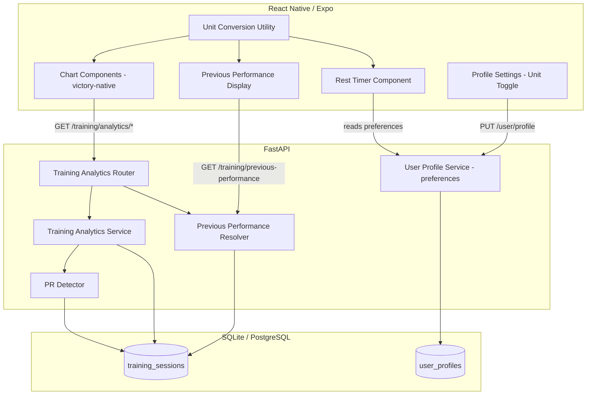

# Design Document: Product Polish V2

## Overview

This design covers five product improvements for HypertrophyOS: training analytics (volume, strength progression, muscle group frequency, PR detection), imperial/metric unit toggle, previous performance display during session logging, real charting library integration, and a configurable rest timer. All features build on the existing FastAPI + SQLAlchemy backend and React Native/Expo frontend with Zustand state management.

The backend stores all data in metric units. The frontend handles unit conversion and display formatting based on user preference. Training analytics are computed on-demand from the existing `training_sessions` table's JSONB `exercises` column. The charting upgrade replaces the current DIY bar sparklines with `victory-native` for interactive charts.

## Architecture



## Components and Interfaces

### Backend Components

#### 1. Training Analytics Service (`src/modules/training/analytics_service.py`)

Computes training analytics from the `training_sessions` table.

```python
class TrainingAnalyticsService:
    def __init__(self, session: AsyncSession) -> None: ...

    async def get_volume_trend(
        self, user_id: UUID, start_date: date, end_date: date,
        muscle_group: str | None = None,
    ) -> list[VolumeTrendPoint]:
        """Compute total volume (sets × reps × weight_kg) per session day."""
        ...

    async def get_strength_progression(
        self, user_id: UUID, exercise_name: str,
        start_date: date, end_date: date,
    ) -> list[StrengthProgressionPoint]:
        """Compute best set or e1RM per session for a specific exercise."""
        ...

    async def get_muscle_group_frequency(
        self, user_id: UUID, start_date: date, end_date: date,
    ) -> list[MuscleGroupFrequency]:
        """Compute sessions per muscle group per week."""
        ...
```

#### 2. PR Detector (`src/modules/training/pr_detector.py`)

Detects personal records when a session is saved.

```python
class PRDetector:
    def __init__(self, session: AsyncSession) -> None: ...

    async def detect_prs(
        self, user_id: UUID, exercises: list[ExerciseEntry],
    ) -> list[PersonalRecord]:
        """Compare each set against historical bests for that exercise+rep count.
        Returns list of PRs detected (empty if none)."""
        ...

    async def get_historical_bests(
        self, user_id: UUID, exercise_name: str,
    ) -> dict[int, float]:
        """Returns {rep_count: best_weight_kg} for a given exercise."""
        ...
```

#### 3. Previous Performance Resolver (`src/modules/training/previous_performance.py`)

Fetches the most recent session data for a given exercise.

```python
class PreviousPerformanceResolver:
    def __init__(self, session: AsyncSession) -> None: ...

    async def get_previous_performance(
        self, user_id: UUID, exercise_name: str,
    ) -> PreviousPerformance | None:
        """Return the last set from the most recent session containing this exercise.
        Returns None if no previous session exists."""
        ...
```

#### 4. Training Analytics Router (`src/modules/training/analytics_router.py`)

New FastAPI router exposing analytics endpoints:

- `GET /training/analytics/volume` — volume trend
- `GET /training/analytics/strength/{exercise_name}` — strength progression
- `GET /training/analytics/muscle-frequency` — muscle group frequency heatmap data
- `GET /training/previous-performance/{exercise_name}` — previous performance for an exercise

#### 5. User Profile Preferences Extension

The existing `PUT /user/profile` endpoint already accepts a `preferences` JSONB field. The unit preference and rest timer defaults will be stored as keys within this blob:

```json
{
  "unit_system": "metric",
  "rest_timer": {
    "compound_seconds": 180,
    "isolation_seconds": 90
  }
}
```

### Frontend Components

#### 6. Unit Conversion Utility (`app/utils/unitConversion.ts`)

Pure functions for converting between metric and imperial.

```typescript
type UnitSystem = 'metric' | 'imperial';

function convertWeight(value: number, from: UnitSystem, to: UnitSystem): number;
function convertHeight(valueCm: number): { feet: number; inches: number };
function formatWeight(valueKg: number, system: UnitSystem): string;
function formatHeight(valueCm: number, system: UnitSystem): string;
function parseWeightInput(input: number, system: UnitSystem): number; // always returns kg
```

#### 7. Chart Components (`app/components/charts/`)

Built on `victory-native`. Three chart components:

- `TrendLineChart` — generic interactive line chart with optional target line, tooltips, and time range selector
- `StrengthChart` — strength progression line chart per exercise
- `TimeRangeSelector` — segmented control for 7d/14d/30d/90d

```typescript
interface TrendLineChartProps {
  data: { date: string; value: number }[];
  color: string;
  targetLine?: number;
  suffix?: string;
  timeRange: '7d' | '14d' | '30d' | '90d';
  onTimeRangeChange: (range: string) => void;
}
```

#### 8. Previous Performance Display (`app/components/training/PreviousPerformance.tsx`)

Inline component shown next to exercise input fields during session logging.

```typescript
interface PreviousPerformanceProps {
  exerciseName: string;
  unitSystem: UnitSystem;
}
// Renders: "Last time: 80kg × 8" or "First time"
```

#### 9. Rest Timer Component (`app/components/training/RestTimer.tsx`)

Countdown overlay that appears after logging a set.

```typescript
interface RestTimerProps {
  durationSeconds: number;
  onDismiss: () => void;
  onComplete: () => void;
  visible: boolean;
}
// Displays: "2:30" countdown, dismiss button, plays sound at zero
```

#### 10. Unit Preference Toggle (`app/screens/profile/ProfileScreen.tsx`)

A toggle row added to the existing Profile settings card for switching between metric and imperial.

## Data Models

### Backend Schemas (new)

```python
# Training analytics response schemas

class VolumeTrendPoint(BaseModel):
    date: date
    total_volume: float  # sets × reps × weight_kg

class StrengthProgressionPoint(BaseModel):
    date: date
    exercise_name: str
    best_weight_kg: float
    best_reps: int
    estimated_1rm: float | None = None

class MuscleGroupFrequency(BaseModel):
    muscle_group: str
    week_start: date
    session_count: int

class PersonalRecord(BaseModel):
    exercise_name: str
    reps: int
    new_weight_kg: float
    previous_weight_kg: float | None = None

class PreviousPerformance(BaseModel):
    exercise_name: str
    session_date: date
    last_set_weight_kg: float
    last_set_reps: int
```

### Exercise-to-Muscle-Group Mapping

A static dictionary mapping exercise names to primary muscle groups:

```python
EXERCISE_MUSCLE_MAP: dict[str, str] = {
    "bench press": "chest",
    "squat": "quadriceps",
    "deadlift": "back",
    "overhead press": "shoulders",
    "barbell row": "back",
    "pull up": "back",
    "bicep curl": "biceps",
    "tricep extension": "triceps",
    "leg press": "quadriceps",
    "lateral raise": "shoulders",
    # ... extensible
}

COMPOUND_EXERCISES: set[str] = {
    "bench press", "squat", "deadlift", "overhead press",
    "barbell row", "leg press", "pull up", "dip",
}
```

Exercises not in the map default to "Other". Compound vs isolation classification drives rest timer defaults.

### User Preferences Schema Extension

No new database columns needed. The existing `preferences` JSONB column on `user_profiles` stores:

```json
{
  "unit_system": "metric" | "imperial",
  "rest_timer": {
    "compound_seconds": 180,
    "isolation_seconds": 90
  }
}
```

### Frontend State Extension

The Zustand store gains a `unitSystem` derived from the profile preferences:

```typescript
// In store/index.ts
interface AppState {
  // ... existing fields
  unitSystem: 'metric' | 'imperial';
}

interface AppActions {
  // ... existing actions
  setUnitSystem: (system: 'metric' | 'imperial') => void;
}
```


## Correctness Properties

*A property is a characteristic or behavior that should hold true across all valid executions of a system — essentially, a formal statement about what the system should do. Properties serve as the bridge between human-readable specifications and machine-verifiable correctness guarantees.*

### Property 1: Volume computation correctness

*For any* set of training sessions with known exercises (each having sets with reps and weight_kg), the total volume returned by the Training Analytics Service for a date range SHALL equal the sum of (reps × weight_kg) across all sets in all exercises in all sessions within that range.

**Validates: Requirements 1.1**

### Property 2: Volume muscle group filtering

*For any* set of training sessions and any muscle group filter, the volume returned SHALL only include contributions from exercises that map to the specified muscle group, and the sum SHALL equal the manually computed volume for those exercises alone.

**Validates: Requirements 1.3**

### Property 3: Strength progression best-set computation

*For any* set of training sessions containing a given exercise, the strength progression time series SHALL return one point per session where the best_weight_kg and best_reps correspond to the set with the highest (weight_kg × reps) product in that session for that exercise.

**Validates: Requirements 2.1**

### Property 4: Muscle group frequency computation

*For any* set of training sessions over a date range, the muscle group frequency data SHALL report a session_count per muscle group per ISO week that equals the number of distinct sessions in that week containing at least one exercise mapped to that muscle group.

**Validates: Requirements 3.1**

### Property 5: Exercise-to-muscle-group mapping completeness

*For any* exercise name present in the EXERCISE_MUSCLE_MAP, the mapping function SHALL return the corresponding muscle group. *For any* exercise name not in the map, the mapping function SHALL return "Other".

**Validates: Requirements 3.2, 3.3**

### Property 6: PR detection correctness

*For any* user with historical training data and a new session being saved, the PR Detector SHALL flag a set as a personal record if and only if its weight_kg exceeds the historical best weight for that exercise at the same rep count. Each flagged PR SHALL include the correct exercise_name, reps, new_weight_kg, and previous_weight_kg. Sets where no historical data exists for that exercise+rep combination SHALL not be flagged as PRs.

**Validates: Requirements 4.1, 4.2, 4.3, 4.4**

### Property 7: Weight conversion round-trip

*For any* non-negative weight value in kilograms, converting to pounds and back to kilograms SHALL produce a value within 0.1 kg of the original (accounting for the rounding specified in Requirement 5.7).

**Validates: Requirements 5.1**

### Property 8: Height conversion round-trip

*For any* positive height value in centimeters, converting to feet/inches and back to centimeters SHALL produce a value within 1 cm of the original.

**Validates: Requirements 5.2**

### Property 9: Preference persistence round-trip

*For any* valid preference object (unit_system or rest_timer settings), persisting the preference and reading it back SHALL return an equivalent object.

**Validates: Requirements 5.3, 8.8**

### Property 10: Unit display formatting

*For any* weight value in kg and unit system preference, the formatted weight string SHALL contain the correct converted value and the appropriate unit suffix ("kg" for metric, "lbs" for imperial). *For any* height value in cm and unit system preference, the formatted height string SHALL contain the correct converted value and the appropriate unit format.

**Validates: Requirements 5.4**

### Property 11: Database metric invariant

*For any* weight or height value input by a user in any unit system, the value persisted to the database SHALL be in metric units (kg for weight, cm for height).

**Validates: Requirements 5.5, 5.6**

### Property 12: Conversion rounding

*For any* weight conversion result, the output SHALL have at most one decimal place. *For any* height conversion to centimeters, the output SHALL be a whole number.

**Validates: Requirements 5.7**

### Property 13: Previous performance recency

*For any* user with multiple training sessions containing a given exercise, the Previous Performance Resolver SHALL return data from the session with the most recent session_date. The returned last_set_weight_kg and last_set_reps SHALL match the final set of that exercise in that session.

**Validates: Requirements 6.1**

### Property 14: Previous performance formatting

*For any* previous performance data with weight and reps, the formatted display string SHALL match the pattern "Last time: {formatted_weight} × {reps}" where formatted_weight respects the user's unit preference.

**Validates: Requirements 6.2**

### Property 15: Time range data filtering

*For any* dataset of trend points with dates and any selected time range (7d, 14d, 30d, 90d), the filtered result SHALL contain only points whose date falls within the selected number of days from today, and SHALL contain all such points from the original dataset.

**Validates: Requirements 7.5**

### Property 16: Rest timer duration selection

*For any* exercise type (compound or isolation) and user preferences, the rest timer SHALL select the custom duration if one is configured for that exercise type, otherwise the default (180s for compound, 90s for isolation). The selected duration SHALL always be a positive integer.

**Validates: Requirements 8.1, 8.2, 8.7**

### Property 17: Timer display formatting

*For any* non-negative integer number of seconds, the timer display formatter SHALL produce a string in "M:SS" format where M is minutes (no leading zero) and SS is seconds (always two digits, zero-padded).

**Validates: Requirements 8.6**

## Error Handling

| Scenario | Behavior |
|---|---|
| Analytics query with invalid date range (start > end) | Return 400 with descriptive error message |
| Strength progression for unknown exercise | Return empty time series (not an error) |
| Previous performance query timeout (>500ms) | Frontend shows exercise input without previous data; does not block logging |
| Unit conversion with negative values | Return 422 validation error |
| Rest timer with zero or negative duration | Clamp to minimum 10 seconds |
| Exercise not in muscle group map | Categorize as "Other" (not an error) |
| Chart data fetch failure | Show "Unable to load chart" with retry button |
| Preference save failure | Show toast error, revert local state to previous value |

## Testing Strategy

### Property-Based Testing

Library: **Hypothesis** (Python backend), **fast-check** (TypeScript frontend)

Each correctness property maps to a single property-based test with minimum 100 iterations. Tests are tagged with the format:

```
Feature: product-polish-v2, Property {N}: {property_title}
```

Backend property tests cover:
- Volume computation (P1, P2)
- Strength progression (P3)
- Muscle group frequency (P4)
- Exercise mapping (P5)
- PR detection (P6)
- Previous performance recency (P13)

Frontend property tests cover:
- Unit conversion round-trips (P7, P8)
- Unit display formatting (P10)
- Database metric invariant (P11)
- Conversion rounding (P12)
- Previous performance formatting (P14)
- Time range filtering (P15)
- Rest timer duration selection (P16)
- Timer display formatting (P17)

### Unit Testing

Unit tests complement property tests for specific examples and edge cases:
- Empty session lists for analytics endpoints
- First-ever exercise (no PR flag)
- Boundary values for unit conversion (0 kg, very large weights)
- "No data for this period" chart state
- Rest timer dismiss/skip behavior
- Preference persistence with partial updates

### Integration Testing

- End-to-end flow: log session → PR detected → response includes PR data
- End-to-end flow: update unit preference → analytics charts reflect new units
- Previous performance resolver returns correct data after multiple sessions logged
