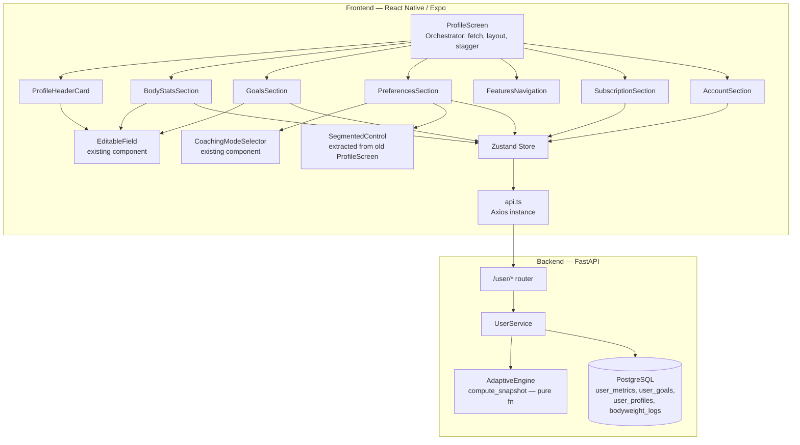
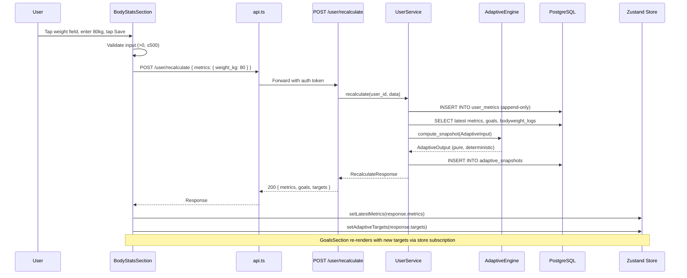

# Design Document — Profile Redesign

## 1. Architecture

### Component Hierarchy



### Why this shape

| Layer | Justification |
|---|---|
| **7 section components** instead of monolithic screen | Current ProfileScreen is ~300 lines with mixed concerns (rest timer state, display name editing, unit toggle, logout). Splitting into sections means each component owns its edit/save lifecycle. ProfileScreen drops to ~100 lines of orchestration. Easier to test, easier to feature-flag individual sections later. |
| **No new backend service class** | The `UserService` already has `log_metrics`, `set_goals`, `get_goals`, `get_profile`. We add one method (`recalculate`) that composes these existing methods + calls the adaptive engine. No new service class needed — that would be an unnecessary layer. |
| **No new database tables** | All data already exists: `user_profiles`, `user_metrics`, `user_goals`, `bodyweight_logs`, `adaptive_snapshots`. The profile redesign is a frontend restructure + one new backend endpoint. Zero migrations. |
| **Store additions are additive** | New slices (`goals`, `latestMetrics`) default to `null`. Existing consumers of `profile`, `unitSystem`, `coachingMode`, `subscription`, `adaptiveTargets` are untouched. No breaking changes. |
| **Unit conversion at display layer only** | All DB values stay in metric (kg, cm). `app/utils/unitConversion.ts` already has `kgToLbs`, `lbsToKg`, `convertHeight`, `formatWeight`, `formatHeight`, `parseWeightInput`. We reuse these. No new conversion logic needed. |

### What I killed

- **Separate RecalculationService**: Considered wrapping the recalculation flow in its own service. Rejected — it's 30 lines of orchestration that belongs in `UserService.recalculate()`. Adding a service class for 30 lines is ceremony, not architecture.
- **WebSocket for real-time target updates**: Considered pushing target updates via WS after recalculation. Rejected — the profile screen is the only consumer, and it already has the response from the POST call. WebSocket adds infra complexity for zero user benefit.
- **Separate metrics-edit modal**: Considered a bottom sheet modal for editing body stats. Rejected — inline editing with `EditableField` is already the pattern used for display name. Consistency > novelty.

## 2. Data Model

### Existing Tables (Zero Changes)

No migrations. No schema changes. Every table below already exists and is untouched.

```
user_profiles
├── id: UUID (PK)
├── user_id: UUID (FK → users.id, UNIQUE, indexed)
├── display_name: VARCHAR(100), nullable
├── avatar_url: VARCHAR(500), nullable
├── timezone: VARCHAR(50), nullable
├── preferred_currency: VARCHAR(3), nullable
├── region: VARCHAR(10), nullable
├── preferences: JSONB, nullable  ← stores unit_system, rest_timer, etc.
├── coaching_mode: VARCHAR(20), default "coached"
├── created_at: TIMESTAMP
└── updated_at: TIMESTAMP

user_metrics (append-only)
├── id: UUID (PK)
├── user_id: UUID (FK → users.id)
├── height_cm: FLOAT, nullable
├── weight_kg: FLOAT, nullable
├── body_fat_pct: FLOAT, nullable
├── activity_level: VARCHAR(20), nullable
├── additional_metrics: JSONB, nullable
├── recorded_at: TIMESTAMP (server_default=now())
├── created_at: TIMESTAMP
├── updated_at: TIMESTAMP
└── INDEX: ix_user_metrics_user_recorded (user_id, recorded_at DESC)

user_goals (upsert — one row per user)
├── id: UUID (PK)
├── user_id: UUID (FK → users.id, UNIQUE, indexed)
├── goal_type: VARCHAR(20)  ← "cutting" | "maintaining" | "bulking"
├── target_weight_kg: FLOAT, nullable
├── target_body_fat_pct: FLOAT, nullable
├── goal_rate_per_week: FLOAT, nullable
├── additional_goals: JSONB, nullable
├── created_at: TIMESTAMP
└── updated_at: TIMESTAMP

bodyweight_logs (append-only)
├── id: UUID (PK)
├── user_id: UUID (FK → users.id)
├── weight_kg: FLOAT
├── recorded_date: DATE
├── created_at: TIMESTAMP
├── updated_at: TIMESTAMP
└── INDEX: ix_bodyweight_logs_user_date (user_id, recorded_date DESC)

adaptive_snapshots (append-only)
├── id: UUID (PK)
├── user_id: UUID (FK → users.id)
├── target_calories: FLOAT
├── target_protein_g: FLOAT
├── target_carbs_g: FLOAT
├── target_fat_g: FLOAT
├── ema_current: FLOAT
├── adjustment_factor: FLOAT
├── input_parameters: JSONB
├── created_at: TIMESTAMP
└── updated_at: TIMESTAMP
```

### Primary Access Patterns

| Query | Table | Index Used | Frequency |
|---|---|---|---|
| Get latest metrics for user | `user_metrics` | `ix_user_metrics_user_recorded` | Every profile load |
| Get user goals | `user_goals` | `user_id` UNIQUE index | Every profile load |
| Get user profile | `user_profiles` | `user_id` UNIQUE index | Every profile load |
| Get bodyweight history (for EMA) | `bodyweight_logs` | `ix_bodyweight_logs_user_date` | Every recalculation |
| Insert new metrics row | `user_metrics` | N/A (append) | Every body stats save |
| Upsert goals | `user_goals` | `user_id` UNIQUE index | Every goals save |

All primary access patterns are indexed. No new indexes needed.

### New Pydantic Schemas (in `src/modules/user/schemas.py`)

```python
class RecalculateRequest(BaseModel):
    """Payload for the recalculate endpoint.
    At least one of metrics or goals must be provided."""
    metrics: UserMetricCreate | None = None
    goals: UserGoalSet | None = None

    @model_validator(mode="after")
    def at_least_one(self) -> "RecalculateRequest":
        if self.metrics is None and self.goals is None:
            raise ValueError("At least one of metrics or goals must be provided")
        return self

class AdaptiveTargetResponse(BaseModel):
    """Computed adaptive targets returned after recalculation."""
    calories: float
    protein_g: float
    carbs_g: float
    fat_g: float

class RecalculateResponse(BaseModel):
    """Response from the recalculate endpoint."""
    metrics: UserMetricResponse | None = None
    goals: UserGoalResponse | None = None
    targets: AdaptiveTargetResponse
```

### Frontend Store Additions (in `app/store/index.ts`)

```typescript
// Additive — no existing state or actions modified
interface AppState {
  // ... all existing fields unchanged ...
  goals: UserGoalResponse | null;        // NEW
  latestMetrics: UserMetricResponse | null; // NEW
}

interface AppActions {
  // ... all existing actions unchanged ...
  setGoals: (goals: UserGoalResponse | null) => void;           // NEW
  setLatestMetrics: (metrics: UserMetricResponse | null) => void; // NEW
}
```

## 3. API Contracts

### New Endpoint: `POST /user/recalculate`

Single endpoint that saves metrics and/or goals, runs the adaptive engine, persists a new snapshot, and returns updated targets. Eliminates 3 sequential round-trips (save → fetch → compute).

**Request:**
```
POST /user/recalculate
Authorization: Bearer <token>
Content-Type: application/json

{
  "metrics": {                    // optional — omit if only changing goals
    "height_cm": 180.0,
    "weight_kg": 80.0,
    "body_fat_pct": 16.0,
    "activity_level": "moderate"
  },
  "goals": {                     // optional — omit if only changing metrics
    "goal_type": "cutting",
    "target_weight_kg": 75.0,
    "goal_rate_per_week": -0.5
  }
}
```

**Response (200):**
```json
{
  "metrics": {
    "id": "uuid",
    "user_id": "uuid",
    "height_cm": 180.0,
    "weight_kg": 80.0,
    "body_fat_pct": 16.0,
    "activity_level": "moderate",
    "recorded_at": "2025-01-15T10:30:00Z",
    "created_at": "2025-01-15T10:30:00Z",
    "updated_at": "2025-01-15T10:30:00Z"
  },
  "goals": {
    "id": "uuid",
    "user_id": "uuid",
    "goal_type": "cutting",
    "target_weight_kg": 75.0,
    "target_body_fat_pct": null,
    "goal_rate_per_week": -0.5,
    "created_at": "2025-01-15T10:30:00Z",
    "updated_at": "2025-01-15T10:30:00Z"
  },
  "targets": {
    "calories": 2180.0,
    "protein_g": 176.0,
    "carbs_g": 220.0,
    "fat_g": 60.56
  }
}
```

**Error Responses:**

| Status | Code | When |
|---|---|---|
| 401 | UNAUTHORIZED | Missing or invalid token |
| 422 | VALIDATION_ERROR | Both metrics and goals are null, or field validation fails |
| 500 | INTERNAL_ERROR | Adaptive engine computation fails (e.g., no bodyweight history) |

### Existing Endpoints Used (No Changes)

| Endpoint | Method | Used For | Called From |
|---|---|---|---|
| `/user/profile` | GET | Load profile on mount | ProfileScreen |
| `/user/profile` | PUT | Save preferences (timezone, region, currency, unit_system, coaching_mode) | PreferencesSection |
| `/user/metrics/history` | GET | "View History" navigation target | BodyStatsSection link |
| `/user/goals` | GET | Load current goals on mount | ProfileScreen |

## 4. Data Flow

### Flow 1: Profile Screen Mount (Parallel Fetch)

```
ProfileScreen.useEffect([], ...)
  ├── api.get("/user/profile")          → store.setProfile(profile)
  ├── api.get("/user/metrics/history?limit=1")  → store.setLatestMetrics(items[0])
  ├── api.get("/user/goals")            → store.setGoals(goals)
  └── api.get("/adaptive/snapshots?limit=1")    → store.setAdaptiveTargets(targets)
  
  All 4 calls fire in parallel via Promise.all.
  Each section renders from store state.
  If any call fails, that section shows error/empty state. Others render normally.
```

### Flow 2: Body Stats Edit → Save → Recalculate



### Flow 3: Goals Edit → Save → Recalculate

Identical to Flow 2, except:
- Request body: `{ goals: { goal_type: "bulking", target_weight_kg: 85, goal_rate_per_week: 0.3 } }`
- `UserService.recalculate` calls `set_goals` instead of `log_metrics`
- Both metrics and goals can be sent simultaneously (e.g., if user changes both)

### Flow 4: Preference Change (Unit System)

```
User taps "Imperial" in SegmentedControl
  → PreferencesSection calls api.put("/user/profile", { preferences: { unit_system: "imperial" } })
  → On success: store.setUnitSystem("imperial"), store.setProfile(updated)
  → BodyStatsSection re-renders: weight shows "176.4 lbs" instead of "80.0 kg"
  → GoalsSection re-renders: target weight shows "165.3 lbs" instead of "75.0 kg"
  → No recalculation needed — unit conversion is display-only
```

### Flow 5: Danger Zone → Delete Account

```
User taps "Danger Zone" header
  → AccountSection: setDangerZoneExpanded(true)
  → LayoutAnimation.configureNext(LayoutAnimation.Presets.easeInEaseOut)
  → Delete Account button slides into view

User taps "Delete Account"
  → Alert.alert("Delete Account", "Your account will be deactivated for 30 days...", [Cancel, Delete])
  → User taps "Delete"
  → api.delete("/user/account")
  → On success: store.clearAuth() → navigate to login
  → On failure: Alert.alert("Error", "Failed to delete account")
```

## 5. Edge Cases & Error Handling

| Scenario | What Happens | Why This Design |
|---|---|---|
| **No metrics exist** (new user) | `GET /user/metrics/history?limit=1` returns empty array. `latestMetrics` stays `null`. BodyStatsSection renders empty state with CTA: "Add your body stats to get personalized targets." | Empty dashes feel broken. A CTA converts the empty state into an onboarding moment. |
| **No goals set** | `GET /user/goals` returns `null`. GoalsSection renders empty state with CTA: "Set your first goal." | Same reasoning. Every "Not set" is a micro-frustration. |
| **Network failure during save** | Axios throws. Section catches error, shows inline message: "Couldn't save. Check your connection." Edited value stays in field state (not cleared). | User shouldn't lose their input. Inline error is less disruptive than Alert. |
| **Recalculation returns 500** | Section catches error, shows: "Targets couldn't be updated. Your previous targets are still active." Store retains previous `adaptiveTargets`. | Partial failure: metrics/goals may have saved but snapshot failed. Previous targets are still valid. |
| **Bodyweight history empty** (engine needs ≥1 entry) | `recalculate` method checks if bodyweight_logs is empty. If so, uses the weight_kg from the metrics as a single-entry history. | The engine requires `min_length=1` for bodyweight_history. Using current weight as fallback is the most reasonable default. |
| **Timezone not detectable** | `Intl.DateTimeFormat().resolvedOptions().timeZone` returns undefined on some older Android devices. Fall back to `"UTC"`. Show timezone picker with "UTC" pre-selected. | UTC is the safest default. User can override manually. |
| **Concurrent profile edits** (two tabs/devices) | Last-write-wins. Profile screen fetches fresh data on mount. Metrics are append-only so no conflict. Goals are upsert so last write wins. | Single-user app. Concurrent edits are extremely unlikely. Last-write-wins is the simplest correct behavior. |
| **Delete account API fails** | Alert: "Failed to delete account." User stays logged in. Account remains active. | Never log out on a failed delete — user would lose access to an account that still exists. |
| **Invalid metric values** (negative weight, >100% body fat) | Frontend: field-level validation before save button enables. Backend: Pydantic `Field(gt=0)`, `Field(ge=0, le=100)` returns 422. | Defense in depth. Frontend catches most issues; backend is the source of truth. |
| **RecalculateRequest with both fields None** | Pydantic `model_validator` rejects with 422: "At least one of metrics or goals must be provided." Frontend never sends this (UI flow always has at least one field). | Belt and suspenders. The validator exists for API consumers beyond the profile screen. |
| **Feature flag off** | `ProfileScreen` checks `profile_redesign` flag. If off, renders the old `ProfileScreenLegacy` component. | Zero-risk rollback. Old screen stays in codebase until flag is 100% and stable. |
| **Imperial unit rounding** | Weight: stored as kg, displayed as lbs with 1 decimal. Height: stored as cm, displayed as ft′in″ with inches rounded to nearest integer. Rounding happens at display layer only. | Rounding at storage would accumulate drift. Display-only conversion is idempotent. |
| **User saves metrics but has no goals** | `recalculate` method: if goals are null, skip goal-dependent parts of the adaptive computation. Return targets based on metrics + default maintenance goal. | User shouldn't be blocked from updating stats just because they haven't set goals yet. |
| **Rapid successive saves** (user taps save twice) | Save button disabled while `saving` state is true. Second tap is a no-op. | Prevents duplicate metric entries in the append-only table. |

## 6. Scalability

This feature is a profile settings screen. It's read-heavy, single-user, and low-frequency. Scalability concerns are minimal, but here's the analysis:

| Concern | Current Scale | At 10x | At 100x | Mitigation |
|---|---|---|---|---|
| **Profile load (4 parallel queries)** | 4 indexed queries per load. Sub-10ms each. | Same — all queries are user-scoped with indexes. | Same — no table scans, no joins. | Already optimized. |
| **Metrics table growth** (append-only) | ~52 rows/user/year (weekly updates). 10K users = 520K rows. | 5.2M rows. Index on (user_id, recorded_at DESC) handles this. | 52M rows. Still fine with the composite index. Consider partitioning by user_id if needed. | Composite index already exists. |
| **Recalculate endpoint** | Reads bodyweight_logs (up to 90 days), runs pure computation. ~50ms total. | Same — computation is O(n) on bodyweight entries, capped at ~90 entries. | Same — no scaling concern. | Already bounded. |
| **Adaptive snapshot table growth** | ~52 rows/user/year. Same as metrics. | Same analysis. | Same analysis. | Same mitigation. |
| **Bottleneck** | None identified. The profile screen is not a hot path. | The hot path is the dashboard (daily nutrition logging). Profile is visited ~2x/week. | Even at 100x users, profile load is 4 indexed queries. No bottleneck. | N/A |

## 7. Tech Decisions

| Decision | Choice | Tradeoffs | Why This Choice |
|---|---|---|---|
| **State management** | Zustand (existing) | Pro: minimal boilerplate, no context providers, direct store access. Con: no built-in devtools like Redux. | Already in use. Adding Redux for one feature would be absurd. |
| **Inline editing** | Reuse `EditableField` component | Pro: consistent UX, already tested. Con: limited to text inputs — need to extend for dropdowns (activity level, goal type). | Consistency with existing display name editing. Extend with a `type` prop for dropdown variant. |
| **Recalculate endpoint** vs. client-side computation | Server-side via `POST /user/recalculate` | Pro: single source of truth, persists snapshot, uses full bodyweight history. Con: requires network call. | The adaptive engine needs bodyweight history (up to 90 days) which the client doesn't have. Server-side is the only correct option. |
| **Feature flag** | Boolean flag in user profile preferences JSONB | Pro: no new infra, already have JSONB preferences. Con: not a proper feature flag service. | Good enough for staged rollout. If we need more sophisticated flagging later, we can migrate to LaunchDarkly. |
| **Animation for number transitions** | React Native Animated API with `timing` (300ms) | Pro: built-in, no extra dependency. Con: not as smooth as Reanimated for complex animations. | Number count-up is simple enough for the built-in API. Reanimated is overkill here. |
| **Timezone detection** | `Intl.DateTimeFormat().resolvedOptions().timeZone` | Pro: built-in, no dependency. Con: returns undefined on some older Android devices. | Fallback to UTC handles the edge case. No need for a timezone library. |
| **Danger Zone animation** | `LayoutAnimation.configureNext()` | Pro: simple, built-in. Con: doesn't work on Android without `UIManager.setLayoutAnimationEnabledExperimental(true)`. | Already enabled in the app (used elsewhere). Simple expand/collapse doesn't need Reanimated. |
| **Property-based testing** | fast-check (frontend), hypothesis (backend) — both already in use | Pro: already configured, team knows them. Con: none. | No decision to make — these are the existing tools. |

## 8. Components and Interfaces

### Frontend Components — Detailed Contracts

#### ProfileScreen (`app/screens/profile/ProfileScreen.tsx` — complete rewrite)

```typescript
// Orchestrator. Fetches data on mount, renders 7 sections with staggered entrance.
// No edit logic — all editing is delegated to section components.
// ~100 lines of orchestration code.

export function ProfileScreen() {
  // 1. Fetch profile, latestMetrics, goals, adaptiveTargets in parallel on mount
  // 2. Render sections with useStaggeredEntrance(index, 60)
  // 3. Pass store state as props to each section
  // 4. Feature flag check: if !profile_redesign, render ProfileScreenLegacy
}
```

#### BodyStatsSection (`app/components/profile/BodyStatsSection.tsx`)

```typescript
interface BodyStatsSectionProps {
  metrics: UserMetricResponse | null;  // null = empty state
  unitSystem: 'metric' | 'imperial';
}

// Renders:
//   - 4 stat fields: height, weight, body fat %, activity level
//   - Last updated date (relative: "3 days ago")
//   - "View History" link → navigation.navigate('MetricsHistory')
//   - Empty state CTA when metrics is null
//
// Edit flow:
//   - Tap any field → inline edit mode (EditableField)
//   - Save → POST /user/recalculate { metrics: { ...updatedFields } }
//   - On success → store.setLatestMetrics(), store.setAdaptiveTargets()
//   - On error → inline error message, retain edited value
//
// Unit conversion:
//   - Weight: formatWeight(kg, unitSystem) from unitConversion.ts
//   - Height: formatHeight(cm, unitSystem) from unitConversion.ts
//   - Input parsing: parseWeightInput(value, unitSystem) before sending to API
```

#### GoalsSection (`app/components/profile/GoalsSection.tsx`)

```typescript
interface GoalsSectionProps {
  goals: UserGoalResponse | null;  // null = empty state
  adaptiveTargets: AdaptiveTargets | null;
  unitSystem: 'metric' | 'imperial';
}

// Renders:
//   - Goal type (cutting/maintaining/bulking) — dropdown selector
//   - Target weight — editable field
//   - Goal rate (kg/week or lbs/week) — editable field
//   - Divider: "Current Targets"
//   - TDEE/macro display: calories, protein_g, carbs_g, fat_g
//   - Empty state CTA when goals is null
//
// Edit flow:
//   - Save → POST /user/recalculate { goals: { ...updatedFields } }
//   - On success → store.setGoals(), store.setAdaptiveTargets()
//   - Number transition animation on target values when they change
```

#### PreferencesSection (`app/components/profile/PreferencesSection.tsx`)

```typescript
interface PreferencesSectionProps {
  profile: UserProfile;
  unitSystem: 'metric' | 'imperial';
  coachingMode: string;
}

// Renders 5 preference rows:
//   1. Unit System — SegmentedControl (metric/imperial)
//   2. Timezone — text display + picker (auto-detect on first load if null)
//   3. Region — text display + picker
//   4. Currency — text display + picker
//   5. Coaching Mode — CoachingModeSelector (existing component)
//
// Each change: PUT /user/profile with updated field → update store
// No rest timer controls (Requirement 8)
```

#### AccountSection (`app/components/profile/AccountSection.tsx`)

```typescript
interface AccountSectionProps {
  onLogout: () => void;
}

// Renders:
//   - Log Out button (secondary variant)
//   - Danger Zone header (TouchableOpacity, collapsed by default)
//   - When expanded: Delete Account button (danger variant)
//   - App version (from expo-constants)
//
// Internal state: dangerZoneExpanded (boolean)
// Expand animation: LayoutAnimation.configureNext(easeInEaseOut)
// Delete flow: Alert.alert with Cancel/Delete → api.delete("/user/account")
```

### Backend — New Method in UserService

```python
# In src/modules/user/service.py — one new method

async def recalculate(
    self, user_id: uuid.UUID, data: RecalculateRequest
) -> RecalculateResponse:
    """Save metrics/goals, run adaptive engine, persist snapshot, return targets.
    
    Steps:
    1. If data.metrics provided → self.log_metrics(user_id, data.metrics)
    2. If data.goals provided → self.set_goals(user_id, data.goals)
    3. Fetch latest metrics (SELECT ... ORDER BY recorded_at DESC LIMIT 1)
    4. Fetch current goals (SELECT ... WHERE user_id = ...)
    5. Fetch bodyweight history (last 90 days)
    6. Fetch user profile (for age, sex — needed by engine)
    7. Build AdaptiveInput from all fetched data
    8. Call compute_snapshot(input) — pure, deterministic
    9. Persist AdaptiveSnapshot
    10. Return RecalculateResponse with metrics, goals, targets
    
    If no bodyweight history exists, use current weight_kg as single entry.
    If no goals exist and data.goals is None, use default MAINTAINING goal.
    """
```

### Backend — New Route

```python
# In src/modules/user/router.py — one new route

@router.post("/recalculate", response_model=RecalculateResponse)
async def recalculate(
    data: RecalculateRequest,
    user: User = Depends(get_current_user),
    service: UserService = Depends(_get_user_service),
) -> RecalculateResponse:
    """Save metrics/goals and return updated adaptive targets."""
    return await service.recalculate(user.id, data)
```

## Correctness Properties

*A property is a characteristic or behavior that should hold true across all valid executions of a system — essentially, a formal statement about what the system should do. Properties serve as the bridge between human-readable specifications and machine-verifiable correctness guarantees.*

### Property 1: Avatar initial derivation

*For any* non-empty string (display name or email), the derived avatar initial SHALL be the uppercase version of the first character of that string.

**Validates: Requirements 1.1**

Reasoning: The avatar initial is a pure function: `str[0].toUpperCase()`. We generate random non-empty strings (including Unicode, emoji, whitespace-prefixed) and verify the initial is always the uppercase first character. This catches edge cases like strings starting with lowercase, numbers, or special characters.

### Property 2: Recalculation consistency

*For any* valid `RecalculateRequest` containing metrics and/or goals, and *for any* existing bodyweight history, the `recalculate` service method SHALL return adaptive targets identical to calling `compute_snapshot()` directly with the same assembled `AdaptiveInput`.

**Validates: Requirements 2.2, 2.3, 3.2, 3.3, 9.1, 9.2**

Reasoning: The recalculate method is orchestration — it assembles inputs and delegates to the pure engine. The invariant is that the orchestration doesn't introduce drift. We generate random valid metrics, goals, and bodyweight histories, run the recalculate method, and compare the returned targets against a direct `compute_snapshot()` call with the same inputs. Any mismatch means the orchestration is buggy.

### Property 3: Unit conversion round-trip

*For any* weight value in kilograms (0.1 ≤ kg ≤ 500), `lbsToKg(kgToLbs(kg))` SHALL produce a value within ±0.05 kg of the original. *For any* height value in centimeters (50 ≤ cm ≤ 300), converting to feet/inches via `convertHeight(cm, 'imperial')` and back via `ftInToCm(feet, inches)` SHALL produce a value within ±1.5 cm of the original.

**Validates: Requirements 2.6, 3.5**

Reasoning: Unit conversions involve floating-point rounding. The round-trip property ensures conversions don't drift beyond acceptable tolerance. The existing `kgToLbs`/`lbsToKg` functions round to 2 decimal places, so ±0.05 kg tolerance accounts for this. Height conversion rounds inches to nearest integer, so ±1.5 cm tolerance accounts for the integer rounding.

### Property 4: RecalculateRequest validation

*For any* `RecalculateRequest` where both `metrics` and `goals` are `None`, the Pydantic validator SHALL reject with a validation error. *For any* request where at least one of `metrics` or `goals` contains valid data, the validator SHALL accept the request.

**Validates: Requirements 9.1, 9.2**

Reasoning: The model_validator enforces a business rule: you can't recalculate with nothing to recalculate. We generate random combinations of None/valid-metrics and None/valid-goals and verify the validation behavior is correct. This catches regressions if someone refactors the validator.

## Error Handling

| Scenario | Frontend Behavior | Backend Behavior |
|---|---|---|
| **Network failure during save** | Inline error below field: "Couldn't save. Check your connection." Retain edited values. | N/A — request never reaches backend |
| **Recalculation endpoint 500** | "Targets couldn't be updated. Your previous targets are still active." Keep previous `adaptiveTargets` in store. | Log error with request_id, return structured ApiError |
| **Invalid metrics values** (negative weight) | Frontend validation prevents submission. Field-level error message. | Pydantic `Field(gt=0)` returns 422 with field errors |
| **Invalid goals values** (unknown goal_type) | Frontend validation prevents submission. | Pydantic enum validation returns 422 |
| **RecalculateRequest both fields None** | Frontend never sends this (UI flow always has at least one field). | Pydantic model_validator returns 422 |
| **Profile fetch fails on mount** | Section shows skeleton → error state with retry button. Other sections render normally. | Return 500 with structured error |
| **Delete account API fails** | Alert: "Failed to delete account." Do NOT log out. | Return 500, account remains active |
| **Timezone auto-detect fails** | Fall back to "UTC". Show picker with manual selection. | N/A — client-side detection |
| **No bodyweight history for engine** | Backend uses current weight_kg as single-entry history. | Fallback in recalculate method |
| **Rapid successive saves** | Save button disabled while `saving=true`. Second tap is no-op. | Append-only tables handle duplicates gracefully |

## Testing Strategy

### Property-Based Tests

Each correctness property maps to exactly one property-based test with minimum 100 iterations.

**Frontend (Jest + fast-check):**

| Test | Property | Library | Iterations |
|---|---|---|---|
| `avatarInitial.property.test.ts` | Property 1: Avatar initial derivation | fast-check | 100 |
| `unitConversionRoundTrip.property.test.ts` | Property 3: Unit conversion round-trip | fast-check | 100 |

Tag format: `// Feature: profile-redesign, Property N: <title>`

**Backend (pytest + hypothesis):**

| Test | Property | Library | Iterations |
|---|---|---|---|
| `test_recalculation_consistency` | Property 2: Recalculation consistency | hypothesis | 100 |
| `test_recalculate_request_validation` | Property 4: RecalculateRequest validation | hypothesis | 100 |

Tag format: `# Feature: profile-redesign, Property N: <title>`

### Unit Tests

**Frontend (`app/__tests__/`):**

- `BodyStatsSection.test.tsx`: renders all 4 fields, handles empty state CTA, shows error on save failure, displays imperial units when toggled
- `GoalsSection.test.tsx`: renders goal fields + targets, handles empty state CTA, shows error on save failure, animates number change
- `PreferencesSection.test.tsx`: renders all 5 controls, timezone auto-detect fallback to UTC
- `AccountSection.test.tsx`: Danger Zone collapsed by default, expands on tap, delete confirmation dialog, app version displayed
- `ProfileScreen.test.tsx`: rest timer fields absent, all 7 sections render, parallel data fetch on mount

**Backend (`tests/`):**

- `test_recalculate_endpoint.py`: saves metrics, saves goals, returns correct targets, handles no-bodyweight-history fallback, rejects empty request
- `test_recalculate_request_schema.py`: validates at-least-one rule, accepts metrics-only, accepts goals-only, accepts both
- Regression: existing `/user/profile`, `/user/metrics`, `/user/goals` endpoints unchanged

### Test Configuration

- Frontend: `jest` with `fast-check` — `fc.assert(property, { numRuns: 100 })`
- Backend: `pytest` with `hypothesis` — `@settings(max_examples=100)`
- All property tests tagged with feature name and property number
- Unit tests use standard Jest matchers (frontend) and pytest assertions (backend)
