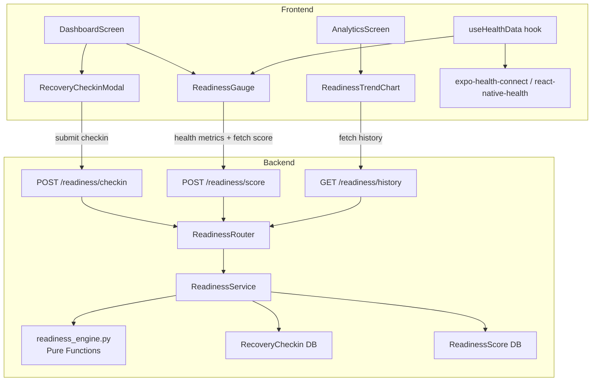
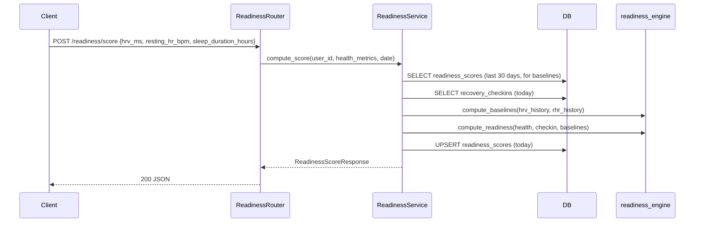

# Design Document: Recovery Readiness Score

## Overview

This feature adds a daily Recovery Readiness Score (0–100) that combines device health data (HRV, resting heart rate, sleep) with optional user-reported recovery signals (soreness, stress, sleep quality). The score is displayed on the dashboard as a circular gauge with color coding and factor breakdown, and tracked over time on the analytics screen.

The design follows the existing architecture pattern: pure computation functions in a dedicated engine module (`readiness_engine.py`), a thin async service layer for DB access, Pydantic schemas for API contracts, and React Native components for the frontend.

In v1 the score is informational only — no training modification. Deferred to v2.

### Prerequisites

- Existing `Base` model, auth middleware, `ProgressRing`, `TrendLineChart`, `DashboardScreen`, `AnalyticsScreen` — all exist
- Hypothesis — already in dev dependencies
- `expo-health-connect` and `react-native-health` — must be installed (Step 0)
- No new secrets, environment variables, or infrastructure changes
- No feature flags — endpoints are additive, frontend degrades gracefully

### Explicitly Cut from v1

- No training recommendation modification (v2)
- No fatigue detection integration (v2)
- No push notifications, background sync, social features
- No user-configurable weights (hardcoded defaults)
- No caching layer — request-time computation is fast enough

## Architecture



### Request Flow



### Revised Execution Plan

No circular dependencies. Each step references only artifacts from prior steps. Verified: no step reads a file created in a later step.

#### Phase 0: Environment Setup

| # | Action | File/Command | Risk | Mitigation | Rollback |
|---|--------|-------------|------|------------|----------|
| 0.1 | Install health packages | `npx expo install expo-health-connect react-native-health` | Expo SDK version conflict | Pin to SDK-compatible versions per Expo docs; run `npx expo doctor` | `npm uninstall expo-health-connect react-native-health` |
| 0.2 | Verify build compiles | `npx expo prebuild --clean && npx expo run:ios` (or Android) | Native module linking failure | Check Expo config plugins are registered in `app.json` | Revert `package.json` + `rm -rf ios android` |
| 0.3 | Create module directory | `mkdir -p src/modules/readiness` + `touch src/modules/readiness/__init__.py` | Nothing | — | `rm -rf src/modules/readiness` |

**Gate 0**: App builds and starts on both platforms. No new runtime errors in existing screens.

#### Phase 1: Pure Engine (Zero Dependencies)

| # | Action | File | Depends On | Risk | Mitigation | Rollback |
|---|--------|------|-----------|------|------------|----------|
| 1.1 | Create readiness engine with all dataclasses and pure functions | `src/modules/readiness/readiness_engine.py` | Nothing | Logic bugs in normalization formulas (division by zero when baseline=0) | Guard: if baseline ≤ 0, return 0.5 (neutral). Property tests in 1.2 catch formula errors | Delete file |
| 1.2 | Write property-based tests (P1-P5) + unit tests | `tests/test_readiness_properties.py` + `tests/test_readiness_unit.py` | 1.1 | Flaky Hypothesis generators producing edge values (NaN, inf) | Use `st.floats(min_value=0.1, max_value=300, allow_nan=False, allow_infinity=False)`. Set `@settings(max_examples=200)` | Fix generators |

**CHECKPOINT A**: `pytest tests/test_readiness_properties.py tests/test_readiness_unit.py -v` — ALL must pass. Do NOT proceed to Phase 2 until green. This validates: e1RM-style formula correctness, normalization bounds [0,1], weight redistribution summing to 1.0, score clamping [0,100], partial data handling.

#### Phase 2: Data Layer + API (Depends on Phase 1)

| # | Action | File | Depends On | Risk | Mitigation | Rollback |
|---|--------|------|-----------|------|------------|----------|
| 2.1 | Create SQLAlchemy models for `recovery_checkins` and `readiness_scores` | `src/modules/readiness/readiness_models.py` | Nothing (uses existing `Base`) | JSONB column not compatible with SQLite dev mode | Add JSONB→JSON patch in `main.py` lifespan (existing pattern) | Delete file |
| 2.2 | Create Pydantic request/response schemas | `src/modules/readiness/readiness_schemas.py` | Nothing | Schema field names drift from engine dataclass names | Name fields identically to engine dataclasses | Delete file |
| 2.3 | Write round-trip property test (P7) for schemas | Add to `tests/test_readiness_properties.py` | 2.2 | Datetime serialization edge cases | Use `datetime.now(UTC)` in generators | Fix test |
| 2.4 | Create async service layer | `src/modules/readiness/readiness_service.py` | 1.1, 2.1, 2.2 | Upsert SQL wrong (INSERT ON CONFLICT syntax); baseline query fetches wrong date range | Write explicit SQL test in 2.7; use `(user_id, score_date)` unique constraint for upsert | Delete file |
| 2.5 | Create FastAPI router with 3 endpoints | `src/modules/readiness/readiness_router.py` | 2.2, 2.4 | Auth dependency import path wrong | Copy pattern from `src/modules/training/router.py` exactly | Delete file |
| 2.6 | Wire router into `main.py`: add import + `app.include_router(readiness_router, prefix="/api/v1/readiness", tags=["readiness"])`. Add model import in lifespan block. | `src/main.py` (2 lines) | 2.5 | Import typo breaks ALL endpoints on startup | Verify: `python -c "from src.main import app; print('OK')"` | Revert 2-line change |
| 2.7 | Write integration tests covering every handler, state transition, and failure mode | `tests/test_readiness_integration.py` | 2.1-2.6 | Test DB setup; conftest missing readiness fixtures | Use existing `conftest.py` async session fixture | Delete file |

**Integration test coverage (2.7) must include ALL of these**:
- `POST /readiness/checkin` — happy path (201), invalid values outside 1-5 (422), unauthenticated (401)
- `POST /readiness/checkin` — upsert: submit twice for same date, verify second overwrites first
- `POST /readiness/score` — happy path with health + check-in (200), health only (200), check-in only (200), all null (200, score=null)
- `POST /readiness/score` — baseline computation with <7 days history (HRV factor absent)
- `GET /readiness/history` — happy path, empty range, invalid range start>end (422), unauthenticated (401)
- Response schema validation: every response matches Pydantic model

**CHECKPOINT B**: `pytest -v` (full backend suite) — ALL must pass including existing tests. Verify no regressions. Do NOT proceed to Phase 3 until green.

#### Phase 3: Frontend (Depends on Phase 2 API contract)

| # | Action | File | Depends On | Risk | Mitigation | Rollback |
|---|--------|------|-----------|------|------------|----------|
| 3.1 | Create pure color/label utility | `app/utils/readinessScoreLogic.ts` | Nothing | Trivial | Tests in 3.2 | Delete file |
| 3.2 | Write color/label tests (P6) | `app/__tests__/utils/readinessScoreLogic.test.ts` | 3.1 | N/A | — | Delete file |
| 3.3 | Create health data hook with platform branching | `app/hooks/useHealthData.ts` | 0.1 (packages) | iOS HealthKit entitlement missing; Android Health Connect not installed on device | Add HealthKit entitlement to `app.json`; graceful fallback to all-null on error | Delete file |
| 3.4 | Create recovery check-in modal | `app/components/modals/RecoveryCheckinModal.tsx` | API contract (2.2) | Request body shape mismatch with backend | Match `CheckinRequest` schema field names exactly | Delete file |
| 3.5 | Create readiness gauge component | `app/components/dashboard/ReadinessGauge.tsx` | 3.1, 3.3 | SVG rendering issues on Android | Test on both platforms; use same SVG pattern as existing `ProgressRing` | Delete file |
| 3.6 | Wire gauge + check-in modal into DashboardScreen | `app/screens/dashboard/DashboardScreen.tsx` | 3.4, 3.5 | Dashboard crash if readiness API throws | Wrap entire readiness section in try/catch; render nothing on error; fire-and-forget pattern (same as existing WeeklyCheckinCard) | Revert changes to DashboardScreen |
| 3.7 | Create readiness trend chart | `app/components/analytics/ReadinessTrendChart.tsx` | 3.1 | N/A | — | Delete file |
| 3.8 | Wire trend chart into AnalyticsScreen | `app/screens/analytics/AnalyticsScreen.tsx` | 3.7 | Analytics crash if history API throws | Wrap in try/catch; render empty state on error | Revert changes to AnalyticsScreen |
| 3.9 | Write frontend component tests | `app/__tests__/components/ReadinessGauge.test.ts` + `app/__tests__/components/RecoveryCheckinModal.test.ts` | 3.4-3.8 | N/A | — | Delete files |

**Frontend test coverage (3.9) must include**:
- ReadinessGauge: renders with valid score, renders empty state when score=null, shows correct color per band, displays factor breakdown, tappable opens modal
- RecoveryCheckinModal: renders three stepper inputs, submit calls API with correct payload, displays validation feedback for out-of-range values

**CHECKPOINT C**: `npx jest --testPathPattern=readiness` + `npx jest` (full frontend suite) — ALL must pass. Do NOT ship until green.

#### Phase 4: Full Regression

**CHECKPOINT D**: `pytest -v` + `npx jest` — full backend + frontend suites. Zero regressions. Ready to deploy.

#### Parallelization Map

```
Phase 0 ──────────────────────────────────────────────────────
  0.1, 0.2, 0.3 (sequential — build depends on install)

Phase 1 ──────────────────────────────────────────────────────
  1.1 → 1.2 (sequential)

Phase 2 ──────────────────────────────────────────────────────
  2.1 ∥ 2.2 (no dependency between models and schemas)
  2.3 depends on 2.2
  2.4 depends on 1.1 + 2.1 + 2.2
  2.5 depends on 2.2 + 2.4
  2.6 depends on 2.5
  2.7 depends on 2.1-2.6

Phase 3 ──────────────────────────────────────────────────────
  3.1 + 3.2 ∥ 3.3 (no dependency)
  3.4 depends on API contract (2.2)
  3.5 depends on 3.1 + 3.3
  3.6 depends on 3.4 + 3.5
  3.7 depends on 3.1
  3.8 depends on 3.7
  3.9 depends on 3.4-3.8
```

## Components and Interfaces

### Backend Components

#### 1. `src/modules/readiness/readiness_engine.py` — Pure Computation Module

Zero side effects. Deterministic given the same inputs.

```python
from dataclasses import dataclass

@dataclass(frozen=True)
class HealthMetrics:
    hrv_ms: float | None = None
    resting_hr_bpm: float | None = None
    sleep_duration_hours: float | None = None

@dataclass(frozen=True)
class UserCheckin:
    soreness: int | None = None      # 1-5 (1=none, 5=very sore)
    stress: int | None = None        # 1-5 (1=none, 5=very stressed)
    sleep_quality: int | None = None # 1-5 (1=poor, 5=excellent)

@dataclass(frozen=True)
class Baselines:
    hrv_mean: float | None = None
    resting_hr_mean: float | None = None
    hrv_data_days: int = 0
    resting_hr_data_days: int = 0

@dataclass(frozen=True)
class ReadinessWeights:
    hrv_trend: float = 0.25
    resting_hr_trend: float = 0.15
    sleep_duration: float = 0.20
    sleep_quality: float = 0.15
    soreness: float = 0.15
    stress: float = 0.10

@dataclass(frozen=True)
class FactorScore:
    name: str
    normalized: float   # 0.0-1.0 (1.0 = optimal)
    weight: float
    effective_weight: float
    present: bool

@dataclass(frozen=True)
class ReadinessResult:
    score: int | None   # 0-100, None if all factors absent
    factors: list[FactorScore]
    factors_present: int
    factors_total: int

MIN_BASELINE_DAYS = 7

def compute_baselines(hrv_history: list[float], resting_hr_history: list[float]) -> Baselines:
    """Arithmetic mean of up to 30 days of history. Returns data_days counts."""

def normalize_hrv_factor(current_hrv: float, baseline_hrv: float) -> float:
    """clamp((current/baseline - 0.7) / 0.6, 0, 1). Higher HRV = better."""

def normalize_resting_hr_factor(current_hr: float, baseline_hr: float) -> float:
    """clamp((baseline/current - 0.85) / 0.3, 0, 1). Lower HR = better."""

def normalize_sleep_duration(hours: float) -> float:
    """clamp((hours - 4) / 4, 0, 1). 4h=0.0, 8h+=1.0."""

def normalize_checkin_factor(value: int) -> float:
    """(5 - value) / 4. For soreness/stress: 1=1.0, 5=0.0."""

def normalize_sleep_quality(value: int) -> float:
    """(value - 1) / 4. 1=0.0, 5=1.0."""

def redistribute_weights(weights: ReadinessWeights, present: dict[str, bool]) -> dict[str, float]:
    """Proportional redistribution. Present factors sum to 1.0. Absent = 0.0."""

def compute_readiness(
    health: HealthMetrics, checkin: UserCheckin | None,
    baselines: Baselines, weights: ReadinessWeights = ReadinessWeights(),
) -> ReadinessResult:
    """Pure computation. None score if all factors absent. Clamped [0, 100]."""
```

#### 2. `src/modules/readiness/readiness_service.py` — Async Service Layer

```python
class ReadinessService:
    def __init__(self, session: AsyncSession): ...

    async def submit_checkin(self, user_id: UUID, data: CheckinRequest) -> CheckinResponse:
        """Upsert recovery check-in for the given date (unique on user_id + checkin_date)."""

    async def compute_score(self, user_id: UUID, health: HealthMetricsRequest, target_date: date) -> ReadinessScoreResponse:
        """1. Fetch 30-day score history for baselines
        2. Fetch today's check-in
        3. Call engine.compute_readiness()
        4. Upsert score to readiness_scores
        5. Return response"""

    async def get_history(self, user_id: UUID, start_date: date, end_date: date) -> list[ReadinessScoreResponse]:
        """Fetch scores in date range, ordered by score_date DESC."""
```

#### 3. `src/modules/readiness/readiness_schemas.py` — Pydantic Schemas

```python
class HealthMetricsRequest(BaseModel):
    hrv_ms: float | None = Field(None, ge=0, le=300)
    resting_hr_bpm: float | None = Field(None, ge=20, le=220)
    sleep_duration_hours: float | None = Field(None, ge=0, le=24)

class CheckinRequest(BaseModel):
    soreness: int = Field(ge=1, le=5)
    stress: int = Field(ge=1, le=5)
    sleep_quality: int = Field(ge=1, le=5)
    checkin_date: date

class CheckinResponse(BaseModel):
    id: UUID; user_id: UUID; soreness: int; stress: int; sleep_quality: int
    checkin_date: date; created_at: datetime
    model_config = {"from_attributes": True}

class FactorScoreResponse(BaseModel):
    name: str; normalized: float; weight: float; effective_weight: float; present: bool

class ReadinessScoreResponse(BaseModel):
    id: UUID; user_id: UUID; score: int | None; score_date: date
    factors: list[FactorScoreResponse]; factors_present: int; factors_total: int
    created_at: datetime
    model_config = {"from_attributes": True}

class ReadinessHistoryResponse(BaseModel):
    items: list[ReadinessScoreResponse]; start_date: date; end_date: date
```

#### 4. `src/modules/readiness/readiness_router.py` — FastAPI Router

```python
router = APIRouter()

@router.post("/checkin", response_model=CheckinResponse, status_code=201)
async def submit_checkin(data: CheckinRequest, user=Depends(get_current_user), db=Depends(get_db)): ...

@router.post("/score", response_model=ReadinessScoreResponse)
async def compute_score(data: HealthMetricsRequest, user=Depends(get_current_user), db=Depends(get_db)): ...

@router.get("/history", response_model=ReadinessHistoryResponse)
async def get_history(start_date: date = Query(...), end_date: date = Query(...), user=Depends(get_current_user), db=Depends(get_db)): ...
```

### Frontend Components

#### 1. `app/hooks/useHealthData.ts`

```typescript
interface HealthData {
  hrv_ms: number | null;
  resting_hr_bpm: number | null;
  sleep_duration_hours: number | null;
  permissionGranted: boolean;
  loading: boolean;
  error: string | null;
}
export function useHealthData(): HealthData { ... }
```

Platform-branched: `expo-health-connect` on Android, `react-native-health` on iOS. Requests permissions on first call. Falls back to null values on denial or unavailability. Tries last 48h if today's data missing.

#### 2. `app/utils/readinessScoreLogic.ts`

```typescript
export function getReadinessColor(score: number): string {
  if (score >= 70) return '#4CAF50';
  if (score >= 40) return '#FFC107';
  return '#F44336';
}
export function getReadinessLabel(score: number): string {
  if (score >= 70) return 'Good';
  if (score >= 40) return 'Moderate';
  return 'Low';
}
```

#### 3. `app/components/dashboard/ReadinessGauge.tsx`

Circular gauge (SVG, same pattern as `ProgressRing`). Color-coded arc. Numeric score centered. Factor breakdown below. Empty state prompt when no score. Tappable to open check-in modal.

#### 4. `app/components/modals/RecoveryCheckinModal.tsx`

Three stepper inputs (soreness, stress, sleep quality) each 1-5. Submit → POST `/readiness/checkin` → triggers score recomputation. Designed for <10 second completion.

#### 5. `app/components/analytics/ReadinessTrendChart.tsx`

Wraps `TrendLineChart`. Color-coded data points per readiness band. Empty state when <2 data points.

## Data Models

### New Tables

#### `recovery_checkins`

| Column | Type | Constraints |
|--------|------|-------------|
| id | UUID | PK, auto-generated |
| user_id | UUID | FK → users.id, NOT NULL |
| soreness | Integer | NOT NULL, CHECK 1-5 |
| stress | Integer | NOT NULL, CHECK 1-5 |
| sleep_quality | Integer | NOT NULL, CHECK 1-5 |
| checkin_date | Date | NOT NULL |
| created_at | Timestamp | server default |
| updated_at | Timestamp | server default, auto-update |

Index: `(user_id, checkin_date)` UNIQUE — one check-in per user per day, upsert on conflict.

#### `readiness_scores`

| Column | Type | Constraints |
|--------|------|-------------|
| id | UUID | PK, auto-generated |
| user_id | UUID | FK → users.id, NOT NULL |
| score | Integer | NULLABLE (null = insufficient data) |
| score_date | Date | NOT NULL |
| hrv_ms | Float | NULLABLE |
| resting_hr_bpm | Float | NULLABLE |
| sleep_duration_hours | Float | NULLABLE |
| sleep_quality | Integer | NULLABLE |
| soreness | Integer | NULLABLE |
| stress | Integer | NULLABLE |
| factors_json | JSONB | NOT NULL — full factor breakdown |
| created_at | Timestamp | server default |
| updated_at | Timestamp | server default, auto-update |

Indexes: `(user_id, score_date)` UNIQUE — one score per user per day. `(user_id, score_date DESC)` for history queries.

### Readiness Score Formula

```
present_factors = {f for f in all_factors if f.data is not None}
redistributed_weights = redistribute(weights, present_factors)
raw = Σ (factor.normalized × factor.effective_weight) for each present factor
score = clamp(round(raw × 100), 0, 100)
```

Factor normalization:
- **HRV trend**: `clamp((current_hrv / baseline_hrv - 0.7) / 0.6, 0, 1)` — 70% baseline = 0.0, 130% = 1.0
- **Resting HR trend**: `clamp((baseline_hr / current_hr - 0.85) / 0.3, 0, 1)` — inverted, lower is better
- **Sleep duration**: `clamp((hours - 4) / 4, 0, 1)` — 4h = 0.0, 8h+ = 1.0
- **Sleep quality**: `(value - 1) / 4` — 1 = 0.0, 5 = 1.0
- **Soreness**: `(5 - value) / 4` — 1 = 1.0 (no soreness), 5 = 0.0
- **Stress**: `(5 - value) / 4` — 1 = 1.0 (no stress), 5 = 0.0

Weight redistribution:
```
total_present_weight = sum(weight for factor in present_factors)
effective_weight[f] = weight[f] / total_present_weight  (present)
effective_weight[f] = 0  (absent)
```

## Correctness Properties

*A property is a characteristic or behavior that should hold true across all valid executions of a system — essentially, a formal statement about what the system should do. Properties serve as the bridge between human-readable specifications and machine-verifiable correctness guarantees.*

### Property 1: Partial data produces valid results

*For any* combination of present and absent health metrics and user check-in data (including all-health-no-checkin, all-checkin-no-health, and mixed), if at least one factor is present, `compute_readiness` SHALL return a non-null score in [0, 100] with correct factor presence flags.

**Validates: Requirements 1.3, 2.4**

### Property 2: Baseline is arithmetic mean

*For any* non-empty list of HRV values and any non-empty list of resting HR values, `compute_baselines` SHALL return `hrv_mean` equal to the arithmetic mean of the HRV list and `resting_hr_mean` equal to the arithmetic mean of the resting HR list, with correct `data_days` counts.

**Validates: Requirements 3.1, 3.2**

### Property 3: Normalization bounds

*For any* valid input to each normalization function (`normalize_hrv_factor`, `normalize_resting_hr_factor`, `normalize_sleep_duration`, `normalize_checkin_factor`, `normalize_sleep_quality`), the output SHALL be in the range [0.0, 1.0].

**Validates: Requirements 4.6**

### Property 4: Weight redistribution preserves total

*For any* `ReadinessWeights` and any combination of present/absent factors where at least one factor is present, the effective weights returned by `redistribute_weights` SHALL sum to 1.0 (within floating-point tolerance). Absent factors SHALL have effective weight 0.0.

**Validates: Requirements 4.3**

### Property 5: Score equals clamped weighted sum

*For any* valid `HealthMetrics`, `UserCheckin`, `Baselines`, and `ReadinessWeights` where at least one factor is present, the readiness score SHALL equal `clamp(round(Σ(factor.normalized × factor.effective_weight) × 100), 0, 100)`, and the score SHALL always be in [0, 100].

**Validates: Requirements 4.1, 4.4**

### Property 6: Color band mapping

*For any* readiness score in [0, 100], `getReadinessColor` SHALL return red for scores 0–39, yellow for scores 40–69, and green for scores 70–100. Boundary values: 39 → red, 40 → yellow, 69 → yellow, 70 → green.

**Validates: Requirements 6.2**

### Property 7: Schema serialization round-trip

*For any* valid `ReadinessScoreResponse` object, serializing to JSON via `.model_dump_json()` and deserializing back via `ReadinessScoreResponse.model_validate_json()` SHALL produce an equivalent object.

**Validates: Requirements 5.4**

## Error Handling

| Scenario | Behavior | Rollback |
|---|---|---|
| All health metrics and check-in absent | Return null score, factors_present=0 | N/A — valid response |
| Fewer than 7 days HRV/RHR history | Factor marked absent, weight redistributed | N/A |
| Check-in values outside 1–5 | Pydantic returns 422 | N/A |
| Invalid date range (start > end) | FastAPI returns 422 | N/A |
| Health permissions denied | Frontend sends null metrics, backend computes from check-in only | N/A |
| Device health store unavailable | Frontend sends null metrics | N/A |
| Duplicate check-in same date | Upsert overwrites | N/A |
| Unauthenticated request | Auth middleware returns 401 | N/A |
| Database failure | Existing handler returns 500 | N/A |
| Frontend API call fails | Gauge/trend show empty state silently | N/A |

## Monitoring (Post-Launch)

- **Endpoint latency**: Track p50/p95/p99 of `POST /readiness/score` and `GET /readiness/history` via existing FastAPI middleware. Alert if p99 > 500ms.
- **Error rate**: Monitor 5xx on readiness endpoints. Alert if >1% over 5 minutes.
- **Adoption**: Log score computations per day. Track check-in submission rate vs active users.
- **Data quality**: Monitor percentage of scores computed with 0 health factors (all null) — indicates permission/integration issues.
- **No new infrastructure**: Uses existing structured logging and API metrics.

## Rollback Plan

This feature is fully additive:
- **Backend**: New files only (`readiness_engine.py`, `readiness_models.py`, `readiness_schemas.py`, `readiness_service.py`, `readiness_router.py`) plus 2 lines in `main.py`. Rollback = revert commit.
- **Frontend**: New files (`useHealthData.ts`, `readinessScoreLogic.ts`, `ReadinessGauge.tsx`, `RecoveryCheckinModal.tsx`, `ReadinessTrendChart.tsx`) plus additions to `DashboardScreen.tsx` and `AnalyticsScreen.tsx`. Rollback = revert commit.
- **Database**: New tables only (`recovery_checkins`, `readiness_scores`). No existing table modifications. Tables can be dropped safely.
- **Partial deployment safe**: Engine works without router. Router works without frontend. Frontend gracefully handles missing API.

## Testing Strategy

Every new code path, handler, state transition, and failure mode has corresponding test coverage. No workflow ships without tests. Missing tests are a blocking gap, not a follow-up.

### Property-Based Tests (Hypothesis) — `tests/test_readiness_properties.py`

7 properties = 7 Hypothesis tests. `@settings(max_examples=200)` each. Tagged: `# Feature: recovery-readiness, Property N: <title>`.

Custom strategies: `HealthMetrics` (floats with `allow_nan=False`), `UserCheckin` (integers 1-5 or None), `Baselines` (means from generated histories), `ReadinessWeights` (positive floats normalized to sum=1.0).

| Property | Test Function | Code Path | Failure Mode Caught |
|----------|--------------|-----------|---------------------|
| P1 | `test_partial_data_produces_valid_results` | `compute_readiness` | Score outside [0,100] with partial data |
| P2 | `test_baseline_is_arithmetic_mean` | `compute_baselines` | Mean calculation off-by-one or rounding |
| P3 | `test_normalization_bounds` | All `normalize_*` | Output outside [0,1] for edge inputs |
| P4 | `test_weight_redistribution_preserves_total` | `redistribute_weights` | Weights don't sum to 1.0 after redistribution |
| P5 | `test_score_equals_clamped_weighted_sum` | `compute_readiness` | Score doesn't match formula |
| P6 | `test_readiness_color_bands` | `getReadinessColor` | Wrong color at boundaries |
| P7 | `test_schema_round_trip` | `ReadinessScoreResponse` | Serialization loses data |

### Unit Tests — `tests/test_readiness_unit.py`

Covers specific examples, edge cases, and every failure mode not caught by property tests.

| Test | Code Path | Validates | Failure Mode |
|------|-----------|-----------|-------------|
| All factors present, known values | `compute_readiness` | Exact score = expected | Formula wrong |
| All factors absent | `compute_readiness` | Returns None | Crash on empty input |
| HRV at baseline | `normalize_hrv_factor(60, 60)` | ~0.5 | Division error |
| HRV 30% above baseline | `normalize_hrv_factor(78, 60)` | 1.0 | Clamp missing |
| HRV with baseline=0 | `normalize_hrv_factor(60, 0)` | 0.5 (neutral) | Division by zero |
| Resting HR at baseline | `normalize_resting_hr_factor(60, 60)` | ~0.5 | Formula inverted |
| Sleep 8h / 4h / 6h / 0h / 12h | `normalize_sleep_duration` | 1.0/0.0/0.5/0.0/1.0 | Clamp missing |
| Soreness 1 / 3 / 5 | `normalize_checkin_factor` | 1.0/0.5/0.0 | Scale inverted |
| Sleep quality 1 / 3 / 5 | `normalize_sleep_quality` | 0.0/0.5/1.0 | Scale inverted |
| Empty history (0 days) | `compute_baselines([], [])` | Both means None, days=0 | Crash on empty list |
| <7 days HRV history | `compute_baselines` | hrv_data_days < 7 | Threshold wrong |
| Exactly 7 days | `compute_baselines` | hrv_data_days = 7 | Off-by-one |
| Default weights sum | `ReadinessWeights()` | Sum = 1.0 | Config error |
| Color boundaries 39/40/69/70 | `getReadinessColor` | red/yellow/yellow/green | Boundary off-by-one |
| Score 0 and 100 | `getReadinessColor` | red/green | Edge values |

### Integration Tests — `tests/test_readiness_integration.py`

Covers every HTTP handler, every status code, every state transition, every auth path.

| Test | Endpoint | Expected | Failure Mode |
|------|----------|----------|-------------|
| Check-in happy path | `POST /checkin` | 201 + correct body | Service crash |
| Check-in upsert same date | `POST /checkin` ×2 | Second overwrites first | Duplicate key error |
| Check-in soreness=0 | `POST /checkin` | 422 | Validation bypass |
| Check-in soreness=6 | `POST /checkin` | 422 | Validation bypass |
| Check-in missing field | `POST /checkin` | 422 | Missing required field |
| Check-in unauthenticated | `POST /checkin` (no token) | 401 | Auth bypass |
| Score with health + check-in | `POST /score` | 200 + score in [0,100] | Engine crash |
| Score health only (no check-in) | `POST /score` | 200 + valid score | Null check-in crash |
| Score check-in only (all null health) | `POST /score` | 200 + valid score | Null health crash |
| Score all null (no data) | `POST /score` | 200 + score=null | Crash on empty |
| Score with <7 days history | `POST /score` | 200 + HRV factor absent | Baseline threshold wrong |
| Score unauthenticated | `POST /score` (no token) | 401 | Auth bypass |
| History happy path | `GET /history` | 200 + items | Query wrong |
| History empty range | `GET /history` | 200 + items=[] | Crash on empty |
| History start > end | `GET /history` | 422 | Validation bypass |
| History unauthenticated | `GET /history` (no token) | 401 | Auth bypass |
| Response schema validation | All endpoints | Matches Pydantic model | Schema drift |

### Frontend Tests

| Test File | Validates | Failure Mode |
|-----------|-----------|-------------|
| `readinessScoreLogic.test.ts` | Color bands (0,39,40,69,70,100), labels (Low/Moderate/Good) | Wrong color/label |
| `ReadinessGauge.test.ts` | Renders score, empty state when null, correct color, factor breakdown visible, tap opens modal | Crash on null, wrong color |
| `RecoveryCheckinModal.test.ts` | Three stepper inputs rendered, submit calls API with correct payload shape, close button works | Missing input, wrong API shape |

### Testing Checkpoints (Gates)

| Checkpoint | Gate Command | Blocks | What It Validates |
|-----------|-------------|--------|-------------------|
| A | `pytest tests/test_readiness_properties.py tests/test_readiness_unit.py -v` | Phase 2 (service/router) | Engine formulas correct, no division-by-zero, bounds hold |
| B | `pytest -v` (full backend) | Phase 3 (frontend) | API endpoints work, no regressions in existing tests |
| C | `npx jest --testPathPattern=readiness` + `npx jest` | Shipping | Frontend components render, no regressions |
| D | `pytest -v` + `npx jest` | Deploy | Full regression — zero failures across entire codebase |
