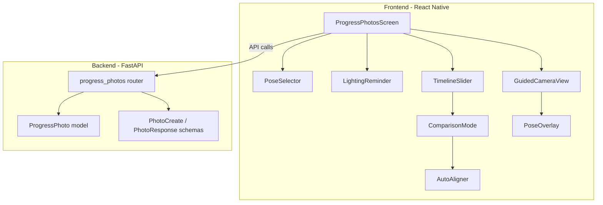
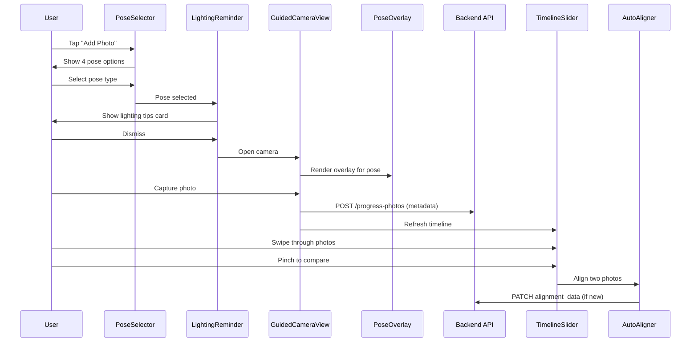
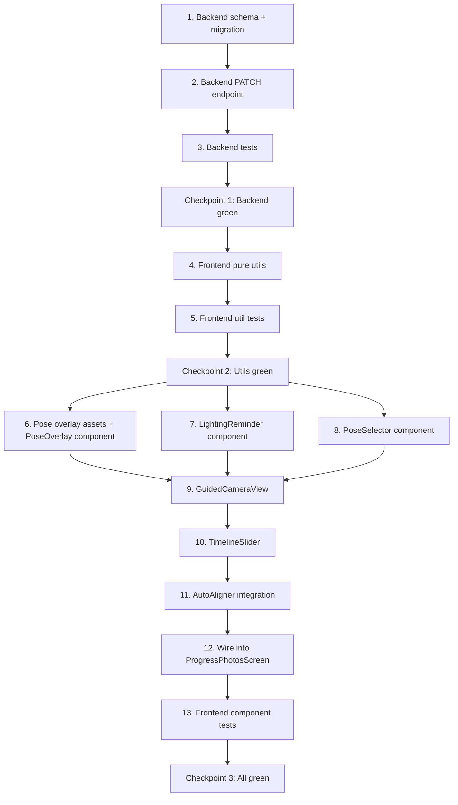

# Design Document: Smart Progress Photos Enhancement

## Overview

This design enhances the existing progress photos feature in Hypertrophy OS with four UX improvements: guided pose overlays on the camera preview, a lighting consistency reminder before capture, a horizontal timeline slider for browsing photos chronologically, and auto-alignment for side-by-side comparison. The architecture layers new components on top of the existing `ProgressPhotosScreen`, `PhotoComparison`, and the backend `progress_photos` module. Photo storage remains on-device; the backend stores only metadata (now extended with alignment data and expanded pose types).

## Architecture



### Component Interaction Flow



## Components and Interfaces

### Frontend Components

#### 1. PoseSelector
A bottom-sheet or modal presenting four pose type options as tappable cards with silhouette thumbnails.

```typescript
interface PoseSelectorProps {
  visible: boolean;
  onSelect: (poseType: PoseType) => void;
  onCancel: () => void;
}

type PoseType = 'front_relaxed' | 'front_double_bicep' | 'side' | 'back';
```

#### 2. LightingReminder
A dismissible card shown between pose selection and camera open.

```typescript
interface LightingReminderProps {
  visible: boolean;
  onDismiss: () => void;
  onDontShowAgain: () => void;
}

// Persisted in AsyncStorage under key 'lighting_reminder_dismissed'
```

#### 3. GuidedCameraView
Wraps `expo-camera` (or `expo-image-picker` camera mode) with a pose overlay layer.

```typescript
interface GuidedCameraViewProps {
  poseType: PoseType;
  onCapture: (uri: string) => void;
  onCancel: () => void;
}
```

#### 4. PoseOverlay
A pure presentational component rendering the silhouette SVG at 30% opacity, scaled to fill the camera preview.

```typescript
interface PoseOverlayProps {
  poseType: PoseType;
  containerWidth: number;
  containerHeight: number;
}
```

The overlay images are bundled as local SVG assets in `app/assets/pose-overlays/`. Four files: `front-relaxed.svg`, `front-double-bicep.svg`, `side.svg`, `back.svg`.

#### 5. TimelineSlider
Replaces the current `FlatList` grid with a horizontal `FlatList` (or `react-native-reanimated-carousel`) for chronological browsing.

```typescript
interface TimelineSliderProps {
  photos: PhotoMeta[];
  pathMap: PhotoPathMap;
  onCompare: (leftPhoto: PhotoMeta, rightPhoto: PhotoMeta) => void;
  poseFilter: PoseType | 'all';
  onPoseFilterChange: (filter: PoseType | 'all') => void;
}
```

Pinch gesture detection uses `react-native-gesture-handler`'s `PinchGestureHandler`. When a pinch is detected, the slider enters comparison mode with the current photo and the nearest neighbor.

#### 6. AutoAligner
A utility module that computes alignment data for a photo. Uses basic image analysis (pixel luminance histogram to find body bounding box center) — no ML in v1.

```typescript
interface AlignmentData {
  centerX: number;   // 0-1 normalized horizontal center
  centerY: number;   // 0-1 normalized vertical center
  scale: number;     // relative scale factor (1.0 = baseline)
}

function computeAlignment(imageUri: string): Promise<AlignmentData>;

function alignForComparison(
  leftAlignment: AlignmentData,
  rightAlignment: AlignmentData,
): { leftTransform: ImageTransform; rightTransform: ImageTransform };

interface ImageTransform {
  translateX: number;
  translateY: number;
  scale: number;
}
```

`alignForComparison` is a pure function: given two `AlignmentData` objects, it returns transforms that center-align and scale-match the two photos. This is the core testable logic.

### Backend Changes

#### Expanded pose_type enum
Update the `PhotoCreate` schema regex from `^(front|side|back)$` to `^(front_relaxed|front_double_bicep|side|back)$`. Add a migration to update existing `front` values to `front_relaxed`.

#### Alignment data field
Add an optional `alignment_data` JSON column to the `ProgressPhoto` model.

```python
# models.py addition
from sqlalchemy import JSON

alignment_data: Mapped[dict | None] = mapped_column(JSON, nullable=True)
```

```python
# schemas.py additions
class AlignmentData(BaseModel):
    centerX: float = Field(ge=0.0, le=1.0)
    centerY: float = Field(ge=0.0, le=1.0)
    scale: float = Field(gt=0.0)

class PhotoCreate(BaseModel):
    capture_date: date
    bodyweight_kg: float | None = None
    pose_type: str = Field(default="front_relaxed", pattern=r"^(front_relaxed|front_double_bicep|side|back)$")
    notes: str | None = None
    alignment_data: AlignmentData | None = None

class PhotoResponse(BaseModel):
    # ... existing fields ...
    alignment_data: AlignmentData | None = None
```

#### New PATCH endpoint
Add `PATCH /api/v1/progress-photos/{photo_id}` to update alignment_data after client-side computation.

```python
@router.patch("/{photo_id}", response_model=PhotoResponse)
async def update_photo(
    photo_id: uuid.UUID,
    data: PhotoUpdate,
    user: User = Depends(get_current_user),
    service: ProgressPhotoService = Depends(_get_service),
) -> PhotoResponse:
    photo = await service.update_photo(user_id=user.id, photo_id=photo_id, data=data)
    return PhotoResponse.model_validate(photo)
```

## Data Models

### Updated ProgressPhoto (SQLAlchemy)

| Column | Type | Nullable | Notes |
|--------|------|----------|-------|
| id | UUID | No | PK, auto-generated |
| user_id | UUID | No | FK → users.id |
| capture_date | Date | No | |
| bodyweight_kg | Float | Yes | Auto-filled from latest bodyweight log |
| pose_type | String(30) | No | front_relaxed, front_double_bicep, side, back |
| notes | Text | Yes | |
| alignment_data | JSON | Yes | {centerX, centerY, scale} |
| created_at | DateTime | No | Auto |
| updated_at | DateTime | No | Auto |
| deleted_at | DateTime | Yes | Soft delete |

### Local Storage Keys

| Key | Type | Description |
|-----|------|-------------|
| `progress_photo_paths` | JSON object | Maps photo ID → local file URI (existing) |
| `lighting_reminder_dismissed` | boolean string | Whether user opted out of lighting reminder |

### Pose Overlay Assets

Bundled SVG files in `app/assets/pose-overlays/`:
- `front-relaxed.svg`
- `front-double-bicep.svg`
- `side.svg`
- `back.svg`


## Correctness Properties

*A property is a characteristic or behavior that should hold true across all valid executions of a system — essentially, a formal statement about what the system should do. Properties serve as the bridge between human-readable specifications and machine-verifiable correctness guarantees.*

### Property 1: Selected pose type persists in metadata

*For any* valid Pose_Type selected by the user, the resulting Photo_Metadata record SHALL contain that exact pose_type value.

**Validates: Requirements 1.2**

### Property 2: Pose type maps to correct overlay asset

*For any* valid Pose_Type, the overlay asset mapping function SHALL return the corresponding SVG asset path, and different pose types SHALL map to different assets.

**Validates: Requirements 2.1**

### Property 3: Overlay scales proportionally

*For any* container dimensions (width, height), the computed overlay dimensions SHALL maintain the original aspect ratio of the silhouette asset (i.e., `outputWidth / outputHeight == originalWidth / originalHeight`).

**Validates: Requirements 2.4**

### Property 4: Lighting reminder preference round-trip

*For any* boolean preference value written to local storage under the lighting reminder key, reading it back SHALL return the same boolean value, and when the value is `true`, the reminder visibility function SHALL return `false`.

**Validates: Requirements 3.4, 3.5**

### Property 5: Pose type validation

*For any* string, the pose_type validator SHALL accept it if and only if it is one of: `front_relaxed`, `front_double_bicep`, `side`, `back`. All other strings SHALL be rejected.

**Validates: Requirements 4.1, 4.3**

### Property 6: Timeline chronological ordering

*For any* set of photos with arbitrary capture dates, the Timeline_Slider sort function SHALL return them in ascending capture_date order. Photos with the same capture_date SHALL maintain stable relative order.

**Validates: Requirements 5.1**

### Property 7: Photo info display completeness

*For any* Photo_Metadata object with a capture_date and optional bodyweight_kg, the formatted display string SHALL contain the formatted date, and SHALL contain the bodyweight value when it is present.

**Validates: Requirements 5.3**

### Property 8: Pose type filter correctness

*For any* set of photos and any selected Pose_Type filter, the filtered result SHALL contain only photos whose pose_type matches the filter, and SHALL contain all photos from the original set that match.

**Validates: Requirements 5.5**

### Property 9: Auto-alignment transform correctness

*For any* two valid AlignmentData objects, the `alignForComparison` function SHALL produce transforms such that: (a) both photos' body centers align to the same horizontal position, and (b) both photos' effective scales are equal after applying the transforms.

**Validates: Requirements 6.1, 6.2**

### Property 10: Alignment computation idempotence

*For any* photo, computing alignment data and then computing it again on the same image SHALL produce equivalent AlignmentData values. Storing and reloading alignment data SHALL also produce equivalent values.

**Validates: Requirements 6.3, 6.5**

### Property 11: Photo metadata serialization round-trip

*For any* valid Photo_Metadata object (including optional AlignmentData), serializing to JSON and then deserializing SHALL produce an object equivalent to the original.

**Validates: Requirements 7.3**

## Error Handling

| Scenario | Behavior | Rollback |
|----------|----------|----------|
| Camera permission denied | Show alert directing user to Settings. Do not crash. | N/A — no state change |
| Pose overlay SVG asset missing | Log warning, proceed without overlay. Camera still functional. | N/A — graceful degradation |
| Auto-alignment fails (no body detected) | Fall back to center-aligned display. Store null alignment_data. | N/A — fallback is the default |
| Backend unreachable during photo save | Save photo locally, queue metadata POST for retry. Show toast. | Photo exists on-device; retry queue persisted in AsyncStorage |
| Invalid pose_type in API request | Return 422 with validation error message. | N/A — request rejected, no state change |
| Corrupted alignment_data JSON in DB | Treat as null, recompute on next comparison. | SET alignment_data = NULL for affected rows |
| Local storage read failure for preferences | Default to showing lighting reminder (safe fallback). | N/A — safe default |
| Pinch gesture not recognized | Remain in single-photo timeline view. No error shown. | N/A — no state change |
| DB migration failure (pose_type rename) | Alembic auto-rollback. Existing "front" values unchanged. | `alembic downgrade -1` |

## Implementation Dependency Chain

The following is the strict execution order. No step may reference artifacts from a later step.



### Risks and Mitigations

| Step | Risk | Mitigation |
|------|------|------------|
| 1. DB migration | Existing "front" rows break if regex changes without data migration | Run data migration in same Alembic revision: UPDATE pose_type SET 'front_relaxed' WHERE pose_type = 'front' |
| 4. Auto-alignment pixel analysis | expo-file-system can't read raw pixel data on all platforms | Use `expo-image-manipulator` to resize to small thumbnail, then analyze. Fallback: skip alignment, store null |
| 6. SVG overlay rendering | `react-native-svg` performance on low-end Android | Pre-rasterize SVGs to PNG at build time as fallback. Test on Pixel 3a |
| 9. GuidedCameraView | `expo-camera` vs `expo-image-picker` — picker doesn't support overlays | Must use `expo-camera` directly for overlay support. Requires `expo-camera` dependency addition |
| 10. Pinch gesture | `react-native-gesture-handler` conflicts with FlatList scroll | Use `GestureDetector` from RNGH v2 with `simultaneousHandlers` to allow both gestures |
| 12. Screen refactor | Breaking existing photo capture flow | Keep old `showCaptureOptions` as fallback behind feature flag during rollout |

### Rollback Plan

| Failure Point | Action |
|---------------|--------|
| Migration breaks prod DB | `alembic downgrade -1` reverts column add and data migration |
| New capture flow crashes | Feature flag `smart_progress_photos_enabled` defaults to `false`. Old flow remains intact. |
| Timeline slider performance regression | Revert to existing FlatList grid. TimelineSlider is a drop-in replacement — swap back in ProgressPhotosScreen |
| Auto-alignment produces bad transforms | Store null alignment_data, fall back to center-aligned. No data corruption risk. |

### Monitoring (Post-Launch)

| Metric | Alert Threshold | Source |
|--------|----------------|--------|
| Photo capture error rate | > 5% of capture attempts fail | Client error logging (Sentry) |
| PATCH alignment_data 5xx rate | > 1% of PATCH requests | Backend access logs / CloudWatch |
| Alignment computation p95 latency | > 2s on-device | Client performance trace |
| Timeline slider frame drops | < 30fps during scroll | React Native performance monitor |
| Lighting reminder dismiss rate | Informational (no alert) | Analytics event `lighting_reminder_dismissed` |
| Pose type distribution | Informational | Analytics event `photo_captured` with pose_type dimension |

## Testing Strategy

### Property-Based Testing

Library: **Hypothesis** (Python backend) and **fast-check** (TypeScript frontend).

Each property test runs a minimum of 100 iterations. Each test is tagged with:
`Feature: smart-progress-photos, Property {N}: {title}`

| Property | Layer | Library | Focus |
|----------|-------|---------|-------|
| P1: Pose type persists | Backend | Hypothesis | PhotoCreate → ProgressPhoto |
| P2: Overlay asset mapping | Frontend | fast-check | poseToAsset pure function |
| P3: Overlay proportional scaling | Frontend | fast-check | computeOverlayDimensions pure function |
| P4: Lighting preference round-trip | Frontend | fast-check | AsyncStorage read/write mock |
| P5: Pose type validation | Backend | Hypothesis | PhotoCreate schema validation |
| P6: Timeline sort | Frontend | fast-check | sortPhotosByDate pure function |
| P7: Photo info display | Frontend | fast-check | formatPhotoInfo pure function |
| P8: Pose filter | Frontend | fast-check | filterByPoseType pure function |
| P9: Alignment transforms | Frontend | fast-check | alignForComparison pure function |
| P10: Alignment idempotence | Frontend | fast-check | computeAlignment determinism |
| P11: Metadata round-trip | Backend | Hypothesis | PhotoResponse serialize/deserialize |

### Unit Testing

Unit tests complement property tests by covering specific examples and edge cases:

- Legacy "front" → "front_relaxed" mapping (Req 4.2)
- Default pose type when none selected (Req 1.3)
- Lighting reminder content includes required text (Req 3.2)
- Alignment fallback when body not detected (Req 6.4)
- Empty photo list renders empty state
- Single photo in timeline (no comparison possible)
- Photos with null bodyweight display correctly
- PATCH endpoint returns 404 for non-existent photo_id
- PATCH endpoint returns 422 for invalid alignment_data (e.g., centerX > 1.0)
- Feature flag off → old capture flow used, new components not rendered

### Integration Testing

- Full capture flow: pose select → lighting reminder → camera → save metadata → appears in timeline
- Comparison mode: pinch → auto-align → display transforms applied
- PATCH alignment_data endpoint: compute → store → retrieve → verify match
- Legacy photo compatibility: old "front" photos display correctly in timeline with front_relaxed filter
- Offline capture: photo saved locally, metadata queued, synced when backend reachable

### Testing Checkpoints

| Checkpoint | Gate Criteria | When |
|------------|--------------|------|
| CP1: Backend green | All Hypothesis property tests pass (P1, P5, P11). Migration up/down works. PATCH endpoint unit tests pass. | After steps 1-3 |
| CP2: Utils green | All fast-check property tests pass (P2, P3, P6, P7, P8, P9). Unit tests for edge cases pass. | After steps 4-5 |
| CP3: All green | All component tests pass. Integration tests pass. No TypeScript errors. No regressions in existing photo tests. | After steps 6-13 |
