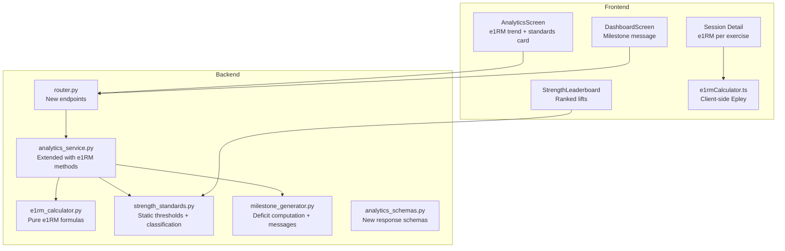

# Design Document: 1RM Estimator and Strength Standards

## Overview

This feature adds estimated one-rep max (e1RM) calculation, trend tracking, strength standards classification, motivational milestones, and a personal strength leaderboard to Hypertrophy OS.

Key design decisions:
- **Pure functions for all e1RM and classification logic** — enables property-based testing without database dependencies
- **Static strength standards data** — stored as Python constants, not in the database, for zero-migration deployment
- **Reuse existing `TrainingAnalyticsService`** — extend with e1RM-specific methods
- **Reuse existing `TrendLineChart`** — the e1RM trend chart uses the same component as other analytics charts
- **No new database tables or migrations** — all data derived from existing `training_sessions` and `bodyweight_logs`
- **Client-side e1RM for session detail** — avoids extra API call; uses same Epley formula as backend

## Architecture



### Dependency Graph (Build Order)

```
Layer 0 (no deps):     e1rm_calculator.py, strength_standards.py, analytics_schemas.py
Layer 1 (depends on 0): milestone_generator.py (depends on strength_standards)
Layer 2 (depends on 0+1): analytics_service.py extensions (depends on e1rm_calculator, strength_standards, milestone_generator)
Layer 3 (depends on 2): router.py endpoints (depends on analytics_service, analytics_schemas)
Layer 4 (depends on 3): Frontend API calls, components
```

No circular dependencies. Each layer only depends on layers below it.

## Components and Interfaces

### 1. `e1rm_calculator.py` — Pure e1RM Computation

Location: `src/modules/training/e1rm_calculator.py`

```python
from dataclasses import dataclass

@dataclass
class E1RMResult:
    epley: float
    brzycki: float
    lombardi: float
    primary: float        # Epley value (the default)
    low_confidence: bool  # True when reps > 30

def compute_e1rm(weight_kg: float, reps: int) -> E1RMResult:
    """Compute estimated 1RM using three formulas.
    
    - reps == 1: returns weight_kg for all formulas
    - reps == 0 or weight_kg == 0: returns 0 for all formulas
    - reps > 30: computes but flags low_confidence=True
    - reps == 37: Brzycki division by zero guard — uses Epley as fallback
    """
    ...

def best_e1rm_for_exercise(sets: list[dict]) -> E1RMResult | None:
    """Return the E1RMResult for the set with the highest Epley e1RM.
    Returns None if no valid sets (weight_kg > 0 and reps > 0) exist.
    """
    ...
```

### 2. `strength_standards.py` — Static Thresholds and Classification

Location: `src/modules/training/strength_standards.py`

```python
from dataclasses import dataclass
from enum import Enum

class StrengthLevel(str, Enum):
    BEGINNER = "beginner"
    INTERMEDIATE = "intermediate"
    ADVANCED = "advanced"
    ELITE = "elite"
    UNKNOWN = "unknown"

STRENGTH_STANDARDS: dict[str, dict[StrengthLevel, float]] = {
    "barbell bench press": {
        StrengthLevel.BEGINNER: 0.5, StrengthLevel.INTERMEDIATE: 1.0,
        StrengthLevel.ADVANCED: 1.5, StrengthLevel.ELITE: 2.0,
    },
    "barbell back squat": {
        StrengthLevel.BEGINNER: 0.75, StrengthLevel.INTERMEDIATE: 1.25,
        StrengthLevel.ADVANCED: 1.75, StrengthLevel.ELITE: 2.5,
    },
    "conventional deadlift": {
        StrengthLevel.BEGINNER: 1.0, StrengthLevel.INTERMEDIATE: 1.5,
        StrengthLevel.ADVANCED: 2.0, StrengthLevel.ELITE: 3.0,
    },
    "overhead press": {
        StrengthLevel.BEGINNER: 0.35, StrengthLevel.INTERMEDIATE: 0.65,
        StrengthLevel.ADVANCED: 1.0, StrengthLevel.ELITE: 1.4,
    },
    "barbell row": {
        StrengthLevel.BEGINNER: 0.4, StrengthLevel.INTERMEDIATE: 0.75,
        StrengthLevel.ADVANCED: 1.1, StrengthLevel.ELITE: 1.5,
    },
}

SUPPORTED_LIFTS: list[str] = list(STRENGTH_STANDARDS.keys())

@dataclass
class StrengthClassification:
    exercise_name: str
    e1rm_kg: float
    bodyweight_kg: float
    bodyweight_ratio: float
    level: StrengthLevel
    next_level: StrengthLevel | None
    next_level_threshold_kg: float | None

def classify_strength(exercise_name: str, e1rm_kg: float, bodyweight_kg: float) -> StrengthClassification:
    """Classify strength level. Raises ValueError if exercise not supported."""
    ...

def rank_by_strength(classifications: list[StrengthClassification]) -> list[StrengthClassification]:
    """Rank by bodyweight_ratio descending."""
    ...

def get_supported_lifts() -> list[str]:
    ...
```

### 3. `milestone_generator.py` — Motivational Messages

Location: `src/modules/training/milestone_generator.py`

```python
@dataclass
class Milestone:
    exercise_name: str
    current_e1rm_kg: float
    next_level: StrengthLevel | None
    deficit_kg: float
    message: str

def generate_milestones(
    classifications: list[StrengthClassification],
    unit_system: str = "metric",
) -> list[Milestone]:
    """Generate milestone messages sorted by smallest deficit first.
    Elite lifts get congratulatory message with deficit_kg=0.
    Omits lifts with level == UNKNOWN.
    """
    ...
```

### 4. Extended `analytics_service.py`

```python
async def get_e1rm_history(self, user_id, exercise_name, start_date, end_date) -> list[E1RMHistoryPoint]:
    """Best e1RM per session for exercise in date range. Sorted by date ascending."""
    ...

async def get_strength_standards(self, user_id) -> StrengthStandardsResponse:
    """Classification + milestones for all supported lifts.
    Fetches latest bodyweight, best e1RM per supported lift, classifies, generates milestones.
    No bodyweight → bodyweight_kg=None, empty classifications, empty milestones.
    """
    ...
```

### 5. New API Endpoints

| Method | Path | Parameters | Description |
|--------|------|------------|-------------|
| GET | `/training/analytics/e1rm-history` | `exercise_name`, `start_date`, `end_date` (all required) | e1RM time series |
| GET | `/training/analytics/strength-standards` | None (auth user) | Classification + milestones |

Both require authentication. e1RM history validates `start_date <= end_date` (400 if violated).

### 6. New Response Schemas

Added to `src/modules/training/analytics_schemas.py`:

```python
class E1RMHistoryPoint(BaseModel):
    date: date
    exercise_name: str
    e1rm_kg: float
    formula: str = "epley"
    low_confidence: bool = False

class StrengthClassificationResponse(BaseModel):
    exercise_name: str
    e1rm_kg: float
    bodyweight_kg: float
    bodyweight_ratio: float
    level: str
    next_level: str | None
    next_level_threshold_kg: float | None

class MilestoneResponse(BaseModel):
    exercise_name: str
    current_e1rm_kg: float
    next_level: str
    deficit_kg: float
    message: str

class StrengthStandardsResponse(BaseModel):
    classifications: list[StrengthClassificationResponse]
    milestones: list[MilestoneResponse]
    bodyweight_kg: float | None
```

### 7. Frontend Components

**`app/utils/e1rmCalculator.ts`** — Client-side Epley formula:
- `computeE1RM(weightKg: number, reps: number): number`
- Same formula as backend: `weight × (1 + reps / 30)`, returns weight when reps=1, returns 0 when reps=0 or weight=0

**e1RM Trend Section** (in `AnalyticsScreen.tsx`):
- Reuses existing `TrendLineChart` and exercise selector
- Calls `GET /training/analytics/e1rm-history`

**Strength Standards Card** (`app/components/analytics/StrengthStandardsCard.tsx`):
- Shows each supported lift with level, ratio, progress bar toward next level
- Falls back to "Log bodyweight to see standards" when no bodyweight data

**Milestone Banner** (in `DashboardScreen.tsx`):
- Closest milestone message, tappable to navigate to analytics

**Strength Leaderboard** (`app/components/analytics/StrengthLeaderboard.tsx`):
- Ranked list by bodyweight ratio, highlights strongest/weakest, "No data" at bottom

## Data Models

No new database tables or migrations. All data derived from:
- **`training_sessions`** — exercise sets (weight_kg, reps)
- **`bodyweight_logs`** — user's current bodyweight
- **Strength standards** — static Python constants

## Correctness Properties

*A property is a characteristic or behavior that should hold true across all valid executions of a system — essentially, a formal statement about what the system should do. Properties serve as the bridge between human-readable specifications and machine-verifiable correctness guarantees.*

### Property 1: e1RM Formula Correctness

*For any* weight_kg > 0 and reps in [1, 30], the E1RM_Calculator SHALL return:
- Epley value equal to `weight_kg × (1 + reps / 30)`
- Brzycki value equal to `weight_kg × 36 / (37 - reps)` (for reps < 37)
- Lombardi value equal to `weight_kg × reps^0.10`
- Primary value equal to the Epley value

**Validates: Requirements 1.1, 1.2, 1.3, 1.7**

### Property 2: Low Confidence Flag

*For any* weight_kg > 0 and reps > 30, `low_confidence = True`. *For any* weight_kg > 0 and reps in [1, 30], `low_confidence = False`.

**Validates: Requirements 1.6**

### Property 3: Best Set Selection Maximality

*For any* non-empty list of sets with weight_kg > 0 and reps > 0, `best_e1rm_for_exercise` SHALL return an E1RMResult whose Epley value is >= the Epley e1RM of every other set in the list.

**Validates: Requirements 1.8**

### Property 4: e1RM History Correctness and Ordering

*For any* set of training sessions containing a given exercise, the e1RM history SHALL return one point per session where e1rm_kg equals the max Epley e1RM across all sets of that exercise in that session, and the list SHALL be sorted by date ascending.

**Validates: Requirements 2.1, 2.2**

### Property 5: Strength Standards Data Completeness

*For any* exercise in SUPPORTED_LIFTS, STRENGTH_STANDARDS SHALL contain entries for all four levels (beginner, intermediate, advanced, elite), and thresholds SHALL be in strictly ascending order.

**Validates: Requirements 3.1**

### Property 6: Strength Classification Correctness

*For any* supported exercise, e1rm_kg > 0, and bodyweight_kg > 0, `classify_strength` SHALL return a StrengthLevel such that the bodyweight ratio meets or exceeds the threshold for the returned level but falls below the threshold for the next level (if one exists).

**Validates: Requirements 3.2**

### Property 7: Milestone Deficit and Message Correctness

*For any* StrengthClassification with a next_level (not elite), the generated Milestone SHALL have deficit_kg equal to `(next_level_threshold_multiplier × bodyweight_kg) - current_e1rm_kg`, and the message SHALL contain the exercise name, next level name, and formatted deficit value.

**Validates: Requirements 4.1, 4.2**

### Property 8: Milestone Sorting by Deficit

*For any* list of milestones, deficit_kg values SHALL be in non-decreasing order.

**Validates: Requirements 4.5**

### Property 9: Leaderboard Sorting by Bodyweight Ratio

*For any* list of classifications with data, `rank_by_strength` SHALL return them with bodyweight_ratio in non-increasing order.

**Validates: Requirements 5.1**

## Error Handling

| Scenario | Handler | Response |
|----------|---------|----------|
| reps = 0 or weight_kg = 0 | `compute_e1rm` | E1RMResult with all zeros |
| reps = 1 | `compute_e1rm` | weight_kg for all formulas |
| reps > 30 | `compute_e1rm` | Computes normally, `low_confidence = True` |
| reps = 37 | `compute_e1rm` | Brzycki division by zero guard — Epley fallback |
| No bodyweight data | `get_strength_standards` | `bodyweight_kg: null`, empty classifications/milestones |
| No e1RM data for a lift | Service layer | Omits that lift from results |
| Exercise not in supported lifts | `classify_strength` | Raises `ValueError` |
| Invalid date range (start > end) | Router validation | 400 Bad Request |
| Unauthenticated request | Auth middleware | 401 Unauthorized |

## Testing Strategy

### Property-Based Testing

Library: **Hypothesis** (Python, already in project)

All 9 correctness properties implemented as Hypothesis tests, minimum 100 examples each.

Tag format: `Feature: strength-standards, Property {N}: {title}`

**Test files:**
- `tests/test_e1rm_properties.py` — Properties 1, 2, 3
- `tests/test_strength_standards_properties.py` — Properties 5, 6, 7, 8, 9
- `tests/test_e1rm_history_properties.py` — Property 4

### Unit Testing

- **Edge cases**: reps=0, reps=1, weight_kg=0, reps=37, reps>30
- **Boundary values**: exact threshold boundaries for strength levels (ratio exactly at beginner, exactly at elite)
- **Integration**: API endpoint response format, auth middleware, date validation
- **Frontend**: `app/__tests__/utils/e1rmCalculator.test.ts` — client-side formula matches backend

### Test Configuration

```python
@settings(max_examples=100)
```

Each property test: single function, docstring with property number, tag format, 100+ iterations.

### Risks and Mitigations

| Risk | Impact | Mitigation |
|------|--------|------------|
| Epley formula inaccurate at high reps (>15) | Users see misleading e1RM | `low_confidence` flag at reps > 30; UI shows warning |
| No bodyweight logged | Strength standards unusable | Graceful fallback with "Log bodyweight" prompt |
| Exercise name mismatch between sessions and SUPPORTED_LIFTS | Lift not classified | Case-insensitive `.lower().strip()` matching |
| Large session history causes slow e1RM history query | Slow analytics page | Existing date range filter limits query scope; same pattern as volume trend |
| Brzycki formula undefined at reps=37 | Division by zero crash | Guard clause returns Epley as fallback |

### Rollback Plan

This feature adds new files and extends existing ones. No database migrations.

- **Backend rollback**: Revert the new files (`e1rm_calculator.py`, `strength_standards.py`, `milestone_generator.py`) and the additions to `analytics_service.py`, `analytics_schemas.py`, `router.py`. No DB rollback needed.
- **Frontend rollback**: Revert new components and the additions to `AnalyticsScreen.tsx`, `DashboardScreen.tsx`. Remove `e1rmCalculator.ts`.
- **Zero data loss risk**: No schema changes, no data mutations. Feature is read-only over existing data.

### Monitoring (Post-Launch)

| Metric | Alert Threshold | Action |
|--------|----------------|--------|
| `/analytics/e1rm-history` p95 latency | > 500ms | Investigate query plan; add date index if needed |
| `/analytics/strength-standards` p95 latency | > 800ms | Cache bodyweight lookup; limit session scan |
| 5xx rate on new endpoints | > 1% | Check error logs for unhandled edge cases |
| Client-side e1RM computation errors (Sentry) | Any | Fix formula edge case |
