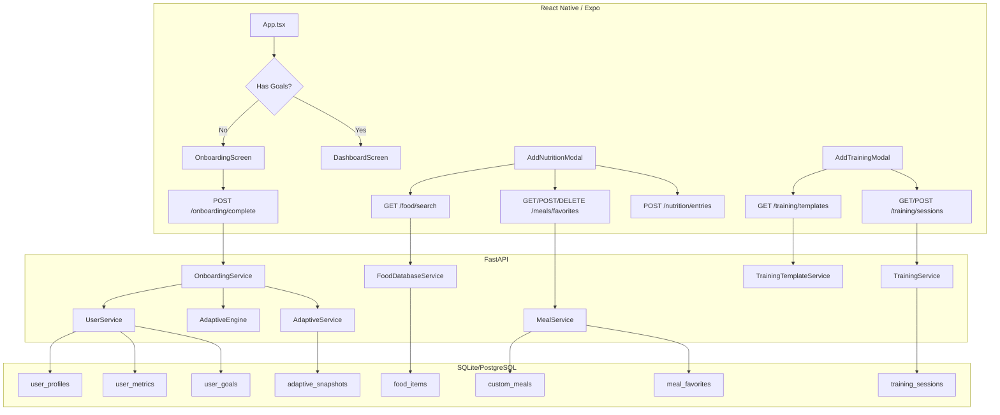

# Design Document: Tier 1 Retention Features

## Overview

This design covers four retention-critical features for HypertrophyOS: onboarding wizard, food search in nutrition logging, meal favorites, and multi-exercise training with templates. The backend already has most data models and CRUD endpoints. The primary work is:

1. A new `POST /api/v1/onboarding/complete` orchestration endpoint
2. A new `GET /api/v1/training/templates` endpoint for pre-built workout templates
3. New frontend screens: `OnboardingScreen` (multi-step wizard)
4. Enhanced frontend modals: `AddNutritionModal` (food search + favorites), `AddTrainingModal` (multi-exercise + templates)
5. Zustand store extensions for onboarding state and template data

The design leverages existing backend modules (adaptive engine, food_database, meals, training, user) and follows the established patterns: FastAPI routers, SQLAlchemy async models, Pydantic schemas, React Native with Zustand, and the dark theme design system.

## Architecture



### Key Architectural Decisions

1. **Single onboarding endpoint**: Rather than having the frontend make 4 separate API calls (profile, metrics, goals, snapshot), a single `POST /onboarding/complete` endpoint orchestrates everything in one transaction. This prevents partial onboarding states.

2. **Static workout templates**: Pre-built templates (Push/Pull/Legs, etc.) are defined as static data in the backend service layer rather than a database table. They change infrequently and don't need per-user customization. This avoids unnecessary schema complexity.

3. **Enhanced modals over new screens**: Food search and favorites are added to the existing `AddNutritionModal` rather than creating separate screens. This keeps the logging flow compact and reduces navigation friction.

4. **Debounced search**: Food search queries are debounced at 300ms on the frontend to avoid excessive API calls while typing.

## Components and Interfaces

### Backend Components

#### 1. Onboarding Module (`src/modules/onboarding/`)

**New files:**
- `router.py` — Single route: `POST /onboarding/complete`
- `service.py` — `OnboardingService` orchestrating user setup
- `schemas.py` — `OnboardingCompleteRequest` and `OnboardingCompleteResponse`

```python
# schemas.py
class OnboardingCompleteRequest(BaseModel):
    """All data needed to complete onboarding in one call."""
    goal_type: GoalType
    height_cm: float = Field(gt=0, le=300)
    weight_kg: float = Field(gt=0, le=500)
    body_fat_pct: float | None = Field(default=None, ge=0, le=100)
    age_years: int = Field(ge=13, le=120)
    sex: Literal["male", "female"]
    activity_level: ActivityLevel
    goal_rate_per_week: float = Field(ge=-2.0, le=2.0)
    display_name: str | None = Field(default=None, max_length=100)

class OnboardingCompleteResponse(BaseModel):
    """Response after successful onboarding."""
    profile: UserProfileResponse
    goals: UserGoalResponse
    snapshot: SnapshotResponse
```

```python
# service.py
class OnboardingService:
    async def complete_onboarding(self, user_id: UUID, data: OnboardingCompleteRequest) -> OnboardingCompleteResponse:
        """Orchestrate full onboarding in a single transaction.
        
        Steps:
        1. Check user doesn't already have goals (conflict guard)
        2. Create/update UserProfile with display_name
        3. Persist UserMetric snapshot
        4. Set UserGoal
        5. Invoke AdaptiveEngine.compute_snapshot() with provided stats
        6. Persist AdaptiveSnapshot
        7. Return combined response
        
        All steps run within the caller's DB transaction.
        """
```

#### 2. Training Templates (`src/modules/training/`)

**Modified files:**
- `router.py` — Add `GET /templates` endpoint
- `service.py` — Add `get_templates()` and `get_template_by_id()` methods

**New file:**
- `templates.py` — Static template definitions

```python
# templates.py
WORKOUT_TEMPLATES = [
    {
        "id": "push",
        "name": "Push Day",
        "description": "Chest, shoulders, and triceps",
        "exercises": [
            {"exercise_name": "Bench Press", "sets": [{"reps": 8, "weight_kg": 0, "rpe": None}] * 4},
            {"exercise_name": "Overhead Press", "sets": [{"reps": 10, "weight_kg": 0, "rpe": None}] * 3},
            {"exercise_name": "Incline Dumbbell Press", "sets": [{"reps": 10, "weight_kg": 0, "rpe": None}] * 3},
            {"exercise_name": "Lateral Raises", "sets": [{"reps": 15, "weight_kg": 0, "rpe": None}] * 3},
            {"exercise_name": "Tricep Pushdowns", "sets": [{"reps": 12, "weight_kg": 0, "rpe": None}] * 3},
        ],
    },
    # ... pull, legs, upper, lower, full_body
]
```

```python
# schemas.py (additions)
class WorkoutTemplateResponse(BaseModel):
    id: str
    name: str
    description: str
    exercises: list[ExerciseEntry]
```

### Frontend Components

#### 1. OnboardingScreen (`app/screens/onboarding/OnboardingScreen.tsx`)

Multi-step wizard with 3 steps:
- **Step 1 — Goal Selection**: Three large cards for bulking/cutting/maintaining
- **Step 2 — Body Stats**: Form with height, weight, body fat %, age, sex, activity level
- **Step 3 — Results**: Display computed targets with a "Get Started" confirmation button

State management: Local `useState` for form data, with a progress indicator showing current step. Onboarding step progress is persisted to AsyncStorage (web: localStorage) so that if the user force-closes the app mid-onboarding, the wizard resumes from the last completed step on next launch.

Navigation integration: `App.tsx` checks for existing goals on auth. If none, renders `OnboardingScreen` instead of `BottomTabNavigator`. A "Skip for now" button allows users to bypass onboarding and explore the dashboard, which then shows a persistent setup banner.

**Setup Banner on Dashboard**: When `needsOnboarding` is true but the user skipped, the `DashboardScreen` renders a `SetupBanner` component at the top prompting "Complete your profile to get personalized targets". Tapping it navigates back to the onboarding flow.

```typescript
// App.tsx detection logic
const [needsOnboarding, setNeedsOnboarding] = useState<boolean | null>(null);

// After auth restore:
const goalsRes = await api.get('user/goals');
setNeedsOnboarding(goalsRes.data === null);

// Render:
{isAuthenticated ? (
  needsOnboarding ? <OnboardingScreen onComplete={() => setNeedsOnboarding(false)} onSkip={() => setNeedsOnboarding(false)} /> : <BottomTabNavigator />
) : <AuthNavigator />}
```

#### 2. Enhanced AddNutritionModal

Add two new sections to the existing modal:

**Food Search Section:**
- Search input at the top with debounced queries (300ms)
- Results list showing food name, calories, protein per serving
- Tap to select → auto-fill macros
- Serving multiplier input (default 1.0) that scales all values

**Favorites Section:**
- Horizontal scrollable list of saved favorites below the search
- Tap to auto-fill macros from favorite snapshot
- Long-press to delete
- "Save as Favorite" button shown after successful log

```typescript
// New state additions to AddNutritionModal
const [searchQuery, setSearchQuery] = useState('');
const [searchResults, setSearchResults] = useState<FoodItem[]>([]);
const [selectedFood, setSelectedFood] = useState<FoodItem | null>(null);
const [servingMultiplier, setServingMultiplier] = useState('1');
const [favorites, setFavorites] = useState<MealFavorite[]>([]);
const [showSaveAsFavorite, setShowSaveAsFavorite] = useState(false);
```

#### 3. Enhanced AddTrainingModal

Complete rewrite of the modal to support multi-exercise sessions:

**Exercise List:**
- Dynamic list of exercises, each with name input and expandable sets
- "Add Exercise" button at the bottom
- Swipe-to-delete on exercises

**Template Picker:**
- Collapsible section at the top with template cards
- "Copy Last Workout" button
- Selecting a template populates the exercise list

**Set Management:**
- Each exercise has an "Add Set" button
- Sets show reps, weight (kg), and optional RPE
- Pre-fill from previous set values for convenience

```typescript
// Core state for multi-exercise modal
interface ExerciseState {
  id: string; // local UUID for key prop
  name: string;
  sets: SetState[];
}
interface SetState {
  id: string;
  reps: string;
  weight: string;
  rpe: string;
}
const [exercises, setExercises] = useState<ExerciseState[]>([]);
const [templates, setTemplates] = useState<WorkoutTemplate[]>([]);
```

#### 4. Zustand Store Extensions

```typescript
// New store slices
interface OnboardingState {
  needsOnboarding: boolean | null;
  onboardingSkipped: boolean; // true if user skipped, used to show setup banner
  setNeedsOnboarding: (needs: boolean) => void;
  setOnboardingSkipped: (skipped: boolean) => void;
}
```

## Data Models

### Existing Models (No Changes Required)

All backend data models are already in place:

| Model | Table | Module | Notes |
|-------|-------|--------|-------|
| `UserProfile` | `user_profiles` | `user` | One-to-one profile with preferences |
| `UserMetric` | `user_metrics` | `user` | Append-only physiological snapshots |
| `UserGoal` | `user_goals` | `user` | One-to-one goal record (goal_type, target_weight, rate) |
| `AdaptiveSnapshot` | `adaptive_snapshots` | `adaptive` | Computed caloric/macro targets |
| `FoodItem` | `food_items` | `food_database` | Food items with macro/micro data |
| `CustomMeal` | `custom_meals` | `meals` | User-created reusable meals |
| `MealFavorite` | `meal_favorites` | `meals` | Favorited meals with nutritional snapshot |
| `TrainingSession` | `training_sessions` | `training` | Sessions with JSONB exercises array |

### New Data Structures (In-Memory Only)

**Workout Templates** — Static Python dicts, not persisted to database:

```python
@dataclass(frozen=True)
class WorkoutTemplate:
    id: str           # e.g. "push", "pull", "legs"
    name: str         # e.g. "Push Day"
    description: str  # e.g. "Chest, shoulders, and triceps"
    exercises: list[dict]  # List of ExerciseEntry-compatible dicts
```

### API Contracts

#### New Endpoints

| Method | Path | Request | Response | Notes |
|--------|------|---------|----------|-------|
| `POST` | `/api/v1/onboarding/complete` | `OnboardingCompleteRequest` | `OnboardingCompleteResponse` | Atomic onboarding |
| `GET` | `/api/v1/training/templates` | — | `list[WorkoutTemplateResponse]` | Static templates |
| `GET` | `/api/v1/training/templates/{id}` | — | `WorkoutTemplateResponse` | Single template |

#### Existing Endpoints Used

| Method | Path | Used By |
|--------|------|---------|
| `GET` | `/api/v1/food/search?q=...` | Food search in nutrition modal |
| `GET` | `/api/v1/meals/favorites` | Favorites list in nutrition modal |
| `POST` | `/api/v1/meals/favorites` | Save favorite after logging |
| `DELETE` | `/api/v1/meals/favorites/{id}` | Remove favorite |
| `POST` | `/api/v1/training/sessions` | Submit multi-exercise session |
| `GET` | `/api/v1/training/sessions?limit=1` | Copy last workout |
| `GET` | `/api/v1/user/goals` | Onboarding detection |
| `POST` | `/api/v1/user/metrics` | Used internally by onboarding |
| `PUT` | `/api/v1/user/goals` | Used internally by onboarding |


## Correctness Properties

*A property is a characteristic or behavior that should hold true across all valid executions of a system — essentially, a formal statement about what the system should do. Properties serve as the bridge between human-readable specifications and machine-verifiable correctness guarantees.*

### Property 1: Onboarding detection is determined by goal existence

*For any* authenticated user, the onboarding detection function SHALL return `true` (needs onboarding) if and only if the user has no UserGoal record, and `false` otherwise.

**Validates: Requirements 1.1, 1.2**

### Property 2: Body stats validation accepts only in-range values

*For any* body stats input (height_cm, weight_kg, body_fat_pct, age_years), the validation function SHALL accept the input if and only if height is in [100, 250], weight is in [30, 300], body fat is in [3, 60] (or null), and age is in [13, 120]. All out-of-range values SHALL be rejected with field-level errors.

**Validates: Requirements 3.2, 3.3**

### Property 3: Onboarding transaction atomicity

*For any* valid onboarding request, after calling `POST /onboarding/complete`, all four records (UserProfile, UserMetric, UserGoal, AdaptiveSnapshot) SHALL exist for that user. *For any* invalid onboarding request that triggers a failure, zero new records SHALL be created.

**Validates: Requirements 4.4, 9.2, 9.4**

### Property 4: Food item auto-fill matches per-serving values

*For any* food item selected from search results, the auto-filled macro values (calories, protein_g, carbs_g, fat_g) SHALL exactly equal the food item's stored per-serving nutritional values.

**Validates: Requirements 5.3**

### Property 5: Serving multiplier scales macros linearly

*For any* food item and *any* positive serving multiplier `m`, the displayed macro values SHALL equal the food item's base per-serving values multiplied by `m`. Specifically: `displayed_calories = base_calories * m`, `displayed_protein = base_protein * m`, `displayed_carbs = base_carbs * m`, `displayed_fat = base_fat * m`.

**Validates: Requirements 5.5**

### Property 6: Favorite snapshot preserves original entry macros

*For any* nutrition entry that is saved as a Meal_Favorite, the favorite's stored nutritional snapshot (calories, protein_g, carbs_g, fat_g) SHALL exactly match the original entry's values.

**Validates: Requirements 6.2**

### Property 7: Favorite auto-fill matches stored snapshot

*For any* Meal_Favorite, when tapped, the auto-filled macro values SHALL exactly equal the favorite's stored nutritional snapshot values.

**Validates: Requirements 6.4**

### Property 8: Exercise and set list operations preserve count invariants

*For any* sequence of add-exercise, add-set, and remove-exercise operations on the training modal's exercise list: after `n` add-exercise operations and `r` remove-exercise operations, the exercise list length SHALL equal `n - r`. After `s` add-set operations on a given exercise, that exercise's set count SHALL equal `s`.

**Validates: Requirements 7.2, 7.3, 7.6**

### Property 9: Training session payload conforms to ExerciseEntry schema

*For any* non-empty list of exercises where each exercise has a non-empty name and at least one set with non-negative reps and weight, serializing the exercise list into a `TrainingSessionCreate` payload SHALL produce a valid payload accepted by the existing `POST /training/sessions` endpoint schema.

**Validates: Requirements 7.4**

### Property 10: Template loading populates correct exercises

*For any* workout template, loading it into the training modal SHALL produce an exercise list where each exercise's name and set count match the template's definition exactly.

**Validates: Requirements 8.2**

### Property 11: Copy last workout reproduces previous session

*For any* training session, copying it into the training modal SHALL produce an exercise list where each exercise's name, set count, reps, and weights match the original session's exercises.

**Validates: Requirements 8.4**

### Property 12: Onboarding snapshot reflects submitted body stats

*For any* valid onboarding request, the resulting AdaptiveSnapshot's `input_parameters` SHALL contain the same height_cm, weight_kg, age_years, sex, activity_level, goal_type, and goal_rate_per_week as the submitted request.

**Validates: Requirements 9.3**

### Property 13: Onboarding validation matches existing schema constraints

*For any* input values, the onboarding endpoint's validation SHALL accept or reject the same inputs as the combination of `UserMetricCreate` (for body stats fields) and `UserGoalSet` (for goal fields) schemas. No input accepted by onboarding SHALL be rejected by the individual schemas, and vice versa.

**Validates: Requirements 9.6**

## Error Handling

### Backend Errors

| Scenario | HTTP Status | Response | Handling |
|----------|-------------|----------|----------|
| Onboarding called for user with existing goals | 409 Conflict | `{"detail": "Onboarding already completed"}` | Frontend redirects to dashboard |
| Onboarding validation failure | 422 Unprocessable Entity | Standard Pydantic validation errors | Frontend shows field-level errors |
| Onboarding transaction failure | 500 Internal Server Error | `{"detail": "Onboarding failed"}` | Frontend shows retry option |
| Food search query too short (<2 chars) | N/A (frontend-only) | No API call made | Frontend shows "Type at least 2 characters" hint |
| Food search API failure | 500 / timeout | Error response | Frontend shows error toast, allows manual entry |
| Training session with 0 exercises | 422 Unprocessable Entity | Pydantic validation error | Frontend prevents submission (client-side validation) |
| Template not found | 404 Not Found | `{"detail": "Template not found"}` | Frontend shows error toast |
| Favorite creation failure | 500 | Error response | Frontend shows error toast, entry still logged |

### Frontend Error Handling Patterns

- **Optimistic UI**: Nutrition and training submissions show immediate feedback, with rollback on failure
- **Graceful degradation**: If food search fails, manual entry remains available. If templates fail to load, manual exercise entry works.
- **Retry logic**: Onboarding completion failure shows a "Retry" button rather than forcing the user to restart
- **Validation-first**: All forms validate client-side before making API calls to minimize unnecessary network requests

## Testing Strategy

### Property-Based Testing (Backend)

Use **pytest** with **Hypothesis** (already configured in the project) for property-based tests.

Each property test runs a minimum of 100 iterations with generated inputs.

**Test file**: `tests/test_onboarding_properties.py`

Properties to implement:
- Property 2: Body stats validation — generate random floats for height/weight/body_fat/age, verify validation accepts iff in-range
- Property 3: Onboarding atomicity — generate valid onboarding inputs, verify all 4 records created; generate invalid inputs, verify 0 records created
- Property 5: Serving multiplier — generate random food items and multipliers, verify linear scaling
- Property 12: Snapshot reflects input — generate valid onboarding inputs, verify snapshot input_parameters match
- Property 13: Validation consistency — generate random inputs, verify onboarding validation matches individual schema validation

**Test file**: `tests/test_training_template_properties.py`

Properties to implement:
- Property 9: Schema conformance — generate random exercise lists, verify serialization produces valid TrainingSessionCreate
- Property 10: Template loading — for each template, verify loaded exercises match definition

### Unit Testing (Backend)

**Test file**: `tests/test_onboarding_unit.py`

- Onboarding happy path: valid input → all records created, correct response
- Onboarding conflict: user with existing goals → 409
- Onboarding with null body_fat_pct: optional field handling
- Template list endpoint returns all 6 templates
- Template by ID returns correct template
- Template by invalid ID returns 404

### Frontend Testing

**Unit tests** (Jest + React Native Testing Library):
- OnboardingScreen step navigation
- Food search debounce behavior (2-char minimum, 300ms delay)
- Serving multiplier calculation
- Exercise list add/remove operations
- Template loading into exercise list

**Property-based tests** are focused on the backend where the core logic lives. Frontend tests focus on specific examples and integration points.

### Test Tagging Convention

Each property-based test must include a docstring tag:

```python
def test_body_stats_validation(height, weight, body_fat, age):
    """Feature: tier1-retention-features, Property 2: Body stats validation accepts only in-range values"""
```

### Testing Libraries

- Backend: pytest + Hypothesis (existing)
- Frontend: Jest + @testing-library/react-native (existing)
- No new testing libraries required
