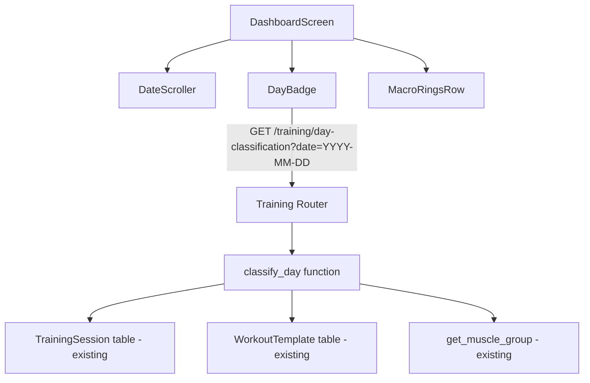

# Design Document: Training Day Rest Day Dashboard Indicator

## Overview

This feature adds a lightweight day classification system and a compact dashboard badge to Hypertrophy OS. The backend provides a single endpoint that determines whether a given date is a training day or rest day by checking logged sessions and workout template schedules, then extracts the relevant muscle groups. The frontend renders a `DayBadge` component between the `DateScroller` and `MacroRingsRow` on the dashboard.

No database migrations required. No new tables. No new dependencies. One new backend file, one new frontend component, one new utility file, two new test files, and minimal edits to three existing files.

## Architecture



### Dependency Chain (Build Order)

```
1. Backend schema (DayClassificationResponse) — no dependencies
2. Backend service (day_classification.py) — depends on: existing models, existing exercise_mapping
3. Backend route (router.py addition) — depends on: schema + service
4. Backend tests — depends on: service + route
5. Frontend utility (dayClassificationLogic.ts) — no dependencies
6. Frontend component (DayBadge.tsx) — depends on: utility, existing theme tokens
7. Frontend tests for utility + component — depends on: utility + component
8. Dashboard integration (DashboardScreen.tsx edit) — depends on: component + API route
9. Dashboard integration tests — depends on: dashboard integration
```

No circular dependencies. Each step consumes only outputs from prior steps.

## Components and Interfaces

### Backend

#### Response Schema — add to `src/modules/training/schemas.py`

```python
class DayClassificationResponse(BaseModel):
    is_training_day: bool
    classification: str  # Literal["training", "rest"]
    muscle_groups: list[str]  # deduplicated, sorted alphabetically
    source: str  # Literal["session", "template", "none"]
```

Constraints:
- `classification` is derived: `"training"` if `is_training_day` else `"rest"`
- `muscle_groups` is empty list when `source == "none"`
- `source` indicates which data source drove the classification

#### Day Classification Service — new file `src/modules/training/day_classification.py`

Single async function, no class needed:

```python
async def classify_day(
    db: AsyncSession,
    user_id: uuid.UUID,
    target_date: date,
) -> DayClassificationResponse:
```

Algorithm (exact steps):

1. Query `training_sessions` WHERE `user_id = :user_id AND session_date = :target_date AND deleted_at IS NULL`. Use existing `TrainingSession` model and `not_deleted()` scope.
2. If rows returned:
   - Collect all exercise names from all sessions' `exercises` JSONB arrays
   - For each exercise name, call `get_muscle_group(exercise_name)` from `exercise_mapping.py`
   - Deduplicate the muscle group list, sort alphabetically
   - Return `DayClassificationResponse(is_training_day=True, classification="training", muscle_groups=sorted_groups, source="session")`
3. If no sessions: Query `workout_templates` WHERE `user_id = :user_id AND deleted_at IS NULL`. Use existing `WorkoutTemplate` model and `not_deleted()` scope.
4. Filter in Python: keep templates where `template.metadata_` is a dict, has key `"scheduled_days"`, and `target_date.weekday()` is in that list. Python's `date.weekday()` returns 0=Monday, 6=Sunday.
5. If matching templates found:
   - Collect all exercise names from all matching templates' `exercises` JSONB arrays
   - Apply same `get_muscle_group()` + dedup + sort logic
   - Return `DayClassificationResponse(is_training_day=True, classification="training", muscle_groups=sorted_groups, source="template")`
6. Otherwise: Return `DayClassificationResponse(is_training_day=False, classification="rest", muscle_groups=[], source="none")`

Extract a helper for muscle group extraction to avoid duplication:

```python
def _extract_muscle_groups(exercises_jsonb: list[list[dict]]) -> list[str]:
    """Flatten exercises from multiple sessions/templates, extract and deduplicate muscle groups."""
    groups: set[str] = set()
    for exercise_list in exercises_jsonb:
        for exercise in exercise_list:
            name = exercise.get("exercise_name", "")
            groups.add(get_muscle_group(name))
    return sorted(groups)
```

#### API Route — add to `src/modules/training/router.py`

Add this endpoint BEFORE the `/sessions/{session_id}` route (to avoid path conflicts with FastAPI's route matching):

```python
@router.get("/day-classification", response_model=DayClassificationResponse)
async def get_day_classification(
    user: User = Depends(get_current_user),
    db: AsyncSession = Depends(get_db),
    target_date: date = Query(..., alias="date"),
) -> DayClassificationResponse:
    """Classify a date as training day or rest day with muscle groups."""
    return await classify_day(db=db, user_id=user.id, target_date=target_date)
```

Route placement matters: it must be registered before `/sessions/{session_id}` so FastAPI doesn't try to parse `"day-classification"` as a UUID session_id.

### Frontend

#### Utility — new file `app/utils/dayClassificationLogic.ts`

```typescript
export function formatMuscleGroup(raw: string): string {
  // "quads" → "Quads"
  // "full_body" → "Full Body"
  // "Other" → "Other"
  return raw
    .split('_')
    .map(word => word.charAt(0).toUpperCase() + word.slice(1))
    .join(' ');
}

export function formatMuscleGroups(groups: string[]): string[] {
  return groups.map(formatMuscleGroup);
}
```

#### DayBadge Component — new file `app/components/dashboard/DayBadge.tsx`

Props interface:

```typescript
interface DayBadgeProps {
  isTrainingDay: boolean;
  muscleGroups: string[];  // already formatted display names
  isLoading: boolean;
}
```

Rendering rules:
- `isLoading=true`: Render `<Skeleton width={200} height={32} borderRadius={16} />` using existing Skeleton component
- `isTrainingDay=true`: Render a horizontal View with:
  - Dumbbell Icon (use existing `<Icon name="dumbbell" />`) in `colors.accent.primary`
  - Text "Training Day" in `colors.accent.primary`, `typography.size.sm`, `fontWeight: semibold`
  - For each muscle group: a small chip/tag with `backgroundColor: colors.accent.primaryMuted`, `borderRadius: radius.full`, text in `colors.accent.primary`, `typography.size.xs`
- `isTrainingDay=false`: Render a horizontal View with:
  - Moon Icon (use existing `<Icon name="moon" />`) in `colors.text.muted`
  - Text "Rest Day" in `colors.text.muted`, `typography.size.sm`, `fontWeight: medium`

Container style: `flexDirection: 'row'`, `alignItems: 'center'`, `justifyContent: 'center'`, `gap: spacing[2]`, `marginBottom: spacing[3]`, `flexWrap: 'wrap'`

#### Dashboard Integration — edit `app/screens/dashboard/DashboardScreen.tsx`

Specific changes:

1. Add import: `import { DayBadge } from '../../components/dashboard/DayBadge';`
2. Add import: `import { formatMuscleGroups } from '../../utils/dayClassificationLogic';`
3. Add state:
   ```typescript
   const [dayClassification, setDayClassification] = useState<{
     isTrainingDay: boolean;
     muscleGroups: string[];
   }>({ isTrainingDay: false, muscleGroups: [] });
   const [dayClassLoading, setDayClassLoading] = useState(true);
   ```
4. Add staggered entrance (insert between existing `dateScrollerAnim` and `ringsAnim`, shift subsequent indices by 1):
   ```typescript
   const dayBadgeAnim = useStaggeredEntrance(2, 60);
   // ringsAnim becomes index 3, budgetAnim becomes 4, etc.
   ```
5. In `loadDashboardData`, add to the `Promise.allSettled` array:
   ```typescript
   api.get('training/day-classification', { params: { date: targetDate } })
   ```
6. Process the result (add after training sessions processing):
   ```typescript
   if (dayClassRes.status === 'fulfilled') {
     const data = dayClassRes.value.data;
     setDayClassification({
       isTrainingDay: data.is_training_day,
       muscleGroups: formatMuscleGroups(data.muscle_groups),
     });
   }
   // On failure: leave default rest day state — graceful degradation
   ```
7. Set `setDayClassLoading(false)` in the `finally` block (alongside existing `setIsLoading(false)`)
8. Set `setDayClassLoading(true)` at the start of `loadDashboardData`
9. Render between DateScroller and MacroRingsRow:
   ```tsx
   <Animated.View style={dayBadgeAnim}>
     <DayBadge
       isTrainingDay={dayClassification.isTrainingDay}
       muscleGroups={dayClassification.muscleGroups}
       isLoading={dayClassLoading}
     />
   </Animated.View>
   ```

## Data Models

### DayClassificationResponse (API)

| Field | Type | Description |
|-------|------|-------------|
| `is_training_day` | `boolean` | Whether the date is a training day |
| `classification` | `string` | `"training"` or `"rest"` |
| `muscle_groups` | `string[]` | Sorted, deduplicated muscle group names (lowercase) |
| `source` | `string` | `"session"`, `"template"`, or `"none"` |

### WorkoutTemplate Metadata Convention

The existing `WorkoutTemplate.metadata_` JSONB field uses a `scheduled_days` key:

```json
{
  "scheduled_days": [0, 2, 4]
}
```

Values are Python weekday numbers (0=Monday, 6=Sunday). This is optional — templates without it are ignored for schedule-based classification. The service validates that `scheduled_days` is a list of integers in range 0-6; malformed values are silently skipped.

No database migrations needed. The `metadata_` JSONB column already exists on `workout_templates`.


## Correctness Properties

*A property is a characteristic or behavior that should hold true across all valid executions of a system — essentially, a formal statement about what the system should do. Properties serve as the bridge between human-readable specifications and machine-verifiable correctness guarantees.*

### Property 1: Session implies training day

*For any* user and any date, if there exists at least one non-deleted training session on that date, the classification service shall return `is_training_day=True` with `source="session"`.

**Validates: Requirements 1.1, 1.4**

### Property 2: No session and no template implies rest day

*For any* user and any date, if there are no non-deleted training sessions on that date and no workout templates with `scheduled_days` containing that date's weekday, the classification service shall return `is_training_day=False` with `source="none"` and an empty muscle groups list.

**Validates: Requirements 1.2**

### Property 3: Template schedule implies training day

*For any* user and any date with no logged sessions, if there exists at least one non-deleted workout template whose `metadata.scheduled_days` contains that date's weekday number, the classification service shall return `is_training_day=True` with `source="template"`.

**Validates: Requirements 1.3, 5.1**

### Property 4: Session takes priority over template

*For any* user and any date that has both a logged session and a matching template schedule, the classification service shall return `source="session"` and the muscle groups shall be derived from the session exercises (not the template exercises).

**Validates: Requirements 1.4**

### Property 5: Muscle group extraction matches mapping

*For any* list of exercises (from either a session or a template), the muscle groups returned by the classification service shall be exactly the set of values produced by applying `get_muscle_group()` to each exercise name.

**Validates: Requirements 2.1, 2.2, 2.3**

### Property 6: Muscle groups are deduplicated and sorted

*For any* classification result where `is_training_day=True`, the `muscle_groups` list shall contain no duplicate entries and shall be sorted in ascending alphabetical order.

**Validates: Requirements 2.4**

### Property 7: Multiple templates merge muscle groups

*For any* user and any date with no logged sessions but multiple workout templates scheduled on that date's weekday, the returned muscle groups shall be the deduplicated, sorted union of muscle groups from all matching templates' exercises.

**Validates: Requirements 5.2**

### Property 8: Templates without scheduled_days are ignored

*For any* user and any date, workout templates that lack a `scheduled_days` key in their metadata shall not contribute to schedule-based day classification. Only templates with explicit `scheduled_days` containing the target weekday shall be considered.

**Validates: Requirements 5.3**

## Error Handling

| Scenario | Behavior | Rollback |
|----------|----------|----------|
| Invalid date format in API request | FastAPI returns 422 with validation error (Pydantic `date` type) | N/A — request rejected |
| Unauthenticated request | Auth middleware returns 401 (existing `get_current_user`) | N/A — request rejected |
| Database connection failure during classify_day | Endpoint returns 500; frontend DayBadge stays in default rest-day state | N/A — transient error |
| Exercise name not in mapping | `get_muscle_group()` returns `"Other"` (existing behavior) | N/A — safe fallback |
| No sessions and no templates for date | Returns `is_training_day=False, muscle_groups=[], source="none"` | N/A — correct behavior |
| Template metadata missing `scheduled_days` key | Template silently skipped for schedule classification | N/A — correct behavior |
| Template `scheduled_days` contains non-integer or out-of-range values | Service skips malformed entries, processes valid ones | N/A — defensive parsing |
| Frontend API call fails (network error, timeout) | DayBadge renders default rest-day state; no crash, no error UI | N/A — graceful degradation |

## Risks and Mitigations

| # | Risk | Impact | Likelihood | Mitigation |
|---|------|--------|------------|------------|
| 1 | Route ordering: `/day-classification` matched as `{session_id}` UUID | 422 errors on the new endpoint | Medium | Register `/day-classification` route BEFORE `/sessions/{session_id}` in router.py. Verified by integration test. |
| 2 | `metadata_.scheduled_days` schema drift from other features | Incorrect template classification | Low | Validate `scheduled_days` is list[int] with values 0-6 in service. Ignore malformed. |
| 3 | Slow query for users with 100+ templates | P99 latency > 200ms | Low | Query is filtered by `user_id` (indexed) + `deleted_at IS NULL` (partial index). Monitor P99. Add JSONB index only if needed. |
| 4 | `useStaggeredEntrance` index shift breaks existing animations | Visual glitch on dashboard | Medium | Increment all indices after the new badge slot. Covered by manual visual QA. |
| 5 | Exercise mapping gaps for new exercises | "Other" shown for valid exercises | Low | Acceptable for v1. Log "Other" frequency for mapping updates. |

## Rollback Plan

This feature is fully additive. No migrations, no schema changes, no existing behavior modified.

| Step | Rollback Action |
|------|----------------|
| Backend service | Delete `src/modules/training/day_classification.py` |
| Backend schema | Remove `DayClassificationResponse` from `schemas.py` |
| Backend route | Remove `get_day_classification` endpoint from `router.py` |
| Frontend component | Delete `app/components/dashboard/DayBadge.tsx` |
| Frontend utility | Delete `app/utils/dayClassificationLogic.ts` |
| Dashboard integration | Revert `DashboardScreen.tsx` to remove DayBadge import, state, API call, and render. Revert staggered entrance indices. |
| Tests | Delete `tests/test_day_classification_properties.py`, `app/__tests__/utils/dayClassificationLogic.test.ts`, `app/__tests__/components/DayBadge.test.ts` |

No data cleanup needed. The `scheduled_days` metadata key in templates is inert without the endpoint.

## Monitoring

| Metric | How | Alert |
|--------|-----|-------|
| `/training/day-classification` latency P50/P95/P99 | Existing FastAPI middleware timing | P99 > 500ms for 5 consecutive minutes |
| `/training/day-classification` 5xx error rate | HTTP status code counter | > 5% over 5 min window |
| `source` distribution (session vs template vs none) | Structured log in `classify_day` | No alert — weekly review for adoption tracking |
| "Other" muscle group frequency | Structured log when "Other" appears in result | No alert — weekly review to prioritize mapping updates |

## Testing Strategy

### Property-Based Tests — `tests/test_day_classification_properties.py`

Use `hypothesis` (Python). Minimum 100 iterations per property. Each test tagged:
`Feature: training-day-indicator, Property {N}: {title}`

| Test | Property | Validates |
|------|----------|-----------|
| `test_session_implies_training_day` | Property 1 | Req 1.1, 1.4 |
| `test_no_data_implies_rest_day` | Property 2 | Req 1.2 |
| `test_template_schedule_implies_training_day` | Property 3 | Req 1.3, 5.1 |
| `test_session_priority_over_template` | Property 4 | Req 1.4 |
| `test_muscle_group_extraction_matches_mapping` | Property 5 | Req 2.1, 2.2, 2.3 |
| `test_muscle_groups_deduplicated_and_sorted` | Property 6 | Req 2.4 |
| `test_multiple_templates_merge_muscle_groups` | Property 7 | Req 5.2 |
| `test_templates_without_scheduled_days_ignored` | Property 8 | Req 5.3 |

Strategy: Since `classify_day` requires an async DB session, property tests will test the pure extraction helper `_extract_muscle_groups` directly for Properties 5-8. Properties 1-4 will use the existing test DB fixtures from `conftest.py` to create sessions/templates and call `classify_day`.

### Unit Tests — Backend

- `classify_day` with a session on the target date → training day, correct muscle groups
- `classify_day` with no session, template scheduled on target weekday → training day from template
- `classify_day` with no session, no matching template → rest day
- `classify_day` with both session and template → source is "session"
- `_extract_muscle_groups` with known exercises → correct groups
- `_extract_muscle_groups` with unknown exercises → includes "Other"
- `_extract_muscle_groups` with duplicate exercises → deduplicated output
- `DayClassificationResponse` serialization round-trip

### Unit Tests — Frontend

- `formatMuscleGroup("quads")` → `"Quads"`
- `formatMuscleGroup("full_body")` → `"Full Body"`
- `formatMuscleGroup("Other")` → `"Other"`
- `DayBadge` renders "Training Day" text when `isTrainingDay=true`
- `DayBadge` renders "Rest Day" text when `isTrainingDay=false`
- `DayBadge` renders muscle group tags when provided
- `DayBadge` renders skeleton when `isLoading=true`
- `DayBadge` renders no muscle group tags when list is empty

### Integration Tests

- `GET /training/day-classification?date=2024-01-15` with a session on that date → 200, training, correct groups
- `GET /training/day-classification?date=2024-01-16` with no data → 200, rest, empty groups
- `GET /training/day-classification?date=invalid` → 422
- `GET /training/day-classification` without auth header → 401

### Testing Checkpoints

1. **After backend service + property tests + unit tests**: Run `pytest tests/test_day_classification_properties.py -v` — all green before touching router
2. **After API route + integration tests**: Run `pytest tests/ -k "day_classification or training"` — no regressions in training module
3. **After frontend utility + component + tests**: Run `npx jest --run app/__tests__/utils/dayClassificationLogic.test.ts app/__tests__/components/DayBadge.test.ts` — all green before dashboard edit
4. **After dashboard integration**: Run `npx jest --run app/__tests__/screens/DashboardScreen.test.tsx` — no regressions
