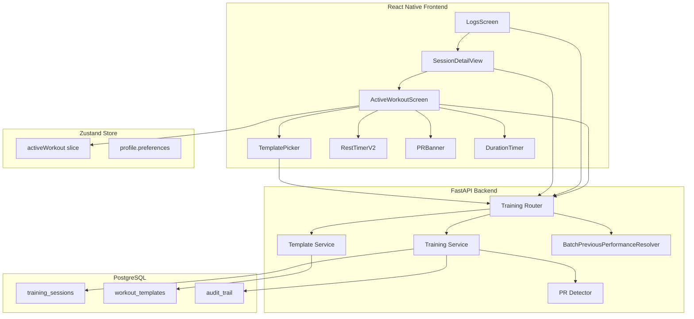
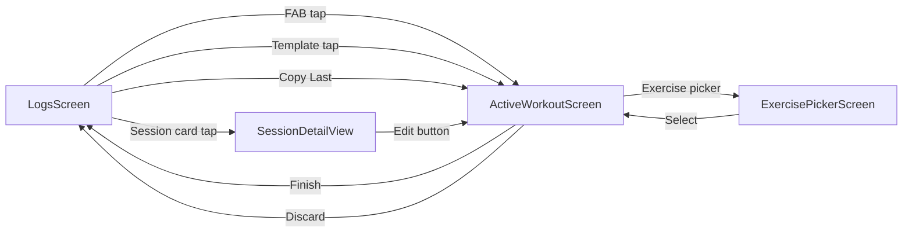

# Design Document: Training Log Redesign

## Overview

This design transforms the training logging experience from a modal-based form (`AddTrainingModal`) into a full-screen `ActiveWorkoutScreen` with inline previous performance, set completion checkmarks, auto-start rest timer with progress ring, PR celebration banners, session detail/edit views, user-created templates, infinite history, and superset grouping.

The architecture follows the existing app patterns: React Native frontend with Zustand state management, FastAPI backend with SQLAlchemy models, and Pydantic schemas. The redesign is additive — existing data models are extended (not replaced), and backward compatibility is maintained for all existing sessions.

### Key Design Decisions

| Decision | Choice | Alternative Considered | Why This Choice |
|---|---|---|---|
| Workout screen type | Full-screen push navigation | Keep modal, make it taller | Modal constrains scroll area, blocks back-navigation, can't deep-link. Every competitor (Hevy, Strong, RP) uses full-screen. Push nav gives us proper navigation stack, crash recovery via route params, and the "focused mode" signal users expect. |
| Workout state persistence | Zustand slice + AsyncStorage middleware | SQLite local DB, or server-side draft | AsyncStorage is already in the stack (Expo). Zustand `persist` middleware gives us crash recovery with zero new dependencies. SQLite adds complexity for a single-document use case. Server-side drafts add latency to every set log. |
| Previous performance batching | Single POST endpoint accepting exercise name array | GraphQL, or keep per-exercise GET | POST batch is the simplest change. The current N+1 GET pattern causes visible latency with 5+ exercises. GraphQL is overkill for one query shape. Batch POST returns all data in one round trip. |
| Set type storage | `set_type` field inside existing exercises JSON array | Separate `sets` table with columns | The exercises column is already JSON. Adding `set_type` to each set object is backward-compatible (old sets default to `normal` via Pydantic). A separate table would require a migration that restructures all existing data. |
| User templates storage | New `workout_templates` PostgreSQL table | JSON file, or metadata on training_sessions | Templates need CRUD, user association, ordering, and soft delete. A proper table gives us indexes, pagination, and audit trail. JSON files don't scale. Session metadata conflates two concerns. |
| Rest timer animation | SVG circle with `strokeDashoffset` via React Native SVG | Canvas, Lottie, or CSS animation | react-native-svg is already a dependency (used by charts). SVG circle animation is GPU-accelerated, 60fps, and requires no additional dependencies. Lottie would need a designer to create the animation file. |
| PR detection timing | On set completion (real-time), not on session save | Batch on save only | Real-time PR detection is what makes Hevy's experience feel alive. Waiting until save means the user misses the emotional moment. The backend already has `PRDetector` — we call it per-set during the workout. |

---

## Architecture



### Navigation Flow



---

## Components and Interfaces

### Frontend Components

#### ActiveWorkoutScreen

The primary full-screen workout logging interface. Replaces `AddTrainingModal`. Registered as a screen in the navigation stack (not a modal).

```typescript
// Navigation params
interface ActiveWorkoutScreenParams {
  mode: 'new' | 'edit' | 'template' | 'copy-last';
  sessionId?: string;       // for edit mode — backend session UUID
  templateId?: string;      // for template mode — template UUID or static ID
  sessionDate?: string;     // for past-date logging — ISO date string
}
```

#### Zustand activeWorkout Slice

All in-progress workout state lives here. Persisted to AsyncStorage via Zustand `persist` middleware for crash recovery.

```typescript
interface ActiveWorkoutState {
  // Workout metadata
  workoutId: string;              // local UUID, generated on workout start
  mode: 'new' | 'edit';
  editSessionId: string | null;   // backend session UUID when editing
  sessionDate: string;            // ISO date string (YYYY-MM-DD)
  startedAt: string;              // ISO timestamp — set once on workout start, never mutated
  
  // Exercise data
  exercises: ActiveExercise[];
  
  // Superset groups
  supersetGroups: SupersetGroup[];
  
  // Notes
  notes: string;
  
  // Template source
  sourceTemplateId: string | null;
  
  // Previous performance cache (keyed by lowercase exercise name)
  previousPerformance: Record<string, PreviousPerformanceData | null>;
  previousPerformanceLoading: boolean;
  
  // Active state flag — true when a workout is in progress
  isActive: boolean;
}

interface ActiveExercise {
  localId: string;          // client-generated UUID
  exerciseName: string;
  sets: ActiveSet[];
}

interface ActiveSet {
  localId: string;          // client-generated UUID
  setNumber: number;        // 1-indexed display number
  weight: string;           // string for TextInput (user's unit system)
  reps: string;             // string for TextInput
  rpe: string;              // string for TextInput, empty = not set
  setType: SetType;         // defaults to 'normal'
  completed: boolean;       // toggled by checkmark tap
  completedAt: string | null;  // ISO timestamp, set on completion
}

type SetType = 'normal' | 'warm-up' | 'drop-set' | 'amrap';

interface SupersetGroup {
  id: string;               // client-generated UUID
  exerciseLocalIds: string[];  // ordered list of exercise localIds, min length 2
}

interface PreviousPerformanceData {
  exerciseName: string;
  sessionDate: string;
  sets: Array<{ weightKg: number; reps: number; rpe: number | null }>;
}
```

**Actions:**

```typescript
interface ActiveWorkoutActions {
  // Lifecycle
  startWorkout: (params: {
    mode: 'new' | 'edit';
    editSessionId?: string;
    templateExercises?: ActiveExercise[];
    sessionDate?: string;
  }) => void;
  finishWorkout: () => ActiveWorkoutPayload;  // returns API payload
  discardWorkout: () => void;                 // clears all state + AsyncStorage
  
  // Exercise CRUD
  addExercise: (name: string) => void;
  removeExercise: (localId: string) => void;
  reorderExercises: (fromIndex: number, toIndex: number) => void;
  
  // Set CRUD
  addSet: (exerciseLocalId: string) => void;
  removeSet: (exerciseLocalId: string, setLocalId: string) => void;
  updateSetField: (exerciseLocalId: string, setLocalId: string, field: 'weight' | 'reps' | 'rpe', value: string) => void;
  updateSetType: (exerciseLocalId: string, setLocalId: string, setType: SetType) => void;
  toggleSetCompleted: (exerciseLocalId: string, setLocalId: string) => {
    completed: boolean;
    validationError: string | null;
  };
  
  // Superset CRUD
  createSuperset: (exerciseLocalIds: string[]) => string | null;  // returns superset ID or null if < 2
  removeSuperset: (supersetId: string) => void;
  
  // Previous performance
  setPreviousPerformance: (data: Record<string, PreviousPerformanceData | null>) => void;
  copyPreviousToSet: (exerciseLocalId: string, setLocalId: string) => void;
  
  // Metadata
  setSessionDate: (date: string) => void;
  setNotes: (notes: string) => void;
}
```

#### DurationTimer

Pure display component. Calculates elapsed time from a start timestamp on every tick.

```typescript
interface DurationTimerProps {
  startedAt: string;  // ISO timestamp
}
// Implementation:
// - useEffect with setInterval(1000)
// - Each tick: elapsed = Math.floor((Date.now() - new Date(startedAt).getTime()) / 1000)
// - Renders formatDuration(elapsed) → "01:23:45"
// - Monospace font prevents layout shift
// - Survives backgrounding because it recalculates from timestamp, not from accumulated state
```

#### RestTimerV2

Rebuilt rest timer with SVG progress ring, pause/resume, +/-15s.

```typescript
interface RestTimerV2Props {
  durationSeconds: number;
  visible: boolean;
  onDismiss: () => void;
  onComplete: () => void;
}

// Internal state machine:
// IDLE → RUNNING (on visible=true)
// RUNNING → PAUSED (on pause tap)
// PAUSED → RUNNING (on resume tap)
// RUNNING → COMPLETED (on remaining=0)
// ANY → IDLE (on skip or dismiss)
//
// Progress ring: SVG <Circle> with:
//   circumference = 2 * PI * radius
//   strokeDashoffset = circumference * (remaining / originalDuration)
//   Animated.timing for smooth transitions
//
// Color: getTimerColor(remaining) → green (>10s), yellow (5-10s), red (<=5s)
// +15s/-15s: remaining = Math.max(0, remaining + delta)
// Sound: expo-av Audio.Sound on completion (best-effort, silent fallback)
```

#### PRBanner

Animated celebration overlay.

```typescript
interface PRBannerProps {
  prs: Array<{
    type: 'weight' | 'reps' | 'volume' | 'e1rm';
    exerciseName: string;
    value: string;  // pre-formatted with unit, e.g. "100kg" or "220lbs"
  }>;
  visible: boolean;
  onDismiss: () => void;
}
// Animation: Animated.spring scale 0→1 (0.3s), auto-dismiss setTimeout(3000)
// Layout: trophy icon + PR type badge + exercise name + value
// Tap anywhere to dismiss immediately
```

#### SessionDetailView

Read-only screen for viewing a completed workout.

```typescript
interface SessionDetailViewParams {
  sessionId: string;
}
// Fetches: GET /api/v1/training/sessions/{sessionId}
// Displays: date, duration (if start_time/end_time present), total working volume
// Each exercise: name, sets table (set#, weight, reps, RPE, set_type, PR badge)
// Notes section (if metadata.notes present)
// "Edit" button → navigates to ActiveWorkoutScreen with mode='edit'
// Handles legacy sessions (no duration, no set_type) gracefully
```

#### TemplatePicker

Template selection shown when starting a workout.

```typescript
interface TemplatePickerProps {
  onSelectTemplate: (templateId: string, isSystem: boolean) => void;
  onCopyLast: () => void;
  onStartEmpty: () => void;
}
// Two sections:
//   "My Templates" — GET /api/v1/training/templates/user (user-created, sorted by sort_order)
//   "System Templates" — GET /api/v1/training/templates (static 6)
// Long-press on user template → ActionSheet with Edit / Delete
// "Copy Last Workout" button
// "Start Empty Workout" button
```

---

## API Contracts

### New Endpoints

#### POST /api/v1/training/previous-performance/batch

Replaces the N+1 per-exercise GET pattern.

```
Request:
  POST /api/v1/training/previous-performance/batch
  Authorization: Bearer {token}
  Body: {
    "exercise_names": ["Barbell Bench Press", "Barbell Row", "Overhead Press"]
  }
  Constraints: exercise_names.length >= 1, <= 20

Response 200:
  {
    "results": {
      "Barbell Bench Press": {
        "exercise_name": "Barbell Bench Press",
        "session_date": "2024-01-15",
        "sets": [
          { "weight_kg": 80.0, "reps": 8, "rpe": 7.0 },
          { "weight_kg": 80.0, "reps": 8, "rpe": 8.0 },
          { "weight_kg": 82.5, "reps": 6, "rpe": 9.0 }
        ]
      },
      "Barbell Row": {
        "exercise_name": "Barbell Row",
        "session_date": "2024-01-15",
        "sets": [{ "weight_kg": 70.0, "reps": 8, "rpe": null }]
      },
      "Overhead Press": null
    }
  }

Response 422: Validation error (empty array, >20 exercises)
```

**Implementation**: `BatchPreviousPerformanceResolver` queries `training_sessions` once (user's sessions ordered by date DESC), iterates through sessions to find the most recent occurrence of each requested exercise, and returns all results in a single dict. This replaces N separate queries with 1.

#### GET /api/v1/training/sessions/{session_id}

Returns a single session by ID. Currently missing — the existing GET /sessions only returns paginated lists.

```
Request:
  GET /api/v1/training/sessions/{session_id}
  Authorization: Bearer {token}

Response 200: TrainingSessionResponse (same schema as list items)
Response 404: Session not found or belongs to different user
```

#### POST /api/v1/training/templates (User Templates)

```
Request:
  POST /api/v1/training/templates
  Authorization: Bearer {token}
  Body: {
    "name": "Push Day A",
    "description": "Heavy bench focus",
    "exercises": [
      {
        "exercise_name": "Barbell Bench Press",
        "sets": [
          { "reps": 5, "weight_kg": 100.0, "rpe": null, "set_type": "normal" }
        ]
      }
    ],
    "metadata": { "notes": "Start with 2 warm-up sets" }
  }

Response 201: WorkoutTemplateResponse
Response 422: Validation error
```

#### GET /api/v1/training/templates/user

```
Request:
  GET /api/v1/training/templates/user
  Authorization: Bearer {token}

Response 200: list[WorkoutTemplateResponse] (ordered by sort_order ASC, created_at DESC)
```

#### PUT /api/v1/training/templates/{template_id}

```
Request:
  PUT /api/v1/training/templates/{template_id}
  Authorization: Bearer {token}
  Body: WorkoutTemplateUpdate (all fields optional)

Response 200: WorkoutTemplateResponse
Response 404: Template not found or belongs to different user
```

#### DELETE /api/v1/training/templates/{template_id}

```
Request:
  DELETE /api/v1/training/templates/{template_id}
  Authorization: Bearer {token}

Response 204: No content
Response 404: Template not found or belongs to different user
```

### Modified Endpoints

#### POST /api/v1/training/sessions (Extended)

New optional fields in the request body:

```
Body additions:
  "start_time": "2024-01-15T14:30:00Z"   // optional, ISO timestamp
  "end_time": "2024-01-15T15:45:00Z"     // optional, ISO timestamp

Set-level additions (inside exercises[].sets[]):
  "set_type": "normal"                    // optional, defaults to "normal"
                                          // enum: normal, warm-up, drop-set, amrap

Session metadata additions:
  "metadata": {
    "notes": "Felt strong",
    "superset_groups": [                  // optional
      { "id": "uuid", "exercise_names": ["Barbell Bench Press", "Barbell Row"] }
    ]
  }
```

All new fields are optional. Existing clients sending the current payload format continue to work.

#### PUT /api/v1/training/sessions/{session_id} (Extended)

Same new optional fields as POST. Audit trail captures changes to new fields.

---

## Data Models

### Extended SetEntry Schema (Backend)

```python
class SetEntry(BaseModel):
    reps: int = Field(ge=0)
    weight_kg: float = Field(ge=0)
    rpe: float | None = Field(default=None, ge=0, le=10)
    set_type: str = Field(default="normal")  # NEW: normal, warm-up, drop-set, amrap

    @field_validator("set_type")
    @classmethod
    def validate_set_type(cls, v: str) -> str:
        allowed = {"normal", "warm-up", "drop-set", "amrap"}
        if v not in allowed:
            raise ValueError(f"set_type must be one of {allowed}")
        return v
```

Backward compatible: existing sets without `set_type` default to `"normal"` via the Pydantic default.

### Extended TrainingSessionCreate Schema

```python
class TrainingSessionCreate(BaseModel):
    session_date: date
    exercises: list[ExerciseEntry] = Field(min_length=1)
    metadata: dict[str, Any] | None = Field(default=None)
    start_time: datetime | None = Field(default=None)   # NEW
    end_time: datetime | None = Field(default=None)      # NEW

    @field_validator("session_date")
    @classmethod
    def no_future_dates(cls, v: date) -> date:
        if v > date.today():
            raise ValueError("session_date cannot be in the future")
        return v
```

### Extended TrainingSessionResponse Schema

```python
class TrainingSessionResponse(BaseModel):
    id: uuid.UUID
    user_id: uuid.UUID
    session_date: date
    exercises: list[ExerciseEntry]
    metadata: dict[str, Any] | None = None
    personal_records: list[PersonalRecordResponse] = Field(default_factory=list)
    start_time: datetime | None = None   # NEW
    end_time: datetime | None = None     # NEW
    created_at: datetime
    updated_at: datetime
```

### TrainingSession Model (Database) — Extended

The existing `training_sessions` table gets two new nullable columns:

```python
# Added to existing TrainingSession model
start_time: Mapped[datetime | None] = mapped_column(nullable=True)  # NEW
end_time: Mapped[datetime | None] = mapped_column(nullable=True)    # NEW
```

Migration is additive (ALTER TABLE ADD COLUMN ... NULL). No data migration needed — existing rows get NULL for both columns.

### New WorkoutTemplate Model (Database)

```python
class WorkoutTemplate(SoftDeleteMixin, AuditMixin, Base):
    __tablename__ = "workout_templates"
    
    id: Mapped[uuid.UUID] = mapped_column(primary_key=True, default=uuid.uuid4)
    user_id: Mapped[uuid.UUID] = mapped_column(ForeignKey("users.id"), index=True)
    name: Mapped[str] = mapped_column(String(200))
    description: Mapped[str | None] = mapped_column(Text, nullable=True)
    exercises: Mapped[list] = mapped_column(JSON)  # Same format as TrainingSession.exercises
    metadata_: Mapped[dict | None] = mapped_column("metadata", JSON, nullable=True)
    sort_order: Mapped[int] = mapped_column(default=0)
    created_at: Mapped[datetime] = mapped_column(default=lambda: datetime.now(timezone.utc))
    updated_at: Mapped[datetime] = mapped_column(
        default=lambda: datetime.now(timezone.utc),
        onupdate=lambda: datetime.now(timezone.utc),
    )
```

**Indexes:**
- `ix_workout_templates_user_id` on `user_id` — primary access pattern is "get all templates for user"
- Composite `(user_id, sort_order)` for ordered listing

### WorkoutTemplate Schemas

```python
class WorkoutTemplateCreate(BaseModel):
    name: str = Field(min_length=1, max_length=200)
    description: str | None = None
    exercises: list[ExerciseEntry] = Field(min_length=1)
    metadata: dict[str, Any] | None = None

class WorkoutTemplateUpdate(BaseModel):
    name: str | None = Field(default=None, min_length=1, max_length=200)
    description: str | None = None
    exercises: list[ExerciseEntry] | None = None
    metadata: dict[str, Any] | None = None

class WorkoutTemplateResponse(BaseModel):
    id: uuid.UUID
    user_id: uuid.UUID
    name: str
    description: str | None = None
    exercises: list[ExerciseEntry]
    metadata: dict[str, Any] | None = None
    is_system: bool = False  # True for static templates, False for user-created
    created_at: datetime
    updated_at: datetime
```

### Batch Previous Performance Schemas

```python
class BatchPreviousPerformanceRequest(BaseModel):
    exercise_names: list[str] = Field(min_length=1, max_length=20)

class PreviousPerformanceSetData(BaseModel):
    weight_kg: float
    reps: int
    rpe: float | None = None

class PreviousPerformanceResult(BaseModel):
    exercise_name: str
    session_date: date
    sets: list[PreviousPerformanceSetData]

class BatchPreviousPerformanceResponse(BaseModel):
    results: dict[str, PreviousPerformanceResult | None]
```

---

## Data Flow

### Flow 1: Start Workout → Log Sets → Finish

```
1. User taps FAB on LogsScreen
   → Navigation.push('ActiveWorkout', { mode: 'new' })

2. ActiveWorkoutScreen mounts
   → Zustand: startWorkout({ mode: 'new', sessionDate: today })
   → Sets workoutId = uuid(), startedAt = now(), isActive = true
   → AsyncStorage persists immediately (crash recovery)

3. User adds exercise via ExercisePicker
   → Zustand: addExercise("Barbell Bench Press")
   → Triggers batch previous performance fetch:
     POST /api/v1/training/previous-performance/batch
     Body: { exercise_names: ["Barbell Bench Press"] }
   → Response cached in Zustand: previousPerformance["barbell bench press"] = {...}

4. User taps Previous column value on Set 1
   → Zustand: copyPreviousToSet(exerciseLocalId, setLocalId)
   → Set weight/reps fields populated from cached previous data
   → Weight converted from kg to user's unit system

5. User taps Completion Checkmark on Set 1
   → Zustand: toggleSetCompleted(exerciseLocalId, setLocalId)
   → Validates: weight and reps non-empty → returns { completed: true, validationError: null }
   → Set: completed = true, completedAt = now()
   → Haptic feedback: Haptics.impactAsync(ImpactFeedbackStyle.Light)
   → PR check: POST /api/v1/training/sessions/check-pr (lightweight endpoint)
     OR: Client-side comparison against previousPerformance cache
   → If PR detected: PRBanner.show({ type: 'weight', exerciseName: '...', value: '...' })
   → Rest timer: RestTimerV2 auto-starts with duration from getRestDuration(exerciseName)
   → AsyncStorage persists updated state

6. Rest timer counts down
   → User can: pause/resume, skip, +15s/-15s
   → On completion: notification sound, "Rest Complete" indicator

7. Repeat steps 4-6 for all sets

8. User taps "Finish Workout"
   → Zustand: finishWorkout() builds API payload:
     {
       session_date: "2024-01-15",
       exercises: [...],  // with set_type on each set
       start_time: "2024-01-15T14:30:00Z",
       end_time: now(),
       metadata: { notes: "...", superset_groups: [...] }
     }
   → POST /api/v1/training/sessions
   → Response includes personal_records array
   → Show finish summary modal (duration, volume, PRs)
   → Optional: "Save as Template?" prompt
   → Zustand: discardWorkout() clears state + AsyncStorage
   → Navigation.goBack() to LogsScreen
   → LogsScreen refreshes via pull-to-refresh or callback
```

### Flow 2: Edit Existing Session

```
1. User taps session card on LogsScreen
   → Navigation.push('SessionDetail', { sessionId: 'uuid' })

2. SessionDetailView fetches: GET /api/v1/training/sessions/{sessionId}
   → Renders read-only view

3. User taps "Edit"
   → Converts TrainingSessionResponse → ActiveWorkoutState:
     - exercises mapped to ActiveExercise[] with all sets
     - mode = 'edit', editSessionId = sessionId
     - weight values converted from kg to user's unit system
   → Navigation.push('ActiveWorkout', { mode: 'edit', sessionId: 'uuid' })

4. User modifies sets, adds/removes exercises

5. User taps "Save Changes"
   → Zustand: finishWorkout() builds TrainingSessionUpdate payload
   → PUT /api/v1/training/sessions/{sessionId}
   → Backend writes audit trail of changes
   → Backend re-runs PR detection
   → Zustand: discardWorkout()
   → Navigation.goBack() twice (to LogsScreen)
```

### Flow 3: Infinite Scroll on LogsScreen

```
1. LogsScreen mounts
   → GET /api/v1/training/sessions?page=1&limit=20
   → Store: sessions = response.items, totalCount = response.total_count, currentPage = 1

2. User scrolls to bottom (onEndReached)
   → Check: hasMore = (currentPage * 20) < totalCount
   → If hasMore: GET /api/v1/training/sessions?page=2&limit=20
   → Append to sessions array, increment currentPage
   → Show loading indicator while fetching

3. User pulls to refresh
   → GET /api/v1/training/sessions?page=1&limit=20
   → Replace sessions array, reset currentPage = 1
```

---

## Edge Cases and Error Handling

### Race Conditions

| Scenario | Risk | Mitigation |
|---|---|---|
| Double-tap on Completion Checkmark | Set toggled twice rapidly, ending in wrong state | Debounce toggleSetCompleted with 300ms cooldown per set. The toggle is idempotent on the Zustand state (completed = !completed), so rapid taps just flip back and forth. The debounce prevents the rest timer from firing twice. |
| Double-tap on "Finish Workout" | Two POST /sessions requests | Disable button on first tap (loading state). The backend is idempotent on session creation (unique workout ID in metadata prevents duplicates). |
| Concurrent session edit by same user | Two tabs/devices editing same session | Last-write-wins via `updated_at` timestamp. The PUT endpoint doesn't check for conflicts — acceptable for a single-user app. If we add multi-device sync later, we'll need optimistic locking. |
| Previous performance fetch returns stale data | User logged a session on another device | Acceptable staleness. Previous performance is a hint, not a constraint. Refresh on next workout start. |
| Template deleted while workout in progress | Template ID in sourceTemplateId no longer exists | No impact. sourceTemplateId is informational only. The workout state is self-contained. |

### Null/Missing Data Handling

| Data | When Missing | Behavior |
|---|---|---|
| `start_time` / `end_time` on legacy sessions | Sessions created before this feature | SessionDetailView hides duration section. Volume still calculated. |
| `set_type` on legacy sets | Sets created before this feature | Default to `"normal"`. Pydantic default handles this transparently. |
| `superset_groups` in metadata | Sessions without supersets | Empty array or absent key. Frontend treats both as "no supersets". |
| Previous performance for new exercise | User has never done this exercise | Previous column shows "—". Tap-to-copy disabled. |
| User templates | New user with no templates | "My Templates" section hidden. Only "System Templates" shown. |
| `metadata.notes` | Session with no notes | Notes section hidden in SessionDetailView. |

### Frontend Error Handling

| Error | Handling | UX |
|---|---|---|
| Network failure on session save | Retry 3x with exponential backoff (1s, 2s, 4s). On final failure, keep workout in Zustand + AsyncStorage. Show persistent "Save failed — tap to retry" banner. | Zero data loss. User can retry or close and resume later. |
| Network failure on previous performance fetch | Show "—" in Previous column. Retry silently when user adds next exercise. | Degraded but functional. |
| Network failure on template CRUD | Error toast with message. Form data preserved for retry. | Templates are secondary to logging. |
| App crash mid-workout | On next app open, Zustand rehydrates from AsyncStorage. If `isActive === true`, show "Resume workout?" dialog with workout summary. | Zero data loss for the most critical flow. |
| Session 404 on detail view | Error screen with "Session not found" and back button. | Clean error state. |
| PR detection failure | Silently skip PR banner. Log error to console. Session still saves. | PRs are celebratory, not critical. |

### Backend Error Handling

| Error | HTTP Status | Response |
|---|---|---|
| Invalid `set_type` value | 422 | Pydantic validation error with field path |
| Future `session_date` | 422 | "session_date cannot be in the future" |
| Template name > 200 chars | 422 | Pydantic validation error |
| Template not found (wrong ID or wrong user) | 404 | "Template not found" (no user ID leak) |
| Batch previous performance > 20 exercises | 422 | "exercise_names must have at most 20 items" |
| Session update with no actual changes | 200 | Success, no audit entry written |
| Duplicate session save (same workoutId) | 201 | Idempotent — returns existing session |

---

## Scalability

This is a single-user mobile app with a FastAPI backend. Current scale is small. Here's what breaks at growth milestones:

| Scale | Bottleneck | Mitigation |
|---|---|---|
| **Current (1K users)** | No bottleneck. Single Postgres instance handles everything. | N/A |
| **10x (10K users)** | `BatchPreviousPerformanceResolver` scans all user sessions to find previous performance. With 500+ sessions per user, this becomes slow. | Add a materialized view or cache table `exercise_last_performance` that stores the most recent set data per (user_id, exercise_name). Update on session create/update. Query is then a simple indexed lookup instead of a full scan. |
| **100x (100K users)** | `training_sessions` table grows large. Pagination queries with `ORDER BY session_date DESC` become slow without proper indexing. Template listing per user needs index. | Ensure composite index on `(user_id, session_date DESC, deleted_at)` for session queries. Index on `(user_id, sort_order)` for templates. Consider partitioning `training_sessions` by user_id if single-table performance degrades. |
| **1M users** | PR detection on every set completion during a workout adds latency. Each PR check queries historical max weights. | Pre-compute PR table: `personal_records(user_id, exercise_name, reps, max_weight_kg)`. Update on session save, not on every set. During workout, compare against cached PR table (fetched once at workout start). |

**Current approach is correct for our scale.** The mitigations above are documented for when we need them, not implemented now. Premature optimization would add complexity without benefit.

---

## Tech Decisions

| Component | Choice | Tradeoff |
|---|---|---|
| **State management** | Zustand with `persist` middleware → AsyncStorage | Pro: Zero new dependencies, crash recovery for free, simple API. Con: AsyncStorage has 6MB limit on Android — not an issue for workout state (~10KB), but would be for offline-first with full history. |
| **Progress ring animation** | react-native-svg `<Circle>` with `Animated.timing` on `strokeDashoffset` | Pro: Already a dependency (charts use it), GPU-accelerated, 60fps. Con: SVG rendering on low-end Android can drop frames — mitigated by using `useNativeDriver: false` with simple timing (not spring). |
| **Haptic feedback** | expo-haptics `impactAsync(Light)` | Pro: Already in Expo SDK, cross-platform. Con: No haptics on Android devices without vibration motor — fails silently, which is fine. |
| **Timer sound** | expo-av `Audio.Sound` | Pro: Already in Expo SDK. Con: Requires audio file asset. Fallback: silent if expo-av unavailable. |
| **Navigation** | React Navigation stack push (not modal) | Pro: Proper back button, deep linking support, navigation state persistence. Con: Slightly more complex than modal for simple cases — but this isn't a simple case. |
| **PR detection timing** | Client-side comparison against `previousPerformance` cache during workout, confirmed by backend on save | Pro: Instant feedback (no network round trip per set). Con: Could show false PRs if cache is stale — acceptable because backend re-validates on save and the celebration moment matters more than 100% accuracy. |
| **Template storage** | PostgreSQL table with JSON exercises column | Pro: Consistent with training_sessions pattern, supports CRUD, indexable by user_id. Con: JSON column isn't queryable for "find templates containing exercise X" — acceptable because we don't need that query in v1. |
| **Infinite scroll** | FlatList `onEndReached` with page-based pagination | Pro: Simple, works with existing paginated API. Con: No cursor-based pagination means inserts during scroll could cause duplicates — mitigated by deduplication on client (filter by session ID). |

---

## Correctness Properties

*A property is a characteristic or behavior that should hold true across all valid executions of a system — essentially, a formal statement about what the system should do. Properties serve as the bridge between human-readable specifications and machine-verifiable correctness guarantees.*

The following properties were derived from the acceptance criteria through systematic prework analysis. Each property is universally quantified and references the requirement it validates.

### Property 1: Duration timer formatting

*For any* non-negative integer number of elapsed seconds, the duration formatting function shall produce a string matching the pattern `HH:MM:SS` where hours = floor(elapsed / 3600), minutes = floor(elapsed / 60) % 60, seconds = elapsed % 60, each zero-padded to 2 digits.

**Validates: Requirements 1.2, 1.3**

### Property 2: Rest timer formatting

*For any* non-negative integer number of remaining seconds, the rest timer formatting function shall produce a string matching the pattern `M:SS` where minutes = floor(remaining / 60) and seconds = remaining % 60, with seconds zero-padded to 2 digits.

**Validates: Requirements 4.3**

### Property 3: Set completion round-trip

*For any* set with valid (non-empty) weight and reps values, completing the set and then uncompleting it shall restore the set to its original state (completed = false, all input values unchanged).

**Validates: Requirements 2.2, 2.4**

### Property 4: Set completion validation rejects incomplete sets

*For any* set where weight is empty OR reps is empty, attempting to mark the set as completed shall be rejected and the set shall remain in incomplete state.

**Validates: Requirements 2.3**

### Property 5: Unit conversion round-trip

*For any* positive weight value and any unit system (metric or imperial), converting from the user's unit to kg for storage and then converting back to the user's unit for display shall produce a value within 0.1 of the original input.

**Validates: Requirements 5.1, 5.3, 5.4, 5.5**

### Property 6: Working volume excludes warm-up sets

*For any* list of exercises with sets of mixed set types, the working volume calculation shall equal the sum of (weight * reps) for only those completed sets where set_type is not `warm-up`.

**Validates: Requirements 6.3, 8.2**

### Property 7: Workout state serialization round-trip

*For any* valid ActiveWorkoutState object, serializing it to JSON for AsyncStorage persistence and then deserializing it back shall produce an equivalent object (all exercises, sets, metadata, and superset groups preserved).

**Validates: Requirements 1.9, 6.5, 13.6**

### Property 8: Template round-trip

*For any* valid workout state with at least one exercise, creating a template from that workout and then starting a new workout from that template shall produce a workout with the same exercise names, same number of sets per exercise, and same target weight/reps values.

**Validates: Requirements 11.2, 11.3**

### Property 9: Pagination has-more-pages

*For any* total count of items, current page number (>= 1), and page size (>= 1), the has-more-pages function shall return true if and only if (page * pageSize) < totalCount.

**Validates: Requirements 12.1, 12.4**

### Property 10: Session grouping by date

*For any* list of training sessions with various session_date values, grouping by date shall produce groups where every session in a group has the same session_date, no session is missing from any group, and groups are sorted in descending date order.

**Validates: Requirements 12.5**

### Property 11: Superset rest timer decision

*For any* superset group and any set completion event within that group, the rest timer shall start if and only if the completed set belongs to the last exercise in the superset group. For non-last exercises, the system shall indicate scroll-to-next instead.

**Validates: Requirements 13.3, 13.4**

### Property 12: Superset creation and removal round-trip

*For any* list of 2 or more exercise local IDs, creating a superset group and then removing it shall restore all exercises to ungrouped state with individual rest timer behavior.

**Validates: Requirements 13.1, 13.5**

### Property 13: Has unsaved data detection

*For any* workout state, the has-unsaved-data function shall return true if and only if at least one exercise has a non-empty name OR at least one set has a non-empty weight or reps value.

**Validates: Requirements 1.7, 9.5**

### Property 14: Date validation rejects future dates

*For any* date value, the date validation function shall accept the date if it is less than or equal to today and reject it if it is strictly after today.

**Validates: Requirements 10.4**

### Property 15: Rest duration selection

*For any* exercise name and user rest timer preferences, the rest duration function shall return the compound duration (default 180s) if the exercise is classified as compound, and the isolation duration (default 90s) otherwise. User preference overrides shall take precedence over defaults.

**Validates: Requirements 4.1, 4.10**

### Property 16: Rest timer adjustment

*For any* current remaining time and any sequence of +15s and -15s adjustments, the resulting remaining time shall equal the original remaining time plus the net adjustment, clamped to a minimum of 0 seconds.

**Validates: Requirements 4.9**

### Property 17: Progress ring color selection

*For any* remaining seconds value, the progress ring color function shall return green if remaining > 10, yellow if 5 < remaining <= 10, and red if remaining <= 5.

**Validates: Requirements 4.4**

### Property 18: Previous performance formatting

*For any* previous performance data (weight in kg, reps, unit system), the formatting function shall produce a string containing the converted weight value, the unit label, and the reps count. For null/missing data, the function shall return a dash character.

**Validates: Requirements 3.2, 3.3**

### Property 19: Copy previous to set

*For any* previous performance data and any target set, copying previous values to the set shall result in the set's weight field containing the previous weight (converted to user's unit system) and the set's reps field containing the previous reps as a string.

**Validates: Requirements 3.4**

### Property 20: Session edit pre-population round-trip

*For any* valid TrainingSessionResponse from the API, converting it to ActiveWorkoutState for editing and then converting back to a TrainingSessionUpdate payload shall preserve all exercise names, set counts, weight values (within unit conversion tolerance), reps values, RPE values, and set types.

**Validates: Requirements 9.1, 9.4**

### Property 21: New set defaults to normal type

*For any* newly created set (via addSet action), the set_type field shall be initialized to `normal`.

**Validates: Requirements 6.1**

### Property 22: Session has-PR indicator

*For any* TrainingSessionResponse, the has-PR indicator shall return true if and only if the personal_records array is non-empty.

**Validates: Requirements 7.6**

### Property 23: Template ordering

*For any* mixed list of user-created and system templates, the ordering function shall place all user-created templates before all system templates, preserving relative order within each group.

**Validates: Requirements 11.4**

### Property 24: PR banner formatting

*For any* personal record data (PR type, exercise name, value in kg, unit system), the PR banner formatting function shall produce a display string containing the PR type label, the exercise name, and the record value converted to the user's preferred unit system.

**Validates: Requirements 7.3**

---

## Testing Strategy

### Dual Testing Approach

This feature uses both unit tests and property-based tests for comprehensive coverage:

- **Property-based tests** verify universal properties across randomly generated inputs (minimum 100 iterations each)
- **Unit tests** verify specific examples, edge cases, integration points, and error conditions
- Together they provide both breadth (properties) and depth (examples)

### Frontend Testing (TypeScript — fast-check)

Property-based testing library: **fast-check** (integrates with Jest/Vitest, mature, well-documented)

Each property test must:
- Run minimum 100 iterations (`fc.assert(property, { numRuns: 100 })`)
- Reference its design document property with a comment tag
- Tag format: `// Feature: training-log-redesign, Property N: {title}`

**Property tests to implement:**

| Property | Test File | Key Generators |
|---|---|---|
| P1: Duration timer formatting | `app/__tests__/utils/durationTimer.test.ts` | `fc.integer({min: 0, max: 86400})` |
| P2: Rest timer formatting | `app/__tests__/utils/restTimerFormat.test.ts` | `fc.integer({min: 0, max: 600})` |
| P3: Set completion round-trip | `app/__tests__/utils/setCompletion.test.ts` | Custom set arbitrary with valid weight/reps |
| P4: Set completion validation | `app/__tests__/utils/setCompletion.test.ts` | Custom set arbitrary with empty fields |
| P5: Unit conversion round-trip | `app/__tests__/utils/weightConversion.test.ts` | `fc.float({min: 0.1, max: 500, noNaN: true})` |
| P6: Working volume calculation | `app/__tests__/utils/volumeCalculation.test.ts` | Custom exercise list arbitrary with mixed set types |
| P7: Workout state serialization | `app/__tests__/utils/workoutSerialization.test.ts` | Custom ActiveWorkoutState arbitrary |
| P8: Template round-trip | `app/__tests__/utils/templateRoundTrip.test.ts` | Custom workout state arbitrary |
| P9: Pagination has-more-pages | `app/__tests__/utils/pagination.test.ts` | `fc.record({total: fc.nat(), page: fc.integer({min:1, max:100}), size: fc.integer({min:1, max:100})})` |
| P10: Session grouping by date | `app/__tests__/utils/sessionGrouping.test.ts` | Custom session list arbitrary |
| P11: Superset rest timer decision | `app/__tests__/utils/supersetLogic.test.ts` | Custom superset group arbitrary |
| P12: Superset round-trip | `app/__tests__/utils/supersetLogic.test.ts` | `fc.uniqueArray(fc.uuid(), {minLength: 2, maxLength: 6})` |
| P13: Has unsaved data | `app/__tests__/utils/unsavedData.test.ts` | Custom workout state arbitrary |
| P14: Date validation | `app/__tests__/utils/dateValidation.test.ts` | `fc.date({min: new Date('2020-01-01'), max: new Date('2030-01-01')})` |
| P15: Rest duration selection | `app/__tests__/utils/restDuration.test.ts` | `fc.oneof(fc.constantFrom(...compoundExercises), fc.constantFrom(...isolationExercises))` |
| P16: Rest timer adjustment | `app/__tests__/utils/restTimerAdjust.test.ts` | `fc.tuple(fc.integer({min:0, max:600}), fc.array(fc.constantFrom(15, -15)))` |
| P17: Progress ring color | `app/__tests__/utils/progressRingColor.test.ts` | `fc.integer({min: 0, max: 300})` |
| P18: Previous perf formatting | `app/__tests__/utils/previousPerformance.test.ts` | Custom previous perf arbitrary |
| P19: Copy previous to set | `app/__tests__/utils/previousPerformance.test.ts` | Custom arbitraries |
| P20: Session edit round-trip | `app/__tests__/utils/sessionEditRoundTrip.test.ts` | Custom session response arbitrary |
| P21: New set defaults | `app/__tests__/utils/setDefaults.test.ts` | N/A (simple assertion) |
| P22: Session has-PR | `app/__tests__/utils/sessionPR.test.ts` | Custom session arbitrary |
| P23: Template ordering | `app/__tests__/utils/templateOrdering.test.ts` | Custom template list arbitrary |
| P24: PR banner formatting | `app/__tests__/utils/prBanner.test.ts` | Custom PR arbitrary |

### Backend Testing (Python — Hypothesis)

Property-based testing library: **Hypothesis** (already used in the project's test suite)

| Property | Test File |
|---|---|
| P5 (backend): Weight conversion round-trip | `tests/test_training_log_redesign_properties.py` |
| P6 (backend): Volume with set_type filtering | `tests/test_training_log_redesign_properties.py` |
| P7 (backend): Session schema round-trip | `tests/test_training_log_redesign_properties.py` |
| P8 (backend): Template schema round-trip | `tests/test_training_log_redesign_properties.py` |
| P14 (backend): Date validation | `tests/test_training_log_redesign_properties.py` |

### Unit Tests (Examples and Edge Cases)

**Frontend:**
- Finish with 0 completed sets → error
- First workout, no previous data → dashes
- Legacy session (no duration) → duration hidden
- Superset with 1 exercise → rejected
- Rest timer at 0s, tap -15s → stays at 0
- Empty template name → validation error
- Double-tap checkmark → debounced

**Backend:**
- Batch previous performance: exercises with no history → null entries
- Template CRUD: create, read, update, soft-delete, list
- Session update: audit trail verification
- PR detection: warm-up sets excluded
- Future date: rejected with 422
- Session with new fields: backward compatible with old payload format
