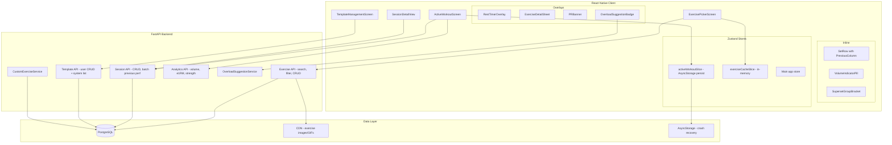
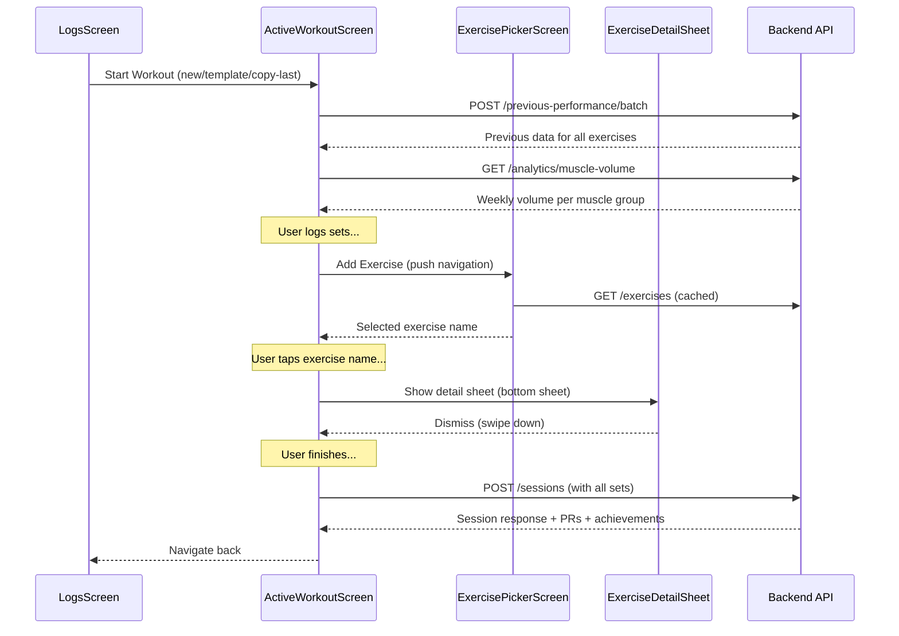

# Design Document: Training Workflow Redesign

## Overview

This design covers a complete overhaul of the training workflow in HypertrophyOS — from exercise database expansion to a best-in-class active workout logging experience. The redesign spans three layers: exercise content (400+ exercises with images/animations from wger + ExerciseDB), frontend UX (full-screen ActiveWorkoutScreen with inline previous performance, tap-to-copy, rest timer with progress ring, superset support), and backend intelligence (progressive overload suggestions, volume tracking during workout, custom exercises).

The core design principle: **Log a set in under 3 seconds. Show the user what to do next. Celebrate when they beat their best.**

### Key Design Decisions

1. **wger as primary exercise source, ExerciseDB v1 for animations** — wger provides 400+ exercises with SVG illustrations under AGPL-3.0. ExerciseDB v1 provides 1,500+ exercises with animated GIFs as a free open-source dataset. All assets self-hosted in our CDN to eliminate runtime dependencies.

2. **Zustand activeWorkoutSlice with AsyncStorage persistence** — The active workout state lives in a separate Zustand store (not the main app store) with AsyncStorage persistence. This enables crash recovery ("Resume workout?") and keeps the main store lean.

3. **Batch previous performance API** — A single `POST /training/previous-performance/batch` call fetches previous data for all exercises at workout start, avoiding N+1 queries. Already implemented in the training-log-redesign spec.

4. **Progressive overload as suggestion, not prescription** — Unlike RP Hypertrophy (which auto-generates workouts), our suggestions are inline badges that the user can ignore. This respects user autonomy while surfacing intelligence.

5. **Exercise Detail Sheet as bottom sheet overlay** — Exercise instructions, animations, and muscle maps are shown in a dismissible bottom sheet during the workout, not a separate screen. This keeps the user in the workout flow.

6. **RPE stored natively, RIR converted** — Backend stores RPE (0-10). RIR is a display-only conversion (RIR 0 = RPE 10, RIR 1 = RPE 9, etc.). This avoids dual storage and simplifies analytics.

## Architecture



### Navigation Flow



## Components and Interfaces

### 1. Exercise Database Layer

#### Backend: Extended Exercise Schema

```python
# src/modules/training/exercises.py (extended)
EXERCISES: list[dict] = [
    {
        "id": "barbell-bench-press",
        "name": "Barbell Bench Press",
        "muscle_group": "chest",
        "secondary_muscles": ["triceps", "shoulders"],
        "equipment": "barbell",
        "category": "compound",
        "image_url": "https://cdn.hypertrophyos.com/exercises/barbell-bench-press.svg",
        "animation_url": "https://cdn.hypertrophyos.com/exercises/barbell-bench-press.gif",
        "description": "A compound pressing movement targeting the chest...",
        "instructions": [
            "Lie flat on a bench with feet on the floor",
            "Grip the bar slightly wider than shoulder width",
            "Unrack and lower to mid-chest",
            "Press up to full lockout"
        ],
        "tips": [
            "Keep shoulder blades retracted and depressed",
            "Drive feet into the floor for leg drive",
            "Touch chest at nipple line"
        ]
    },
    # ... 400+ exercises
]
```

#### Backend: Custom Exercise Model

```python
# src/modules/training/models.py (new table)
class CustomExercise(SoftDeleteMixin, Base):
    __tablename__ = "custom_exercises"
    
    user_id: Mapped[uuid.UUID] = mapped_column(ForeignKey("users.id"), index=True)
    name: Mapped[str] = mapped_column(String(200))
    muscle_group: Mapped[str] = mapped_column(String(50))
    secondary_muscles: Mapped[list] = mapped_column(JSONB, default=list)
    equipment: Mapped[str] = mapped_column(String(50))
    category: Mapped[str] = mapped_column(String(20), default="compound")
    notes: Mapped[str | None] = mapped_column(Text, nullable=True)
```

#### Backend: Enhanced Search Endpoint

```python
# Extended search supporting equipment and category filters
@router.get("/exercises/search")
async def search_exercises_endpoint(
    q: str = Query(default="", min_length=1),
    muscle_group: Optional[str] = Query(default=None),
    equipment: Optional[str] = Query(default=None),
    category: Optional[str] = Query(default=None),
) -> List[dict]:
    return search_exercises(
        query=q, muscle_group=muscle_group,
        equipment=equipment, category=category
    )
```

#### Frontend: Exercise Type

```typescript
// app/types/exercise.ts (extended)
interface Exercise {
  id: string;
  name: string;
  muscle_group: string;
  secondary_muscles: string[];
  equipment: string;
  category: 'compound' | 'isolation';
  image_url: string | null;
  animation_url: string | null;
  description: string | null;
  instructions: string[] | null;
  tips: string[] | null;
  is_custom?: boolean;
}
```

### 2. Active Workout Screen

The core logging experience. Full-screen push navigation with duration timer, exercise cards, inline previous performance, and set logging.

```typescript
// app/screens/training/ActiveWorkoutScreen.tsx
interface ActiveWorkoutScreenProps {
  route: { params: ActiveWorkoutScreenParams };
}

// Layout:
// ┌─────────────────────────────────┐
// │ ← Back   Duration: 00:45:12   ⋮ │  (header)
// ├─────────────────────────────────┤
// │ 📊 Volume: Chest 12/16 sets    │  (volume indicator)
// ├─────────────────────────────────┤
// │ [img] Barbell Bench Press    ⓘ │  (exercise card header)
// │ 💡 Try 82.5kg × 8 (+2.5kg)    │  (overload suggestion)
// │ #  Prev      Weight Reps RPE ✓ │  (set header)
// │ 1  80kg×8    [80]  [8]  [8] ☑ │  (completed set)
// │ 2  80kg×8    [82]  [8]  [ ] ☐ │  (current set)
// │ 3  80kg×8    [  ]  [ ]  [ ] ☐ │  (empty set)
// │ + Add Set                       │
// ├─────────────────────────────────┤
// │ [img] Overhead Press         ⓘ │
// │ ...                             │
// ├─────────────────────────────────┤
// │ + Add Exercise                  │
// │ [Finish Workout]                │
// └─────────────────────────────────┘
```

### 3. SetRow Component

The atomic unit of set logging. Optimized for speed.

```typescript
interface SetRowProps {
  exerciseLocalId: string;
  set: ActiveSet;
  setIndex: number;
  previousData: PreviousPerformanceData | null;
  unitSystem: UnitSystem;
  onToggleComplete: () => { completed: boolean; validationError: string | null };
  onUpdateField: (field: 'weight' | 'reps' | 'rpe', value: string) => void;
  onUpdateSetType: (setType: SetType) => void;
  onCopyPrevious: () => void;
}
```

**Interaction flow for 2-3 tap logging:**
1. Tap Previous_Column → auto-fills weight + reps from last session
2. (Optional) Adjust weight/reps
3. Tap Completion_Checkmark → validates, marks complete, triggers rest timer + haptic

### 4. Rest Timer with Progress Ring

```typescript
interface RestTimerOverlayProps {
  durationSeconds: number;
  visible: boolean;
  exerciseName: string;
  onDismiss: () => void;
  onComplete: () => void;
  onAdjust: (delta: number) => void; // +15 or -15
  onPause: () => void;
  onResume: () => void;
}

// Visual: Circular SVG arc (react-native-svg)
// - Full circle = total duration
// - Arc decreases as time passes
// - Color: green (>10s remaining) → yellow (5-10s) → red (≤5s)
// - Center: remaining time in M:SS format
// - Bottom: [−15s] [Pause/Resume] [+15s] [Skip]
```

### 5. Progressive Overload Suggestion Service

```python
# src/modules/training/overload_service.py
class OverloadSuggestionService:
    """Computes progressive overload suggestions based on recent performance."""
    
    async def get_suggestion(
        self, user_id: uuid.UUID, exercise_name: str
    ) -> Optional[OverloadSuggestion]:
        """
        Algorithm:
        1. Fetch last 3-5 sessions for this exercise
        2. If < 3 sessions, return None (insufficient data)
        3. Compute average RPE across recent sessions
        4. If avg RPE < 7 (easy): suggest weight increase
           - Barbell: +2.5kg, Dumbbell/Cable: +1kg
        5. If avg RPE 7-9 (moderate): suggest same weight, +1 rep
        6. If avg RPE > 9 (hard): suggest same weight and reps
        7. Return suggestion with confidence level
        """
```

```python
class OverloadSuggestion(BaseModel):
    exercise_name: str
    suggested_weight_kg: float
    suggested_reps: int
    reasoning: str  # e.g., "Recent RPE avg 6.5 — increase weight by 2.5kg"
    confidence: str  # "high", "medium", "low"
```

### 6. Exercise Detail Sheet

```typescript
interface ExerciseDetailSheetProps {
  exercise: Exercise;
  visible: boolean;
  onDismiss: () => void;
}

// Layout (bottom sheet, 70% screen height):
// ┌─────────────────────────────────┐
// │ ─── (drag handle)               │
// │ [Animated GIF / Static Image]   │
// │                                  │
// │ Barbell Bench Press              │
// │ Chest · Barbell · Compound      │
// │                                  │
// │ Muscles Targeted                 │
// │ Primary: Chest                   │
// │ Secondary: Triceps, Shoulders    │
// │                                  │
// │ Instructions                     │
// │ 1. Lie flat on bench...          │
// │ 2. Grip bar wider than...        │
// │                                  │
// │ Tips                             │
// │ • Keep shoulder blades retracted │
// │ • Drive feet into floor          │
// └─────────────────────────────────┘
```

### 7. Superset Group Visual

```typescript
interface SupersetGroupProps {
  group: SupersetGroup;
  exercises: ActiveExercise[];
  label: string; // "A", "B", "C"...
  onRemoveSuperset: () => void;
}

// Visual: Left bracket connecting grouped exercises
// ┌──┐
// │A │ [Exercise 1 card]
// │  │ [Exercise 2 card]
// └──┘
// Rest timer only fires after last exercise in group
```

### 8. Volume Indicator Pill

```typescript
interface VolumeIndicatorPillProps {
  muscleGroup: string;
  currentSets: number;
  mev: number;
  mav: number;
  mrv: number;
}

// Display: "Chest: 12/16 sets" with color coding
// Below MEV: red (under-training)
// MEV to MAV: yellow (minimum effective)
// MAV to MRV: green (optimal)
// Above MRV: red (over-training)
```

### 9. Custom Exercise Creation

```typescript
interface CreateCustomExerciseProps {
  onCreated: (exercise: Exercise) => void;
  onCancel: () => void;
}

// Fields:
// - Name (required)
// - Primary muscle group (required, picker from 13 groups)
// - Equipment (required, picker)
// - Category (optional, default compound)
// - Secondary muscles (optional, multi-select)
// - Notes (optional)
```

### 10. Template Management

```typescript
// Template creation from finish flow
interface SaveAsTemplateModalProps {
  exercises: ActiveExercise[];
  onSave: (name: string, description?: string) => void;
  onCancel: () => void;
}

// Template editing screen
interface TemplateEditorScreenProps {
  templateId?: string; // null = create new
}
```

## Data Models

### Exercise Record (Extended)

```typescript
interface ExerciseRecord {
  id: string;
  name: string;
  muscle_group: string;
  secondary_muscles: string[];
  equipment: 'barbell' | 'dumbbell' | 'cable' | 'machine' | 'bodyweight' | 'band' | 'kettlebell' | 'smith_machine';
  category: 'compound' | 'isolation';
  image_url: string | null;
  animation_url: string | null;
  description: string | null;
  instructions: string[] | null;
  tips: string[] | null;
}
```

### Active Workout State (Zustand)

Already defined in `app/types/training.ts` — includes `ActiveWorkoutState`, `ActiveExercise`, `ActiveSet`, `SupersetGroup`, `PreviousPerformanceData`.

### Training Session (Backend Response)

Already defined in `src/modules/training/schemas.py` — includes `TrainingSessionResponse`, `SetEntry` (with `set_type`), `ExerciseEntry`, `PersonalRecordResponse`.

### Overload Suggestion (New)

```python
class OverloadSuggestion(BaseModel):
    exercise_name: str
    suggested_weight_kg: float
    suggested_reps: int
    reasoning: str
    confidence: str  # "high" | "medium" | "low"
```

### Custom Exercise (New)

```python
class CustomExerciseCreate(BaseModel):
    name: str = Field(min_length=1, max_length=200)
    muscle_group: str
    equipment: str
    category: str = "compound"
    secondary_muscles: list[str] = Field(default_factory=list)
    notes: Optional[str] = None

class CustomExerciseResponse(BaseModel):
    id: uuid.UUID
    user_id: uuid.UUID
    name: str
    muscle_group: str
    secondary_muscles: list[str]
    equipment: str
    category: str
    notes: Optional[str]
    is_custom: bool = True
    image_url: None = None
    animation_url: None = None
    created_at: datetime
```


## Exercise Database Migration Plan

### Phase 1: Data Import & Schema Extension

1. **Extend exercise schema** — Add `secondary_muscles`, `description`, `instructions`, `tips`, `animation_url` fields to the static exercise database in `exercises.py`
2. **Import wger exercises** — Write a migration script (`scripts/import_wger.py`) that:
   - Fetches all exercises from wger's public API (`https://wger.de/api/v2/exercise/`)
   - Maps wger muscle groups to our 13 muscle groups
   - Downloads SVG illustrations and stores in `static/exercises/`
   - Generates exercise records with all extended fields
3. **Enrich with ExerciseDB v1** — Write an enrichment script (`scripts/enrich_exercisedb.py`) that:
   - Downloads the ExerciseDB v1 dataset (free, open-source)
   - Matches exercises by name (fuzzy matching with >85% confidence)
   - Pulls animated GIF URLs for matched exercises
   - Downloads GIFs and stores in `static/exercises/animations/`
4. **Self-host all assets** — All images and GIFs served from our own static file server or CDN, zero runtime dependency on external APIs

### Phase 2: Backend API Updates

1. **Extended search endpoint** — Add `equipment` and `category` filter params to `GET /exercises/search`
2. **Custom exercise CRUD** — New endpoints: `POST /exercises/custom`, `GET /exercises/custom`, `PUT /exercises/custom/{id}`, `DELETE /exercises/custom/{id}`
3. **Overload suggestion endpoint** — `GET /exercises/{name}/overload-suggestion` returns progressive overload recommendation
4. **Merged exercise list** — `GET /exercises` returns system exercises + user's custom exercises, deduplicated

### Phase 3: Frontend Integration

1. **Exercise cache slice** — In-memory Zustand store for exercise data, fetched once on app start, refreshed on pull-to-refresh
2. **Image loading** — `FastImage` (or `expo-image`) for cached image loading with placeholder fallback
3. **Animation playback** — GIF rendering in exercise cards and detail sheet using `Image` component with `resizeMode="contain"`

## File Changes Summary

### New Files

| File | Purpose |
|------|---------|
| `scripts/import_wger.py` | Migration script to import wger exercises |
| `scripts/enrich_exercisedb.py` | Enrichment script for ExerciseDB animated GIFs |
| `src/modules/training/overload_service.py` | Progressive overload suggestion algorithm |
| `src/modules/training/custom_exercise_service.py` | Custom exercise CRUD service |
| `app/components/training/SetRowV2.tsx` | Redesigned set row with inline previous + tap-to-copy |
| `app/components/training/ExerciseDetailSheet.tsx` | Bottom sheet with instructions, animation, muscle map |
| `app/components/training/RestTimerRing.tsx` | SVG circular progress ring rest timer |
| `app/components/training/VolumeIndicatorPill.tsx` | Inline volume tracking pill |
| `app/components/training/OverloadSuggestionBadge.tsx` | Progressive overload suggestion display |
| `app/components/training/SupersetBracket.tsx` | Visual bracket for superset grouping |
| `app/components/training/RPEPicker.tsx` | Quick-select RPE/RIR picker |
| `app/components/training/FinishSummary.tsx` | Workout finish summary modal |
| `app/components/training/SaveAsTemplateModal.tsx` | Save workout as template prompt |
| `app/screens/training/TemplateEditorScreen.tsx` | Template create/edit screen |
| `app/screens/training/SessionDetailScreen.tsx` | Session detail view (read-only + edit trigger) |
| `app/store/exerciseCacheSlice.ts` | In-memory exercise cache store |

### Modified Files

| File | Changes |
|------|---------|
| `src/modules/training/exercises.py` | Expand to 400+ exercises with extended schema |
| `src/modules/training/router.py` | Add custom exercise endpoints, overload suggestion endpoint, extended search filters |
| `src/modules/training/schemas.py` | Add `OverloadSuggestion`, `CustomExerciseCreate`, `CustomExerciseResponse` schemas |
| `app/types/exercise.ts` | Extend `Exercise` interface with `secondary_muscles`, `description`, `instructions`, `tips`, `animation_url` |
| `app/screens/training/ActiveWorkoutScreen.tsx` | Major rewrite — inline previous, tap-to-copy, volume indicators, overload suggestions, exercise images |
| `app/screens/exercise-picker/ExercisePickerScreen.tsx` | Add equipment filter chips, exercise images, long-press detail sheet, custom exercise creation |
| `app/components/exercise-picker/ExerciseCard.tsx` | Add image thumbnail, animation preview on long-press |
| `app/store/activeWorkoutSlice.ts` | Add volume tracking state, overload suggestion caching |

## Implementation Phases

### Phase A: Exercise Database (Backend-Heavy, Low UI Risk)
- Import wger exercises → 400+ exercises with images
- Enrich with ExerciseDB v1 GIFs
- Extend exercise schema with new fields
- Self-host all assets
- Add equipment/category search filters
- **Estimated effort:** 3-4 days
- **Risk:** Low — additive changes, no existing functionality modified

### Phase B: Set Logging Speed (Frontend-Heavy, High Impact)
- Redesign SetRow with inline previous performance column
- Implement tap-to-copy from previous
- Optimize input flow for 2-3 taps per set
- Add exercise image thumbnails to exercise cards
- **Estimated effort:** 3-4 days
- **Risk:** Medium — modifies core logging UX, needs thorough testing

### Phase C: Rest Timer Upgrade (Frontend, Medium Impact)
- Replace basic countdown with SVG progress ring
- Add pause/resume, +/-15s adjustment
- Add color transition (green → yellow → red)
- Per-exercise duration configuration
- **Estimated effort:** 2 days
- **Risk:** Low — replaces existing component, isolated change

### Phase D: Intelligence Layer (Full-Stack, High Differentiation)
- Progressive overload suggestion service (backend)
- Overload suggestion badge (frontend)
- Volume indicator pill during workout (frontend)
- RPE/RIR picker with quick-select (frontend)
- **Estimated effort:** 3-4 days
- **Risk:** Medium — new backend service, but non-blocking (suggestions are optional)

### Phase E: Exercise Content & Detail Sheet (Frontend, Medium Impact)
- Exercise detail bottom sheet with instructions, animation, muscle map
- Long-press on exercise card to preview
- Muscle activation SVG diagrams
- **Estimated effort:** 2-3 days
- **Risk:** Low — new overlay component, doesn't modify existing flows

### Phase F: Custom Exercises & Templates (Full-Stack, Medium Impact)
- Custom exercise creation (backend + frontend)
- Template editor screen
- Save-as-template from finish flow
- Template search and organization
- **Estimated effort:** 3-4 days
- **Risk:** Medium — new CRUD flows, but isolated from core logging

### Phase G: Session Detail & Editing (Frontend, Low Risk)
- Session detail view with exercise images
- Edit mode (opens ActiveWorkoutScreen in edit mode)
- PR badge display on session detail
- **Estimated effort:** 2 days
- **Risk:** Low — read-only view + existing edit mode

**Total estimated effort:** 18-25 days across all phases
**Recommended shipping order:** A → B → C → D → E → F → G (each phase is independently shippable)
