# Design Document: UX Redesign V1

## Overview

This design transforms HypertrophyOS from a functional prototype into a production-grade premium fitness app. The redesign touches four layers: design tokens, component library, navigation architecture, and screen compositions. All changes are frontend-only (React Native/Expo, web target). No backend changes.

The core problem: the current app has 6 tabs (too many), no visual progress indicators (just numbers), broken layouts (vertical filter pills), inconsistent components (3 different button styles), and zero animation (feels like a form app, not a fitness product). Every screen has dead space and no empty states.

The fix: 4-tab navigation, SVG progress rings with animated fills, a standardized component library with 4 button variants and 3 card variants, platform-adaptive modals, staggered entrance animations, skeleton loading states, and tailored empty states for every screen.

## Architecture

### Layer Diagram


### Why This Layering

Every layer has exactly one job:

1. **Tokens**: Single source of truth for all visual values. Change a color here, it propagates everywhere. No magic numbers in component files.
2. **Animation hooks**: Reusable animation primitives. A stagger hook shouldn't know about cards or rings — it just takes an index and returns an animated style. This keeps animation logic out of component render functions.
3. **Base components**: Stateless, token-driven, variant-based. A `Button` doesn't know it's on the Dashboard. It knows its variant is `primary` and renders accordingly. Zero business logic.
4. **Composite components**: Combine base components with domain knowledge. A `QuickActionButton` knows about nutrition/training/bodyweight categories. It composes `Card`, `usePressAnimation`, and domain-specific icons.
5. **Screens**: Orchestrate composites, manage data fetching, handle navigation. The `DashboardScreen` fetches KPIs, computes streak, and passes data down. No styling logic — that's in the components.
6. **Navigation**: Route configuration only. Tab structure, stack definitions, transition configs. No rendering logic.

### What I Killed

- **Separate Learn tab**: Moved to Profile stack. Learn is a discovery feature, not a daily-use tab. Users open it occasionally, not every session. Putting it behind Profile → Learn reduces tab bar clutter without hiding it.
- **More tab**: Everything in More (Coaching, Community, Founder's Story, Health Reports) moves to Profile → Features section. The More screen was a junk drawer.
- **Adaptive Targets section on Dashboard**: Duplicate of the data already in Progress Rings. Removed entirely.
- **Separate research files**: All design decisions are inline in this document.

### Navigation Architecture

```
BottomTabNavigator (4 tabs, crossfade transition 200ms)
├── Home (DashboardStack)
│   ├── DashboardHome → DashboardScreen
│   └── ExercisePicker → ExercisePickerScreen
├── Log (LogsStack)  
│   ├── LogsHome → LogsScreen
│   └── ExercisePicker → ExercisePickerScreen
├── Analytics (AnalyticsStack)
│   └── AnalyticsHome → AnalyticsScreen
└── Profile (ProfileStack)
    ├── ProfileHome → ProfileScreen
    ├── Learn → LearnScreen
    ├── ArticleDetail → ArticleDetailScreen
    ├── Coaching → CoachingScreen
    ├── Community → CommunityScreen
    ├── FounderStory → FounderStoryScreen
    └── HealthReports → HealthReportsScreen
```

**Tab transition**: Custom `tabBarStyle` with crossfade using `sceneContainerStyle` opacity animation. Not using `react-native-tab-view` — the built-in `@react-navigation/bottom-tabs` supports `tabBarAnimationEnabled` but we need custom crossfade, so we wrap the scene container in an `Animated.View` with opacity driven by the tab index.

**Stack transition**: Custom `cardStyleInterpolator` on each stack navigator:
- Push: incoming screen slides from right (30% offset → 0), outgoing fades to 0.95 opacity. Duration 250ms, ease-out.
- Pop: reverse of push. Duration 200ms, ease-in-out.

**Why not `react-navigation` shared element transitions?** They require `react-native-shared-element` which adds native module complexity and has known issues on web. The slide + fade approach is simpler, works on all platforms, and feels premium enough.

## Components and Interfaces

### 1. Design Token Updates (`app/theme/tokens.ts`)

**Changes from current tokens:**

| Token | Current | New | Why |
|-------|---------|-----|-----|
| `bg.base` | `#0B0F14` | `#0A0E13` | Darker base = more contrast headroom |
| `bg.surface` | `#111827` | `#12171F` | Clearer step from base (was too close) |
| `bg.surfaceRaised` | `#161C24` | `#1A2029` | Visible card pop (was invisible) |
| `text.primary` | `#E5E7EB` | `#F1F5F9` | Crisper white, better contrast ratio |
| `text.secondary` | `#9CA3AF` | `#94A3B8` | Slate tone, more readable |
| `text.muted` | `#8B95A1` | `#64748B` | Darker muted = clearer hierarchy |
| `border.subtle` | `rgba(255,255,255,0.04)` | `rgba(255,255,255,0.06)` | Was invisible, now barely visible |
| `border.default` | `rgba(255,255,255,0.08)` | `rgba(255,255,255,0.08)` | No change |
| NEW: `border.hover` | — | `rgba(255,255,255,0.12)` | For interactive hover states |

**New token group — `macro` color ramp:**

```typescript
macro: {
  calories: '#06B6D4',                    // cyan — matches existing accent
  caloriesSubtle: 'rgba(6,182,212,0.10)', // ring track, bar track
  protein: '#22C55E',                     // emerald — matches existing positive
  proteinSubtle: 'rgba(34,197,94,0.10)',
  carbs: '#F59E0B',                       // amber — matches existing warning
  carbsSubtle: 'rgba(245,158,11,0.10)',
  fat: '#F472B6',                         // rose — new, for fat macro
  fatSubtle: 'rgba(244,114,182,0.10)',
}
```

**Why these specific colors?** Cyan/emerald/amber are already in the palette (accent, positive, warning). Reusing them for macros creates visual consistency. Rose (#F472B6) is new but sits well in the dark theme — it's the Tailwind `pink-400`, which has excellent contrast on dark backgrounds (WCAG AA at 4.5:1 against #0A0E13).

**Spacing scale**: No changes needed. The current scale (4/8/12/16/20/24/32/40/48/64) already covers all needs. The problem isn't the scale — it's inconsistent usage. The fix is enforcement in code review, not token changes.

### 2. Animation Infrastructure

**Tech decision: Reanimated 3 vs. React Native Animated API**

Reanimated 3 runs animations on the UI thread via worklets. The core Animated API runs on the JS thread, which means animations jank when JS is busy (e.g., during data fetch). For a premium feel, UI-thread animations are non-negotiable. Reanimated 3 is already compatible with Expo SDK 50+ and works on web via `react-native-reanimated/plugin`.

**If Reanimated is unavailable on web**: All hooks check `Platform.OS === 'web'` and fall back to CSS transitions via `style` props. The hooks return static styles (opacity: 1, transform: none) so components render correctly without animation. This is the degradation path — not a crash path.

#### Hook: `useStaggeredEntrance(index: number, staggerDelay = 60)`

```typescript
// Returns: { opacity: 0→1, translateY: 12→0 }
// Delay: index * staggerDelay ms
// Duration: 300ms, ease-out
// Max animated index: 8 (indices >= 8 get delay 0, instant appearance)
// Trigger: on mount only (not on re-render or data refresh)
```

**Why max 8?** Staggering 20+ items creates a waterfall effect that feels slow. After 8 items, the user has scrolled past the fold anyway. Items below the fold appear instantly.

**Why 60ms stagger for Dashboard, 40ms for lists?** Dashboard has 5-6 sections — 60ms × 6 = 360ms total cascade, which feels deliberate. Lists have many items — 40ms × 8 = 320ms, keeping total time similar.

#### Hook: `useCountingValue(target: number, duration = 400)`

```typescript
// Interpolates from previous value to new target over duration ms
// Uses withTiming + linear easing for smooth number counting
// Returns a SharedValue<number> that can be read in animated text
// Formula: currentValue = startValue + (target - startValue) * progress
// Where progress goes from 0 to 1 over duration ms
```

**Edge case**: If target changes while animation is in progress, the hook cancels the current animation and starts a new one from the current interpolated value. No jump.

#### Hook: `usePressAnimation()`

```typescript
// Returns: { animatedStyle, onPressIn, onPressOut }
// onPressIn: scale → 0.98 over 100ms
// onPressOut: scale → 1.0 over 100ms
// Uses withTiming, not withSpring (spring feels bouncy, we want crisp)
```

#### Hook: `useSkeletonPulse()`

```typescript
// Returns: animated opacity style
// Oscillates between 0.3 and 0.7
// Duration: 600ms per half-cycle (1.2s full cycle)
// Uses withRepeat(withTiming(...), -1, true)
```

### 3. Base Components

#### ProgressRing (`app/components/common/ProgressRing.tsx`)

```typescript
interface ProgressRingProps {
  value: number;          // current consumed value
  target: number;         // daily target
  color: string;          // macro ramp color (e.g., macro.calories)
  trackColor: string;     // subtle variant (e.g., macro.caloriesSubtle)
  size?: number;          // outer diameter, default 96
  strokeWidth?: number;   // ring thickness, default 8
  label: string;          // unit label ("kcal", "g")
  animated?: boolean;     // animate on mount, default true
  onTargetMissing?: () => void; // tap handler for "Set targets" state
}
```

**Implementation**: SVG `<Circle>` with `strokeDasharray = circumference` and `strokeDashoffset` animated from `circumference` (0%) to `circumference * (1 - percentage)` (target%). The ring is rotated -90° so fill starts from 12 o'clock.

**Render states:**
1. `target > 0, value <= target`: Normal fill with macro color. Center text: value in bold, "/ target label" in muted.
2. `target > 0, value > target`: Full ring in `semantic.warning`. Center text: value in bold with warning color.
3. `target === 0 || target === undefined`: Muted track only. Center text: "Set targets" in accent color, tappable.

**Performance**: The SVG circle is lightweight — no bitmap rendering. The animated dashoffset runs on the UI thread via Reanimated. Re-renders only when `value` or `target` props change (React.memo with shallow compare).

#### ProgressBar (`app/components/common/ProgressBar.tsx`)

```typescript
interface ProgressBarProps {
  value: number;
  target: number;
  color: string;
  trackColor: string;
  showPercentage?: boolean;  // default true
  height?: number;           // default 6
}
```

**Logic:**
- `percentage = target > 0 ? Math.round((value / target) * 100) : 0`
- `fillWidth = Math.min(percentage, 100) + '%'`
- `fillColor = percentage > 100 ? colors.semantic.warning : color`
- Percentage label: `${Math.min(percentage, 999)}%` (cap display at 999% to prevent layout overflow)

#### EmptyState (`app/components/common/EmptyState.tsx`)

```typescript
interface EmptyStateProps {
  icon: string;
  title: string;
  description: string;
  actionLabel?: string;
  onAction?: () => void;
  children?: ReactNode;  // for extra content like category pills
}
```

Centered vertical stack. Icon at 48px in `text.muted` color. Title in `text.secondary`, 16px semibold. Description in `text.muted`, 14px regular. CTA button (primary variant) only if `actionLabel` is provided.

#### Skeleton (`app/components/common/Skeleton.tsx`)

```typescript
interface SkeletonProps {
  width: number | `${number}%`;
  height: number;
  borderRadius?: number;
  variant?: 'rect' | 'circle';
}
```

Uses `useSkeletonPulse()` for the opacity animation. Background: `bg.surfaceRaised`. No border.

#### ModalContainer (`app/components/common/ModalContainer.tsx`)

```typescript
interface ModalContainerProps {
  visible: boolean;
  onClose: () => void;
  title: string;
  children: ReactNode;
}
```

**Platform branching:**

```
Platform.OS === 'web':
  → Centered dialog
  → max-width: 480px, max-height: 85vh
  → Backdrop: rgba(0,0,0,0.6) + backdropFilter: blur(8px)
  → Entrance: scale 0.95→1.0, opacity 0→1, 200ms ease-out
  → Exit: scale 1.0→0.95, opacity 1→0, 150ms ease-in

Platform.OS !== 'web':
  → Bottom sheet
  → borderTopLeftRadius: 16, borderTopRightRadius: 16
  → Drag handle: 36×4px rounded bar, bg.surfaceRaised, centered
  → Entrance: translateY from 100% to 0, 250ms ease-out
  → Exit: translateY from 0 to 100%, 200ms ease-in
  → Backdrop: rgba(0,0,0,0.6)
```

**Why not a third-party bottom sheet library?** Libraries like `@gorhom/bottom-sheet` add native module dependencies and have web compatibility issues. Our bottom sheet is simple (no snap points, no gesture-to-dismiss) — a `Modal` with `animationType="slide"` and custom styling is sufficient.

#### Updated Button (`app/components/common/Button.tsx`)

New variants added to existing component:

| Variant | Background | Border | Text Color | Shadow |
|---------|-----------|--------|------------|--------|
| primary | accent.primary | none | text.primary | 0 2px 8px rgba(6,182,212,0.25) |
| secondary | transparent | 1px border.default | accent.primary | none |
| ghost | transparent | none | accent.primary | none |
| danger | semantic.negativeSubtle | 1px semantic.negative | semantic.negative | none |

All variants: min-height 44px, border-radius 12px, padding 12px vertical / 24px horizontal. Press animation via `usePressAnimation()` (scale 0.97). Disabled: opacity 0.4.

#### Updated Card (`app/components/common/Card.tsx`)

| Variant | Background | Border | Shadow |
|---------|-----------|--------|--------|
| flat | bg.surface | 1px border.subtle | none |
| raised | bg.surfaceRaised | 1px border.default | md (0 4px 12px rgba(0,0,0,0.4)) |
| outlined | transparent | 1px border.default | none |

All variants: padding 16px, border-radius 12px. Optional `onPress` prop adds press animation. Optional `animated` + `animationIndex` props enable staggered entrance.

#### FilterPill (`app/components/common/FilterPill.tsx`)

Horizontal pill. Active: `accent.primaryMuted` bg, `accent.primary` border, `accent.primary` text. Inactive: `bg.surface` bg, `border.subtle` border, `text.muted` text. Background color transition: 150ms via Reanimated `interpolateColor`. Height: 32px. Horizontal padding: 16px. Border-radius: full (9999).

#### SectionHeader (`app/components/common/SectionHeader.tsx`)

Title: 18px, semibold, `text.primary`. Optional right-aligned action link in `accent.primary`, 14px. Margin: 24px top, 12px bottom.

### 4. Composite Components

#### QuickActionButton (`app/components/dashboard/QuickActionButton.tsx`)

```typescript
interface QuickActionButtonProps {
  icon: string;
  label: string;
  accentColor: string;    // left border color
  completed: boolean;     // checkmark badge
  onPress: () => void;
}
```

Card (flat variant) with 4px left border in `accentColor`. Icon area: 40px, centered. Label: 13px, medium, `text.secondary`. Checkmark badge: 16px circle, `semantic.positive` bg, white checkmark, positioned top-right. Press animation via `usePressAnimation()`.

#### StreakIndicator (`app/components/dashboard/StreakIndicator.tsx`)

```typescript
interface StreakIndicatorProps {
  count: number;  // 0 = hidden
}
```

Renders nothing if `count === 0`. Otherwise: 🔥 emoji + count in `accent.primary`, 16px semibold. Count uses `useCountingValue` for animated transition when value changes.

**Streak calculation** (pure function, `app/utils/calculateStreak.ts`):

```typescript
function calculateStreak(logDates: string[], today: string): number {
  // logDates: sorted ISO date strings (e.g., ["2024-01-15", "2024-01-16"])
  // today: ISO date string
  // Returns: number of consecutive days ending at today
  // If today is not in logDates, returns 0
  // Algorithm: walk backwards from today, counting consecutive dates
}
```

**Edge cases:**
- Empty `logDates` → 0
- `today` not in `logDates` → 0
- Duplicate dates in `logDates` → deduplicate first
- Non-sorted input → sort first
- Future dates → ignored (filtered out)

#### ArticleCardCompact (`app/components/dashboard/ArticleCardCompact.tsx`)

For the Dashboard's horizontal featured section. Card (flat variant), fixed width 200px. 4px top border in category color. Title: 14px, semibold, max 2 lines with ellipsis. Read time: 12px, muted. Arrow icon: 12px, muted, bottom-right.

#### FeatureNavItem (`app/components/profile/FeatureNavItem.tsx`)

Row layout. 24px icon (emoji). Label: 16px, medium, `text.primary`. Description: 13px, `text.muted`. Chevron: 16px, `text.muted`, right-aligned. Press animation. Full-width touchable.

#### TodaySummaryRow (`app/components/dashboard/TodaySummaryRow.tsx`)

```typescript
interface TodaySummaryRowProps {
  mealsLogged: number;
  workoutsCompleted: number;
}
```

Horizontal row with two items. Each: icon + count + label. Count color: `semantic.positive` if > 0, `text.muted` if 0. Label: 13px, `text.secondary`.

#### MacroRingsRow (`app/components/dashboard/MacroRingsRow.tsx`)

```typescript
interface MacroRingsRowProps {
  calories: { value: number; target: number };
  protein: { value: number; target: number };
  carbs: { value: number; target: number };
  onTargetMissing?: () => void;
}
```

Horizontal row of 3 ProgressRing components with 12px gap. Each ring uses the corresponding macro color. This is a layout wrapper — no logic beyond prop forwarding.

## Data Models

No new data models. The redesign consumes existing API responses and Zustand store. Key data flows:

### Data Flow: Dashboard Load

```mermaid
sequenceDiagram
    participant U as User
    participant D as DashboardScreen
    participant S as Zustand Store
    participant API as Backend API
    
    U->>D: Opens app / navigates to Home tab
    D->>D: Show skeleton loading state
    D->>S: Read cached profile (displayName)
    D->>D: Render greeting immediately from cache
    
    par Parallel API calls
        D->>API: GET nutrition/entries?date=today
        D->>API: GET adaptive/snapshots?limit=1
        D->>API: GET training/sessions?date=today&limit=1
        D->>API: GET content/articles?limit=5&status=published
        D->>API: GET user/streak (optional, 404 = 0)
    end
    
    API-->>D: Nutrition entries (sum → calories, protein, carbs)
    API-->>D: Adaptive snapshot (targets)
    API-->>D: Training sessions (count)
    API-->>D: Articles (featured list)
    API-->>D: Streak count (or 0)
    
    D->>D: Hide skeletons
    D->>D: Animate sections with stagger (60ms)
    D->>D: Animate progress rings (600ms fill)
    D->>D: Animate counting values (400ms)
```



### Data Flow: Modal Open (Platform-Adaptive)


### Streak Calculation Data Flow

The streak is computed client-side from cached log dates in the Zustand store. If a `GET user/streak` endpoint exists, we use it. If it returns 404, we fall back to client-side calculation from the nutrition/training entry dates already fetched.

```typescript
// Client-side fallback
const nutritionDates = nutritionEntries.map(e => e.entry_date);
const trainingDates = trainingSessions.map(s => s.session_date);
const allDates = [...new Set([...nutritionDates, ...trainingDates])].sort();
const streak = calculateStreak(allDates, todayISO);
```

## Edge Cases and Error Handling

### Null/Undefined Data

| Scenario | Handling |
|----------|----------|
| `displayName` is null/undefined | Greeting shows time-based only ("Good morning") |
| `target_calories` is 0 or missing | ProgressRing shows "Set targets" tappable link |
| `nutritionEntries` is empty array | Today summary shows "0 meals", Quick Action shows no checkmark |
| `articles` is empty array | Featured section is omitted entirely (not shown with empty state) |
| `streak` endpoint returns 404 | Fall back to client-side calculation, default 0 |
| `favorites` fetch fails | Favorites section hidden, manual entry still works |
| `templates` fetch fails | Templates section shows "No templates available" inline text |

### Race Conditions

| Scenario | Handling |
|----------|----------|
| User switches tabs while Dashboard is loading | `useEffect` cleanup cancels pending state updates via abort controller |
| User opens modal while data is still loading | Modal renders with current cached data; doesn't wait for refresh |
| User submits nutrition entry while Dashboard is refreshing | Optimistic update: increment local calorie/protein counts immediately, reconcile on next fetch |
| Multiple rapid tab switches | Crossfade animation uses `useRef` to track current tab index; stale animations are cancelled |

### Platform Edge Cases

| Scenario | Handling |
|----------|----------|
| Web: no `backdropFilter` support (older browsers) | CSS fallback: solid dark overlay without blur |
| Web: no Reanimated native driver | All animation hooks check `Platform.OS` and fall back to static styles |
| Mobile: keyboard covers modal inputs | `KeyboardAvoidingView` wraps modal content (existing behavior, preserved) |
| Mobile: safe area insets vary by device | `SafeAreaView` with `edges={['top']}` (existing behavior, preserved) |
| Web: window resize while modal is open | Modal uses `maxWidth: 480` with `width: '90%'` — responsive by default |

### Animation Edge Cases

| Scenario | Handling |
|----------|----------|
| `useCountingValue` target changes mid-animation | Cancel current animation, start new from current interpolated value |
| Stagger animation on screen with 0 items | No animation triggered, no error |
| Stagger animation on screen with 50+ items | Only first 8 items animate, rest appear instantly |
| Pull-to-refresh triggers | `isInitialLoad` ref prevents re-triggering stagger animations |
| ProgressRing with value=0, target=0 | Muted ring, "Set targets" text, no division by zero |
| ProgressRing with negative value | Clamped to 0 (defensive: `Math.max(0, value)`) |

### Partial Failures

All Dashboard API calls use `Promise.allSettled`. Each section renders independently:
- Nutrition fetch fails → Progress rings show 0/target, Today summary shows 0 meals
- Adaptive fetch fails → Progress rings show 0/2400 (hardcoded fallback targets)
- Training fetch fails → Today summary shows 0 workouts
- Articles fetch fails → Featured section omitted
- Streak fetch fails → Streak indicator hidden

No error toasts on Dashboard. The dashboard is a read-only summary — partial data is better than an error screen.

## Performance Considerations

### Render Performance

- **ProgressRing**: `React.memo` with shallow prop comparison. SVG circle is lightweight — no bitmap.
- **Stagger animations**: Each item's animation is independent (no shared state). Reanimated worklets run on UI thread.
- **Skeleton pulse**: Single shared `useSkeletonPulse` instance per skeleton group (not per skeleton element) to reduce worklet count.
- **FlatList for Logs/Learn**: Existing `FlatList` with `keyExtractor` preserved. `renderItem` wrapped in `React.memo`.
- **Dashboard ScrollView**: Not a FlatList (sections are heterogeneous). But section count is fixed (6 max), so no virtualization needed.

### Bundle Size Impact

- `react-native-reanimated`: Already in Expo SDK, no additional bundle cost
- `react-native-svg`: Already used for tab icons, no additional cost
- New components: ~15 small files, estimated <20KB total minified
- No new third-party dependencies required

## Tech Decisions

| Decision | Choice | Tradeoff |
|----------|--------|----------|
| Animation library | Reanimated 3 | Pro: UI thread, Expo-compatible. Con: Worklet debugging is harder than JS animations |
| SVG for progress rings | react-native-svg (existing) | Pro: Already in bundle, lightweight. Con: No GPU acceleration for complex SVGs (not needed here) |
| Bottom sheet library | Custom (Modal + styling) | Pro: No new dependency, full control. Con: No gesture-to-dismiss (acceptable for data entry modals) |
| State management | Zustand (existing) | Pro: Already used, minimal boilerplate. Con: No built-in devtools (acceptable) |
| Tab transition | Custom crossfade | Pro: Premium feel. Con: Slightly more complex than default instant swap |
| Skeleton loading | Custom component | Pro: Tiny, token-aware. Con: No shimmer gradient (pulse is sufficient for dark theme) |
| Platform detection | `Platform.OS` | Pro: Built-in, reliable. Con: No SSR detection (not needed — Expo doesn't SSR) |

## Correctness Properties

*A property is a characteristic or behavior that should hold true across all valid executions of a system — essentially, a formal statement about what the system should do. Properties serve as the bridge between human-readable specifications and machine-verifiable correctness guarantees.*

Properties are derived from the acceptance criteria prework analysis. Each is universally quantified and designed for property-based testing with `fast-check`.

### Property 1: Greeting personalization

*For any* user display name (including empty string, null, undefined, and arbitrary non-empty strings), the greeting function SHALL return a string containing the display name when it is a non-empty string, or a valid time-based greeting ("Good morning", "Good afternoon", "Good evening") when the name is absent. The greeting SHALL never be empty.

**Validates: Requirements 2.1**

### Property 2: Progress ring correctness

*For any* numeric value ≥ 0 and any target ≥ 0, the ProgressRing logic SHALL:
- When target > 0 and value ≤ target: compute fill percentage as `Math.round((value / target) * 100)` and select the assigned macro color
- When target > 0 and value > target: compute fill at 100% and select `semantic.warning` color
- When target === 0: compute fill at 0% and select the muted track color
- Always: the displayed current value text SHALL equal the input value, and the displayed target text SHALL equal the input target

**Validates: Requirements 2.3, 2.4, 2.5, 2.6, 5.5**

### Property 3: Today activity summary counts

*For any* array of nutrition entries and any array of training sessions for a given date, the Today summary SHALL display counts equal to the lengths of the respective arrays, both as non-negative integers.

**Validates: Requirements 3.1**

### Property 4: Quick action completion badge

*For any* combination of boolean completion states for nutrition, training, and bodyweight categories, the QuickActionButton for each category SHALL display a checkmark badge if and only if the completion state for that category is true.

**Validates: Requirements 3.4**

### Property 5: Streak calculation

*For any* sorted array of unique ISO date strings and a today date string, the `calculateStreak` function SHALL return the length of the longest consecutive-day sequence ending at today. If today is not in the array, it SHALL return 0. For an empty array, it SHALL return 0.

**Validates: Requirements 3.5**

### Property 6: Article card field completeness

*For any* valid article object with non-empty title, category, and estimated_read_time_min > 0, the rendered article card output SHALL contain text matching the title, the category name, and the read time value.

**Validates: Requirements 4.2, 9.4**

### Property 7: Surface luminance hierarchy

*For any* pair of adjacent surface levels in the token system (base < surface < surfaceRaised), the relative luminance of the higher level SHALL be strictly greater than the lower level.

**Validates: Requirements 5.1**

### Property 8: Button variant style correctness

*For any* button variant in {primary, secondary, ghost, danger} and any disabled state in {true, false}, the computed button styles SHALL have minHeight ≥ 44, and when disabled is true, opacity SHALL be ≤ 0.5.

**Validates: Requirements 6.1, 6.2, 6.4**

### Property 9: Card variant style correctness

*For any* card variant in {flat, raised, outlined}, the computed card styles SHALL have padding equal to 16 and borderRadius equal to 12, and the backgroundColor SHALL match the variant's specification in the token mapping.

**Validates: Requirements 7.1, 7.2**

### Property 10: Empty state completeness

*For any* EmptyState props with non-empty icon, title, and description, and an optional actionLabel string, the rendered output SHALL contain the title text and description text, and SHALL include a button element if and only if actionLabel is a non-empty string.

**Validates: Requirements 8.1**

### Property 11: Filter pill state styling

*For any* boolean active state, the FilterPill computed styles SHALL use accent-primaryMuted background when active is true, and bg.surface background when active is false. Border color SHALL be accent.primary when active, border.subtle when inactive.

**Validates: Requirements 9.2, 9.3**

### Property 12: Progress bar correctness

*For any* numeric value ≥ 0 and target > 0, the ProgressBar logic SHALL:
- Compute percentage as `Math.min(Math.round((value / target) * 100), 100)`
- Select `semantic.warning` color when value > target, and the assigned macro color otherwise
- The percentage label text SHALL equal the computed percentage followed by "%"

**Validates: Requirements 11.1, 11.2**

### Property 13: Comparison color coding

*For any* actual value ≥ 0 and target value > 0, the comparison color SHALL be:
- `semantic.positive` when percentage is in [90, 110]
- `semantic.warning` when percentage is in [70, 89] or [111, 130]
- `semantic.negative` when percentage is < 70 or > 130

Where percentage = Math.round((actual / target) * 100).

**Validates: Requirements 11.4**

### Property 14: Profile user info rendering

*For any* user profile with displayName (possibly empty string), email (non-empty string), and isPremium boolean, the profile info SHALL display the first character of (displayName if non-empty, else email) uppercased as the avatar initial, and SHALL include a premium badge element if and only if isPremium is true.

**Validates: Requirements 12.4**

### Property 15: Spacing scale compliance

*For any* numeric value used as padding or margin in the redesigned components' StyleSheet definitions, the value SHALL be a member of the set {0, 4, 8, 12, 16, 20, 24, 32, 40, 48, 64}.

**Validates: Requirements 13.1**

### Property 16: Stagger delay calculation

*For any* non-negative integer index and positive stagger delay value, the computed animation delay SHALL equal `index * staggerDelay` when index < 8, and SHALL equal 0 when index ≥ 8.

**Validates: Requirements 15.2**

### Property 17: Counting interpolation

*For any* start value, end value, and progress fraction in [0, 1], the interpolated value SHALL equal `start + (end - start) * progress`. At progress=0 it SHALL equal start. At progress=1 it SHALL equal end.

**Validates: Requirements 16.3**

## Testing Strategy

### Dual Testing Approach

- **Property-based tests** (fast-check + Jest): Verify universal properties across 100+ randomized inputs. One test per property above.
- **Unit tests** (Jest + React Native Testing Library): Verify specific rendering examples, edge cases, snapshots, and integration points.

Both are complementary. Property tests catch the "works for all inputs" class of bugs. Unit tests catch the "this specific edge case renders wrong" class.

### Property-Based Testing Configuration

- Library: `fast-check` — TypeScript-native, works with Jest, no native modules
- Minimum iterations: 100 per property test
- Tag format: `Feature: ux-redesign-v1, Property {N}: {title}`
- Each correctness property maps to exactly one `fast-check` test
- Generators: `fc.string()`, `fc.nat()`, `fc.boolean()`, `fc.array()`, `fc.record()` for domain objects

### Test File Organization

```
app/__tests__/
├── utils/
│   ├── greeting.test.ts           # Property 1
│   ├── calculateStreak.test.ts    # Property 5
│   ├── progressRingLogic.test.ts  # Property 2
│   ├── progressBarLogic.test.ts   # Property 12
│   ├── comparisonColor.test.ts    # Property 13
│   ├── staggerDelay.test.ts       # Property 16
│   ├── countingInterpolation.test.ts # Property 17
│   └── tokenValidation.test.ts    # Properties 7, 15
├── components/
│   ├── Button.test.tsx            # Property 8 + unit tests
│   ├── Card.test.tsx              # Property 9 + unit tests
│   ├── EmptyState.test.tsx        # Property 10 + unit tests
│   ├── FilterPill.test.tsx        # Property 11 + unit tests
│   ├── ProgressRing.test.tsx      # Unit tests (rendering)
│   ├── Skeleton.test.tsx          # Unit tests
│   └── ModalContainer.test.tsx    # Unit tests (platform branching)
├── screens/
│   ├── DashboardScreen.test.tsx   # Properties 3, 4 + unit tests
│   └── ProfileScreen.test.tsx     # Property 14 + unit tests
└── integration/
    └── articleCard.test.tsx        # Property 6
```

### Unit Test Focus Areas

- Navigation: 4 tabs render, correct route names, no "More" or "Learn" tab
- Empty states: Each screen renders correct empty state when data is absent
- Modal platform: Web renders centered dialog, mobile renders bottom sheet
- Skeleton: Loading state shows skeletons, loaded state hides them
- Token values: Specific hex values match spec
- Component variants: Each variant renders with correct visual properties
