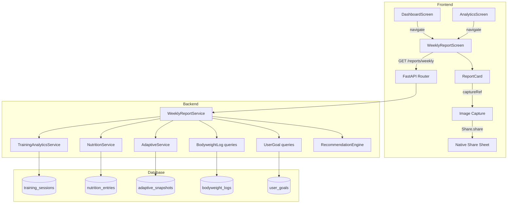

# Design Document: Weekly Intelligence Report

## Overview

The Weekly Intelligence Report aggregates training, nutrition, and body metrics for a given ISO week into a single report, appends 2–3 personalized recommendations, and exposes the result through a REST endpoint. The frontend renders the report on a dedicated screen with skeleton loading, empty states, historical week navigation, and a shareable image card.

The design leverages existing services — `TrainingAnalyticsService`, `NutritionService`, `AdaptiveService`, and bodyweight logs from the `user` module — composing their data into a new `WeeklyReportService`. No new database tables are required; the report is computed on-the-fly from existing data.

## Architecture



The backend is a pure aggregation layer — it reads from existing tables, computes derived metrics, and returns a JSON response. The recommendation engine is a deterministic, rule-based function with no ML dependencies.

## Components and Interfaces

### Backend Components

#### 1. WeeklyReportService (`src/modules/reports/service.py`)

Orchestrates data fetching from existing services and computes the report.

```python
class WeeklyReportService:
    def __init__(self, session: AsyncSession) -> None: ...

    async def get_weekly_report(
        self, user_id: uuid.UUID, year: int, week: int
    ) -> WeeklyReportResponse: ...
```

Internally calls:
- `TrainingAnalyticsService.get_volume_trend(user_id, week_start, week_end)` — total and per-muscle-group volume
- `TrainingAnalyticsService.get_muscle_group_frequency(user_id, week_start, week_end)` — session count per muscle group
- Queries `training_sessions` for PR detection (reuses existing PR logic from `TrainingService`)
- `NutritionService.get_entries(user_id, DateRangeFilter(week_start, week_end))` — raw entries for aggregation
- `AdaptiveService.get_snapshots(user_id, limit=2)` — current and previous snapshot for TDEE delta
- Queries `bodyweight_logs` for the week's entries
- Queries `user_goals` for goal type and rate
- Passes aggregated data to `RecommendationEngine.generate()`

#### 2. RecommendationEngine (`src/modules/reports/recommendations.py`)

Pure function — no DB access, no side effects. Takes aggregated metrics and user goal context, returns 2–3 recommendation strings.

```python
@dataclass(frozen=True)
class ReportContext:
    volume_by_muscle_group: dict[str, float]
    sets_by_muscle_group: dict[str, int]
    session_count: int
    prs: list[PersonalRecord]
    avg_calories: float
    target_calories: float
    compliance_pct: float
    weight_trend: float | None
    goal_type: str  # "cutting" | "maintaining" | "bulking"
    goal_rate_per_week: float | None
    days_logged_nutrition: int
    days_logged_training: int

def generate_recommendations(ctx: ReportContext) -> list[str]: ...
```

Rules (evaluated in priority order, first 2–3 that match are returned):

1. **No data**: If `days_logged_training == 0` and `days_logged_nutrition == 0`, return encouragement to start logging.
2. **Under-volume muscle group**: For each muscle group where `sets < MEV`, generate "Increase {group} volume — only {n} sets this week (MEV is {mev})". Pick the most under-volume group.
3. **High compliance**: If `compliance_pct > 85`, generate "Great {macro} compliance at {pct}% — keep it up".
4. **Low compliance**: If `compliance_pct < 60`, generate "Nutrition consistency was {pct}% this week — try prepping meals ahead".
5. **Weight on track**: If weight trend direction matches goal, generate "Weight trending {direction} {delta}kg/week — on track for your {goal} goal".
6. **Weight off track**: If weight trend opposes goal, generate "Weight trending {direction} — consider adjusting calories by ~{adjustment}kcal".
7. **PR celebration**: If PRs were hit, generate "New PR on {exercise} — {weight}kg × {reps}!".
8. **Fallback**: "Keep logging consistently — more data means better insights."

The engine always returns exactly `min(3, max(2, len(matched_rules)))` recommendations. If fewer than 2 rules match, the fallback fills the gap.

#### 3. MEV Reference Data (`src/modules/reports/mev_reference.py`)

Static dictionary of minimum effective volume per muscle group (sets/week). Used by the recommendation engine.

```python
MEV_SETS: dict[str, int] = {
    "chest": 10,
    "back": 10,
    "shoulders": 8,
    "quads": 8,
    "hamstrings": 6,
    "glutes": 4,
    "biceps": 6,
    "triceps": 6,
    "calves": 6,
    "abs": 4,
    "traps": 4,
    "forearms": 2,
}
```

#### 4. Report Router (`src/modules/reports/router.py`)

```python
@router.get("/weekly", response_model=WeeklyReportResponse)
async def get_weekly_report(
    year: int | None = Query(None),
    week: int | None = Query(None),
    user_id: uuid.UUID = Depends(get_current_user_id),
    session: AsyncSession = Depends(get_session),
) -> WeeklyReportResponse: ...
```

- If `year`/`week` omitted, defaults to current ISO week.
- Validates week is not in the future → 400.
- Delegates to `WeeklyReportService`.

#### 5. Report Schemas (`src/modules/reports/schemas.py`)

```python
class TrainingMetrics(BaseModel):
    total_volume: float = Field(ge=0)
    volume_by_muscle_group: dict[str, float]
    session_count: int = Field(ge=0)
    personal_records: list[PersonalRecord]

class NutritionMetrics(BaseModel):
    avg_calories: float = Field(ge=0)
    avg_protein_g: float = Field(ge=0)
    avg_carbs_g: float = Field(ge=0)
    avg_fat_g: float = Field(ge=0)
    target_calories: float = Field(ge=0)
    compliance_pct: float = Field(ge=0, le=100)
    tdee_delta: float | None = None
    days_logged: int = Field(ge=0)

class BodyMetrics(BaseModel):
    start_weight_kg: float | None = None
    end_weight_kg: float | None = None
    weight_trend_kg: float | None = None

class WeeklyReportResponse(BaseModel):
    year: int
    week: int
    week_start: date
    week_end: date
    training: TrainingMetrics
    nutrition: NutritionMetrics
    body: BodyMetrics
    recommendations: list[str] = Field(max_length=3)
```

### Frontend Components

#### 1. WeeklyReportScreen (`app/screens/reports/WeeklyReportScreen.tsx`)

- Fetches `GET /reports/weekly?year={y}&week={w}` on mount and on week change.
- Renders four collapsible sections: Training, Nutrition, Body, Recommendations.
- Week selector: left/right arrows to navigate weeks, disabled for future weeks.
- Share button in header triggers report card capture.
- Skeleton loading state per section.
- Empty state per section when no data.

#### 2. ReportCard (`app/components/reports/ReportCard.tsx`)

- A `View` wrapped in `react-native-view-shot`'s `ViewShot` ref for image capture.
- Displays: week label, total volume, session count, compliance %, weight trend, top recommendation.
- Styled with the app's dark theme tokens.
- Not scrollable — fixed-height card optimized for social sharing dimensions.

#### 3. Navigation Integration

- Add "Weekly Report" entry point to `AnalyticsScreen` (similar to existing "Nutrition Report" link).
- Add "Weekly Report" card/button to `DashboardScreen` in the summary section.
- Register `WeeklyReport` route in the navigation stack.

## Data Models

No new database tables. The report is computed on-the-fly from:

| Existing Table | Data Used |
|---|---|
| `training_sessions` | exercises JSONB, session_date |
| `nutrition_entries` | calories, protein_g, carbs_g, fat_g, entry_date |
| `adaptive_snapshots` | target_calories, created_at |
| `bodyweight_logs` | weight_kg, recorded_date |
| `user_goals` | goal_type, goal_rate_per_week |

### Derived Computations

- **Total volume**: `SUM(reps × weight_kg)` across all sets in all sessions for the week.
- **Volume by muscle group**: Same sum, grouped by `get_muscle_group(exercise_name)`.
- **Sets by muscle group**: Count of sets per muscle group (for MEV comparison).
- **Compliance %**: `(days_within_5pct / days_logged) × 100`. A day is "within 5%" if `|day_calories - target_calories| / target_calories <= 0.05`.
- **TDEE delta**: `current_snapshot.target_calories - previous_snapshot.target_calories`. Null if fewer than 2 snapshots exist.
- **Weight trend**: `last_bw_entry.weight_kg - first_bw_entry.weight_kg` for the week. Null if fewer than 2 entries.


## Correctness Properties

*A property is a characteristic or behavior that should hold true across all valid executions of a system — essentially, a formal statement about what the system should do. Properties serve as the bridge between human-readable specifications and machine-verifiable correctness guarantees.*

### Property 1: Training metrics aggregation correctness

*For any* set of training sessions within an ISO week, the report's `total_volume` SHALL equal the sum of (reps × weight_kg) across all sets, the `volume_by_muscle_group` values SHALL sum to `total_volume`, each muscle group's volume SHALL equal the sum of (reps × weight_kg) for exercises mapping to that group, and `session_count` SHALL equal the number of distinct session dates.

**Validates: Requirements 1.1, 1.2, 1.3**

### Property 2: Nutrition metrics aggregation correctness

*For any* set of nutrition entries within an ISO week, the report's `avg_calories` SHALL equal the sum of all entry calories divided by the number of distinct entry dates, `avg_protein_g`, `avg_carbs_g`, and `avg_fat_g` SHALL be computed analogously, and `days_logged` SHALL equal the number of distinct entry dates.

**Validates: Requirements 2.1, 2.2, 2.6**

### Property 3: Compliance percentage correctness

*For any* set of nutrition entries within an ISO week and a positive caloric target, the report's `compliance_pct` SHALL equal `(compliant_days / days_logged) × 100`, where a day is compliant if `|day_total_calories - target| / target <= 0.05`.

**Validates: Requirements 2.3**

### Property 4: TDEE delta correctness

*For any* two adaptive snapshots (current and previous), the report's `tdee_delta` SHALL equal `current.target_calories - previous.target_calories`. If fewer than two snapshots exist, `tdee_delta` SHALL be null.

**Validates: Requirements 2.4**

### Property 5: Body metrics aggregation correctness

*For any* sequence of 2 or more bodyweight log entries within an ISO week sorted by date, the report's `start_weight_kg` SHALL equal the first entry's weight, `end_weight_kg` SHALL equal the last entry's weight, and `weight_trend_kg` SHALL equal `end_weight_kg - start_weight_kg`.

**Validates: Requirements 3.1, 3.2**

### Property 6: Recommendation count invariant

*For any* valid `ReportContext`, the `generate_recommendations` function SHALL return a list containing exactly 2 or 3 items.

**Validates: Requirements 4.1**

### Property 7: Under-MEV recommendation generation

*For any* `ReportContext` where at least one muscle group has a set count below its MEV threshold, the recommendations SHALL contain a string mentioning that muscle group's name, its current set count, and its MEV value.

**Validates: Requirements 4.2**

### Property 8: Compliance-based recommendation correctness

*For any* `ReportContext` with `compliance_pct > 85`, the recommendations SHALL contain a positive reinforcement string citing the compliance rate. *For any* `ReportContext` with `compliance_pct < 60`, the recommendations SHALL contain a string encouraging improved consistency.

**Validates: Requirements 4.3, 4.4**

### Property 9: Weight-goal alignment recommendation

*For any* `ReportContext` with a non-null `weight_trend` and a defined `goal_type`, if the trend direction matches the goal (negative trend for cutting, positive for bulking), the recommendations SHALL contain an on-track message. If the trend opposes the goal, the recommendations SHALL contain an adjustment suggestion.

**Validates: Requirements 4.5, 4.6**

### Property 10: Future week rejection

*For any* ISO week (year, week_number) that is strictly in the future relative to the current date, the report endpoint SHALL return a 400 status code.

**Validates: Requirements 5.4**

### Property 11: Report serialization round-trip

*For any* valid `WeeklyReportResponse` object, serializing to JSON and then deserializing SHALL produce an object equivalent to the original.

**Validates: Requirements 9.1**

### Property 12: Schema validation rejects invalid data

*For any* numeric field in `WeeklyReportResponse` set to a negative value, or a recommendations list with more than 3 items, Pydantic validation SHALL raise a `ValidationError`.

**Validates: Requirements 9.2, 9.3**

## Error Handling

| Scenario | Handling |
|---|---|
| Future ISO week requested | Return HTTP 400 with message "Cannot generate report for a future week" |
| Invalid year/week combination | Return HTTP 422 (Pydantic validation) |
| No training data for the week | Return report with zeroed training metrics and empty PR list |
| No nutrition data for the week | Return report with zeroed nutrition metrics and 0% compliance |
| Fewer than 2 bodyweight entries | Return report with null weight_trend and null start/end weights |
| No adaptive snapshots | Return report with null TDEE delta, target_calories = 0 |
| Database connection failure | Return HTTP 500 with generic error; log details server-side |
| Image capture failure (frontend) | Show toast "Could not generate image" and disable share button |
| Share sheet cancelled by user | No-op — dismiss share sheet gracefully |

## Testing Strategy

### Property-Based Tests (Hypothesis — Python)

Use the `hypothesis` library for all property-based tests. Each test runs a minimum of 100 iterations.

| Test | Property | Tag |
|---|---|---|
| `test_training_metrics_aggregation` | Property 1 | Feature: weekly-intelligence-report, Property 1: Training metrics aggregation correctness |
| `test_nutrition_metrics_aggregation` | Property 2 | Feature: weekly-intelligence-report, Property 2: Nutrition metrics aggregation correctness |
| `test_compliance_percentage` | Property 3 | Feature: weekly-intelligence-report, Property 3: Compliance percentage correctness |
| `test_tdee_delta` | Property 4 | Feature: weekly-intelligence-report, Property 4: TDEE delta correctness |
| `test_body_metrics_aggregation` | Property 5 | Feature: weekly-intelligence-report, Property 5: Body metrics aggregation correctness |
| `test_recommendation_count_invariant` | Property 6 | Feature: weekly-intelligence-report, Property 6: Recommendation count invariant |
| `test_under_mev_recommendation` | Property 7 | Feature: weekly-intelligence-report, Property 7: Under-MEV recommendation generation |
| `test_compliance_recommendation` | Property 8 | Feature: weekly-intelligence-report, Property 8: Compliance-based recommendation correctness |
| `test_weight_goal_recommendation` | Property 9 | Feature: weekly-intelligence-report, Property 9: Weight-goal alignment recommendation |
| `test_future_week_rejection` | Property 10 | Feature: weekly-intelligence-report, Property 10: Future week rejection |
| `test_report_serialization_roundtrip` | Property 11 | Feature: weekly-intelligence-report, Property 11: Report serialization round-trip |
| `test_schema_validation_rejects_invalid` | Property 12 | Feature: weekly-intelligence-report, Property 12: Schema validation rejects invalid data |

### Unit Tests (pytest)

- Test PR detection with specific known sessions (Requirement 1.4)
- Test empty data edge cases: no training, no nutrition, <2 bodyweight entries (Requirements 1.5, 2.5, 3.3)
- Test no-data recommendation fallback (Requirement 4.7)
- Test default-to-current-week behavior (Requirement 5.3)
- Test API response structure with a known dataset (Requirement 5.2)

### Frontend Tests (Jest)

- Test `WeeklyReportScreen` renders all four sections
- Test week selector disables future navigation
- Test skeleton loading states appear during fetch
- Test empty states render when section data is null/empty
- Test share button triggers image capture flow

## Implementation Execution Plan

### Dependency Chain (Correct Build Order)

```
Layer 0: Schemas + MEV reference (no dependencies)
Layer 1: RecommendationEngine (depends on: schemas, MEV reference)
Layer 2: WeeklyReportService (depends on: schemas, RecommendationEngine, existing services)
Layer 3: Report Router (depends on: WeeklyReportService, schemas)
Layer 4: Router registration in main.py (depends on: router)
Layer 5: Frontend WeeklyReportScreen (depends on: working API)
Layer 6: Frontend ReportCard + share (depends on: WeeklyReportScreen)
Layer 7: Navigation integration (depends on: WeeklyReportScreen)
```

No circular dependencies. Each layer only references artifacts from prior layers.

### Risks and Mitigations

| Step | Risk | Mitigation |
|---|---|---|
| Schemas | `PersonalRecord` import from training module may have circular import | Import from `training.analytics_schemas` which has no back-references |
| RecommendationEngine | Rule priority logic produces <2 or >3 recommendations in edge cases | Property 6 test catches this; fallback rule guarantees minimum 2 |
| WeeklyReportService | Existing `NutritionService.get_entries` pagination limit (default 50) may truncate weekly entries | Pass `limit=500` explicitly; a user logging >500 entries/week is unrealistic |
| WeeklyReportService | `get_volume_trend` returns per-day volume, not per-muscle-group | Compute per-muscle-group volume directly from raw session data via `_fetch_sessions` |
| Router | Auth middleware not applied | Use existing `Depends(get_current_user_id)` pattern from other routers |
| Frontend share | `react-native-view-shot` not installed | Add as dependency; if unavailable, hide share button gracefully |
| Frontend share | iOS photo library permission not granted | Request permission before save; show alert if denied |
| Performance | Report computation queries 5 tables per request | All queries are indexed (user_id + date range); no full table scans. Monitor P99 latency. |

### Testing Checkpoints

**Checkpoint 1 — After Layer 1 (Schemas + RecommendationEngine + MEV):**
Gate: All property tests for Properties 6–9, 11–12 pass. All unit tests for edge cases (empty data, no-data fallback) pass. Zero test failures before proceeding.

**Checkpoint 2 — After Layer 3 (Service + Router wired):**
Gate: All property tests for Properties 1–5, 10 pass. Integration test hitting `GET /reports/weekly` with test DB returns valid response. Future-week 400 test passes. Zero test failures before proceeding.

**Checkpoint 3 — After Layer 7 (Full frontend):**
Gate: Jest tests for screen rendering, week selector, empty states, and share flow pass. Manual smoke test: navigate to report from dashboard and analytics, switch weeks, verify data renders.

### Rollback Plan

| If step N fails... | Undo |
|---|---|
| Schemas have import errors | Delete `src/modules/reports/` directory; no DB migration to revert |
| RecommendationEngine logic is wrong | Fix in isolation — pure function, no side effects, no state to clean up |
| Router registration breaks app startup | Remove the `include_router` line from `main.py`; app reverts to pre-feature state |
| Frontend screen crashes | Remove route registration from navigator; entry points in Dashboard/Analytics are dead links but app is stable |
| `react-native-view-shot` causes build failure | Remove the dependency and the ReportCard component; report screen works without share |

No database migrations are involved, so rollback is always a code-only revert.

### Monitoring (Post-Launch)

| Metric | Instrument | Alert Threshold |
|---|---|---|
| `GET /reports/weekly` P99 latency | PostHog / server-side timing middleware | >2s P99 over 5-min window |
| `GET /reports/weekly` error rate | HTTP 5xx count | >5% of requests in 5-min window |
| Report screen load failures (frontend) | PostHog `feature.used` event with `error` property | >10% error rate |
| Share action success rate | PostHog event `report.shared` vs `report.share_failed` | >20% failure rate |
| Recommendation engine producing <2 recommendations | Server-side log warning | Any occurrence (should be zero) |

Add `track_feature_used(user_id, "weekly_report_viewed")` in the router handler and `track_event(user_id, "report.shared")` / `track_event(user_id, "report.share_failed")` in the frontend share flow.
